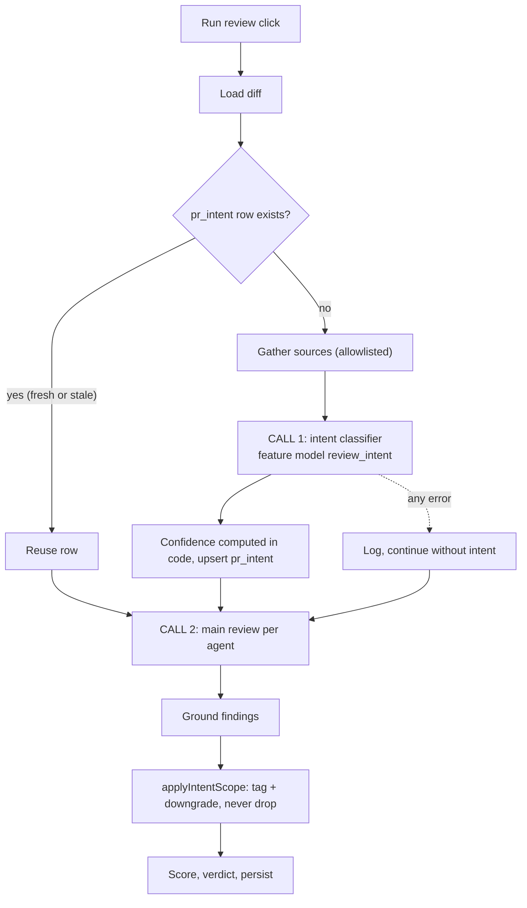

# Intent layer — two calls per review

What a PR is *meant* to change is derived by a cheap classifier call (CALL 1) and
fed into the main review call (CALL 2), which tags findings in/out of scope.
Behaviour spec: `../specs/intent-layer.md`. Per-package detail:
`../reviewer-core/docs/pipeline.md` (steps 2 and 5b),
`../server/docs/review-run-lifecycle.md` (pre-work, fail-soft).

## The two calls

| | CALL 1 — classifier | CALL 2 — main review |
|---|---|---|
| Code | `deriveIntent` (`reviewer-core/src/intent/derive.ts:36`), called from `IntentService.classifyOnce` (`server/src/modules/intent/service.ts:364`) | `reviewPullRequest` (`reviewer-core/src/review/run.ts:137`) |
| Model | workspace feature model `review_intent` (`service.ts:172`) | the agent's own model (`run-executor.ts:244`) |
| Sees | PR title, description, file list, hunk headers, linked sources — never diff bodies (`intent/prompt.ts:24-25`) | full diff + `## PR intent` section |
| System prompt | its own `INTENT_SYSTEM` + `INJECTION_GUARD` (`intent/prompt.ts:96`) | the agent's `system_prompt` + `INJECTION_GUARD`, **unchanged** by this feature |
| Recorded on | `pr_intent` row (tokens, cost, duration), not an `agent_run` (`service.ts:112-115`) | `agent_runs` + `run_traces` |
| On failure | swallowed, review continues (`service.ts:179-184`) | run fails as usual |

Agent system prompts (`docs/agent-prompts/*.md`, `agents.system_prompt`) are not
touched: the intent reaches the model only as an extra user-message section
(`reviewer-core/src/prompt.ts:151-152`, wrapped as untrusted).

## Sources and what the resolver may read

Everything the classifier sees is untrusted text (`wrapUntrusted`,
`intent/prompt.ts:52`). Sources are recorded per run as `IntentSource`
(`kind`, `ref`, `status` = used | truncated | missing | blocked).

| Source | Rule | Code |
|---|---|---|
| PR title / description | HTML comments stripped, capped 300 / 4000 chars | `service.ts:241,255-265` |
| Changed files, hunk headers | metadata only; max 300 files, 200 headers | `service.ts:242-249`, `server/src/modules/intent/constants.ts:13-14` |
| GitHub issues | `#N` and issue URLs **of the same repository**; an issue in another repo is not fetched (`issue in another repository` in the missing context: the operator's token may see repos the PR author cannot); max 3, 3000 chars each, 10 s timeout | `helpers.ts:120-128`, `constants.ts:18,24,42` |
| Repo files | same-repo only; `.md`/`.txt`; safe relative path; read as a git **blob** at head sha then `HEAD`, no symlinks, max 256 KiB; max 3 | `helpers.ts:89-100`, `adapters/git/repo-file-reader.ts:33-84` |
| Jira / Linear tickets | max 2; only allowlisted hosts (below) | `helpers.ts:137-145`, `adapters/tickets/http.ts:56-110` |
| Any other URL | never fetched; recorded `blocked` and surfaced in `missing_context` | `helpers.ts:178,193` |

Only the first 20 000 chars of the PR text are scanned for references
(`constants.ts:32`).

### Ticket allowlist (SSRF guard)

`HttpTicketFetcher` (`server/src/adapters/tickets/http.ts:43`) is given
`{host, key}` only, never the raw URL (`adapters/tickets/index.ts:1-4`). A fetch
proceeds only if all hold, otherwise it returns `blocked` / `missing` with a
fixed reason string:

1. host is in `INTENT_TICKET_HOSTS` (`http.ts:58`); empty list = nothing fetched;
2. host is a valid DNS name, not an IP; key matches `KEY_RE` (`http.ts:59-60`);
3. credentials configured (`http.ts:62-64`);
4. every resolved address is public (`http.ts:73`, `adapters/tickets/ip.ts`);
5. request is built by the adapter, `redirect: 'manual'`, 5 s timeout, 64 KiB
   body cap, JSON content type required (`http.ts:82-101`).

Known limit (documented in code, `http.ts:38-41`): DNS is validated just before
`fetch`, which resolves again, so a rebinding resolver could swap the address;
the operator-owned allowlist bounds that risk.

### Environment

| Variable | Read by | Meaning |
|---|---|---|
| `INTENT_TICKET_HOSTS` | `platform/config.ts:31,85-88` | comma-separated hostnames allowed for ticket fetches; default empty |
| `JIRA_EMAIL`, `JIRA_API_TOKEN` | `http.ts:117` via `SecretsProvider` | Basic auth for Jira hosts |
| `LINEAR_API_KEY` | `http.ts:114` via `SecretsProvider` | auth for `linear.app` / `*.linear.app` hosts (calls `api.linear.app`, `http.ts:12,66`) |

Without credentials a ticket link is recorded `blocked`
(`LINEAR_API_KEY not configured` / `Jira credentials not configured`).

## Confidence, staleness, scope

- **Confidence is computed, not asked of the model**
  (`intent/confidence.ts`): `low` if the description has < 40 meaningful chars,
  or a linked source was referenced but none loaded, or no linked source loaded
  and the description is under 200 chars (a one-sentence description cannot
  support a scope judgement); `high` if a linked source loaded and nothing is
  missing/blocked; else `medium`. `low` turns the scope filter off.
- **Stale** = head sha or `inputHash(title, body, head sha, files)` changed since
  derivation (`helpers.ts:255-276`). Review runs reuse a stale row; the user
  re-derives via `POST /pulls/:id/intent` (`intent/routes.ts:27`, rate-limited
  to 10/min). `GET` computes `stale` on read (`routes.ts:17`).
- **Scope policy** (`reviewer-core/src/intent/scope.ts:22`): out-of-scope
  WARNING → SUGGESTION with `original_severity` (only `perf` / `style` / `test`);
  CRITICAL, `security` and `bug` unchanged; `low` confidence or no intent → unchanged; nothing is dropped.
  Table: `../reviewer-core/docs/pipeline.md` step 5b.

## Where to look when a run looks wrong

- Live Log shows `Intent classifier (…)` then `Starting review with agent` with a
  different model: both calls ran. `run_traces.trace->'prompt_assembly'->>'intent'`
  is non-null when the section was injected (`prompt.ts:188`).
- `intent: not injected (derivation failed | none available)` in the log
  (`run-executor.ts:235`): the review ran without intent; the failure reason is in
  the preceding `intent: failed — …` line.
