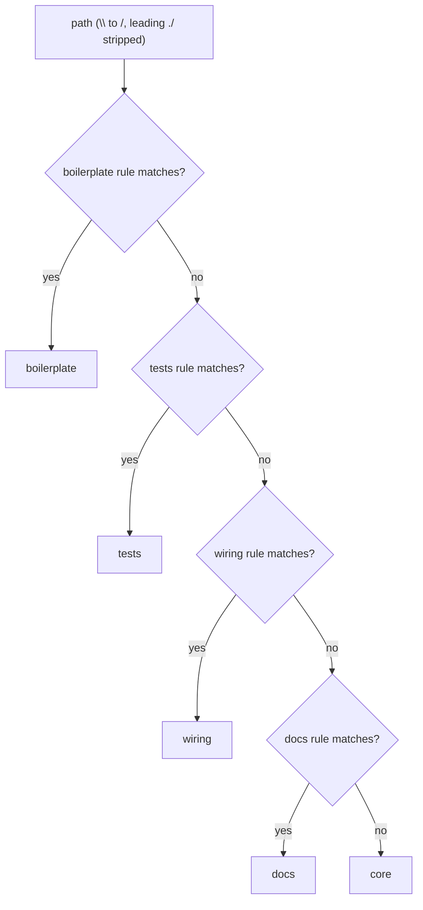
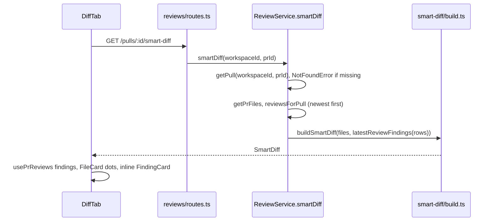

# Smart Diff — how Files changed is grouped and where findings land

Behaviour spec and task cards: `specs/smart-diff.md`, `specs/smart-diff.tasks.md`. This page explains the mechanism as implemented (server + client).

## Why no LLM is called

Roles come from the file path alone. `classifyFile` is a pure function over regexes (`server/src/modules/reviews/smart-diff/classify.ts:7-13`), and `buildSmartDiff` is a pure assembler over plain `{path, additions, deletions}` and `{file, start_line}` inputs (`smart-diff/build.ts:35-71`). Consequences:

- The route works before any review exists and costs nothing; `ReviewService.smartDiff` only reads the DB (`server/src/modules/reviews/service.ts:180-195`).
- Same input, same output: tests need no stubs.
- The classifier has no HTTP/DB import, so a later lesson can reuse it as a prompt filter.

`split_suggestion` is a stub: `{too_big: false, total_lines: Σ(additions+deletions), proposed_splits: []}` (`build.ts:67-70`). There is no `pseudocode_summary`.

## Role classification: first matching rule wins

Rule order is `boilerplate > tests > wiring > docs > core` (`smart-diff/constants.ts:26-73`); unmatched paths are `core` (`classify.ts:12`). Display order is different: `core, tests, wiring, docs, boilerplate` (`constants.ts:7-13`).

| Rule | Matches (regex on the normalized path) |
|---|---|
| boilerplate | `*.lock`, `pnpm-lock.yaml`, `package-lock.json`, `yarn.lock`, `*.snap`, `*.generated.*`, `*.min.js`, root `dist/` and `build/`, any `__snapshots__/` |
| tests | `*.test|spec.[jt]s(x)`, any `test/`, `tests/`, `__tests__/` segment, root `e2e/` |
| wiring | `index.ts|js` at any depth, `*.config.*`, `tsconfig*.json`, `.eslintrc*`, `.env*`, `docker-compose*.yml`, root `.github/` and `.claude/` |
| docs | `*.md`, `README*`, `CHANGELOG*`, `LICENSE`, root `docs/` |

### The three disputed cases

Each falls out of the rule order; they are deliberate (`constants.ts:20-24`).

| Path | Role | Reason |
|---|---|---|
| `__tests__/__snapshots__/x.snap` | boilerplate | Boilerplate is checked before tests, so the snapshot rule beats the `__tests__/` directory rule. |
| `.claude/skills/security/SKILL.md` | wiring | Wiring (`.claude/`) is checked before docs (`*.md`). |
| `e2e/README.md` | tests | Tests (`^e2e/`) is checked before docs (`README*`). |

Accepted limitation: a basename `index.ts|js` is wiring even if it holds logic (`constants.ts:21`).

## Route and response contract

`GET /pulls/:id/smart-diff` — `IdParams` in, `SmartDiff` out; the response schema validates the reply (`server/src/modules/reviews/routes.ts:136-143`). The handler does context plus one service call.

- `getPull(workspaceId, …)` runs first because `getPrFiles`/`reviewsForPull` are not workspace-scoped; a missing PR throws `NotFoundError('Pull request not found')` (`service.ts:181-183`).
- Response shape (`SmartDiff` in `server/src/vendor/shared/contracts/brief.ts`): `groups: {role, files: {path, additions, deletions, finding_lines[]}[]}[]` and `split_suggestion`. `role` is one of `core | tests | wiring | docs | boilerplate`, identical in both `brief.ts` copies (server and client).
- Groups follow the display order; **empty groups are omitted**; files inside a group are sorted by path (`getPrFiles` has no ORDER BY) (`build.ts:61-65`).
- `finding_lines` = unique ascending `start_line` of findings whose `file === path` (`build.ts:39-44,56`).
- "Latest review" = first entry with `kind === 'review'` in the newest-first list; `summary` reviews are ignored; dismissed findings are kept; none → every `finding_lines` is `[]` (`build.ts:29-32`).

## Client: grouping and anchoring findings

`DiffTab` (`client/src/app/repos/[repoId]/pulls/[number]/_components/DiffTab/DiffTab.tsx:28-116`):

- Smart order / Original order toggle is local state, default `smart` (`:29`). While the smart-diff query loads or fails, it renders the original order (`:30-32,116`).
- `groupFiles` maps response groups onto the PR's own `PrFile[]` by path, ignores unknown paths, and appends files the response missed to `core` (`DiffTab/helpers.ts:12-32`).
- `docs` and `boilerplate` groups start collapsed at group level (`DiffTab/constants.ts:7`, used at `DiffTab.tsx:109`).

Findings are **not** taken from the route's `finding_lines`. The client renders from `usePrReviews` (the live source, refreshed after Run review) using the same "latest review" rule (`helpers.ts:36-38`), grouped by file (`helpers.ts:54-58`). `finding_lines` remains the contract and prompt-filter source.

Anchoring, inside `FileCard` (`client/src/components/diff-viewer/FileCard/FileCard.tsx:68-75`):

1. Every rendered patch line contributes its keys via `keysForLine` (`comments.ts:63-74`): `RIGHT:<newNo>` for add/context lines, `LEFT:<oldNo>` for delete/context lines.
2. A finding's key is always `RIGHT:${start_line}` (`diff-viewer/findings.ts:29-31`).
3. `partitionFindings` splits findings into `matched` (key is rendered; the card shows under that line) and `outside` (`findings.ts:34-49`). A finding on a line missing from the patch, or on a deleted-only line, is `outside`.
4. `outside` findings render in a titled end-of-file block (`smartDiff.outsideDiffTitle`) after the lines (`FileCard.tsx:129-138`).

The viewer never imports app code: `DiffTab` injects a `DiffFindingApi = {byFile, show, FindingView}` (`findings.ts:9-16`), where `FindingView` wraps the route-local `FindingCard`.

### Toggle behaviour

`show` is the comments toggle state (`showComments`, default `false`, `DiffTab.tsx:28,45`). It hides the inline finding cards and the outside block (`FileCard.tsx:129`); the per-file severity dot and the group header count stay visible (`FileCard.tsx:76-101`). The toggle button appears when comments + findings > 0 (`DiffTab.tsx:47-48,84`). So findings are hidden until the user turns the toggle on.

## Spec/code notes

- The spec says the dot uses `SEV_COLOR`/tokens as unverified; the code colours it from the top severity of the file's findings (`FileCard.tsx:76-77`).
