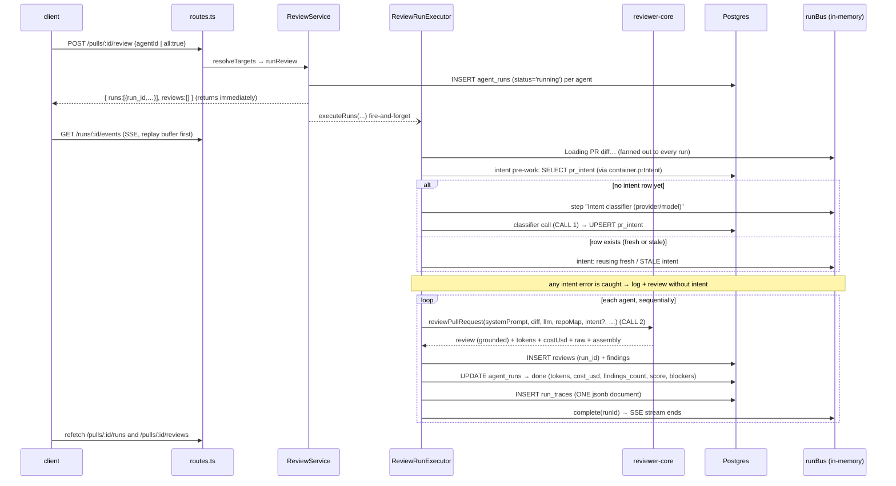

# Review run lifecycle

How one click on **Run review** becomes persisted findings, a live log and a
run trace — and what each state looks like in the database.

Code: `src/modules/reviews/{routes,service,run-executor}.ts`,
`src/modules/intent/service.ts` (intent pre-work),
`src/modules/reviews/repository/run.repo.ts`, engine in `../../reviewer-core`.

## Sequence

## Why it is shaped like this

- **Rows first, work later.** `ReviewService.runReview` (`service.ts:103`) creates
  every `agent_runs` row before any LLM call so the HTTP response already carries
  `run_id`s. The client subscribes to SSE and survives reloads because
  "what is running" is read from the DB (`GET /pulls/:id/runs/active`), not from
  client state.
- **Diff loaded once, agents run one after another.** `executeRuns`
  (`run-executor.ts:69`) loads the diff once for all jobs, then loops the agents.
  A failing agent is caught and persisted as `failed`; the loop continues.
- **Intent pre-work is fail-soft and runs once per click.** After the diff loads,
  `executeRuns` calls `container.prIntent.ensureForReview(...)` once for all
  queued runs (`run-executor.ts:124`). It never throws
  (`modules/intent/service.ts:179-184`): any error is logged
  (`intent: failed — …; reviewing without intent`) and the review proceeds
  without intent. It must not go through `failAll` (`run-executor.ts:121-123`).
  Rules, all in `ensureForReview` (`service.ts:149`):
  - **Auto-classify only when no `pr_intent` row exists** (`service.ts:160-172`).
  - **A stale row is reused**, not re-derived; the log says
    `reusing STALE intent … re-run it from the PR page` (`service.ts:164-168`).
    Re-deriving is the explicit `POST /pulls/:id/intent` (`intent/routes.ts:27`).
  - The intent call is **not an `agent_run`**: its usage lives on `pr_intent`
    (`service.ts:112-115`), so run cost/tokens exclude it.
  - Two distinct Live Log steps: `Intent classifier (<provider>/<model>)`
    (`service.ts:176`, model = the `review_intent` feature model) and later, per
    agent, `Starting review with agent "<name>" (<provider>/<model>)`
    (`run-executor.ts:177`) — a different model. The trace `tool_calls` list
    `intent_classify` (`fresh` | `cached`, omitted when failed) before the
    `review_file` entries (`run-executor.ts:329-347`).
  - Per agent, the log records `intent: injected (…)` or `intent: not injected
    (…)` (`run-executor.ts:229-236`); the intent then goes to
    `reviewPullRequest({ intent })` (`run-executor.ts:260`) — see
    `../../docs/intent-layer.md`.
- **The engine is pure.** `reviewPullRequest` does prompt → LLM → grounding →
  score. The executor owns only I/O: repo-intel context (callers digest, repo
  map, rank note — skipped when the agent's `repoIntel` toggle is off),
  persistence and observability.
- **One trace document per run.** `run_traces.trace` is a single jsonb blob
  (config, stats, prompt assembly, tool calls, raw model output, full log). New
  fields on it must be `.nullish()` — old documents lack them
  (see `../INSIGHTS.md`).

## States of `agent_runs.status`

| Status | Set by | Row contents |
|---|---|---|
| `running` | `createAgentRun` | provider, model, `ran_at` |
| `done` | `runOneAgent` success | duration, tokens, `cost_usd`, `findings_count`, `grounding` ("k/n passed"), `score`, `blockers` |
| `failed` | agent error, diff-load failure (`failAll`), or boot reaper | `error`, tokens `0`, `cost_usd` null, `findings_count` 0; a minimal trace built from the event buffer |
| `cancelled` | `POST /runs/:id/cancel` → `cancelRunIfRunning` (only if still running) | the engine throws `RunCancelledError` at its next checkpoint (before each chunk LLM call) |

- **Reaper:** on boot `app.ts:81` calls `reapStaleRuns()`, which flips every
  row still `running` to `failed` — those belonged to a process that died.
- **Blockers vs verdict:** `blockers = countBlockers(findings, agent.ciFailOn)`
  is deterministic (severity ≥ the agent's gate). The timeline colours runs on
  blockers, never on the model's `verdict`.

## Run ↔ review link

`reviews.run_id` points at `agent_runs.id` **without a foreign key**. Consequences:

- deleting a run must delete its review explicitly (`deleteAgentRun`,
  `run.repo.ts`), otherwise findings are orphaned in the Review runs list;
- joins go through `run_id` on read: review cost/tokens
  (`reviewsForPull`), timeline finding previews (`listRunsForPull`);
- seeded reviews have no `run_id` — they appear under Review runs but never on
  the Timeline.

## Prompt log and correlation id

`POST /pulls/:id/review` hands `req.id` (a UUID per request) to `runReview` →
`executeRuns`. It becomes `correlation_id` on the run logger's context and is passed
into the intent step and `reviewPullRequest`, so the classifier's and every agent's
`prompt.assembled` event carry the same id. Only section names, sources and sizes are
logged, never prompt text; `PROMPT_LOG_VERBOSE` (development only) adds per-section
tokens. Details and the event shape: `../../docs/prompt-logging.md`.
