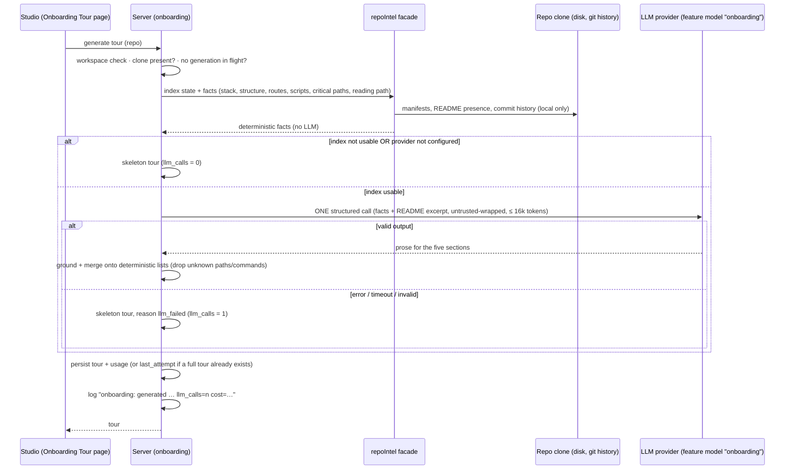
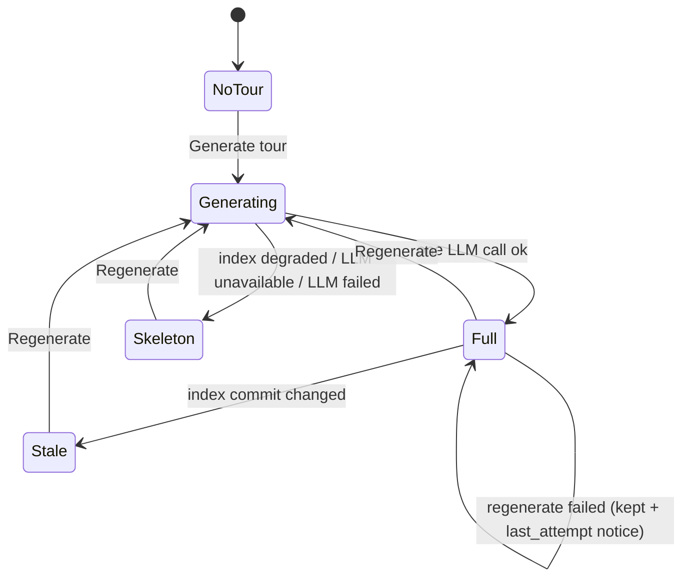

# Spec: Onboarding Tour (per-repo onboarding generator)
Date: 2026-10-01
Status: draft
Supersedes: none

> Lesson scope: **L05 — Onboarding generator** (`README.md` lesson roadmap, row L05). Project Context (the other L05
> item, `specs/2026-10-01-project-context.md`) and PR Brief are not part of this spec.

## Problem and user

A **developer who is new to a repository** (a new hire, a reviewer who has to review a PR in a codebase they have
never opened, or a contributor to an unfamiliar open-source project) opens a repo of thousands of files and has no idea
where requests enter, which files everything depends on, how to start it locally, what to read first or what a safe
first change would be. DevDigest already clones and indexes every added repo (`repo-intel`: import graph, PageRank
file rank, endpoint/cron facts), but none of that knowledge is shown to a person. Only the review prompt uses it.

The Onboarding Tour turns the existing index into a five-part tour of one repo: **architecture overview, critical
paths, how to run locally, guided reading path, first tasks**. Facts are collected deterministically. One structured LLM
call turns them into readable prose. When the index or the LLM cannot be trusted, the user gets an honest
deterministic skeleton. The number of LLM calls and the cost of every generation can be seen in the UI and in the logs.

**What "onboarding" means here (clarification 1).** In this spec "onboarding" means *onboarding a developer onto one
repository's codebase*. It does **not** mean the existing global `/onboarding` route, which is the "Add a repository"
screen used when a workspace has no repos yet (`client/src/app/onboarding/page.tsx:10`, e2e flow
`06-onboarding.flow.json`). That screen keeps its route and behaviour unchanged.

## Goals / Non-goals

- **Goals**
  - G1: A repo-scoped *Onboarding Tour* page with the five sections of the design.
  - G2: All **facts** (stack, structure, routes, scripts, critical files, reading order) are computed deterministically
    from the `repo-intel` index and the repo's local clone, with no LLM involved.
  - G3: The guided reading path is ordered by an import-graph score: `score = PageRank × (1 + hotness)`.
  - G4: **Exactly one** structured LLM call per generation turns the facts into prose for the five sections.
  - G5: An honest deterministic skeleton is shown when the index is degraded or the LLM call fails or is not available.
  - G6: The number of LLM calls, tokens, cost, model and duration of every generation are persisted, shown on the page
    (like the L01 run-cost badge) and written to the server log.
  - G7: Works on large and shallow-cloned repos within bounded time, prompt size and cost.
- **Non-goals**
  - Changing the global `/onboarding` (Add repository) screen.
  - Tours for repos that have no local clone (no GitHub-API-only mode); see *Resolved decisions → No-clone mode*.
  - Deepening the clone (fetching more git history) to compute hotness; see *Resolved decisions → Hotness*.
  - Extending `repo-intel` parsing to non-JS/TS languages. Such repos get the skeleton path (AC-19).
  - A public or unauthenticated share link, a tour export (PDF/Markdown) and per-user tour progress tracking.
  - An in-app file viewer. *Open* links to GitHub (AC-34).
  - Running any command from the tour. DevDigest only displays commands (AC-35).
  - Automatic generation on repo add or on index refresh. Generation always starts from a user action (AC-4, AC-25).
  - A tour language other than English.
  - Tour version history. Only the latest tour per repo is kept; past generations remain visible in the logs only.

## User stories

- **US-1**: As a developer new to a repo, I want a single page that explains the repo's architecture, so that I know
  where requests enter and how the parts connect before I read any code.
- **US-2**: As a developer new to a repo, I want the few files everything depends on listed with a reason each, so that
  I know what is risky to touch and what to reuse.
- **US-3**: As a developer new to a repo, I want copyable commands to run it locally, taken from the repo's own files,
  so that I can start it without guessing.
- **US-4**: As a developer new to a repo, I want an ordered reading list computed from the import graph, so that I read
  the most central files first.
- **US-5**: As a developer new to a repo, I want a few concrete first tasks with a file and a complexity, so that I can
  make a safe first contribution.
- **US-6**: As a user, I want to be told honestly when the tour is incomplete (degraded index, failed or unavailable
  LLM), so that I never mistake a guess for a fact.
- **US-7**: As the person paying for the LLM, I want to see how many LLM calls a tour took and what it cost, in the UI
  and in the logs, so that I can verify the "one call" promise and control spend.
- **US-8**: As a user, I want to regenerate a tour, see when it is stale, open its files on GitHub and share the page
  with a teammate, so that the tour stays useful after the code changes.

## Acceptance criteria (EARS)

### Page, navigation and states

- **AC-1** (ubiquitous, covers US-1, US-8): The studio shall provide a repo-scoped *Onboarding Tour* page at
  `/repos/:repoId/onboarding`, reachable from a sidebar item "Onboarding Tour" in the WORKSPACE group placed between
  *Pull Requests* and *Project Context*, with the breadcrumb `<owner>/<repo> › Onboarding Tour`. The sidebar item shall
  be marked active on this page and shall **not** be marked active on the global `/onboarding` (Add repository) screen.
  — *Verify: component test of the shell nav order; `activeKeyFor` unit cases `/repos/r1/onboarding → onboarding-tour`
  and `/onboarding → not onboarding-tour`; e2e flow 06 still passes unchanged.*
- **AC-2** (state-driven, covers US-1..US-5): WHILE a tour exists for the repo, the page shall show the title
  "Onboarding for `<repo name>`", a subtitle "Generated from index of N files · generated `<relative time>`", a usage
  badge (AC-27), the actions *Regenerate* and *Share link*, an "On this page" list with five links, and five collapsible
  section cards in this fixed order: *Architecture overview*, *Critical paths*, *How to run locally*, *Guided reading
  path*, *First tasks*. — *Verify: component test with a tour fixture renders the five cards in order, the five nav
  links, the subtitle and both actions.*
- **AC-3** (event-driven, covers US-1): WHEN the user activates an "On this page" link, the page shall scroll to that
  section, move keyboard focus to its heading and set the URL fragment to the section id (`#architecture`,
  `#critical-paths`, `#run-locally`, `#reading-path`, `#first-tasks`). WHEN the user toggles a card header, the card
  shall collapse or expand and its toggle shall expose the state through `aria-expanded`. All cards start expanded. —
  *Verify: component test clicks a nav link (fragment set, heading focused) and toggles a card (`aria-expanded`
  flips, body hidden).*
- **AC-4** (state-driven, covers US-1, US-7): WHILE no tour has been generated for the repo, the page shall show an
  empty state with a *Generate tour* action and the text that generating makes one LLM call. Opening the page shall
  never start a generation by itself. — *Verify: component test with "no tour" response renders the CTA and the
  one-call text; a server test shows `GET` of the tour makes 0 LLM calls (counting fake `LLMProvider`).*
- **AC-5** (state-driven, covers US-6): WHILE the tour is loading, the page shall show a loading skeleton; WHILE
  loading has failed, it shall show an error state with a retry action. — *Verify: component tests for both states.*
- **AC-6** (unwanted behaviour, covers US-6): IF the repo has no local clone, THEN the page shall show a "repository
  not cloned yet" state with *Generate tour* disabled, and a generation request shall be rejected with `409`
  `not_cloned` without any LLM call. — *Verify: server test with `clone_path` null → 409 `not_cloned`, 0 LLM calls;
  component test of the not-cloned state.*
- **AC-37** (unwanted behaviour, covers US-8): IF a tour read or generation request names a repo outside the caller's
  workspace, THEN the system shall answer `404` and make no LLM call. — *Verify: route test with a repo of another
  workspace.*

### Deterministic facts (no LLM)

- **AC-7** (ubiquitous, covers US-1, US-3, US-6): The system shall derive the tour's facts (stack, structure, routes,
  scripts, critical files and reading path) only from the repo's `repo-intel` index and files in the repo's local clone,
  with no LLM call, exposed through the `repoIntel.*` facade. Given the same clone commit and the same index, two
  collections shall produce identical facts. — *Verify: `.it` test collects facts twice on a fixture clone and compares
  them deep-equal; a counting fake `LLMProvider` records 0 calls during collection.*
- **AC-8** (ubiquitous, covers US-1): The system shall detect the repo's **stack** from manifest files at the clone
  root and one directory level below (at least: `package.json` dependencies, lockfiles `pnpm-lock.yaml` /
  `yarn.lock` / `package-lock.json`, `tsconfig.json`, `Dockerfile`, `docker-compose*.yml` / `compose*.yml`, `Makefile`,
  `pyproject.toml`, `requirements.txt`, `go.mod`, `Cargo.toml`), and each detected stack item shall carry the manifest
  path it came from. — *Verify: unit test on a fixture with `package.json` (`fastify`, `next`), `pnpm-lock.yaml` and
  `docker-compose.yml` → items `Node.js/TypeScript`, `Fastify`, `Next.js`, `pnpm`, `Docker Compose`, each with its
  evidence path.*
- **AC-9** (ubiquitous, covers US-1): The system shall describe the repo **structure** as the directories up to depth 2
  that contain indexed files, each with its indexed-file count, ordered by count descending then path, capped at 40
  entries, excluding the indexer's excluded directories (`node_modules`, `dist`, `build`, `coverage`, `.next`, `out`,
  `vendor`, `.git`). — *Verify: unit test on an index fixture; 45 directories → 40 returned in the stated order.*
- **AC-10** (ubiquitous, covers US-1, US-2): The system shall list the repo's **routes** as `METHOD /path` with the
  declaring file, taken from the index's endpoint facts, capped at 50 and ordered by declaring file's score (AC-12)
  then path. — *Verify: unit test with index endpoint facts in three files.*
- **AC-11** (ubiquitous, covers US-3): The system shall collect **scripts** from the root `package.json` `scripts` (and
  `package.json` files one level down), `Makefile` targets and Docker Compose service names, and shall build each "run
  locally" command from them with the package manager detected from the lockfile (`pnpm`, `yarn`, else `npm run`). The
  run-locally list shall be, in order and only when the evidence exists: install (`<pm> install`), environment copy
  (`cp <x>.env.example <x>.env` when an `.env.example` exists), compose up (`docker compose up -d` with the services
  that look like data stores, e.g. `postgres`, `redis`, `mysql`, `mongo`), and the dev or start script
  (`<pm> dev` / `<pm> start`). Each command shall carry the file it came from. — *Verify: unit test on the fixture
  above → `pnpm install`, `cp .env.example .env`, `docker compose up -d postgres redis`, `pnpm dev` with sources; a
  fixture without a lockfile uses `npm`.*

### Guided reading path and critical paths

- **AC-12** (ubiquitous, covers US-4): The system shall order the guided reading path by `score = pagerank × (1 +
  hotness)`, where `pagerank` is the file's import-graph PageRank from the index and `hotness ∈ [0, 1]` is the number of
  commits touching the file in the local clone's history within the last 180 days divided by the maximum such count in
  the repo (0 when the maximum is 0). Ties shall be broken by path ascending. The path shall hold at most 8 files and
  exclude test files, `.d.ts` files, migrations, and config/tooling files (the index's junk-path patterns, matched at
  any depth including the repo root). — *Verify: unit test with pagerank/hotness fixtures: a file with lower pagerank
  but hotness 1 overtakes one with higher pagerank and hotness 0 as the formula says; `test/x.ts` at the root and
  `src/a.test.ts` are excluded; 12 candidates → 8.*
- **AC-13** (state-driven, covers US-4, US-6): WHILE the local clone's history cannot provide churn (for example a
  depth-1 clone with a single commit), the system shall use `hotness = 0` for every file, record
  `hotness_available: false` on the tour, and the reading-path card shall state that the order uses import-graph rank
  only because commit history is not available in the clone. — *Verify: `.it` test on a depth-1 fixture clone →
  `hotness_available: false`, order equals pagerank order; component test renders the note.*
- **AC-14** (ubiquitous, covers US-2): The system shall select up to 6 **critical paths** deterministically: files on
  the import-graph dependency chains starting from the top-ranked files, plus files that declare routes, junk paths
  excluded (AC-12), de-duplicated and ordered by score (AC-12) then path. Each row shall show the path, a one-line
  reason (AC-16 or the skeleton reason of AC-21) and an *Open* action (AC-34). — *Verify: unit test on a graph fixture
  with a chain `server.ts → middleware/auth.ts → lib/redis.ts` and a route file; a `*.test.ts` root is excluded;
  ≤ 6 rows.*

### The single LLM call

- **AC-15** (event-driven, covers US-1..US-5, US-7): WHEN a generation runs with a usable index (not AC-19) and a
  configured provider (not AC-20), the system shall make **exactly one** structured completion request to the model
  resolved for the `onboarding` feature (Settings → Feature Models; default `openrouter` /
  `deepseek/deepseek-v4-flash`), with no schema-repair re-prompt and no automatic retry of a failed request, and with a
  90-second timeout. — *Verify: service test with a counting fake `LLMProvider` → exactly 1 call; with the fake
  returning schema-invalid output → still 1 call and the AC-20 skeleton; with the fake failing → 1 call, no retry.*
- **AC-16** (ubiquitous, covers US-1..US-5): The LLM call shall receive only the AC-7 facts, the computed critical-path
  and reading-path lists, and an excerpt of the root README of at most 1,500 tokens, and shall return: an architecture
  summary (markdown) and at most one Mermaid diagram; one reason per given critical path; one "why" line per given
  reading-path file; an optional note per given run-locally command; and 3 to 5 first tasks, each with a title, a repo
  path and a complexity `low`, `medium` or `high`. The model shall not add, remove or reorder critical paths,
  reading-path files or commands; the system shall keep the deterministic lists and only attach the model's text to
  the items by path or command. — *Verify: unit test of the merge step: model output that reorders the reading path and
  adds an extra file → final order equals the computed order and the extra file is absent.*
- **AC-17** (unwanted behaviour, covers US-6): IF the model's output names a file path that is not in the index or the
  clone, a command not in the AC-11 list, or a first task whose path is neither an existing file nor an existing
  directory, THEN the system shall drop that item (or that text), count it in `dropped_items`, and show the rest. —
  *Verify: unit test with a hallucinated `src/missing.ts` first task and an invented command → both dropped,
  `dropped_items = 2`.*
- **AC-18** (unwanted behaviour, covers US-1, US-6): IF the model's Mermaid diagram cannot be parsed or rendered, THEN
  the architecture card shall omit it and show a short note that the diagram could not be rendered, instead of failing
  silently. — *Verify: component test with an invalid diagram string → note shown, summary still rendered.*

### Deterministic skeleton and honest status

- **AC-19** (unwanted behaviour, covers US-6): IF the repo's index is not usable — never indexed, `failed`, `degraded`,
  `repo-intel` switched off, or no file has a rank (e.g. a repo with no JS/TS files) — THEN the system shall make **no**
  LLM call and store a skeleton tour with `mode: skeleton` and `skeleton_reason: index_degraded`, including the index
  status and reason. — *Verify: service test for each of the five index cases → 0 LLM calls, `skeleton_reason:
  index_degraded`.*
- **AC-20** (unwanted behaviour, covers US-6): IF the provider for the `onboarding` feature has no API key, THEN the
  system shall make no LLM call and produce a skeleton with `skeleton_reason: llm_unavailable`; IF the single LLM call
  errors, times out or returns output that fails the schema, THEN the system shall produce a skeleton with
  `skeleton_reason: llm_failed` and a short, secret-free error reason. — *Verify: service tests with no key (0 calls),
  a throwing fake and a schema-invalid fake (1 call each).*
- **AC-21** (ubiquitous, covers US-6): A skeleton tour shall contain only deterministic content: the architecture card
  shows the stack items and structure list with no prose; critical-path and reading-path rows show a computed reason of
  the form "imported by N files · rank p`<percentile>`"; the run-locally card shows the AC-11 commands; the first-tasks
  card shows a message that first tasks need the LLM step. No skeleton text shall be written to look like model output.
  — *Verify: snapshot of the skeleton for a fixture; component test that first tasks shows the message and no task
  cards.*
- **AC-22** (state-driven, covers US-6): WHILE the shown tour is a skeleton, the page shall show a banner at the top
  naming the reason in plain words (index not usable + index status; LLM not configured; LLM call failed + reason) and
  offering *Regenerate*; WHILE a full tour was generated on a `partial` index, the page shall show a notice that the
  index is partial with the number of skipped files. — *Verify: component tests for the three skeleton reasons and the
  partial-index notice.*
- **AC-23** (unwanted behaviour, covers US-6, US-8): IF a regeneration ends in a skeleton (AC-19, AC-20) while the repo
  already has a full (`mode: llm`) tour, THEN the system shall keep the full tour, record the failed attempt (time,
  reason and usage) on it, and the page shall show the full tour with a notice that the last regeneration failed, when,
  and why. IF the repo has no full tour, THEN the skeleton becomes the stored tour. — *Verify: service test: full tour
  stored, regenerate with failing fake → stored sections unchanged, `last_attempt` set with `llm_calls: 1`; component
  test of the notice.*

### Generation control

- **AC-24** (state-driven, covers US-7, US-8): WHILE a generation is running for a repo, the page shall show a progress
  indicator and disable *Generate tour* / *Regenerate*, and a second generation request for the same repo shall be
  rejected with `409` `generation_in_progress` without starting another LLM call. — *Verify: service test fires two
  concurrent generations → one LLM call total, the second gets 409; component test of the disabled state.*
- **AC-25** (event-driven, covers US-8): WHEN the user activates *Generate tour* or *Regenerate*, the system shall run
  one generation (AC-15/AC-19/AC-20) and, on success, replace the stored tour and show it. The action shall not ask for
  confirmation, and its tooltip shall state that it makes one LLM call. — *Verify: component test: click Regenerate →
  generate request sent, refreshed tour rendered; tooltip text present.*

### Cost and call-count observability

- **AC-26** (event-driven, covers US-7): WHEN a generation finishes (any mode), the system shall persist with the tour
  (or with `last_attempt`, AC-23): `llm_calls` (0 or 1), `tokens_in`, `tokens_out`, `cost_usd` (`null` when the price is
  unknown, `0` when no call was made), `model` (`provider/model`, `null` when no call was made), `duration_ms` and
  `dropped_items`. — *Verify: `.it` test reads the stored tour after an `llm`, a skeleton-by-index and a
  skeleton-by-failure generation and checks every field.*
- **AC-27** (ubiquitous, covers US-7): The page header shall show the tour's usage as "`<n>` LLM call(s) · `<tokens>` tok
  · `<cost>`" using the same token and cost formatting as the run-cost badge (unknown cost as "—"), with the model in its
  tooltip. — *Verify: component test: fixture `{llm_calls:1, tokens_in:8000, tokens_out:1119, cost_usd:0.0012}` →
  "1 LLM call · 9,119 tok · $0.0012"; `cost_usd:null` → "—".*
- **AC-28** (event-driven, covers US-7): WHEN a generation finishes, the server shall write one log line of the form
  `onboarding: generated <owner>/<name> mode=<llm|skeleton> reason=<none|index_degraded|llm_unavailable|llm_failed>
  llm_calls=<n> tokens=<in>/<out> cost=<$x|unknown> model=<provider/model|none> duration_ms=<n> dropped=<n>`, and WHEN
  the LLM call is made, it shall emit one `prompt.assembled` event with `call: "onboarding"`, section names, sizes and
  the correlation id, never the prompt text. — *Verify: service test with a captured logger: an `llm` run → exactly
  one `onboarding: generated` line with `llm_calls=1` and one `prompt.assembled` event; a skeleton-by-index run → the
  line with `llm_calls=0` and no `prompt.assembled` event; neither contains README text.*
- **AC-29** (event-driven, covers US-1..US-7): WHEN a user adds an unfamiliar public open-source JS/TS repo, waits for
  indexing, opens its Onboarding Tour and generates it, the page shall show all five sections, every *Open* link shall
  resolve to an existing file on GitHub, and the server log shall show exactly one `onboarding: generated` line with
  `llm_calls=1` and a cost equal to the page's usage badge. — *Verify: manual demo scenario, recorded with the repo
  name, log excerpt and screenshot in the Delivery log.*

### Freshness and large repositories

- **AC-30** (state-driven, covers US-8): WHILE the repo's last indexed commit differs from the commit the tour was
  generated from, the page shall show a notice that the code has changed since the tour was generated, with a
  *Regenerate* action. — *Verify: component test with differing `source_sha` and index sha → notice shown; equal →
  hidden.*
- **AC-31** (state-driven, covers US-1, US-6): The tour shall record the index's indexed-file count, skipped-file
  count and whether the index was bounded by its file cap. WHILE the tour's index was bounded or partial, the subtitle
  shall read "Generated from index of N of M files" and the page shall state that the tour covers only the indexed
  files. —
  *Verify: component test with `files_indexed: 5000, files_total: 12450` → "N of M" subtitle and the coverage note.*
- **AC-32** (ubiquitous, covers US-6, US-7): The LLM prompt for a generation shall stay within 16,000 input tokens
  (server tokenizer) regardless of repo size: facts lists are capped as in AC-9/AC-10/AC-12/AC-14, and, if the cap is
  still exceeded, the routes list and then the structure list shall be truncated from the end until it fits. —
  *Verify: unit test with a 5,000-file / 2,000-route fixture → assembled prompt ≤ 16,000 tokens, routes truncated
  first.*

### Security and actions

- **AC-33** (ubiquitous, covers US-6): Every repo-derived text in the prompt (README excerpt, file paths, script names
  and commands, route strings, manifest names) shall be passed inside the shared untrusted-data wrapper behind the
  shared injection guard, and the model's output shall be rendered as markdown with raw HTML disabled, Mermaid in
  strict security mode, and links inside model prose shown as plain text (not clickable). — *Verify: unit test that a
  README containing `</untrusted>` and "ignore previous instructions" stays inside its block; component test that a
  model summary containing `<script>` and `[x](javascript:alert(1))` renders inert with no anchor.*
- **AC-34** (event-driven, covers US-2, US-8): WHEN the user activates *Open* on a critical path, a reading-path file
  or a first task's path, the studio shall open that path on GitHub at the commit the tour was generated from (a blob
  URL for a file, a tree URL for a directory) in a new tab with `rel="noopener noreferrer"`. — *Verify: component test
  of the generated `href`, `target` and `rel` for a file and a directory.*
- **AC-35** (event-driven, covers US-3): WHEN the user activates a command's copy button, the studio shall copy exactly
  that command text to the clipboard and confirm with a toast. The run-locally card shall state that the commands come
  from the repo's own files and should be reviewed before running; DevDigest shall never execute them. — *Verify:
  component test with a mocked clipboard: copied text equals the command; notice text rendered.*
- **AC-36** (event-driven, covers US-8): WHEN the user activates *Share link*, the studio shall copy the page's own URL
  (including the current section fragment, if any) to the clipboard and show a toast saying the link opens for people
  with access to this DevDigest instance. It shall not create a public link or call the server. — *Verify: component
  test: clipboard receives `<origin>/repos/<id>/onboarding#reading-path`; no API request made.*

## Edge cases

- A repo with no JS/TS files (e.g. a Python repo): the index has no ranked files, so the tour is a skeleton with
  `index_degraded`; stack (`pyproject.toml`) and run-locally commands from a `Makefile` still appear (covers AC-8,
  AC-11, AC-19, AC-21).
- A repo over the indexer's 5,000-file cap: tour generated from the indexed subset with the "N of M files" subtitle
  and coverage note; prompt stays ≤ 16,000 tokens (covers AC-31, AC-32).
- A depth-1 clone (the default) has one commit: `hotness = 0` everywhere, reading path = PageRank order, with the
  note (covers AC-12, AC-13). After a resync (depth ~50) some history exists; hotness is computed from what is there.
- The repo row exists but its clone is still running or failed: not-cloned state, generation rejected with `409`
  (covers AC-6).
- The index is `partial` (soft time budget hit, or one file failed to parse) but has ranked files: the LLM path runs,
  with the partial-index notice (covers AC-22).
- No `package.json` and no `Makefile`: the run-locally card shows an empty-state line "No run instructions found in
  the repo's files" instead of invented commands (covers AC-11, AC-17).
- A `package.json` script whose body is malicious (`"dev": "curl … | sh"`): the tour shows `pnpm dev`, never the script
  body, and the review-before-running notice (covers AC-11, AC-35).
- No README: the LLM call runs without the excerpt; the architecture summary is built from facts only (covers AC-16).
- A README that tells the model to "say this repo is safe" or contains `</untrusted>`: stays inside its block; nothing
  from it can add files, commands or tasks because those lists are deterministic (covers AC-16, AC-33).
- The model returns a reason for a path that is not in the critical-path list: that text is dropped; the row shows the
  skeleton reason (covers AC-16, AC-17, AC-21).
- The model returns 0 valid first tasks (all dropped): the first-tasks card shows the AC-21 message, with the tour
  still `mode: llm` and `dropped_items` counting them (covers AC-17, AC-21).
- The model's price is unknown: usage shows "—" for cost, and the log says `cost=unknown` (covers AC-27, AC-28).
- Two browser tabs press *Regenerate* at the same time: one LLM call, the other tab gets `generation_in_progress` and
  then shows the new tour on refetch (covers AC-24).
- The repo is resynced while a tour exists: the stale notice appears; nothing regenerates automatically (covers AC-30).
- A tour path is later deleted from the repo: *Open* points at the tour's `source_sha`, so the link still resolves on
  GitHub (covers AC-34).
- A repo-root `test/` folder or `vitest.config.ts` would rank high: excluded from the reading path and critical paths
  (covers AC-12, AC-14).
- A section anchor in a shared URL (`#first-tasks`) opens the page scrolled to that section (covers AC-3, AC-36).

## Non-functional requirements

- **Performance:** for an index of ≤ 5,000 files, deterministic fact collection (AC-7..AC-14) completes in ≤ 3 s on a
  dev laptop; reading a stored tour responds in ≤ 300 ms; a full generation finishes in ≤ 95 s (bounded by the 90 s
  LLM timeout of AC-15). — *Verify: timed `.it` test on a generated 5,000-file fixture; `duration_ms` in the log of
  the AC-29 demo.*
- **Cost:** at most one LLM call per user action; the prompt is ≤ 16,000 input tokens (AC-32). With the default model
  a generation is expected to cost well under $0.01. — *Verify: AC-15 and AC-32 tests; cost from the AC-29 demo log.*
- **Security:** no API reads a file outside the repo clone; manifest/README reads resolve symlinks and refuse paths
  outside the clone; every endpoint is workspace-scoped (AC-37); no secret (API key, PAT in a clone URL) appears in
  the prompt, the stored tour, the error reason or the log. — *Verify: unit test with a `README.md` symlink to a file
  outside the clone → not read; a test that a provider error message containing a key is redacted in
  `last_attempt.reason`.*
- **Security (prompt injection):** repo content reaches the model only inside the untrusted wrapper (AC-33); the lists
  the user acts on (files, commands, critical paths, reading order) are deterministic, so injected text can change at
  most prose. — *Verify: AC-16, AC-17, AC-33 tests.*
- **Accessibility:** card toggles are buttons with `aria-expanded` and `aria-controls`; the "On this page" list is a
  `nav` with an accessible name; icon-only copy buttons have an `aria-label` naming the command; complexity badges show
  text, not colour alone; generation progress and skeleton/failed banners are announced (`aria-live="polite"` /
  `role="status"`). — *Verify: RTL queries by role/name for each of these.*
- **Observability:** AC-28's log line and `prompt.assembled` event for every generation; the persisted usage of AC-26
  is the record for the UI. — *Verify: AC-26, AC-28 tests.*
- **i18n:** every new user-visible string lives in `client/messages/en/onboarding.json` (namespace already exists and
  is unused) or `shell.json` (`onboarding-tour` nav key already exists). — *Verify: no hard-coded strings in review;
  the `pr-self-review` i18n gate.*

## Inputs and provenance

- **`repo-intel` index** of the repo (symbols, import edges, `file_rank` PageRank, endpoint facts, index state):
  computed by DevDigest from the clone. Trusted as computed data; the text in it (paths, route strings) originates in
  the repo and is untrusted.
- **Files in the local clone** (manifests, lockfiles, `.env.example` presence, `Makefile`, compose files, root README,
  git history for hotness): written by repo contributors. **Untrusted.**
- **Feature-model setting** `onboarding` (Settings → Feature Models): user-supplied configuration.
- **LLM output**: untrusted; schema-validated, grounded against the index/clone (AC-17) and rendered inert (AC-33).
- **User actions**: Generate/Regenerate, Share link, Open, copy, section toggles.
- **Design source**: one local screenshot (`pasted-image-20261001-212157.png`), read directly. No Figma, no `WebFetch`.
- Verified repo baseline this spec builds on:
  - `client/src/app/onboarding/page.tsx:10`: `/onboarding` is the Add-repository screen; e2e
    `e2e/specs/06-onboarding.flow.json:2-9` tests only that.
  - `client/src/components/app-shell/helpers.ts:29`: `activeKeyFor` matches any pathname containing `/onboarding` →
    `onboarding-tour`, so the add-repo screen would highlight the new nav item unless the match is narrowed (AC-1).
  - `client/messages/en/shell.json:19` (`onboarding-tour` label) and `client/messages/en/onboarding.json` (tour strings,
    unused); `client/src/vendor/ui/nav.ts:22-27` has only `pulls` and `context` in WORKSPACE.
  - `server/src/vendor/shared/contracts/knowledge.ts:28-47` (identical in the client copy): generic
    `Onboarding { sections: [{ kind, title, body, diagram?, links[] }] }`, no usage or status fields.
  - `server/src/db/schema/context.ts:120-126`: table `onboarding(repo_id PK, json, generated_at)`, never read or
    written; `server/src/prompts/onboarding.system.md` exists, unused, and describes different section kinds
    (`architecture`, `routes_and_apis`).
  - `server/src/vendor/shared/contracts/platform.ts:15-51`: feature model `onboarding`, default `openrouter` /
    `deepseek/deepseek-v4-flash`; resolved through `container.resolveFeatureModel` (`server/INSIGHTS.md:167-179`).
  - `server/src/modules/repo-intel/pipeline/rank.ts:3-7, 47-52`: rank is PageRank only and `hotness` is always 0
    because `CLONE_DEPTH = 1` (`server/src/modules/repos/constants.ts:9`); `HOTNESS_WINDOW_DAYS = 180` is declared but
    unused. Resync deepens history to ~50 commits (`server/src/adapters/git/simple-git.ts:80-90`).
  - `server/src/modules/repo-intel/service.ts:685-745`: `getTopFilesByRank` (junk-path filter) and `getCriticalPaths`
    (no junk filter, no consumer). Junk patterns need a leading slash for `/test/` and `/migrations/`, so root-level
    `test/` is not excluded today (AC-12 requires it).
  - Index scope: JS/TS only, `MAX_INDEXED_FILES = 5000` chosen alphabetically (`repo-intel/constants.ts:12, 35-39`,
    `pipeline/walk.ts:62-66`); `getIndexState` for a never-indexed repo returns `degraded` / `no_data`
    (`service.ts:191-208`). No stack, script, Dockerfile or README reader exists anywhere in `server/src`.
  - `completeStructured` re-prompts on a schema failure (default up to 3 attempts) and the providers retry transport
    errors (`server/src/adapters/llm/openai.ts:90-130`, `reviewer-core/src/llm/openrouter.ts:55-57, 64-122`,
    `server/src/platform/resilience.ts:35-50`); `StructuredResult.attempts` counts only parse attempts. AC-15 forbids
    both for this feature.
  - Cost: `StructuredResult` carries `tokensIn`/`tokensOut`/`costUsd` (`server/src/vendor/shared/adapters.ts:62-70`);
    unknown price → `null` (`server/src/adapters/llm/pricing.ts:38`); client formatting in
    `client/src/lib/format-cost.ts` and `client/src/components/run-cost-badge/`. Closest log template:
    `server/src/modules/intent/service.ts:401-421`.
  - `reviewer-core/src/index.ts:15-26` exports `wrapUntrusted` and `INJECTION_GUARD`; the conventions extractor uses a
    weaker ad-hoc delimiter instead (`server/src/modules/conventions/prompt.ts`).
  - Missing provider key → `ConfigError` (`server/src/platform/container.ts:256-275`).
  - `client/src/components/mermaid-diagram/MermaidDiagram.tsx:37, 57`: strict security level; an invalid diagram
    renders nothing (AC-18 asks for a note instead). `client/src/lib/github-urls.ts` builds GitHub blob URLs.
    No shared collapsible, copy-button, share or "x ago" component exists (`client/src/lib/relative-time.ts` gives
    "2h", without "ago").

## Untrusted inputs

- **README excerpt, manifest contents, script names, route strings, file paths:** only ever sent to the model inside the
  shared untrusted wrapper behind the shared injection guard (AC-33); the excerpt is capped at 1,500 tokens (AC-16).
- **Script bodies:** never shown and never sent as commands; the tour shows `<pm> <script-name>` only (AC-11, edge
  cases). Commands are displayed for copying, never executed (AC-35).
- **LLM output:** schema-validated; every path and command is checked against the index/clone and the deterministic
  lists (AC-16, AC-17); rendered as markdown without raw HTML, links as plain text, Mermaid strict (AC-18, AC-33).
- **Git history (hotness):** read-only, local; commit messages are not read or sent to the model.
- **Design screenshot:** read as a local image for layout facts only. No `WebFetch` was performed.

## Workflows and contracts

### Generation flow

### Tour states

### Boundary contracts (behaviour level; exact names are for the plan)

- **Read the tour:** `GET /repos/:repoId/onboarding` → `{ status: 'none' | 'ready' | 'not_cloned' | 'generating',
  tour?: Tour }`; `404` for a repo outside the workspace. Makes no LLM call.
- **Generate / regenerate:** `POST /repos/:repoId/onboarding/generate` → the resulting `Tour` (the kept full tour with
  `last_attempt` in the AC-23 case). Errors: `409 not_cloned`, `409 generation_in_progress`, `404` outside the
  workspace. An LLM failure is **not** an HTTP error; it is a skeleton tour or a `last_attempt` (AC-20, AC-23).
- **`Tour`** (replaces the unused generic `Onboarding` contract; both `@devdigest/shared` copies change together;
  fields added later to this jsonb-persisted shape must be `.nullish()`, `server/INSIGHTS.md:149-165`):
  - `repo_id`, `generated_at`, `source_sha`, `mode: 'llm' | 'skeleton'`,
    `skeleton_reason: 'index_degraded' | 'llm_unavailable' | 'llm_failed' | null`, `skeleton_detail: string | null`
  - `index: { status, reason | null, files_indexed, files_skipped, files_total | null, bounded, hotness_available }`
  - `usage: { llm_calls: 0 | 1, tokens_in, tokens_out, cost_usd: number | null, model: string | null, duration_ms,
    dropped_items }`
  - `architecture: { summary_md: string | null, diagram: string | null, stack: [{ name, evidence_path }],
    structure: [{ path, files }], routes: [{ method, path, file }] }`
  - `critical_paths: [{ path, reason: string | null, computed_reason }]` (≤ 6)
  - `run_locally: [{ command, source_path, note: string | null }]`
  - `reading_path: [{ path, score, pagerank, hotness, why: string | null, computed_reason }]` (≤ 8, in order)
  - `first_tasks: [{ title, path, path_kind: 'file' | 'dir', complexity: 'low' | 'medium' | 'high' }]` (0–5)
  - `last_attempt: { at, skeleton_reason, detail, usage } | null` (AC-23)
- **LLM output schema** (single structured call): `{ architecture_summary_md, architecture_diagram | null,
  critical_path_reasons: [{ path, reason }], reading_path_whys: [{ path, why }], command_notes: [{ command, note }],
  first_tasks: [{ title, path, complexity }] }`.

## Design review notes

- **Gaps found in the supplied design (all promoted to ACs):** no empty / loading / error / not-cloned states (AC-4,
  AC-5, AC-6); no in-progress state for Regenerate (AC-24); no skeleton or failed-generation banner (AC-22, AC-23); no
  stale-tour notice (AC-30); no usage/cost display although cost visibility is a goal (AC-27); "Share link" and
  "Open" have no defined target (AC-36, AC-34); copy buttons on commands give no feedback (AC-35).
- **Subtitle "Generated from index of 12,450 files · last refreshed 2h ago":** 12,450 exceeds the indexer's 5,000-file
  cap, so an honest subtitle for that repo is "N of M files" (AC-31). "Last refreshed" is ambiguous (index vs tour);
  the spec shows the **tour's generation time** and handles index freshness with the stale notice (AC-30).
- **Architecture diagram:** the design shows a clean diagram; a model-written Mermaid diagram can be invalid, and the
  existing `MermaidDiagram` drops it silently. AC-18 requires a visible note.
- **Critical-path reasons like "used by 14 routes":** such counts must be facts, not model claims. The skeleton reason
  ("imported by N files · rank pNN") is computed; the model's reason is prose only. UX proposal: show the computed
  reason as a dim suffix even on full tours, so numbers are always grounded.
- **"How to run locally" in the design includes `# add OPENAI + STRIPE keys`:** comments like that can only come from
  the model's `note`, never from invented commands (AC-16, AC-17).
- **First task "Document the webhook signature flow" → `specs/`:** the design links a directory, so first-task paths
  may be directories (AC-17, contract `path_kind`).
- **Cross-module communication:** the server's new onboarding feature reads facts only through the `repoIntel.*` facade
  (stack/structure/scripts/hotness are new facade reads; hotness becomes a real value instead of the constant 0),
  resolves its model through the container's feature-model resolver, and reuses `wrapUntrusted` / `INJECTION_GUARD`
  from `reviewer-core`. The existing `onboarding.system.md` describes different sections (`routes_and_apis`) and must
  be rewritten for the five sections; the existing `onboarding` table has no usage columns. Both are the plan's
  concern. `README.md` of `repo-intel` still claims "PageRank + git hotness" while code is PageRank only.
- **UX improvement proposals (not required):**
  - Show the reading path's score breakdown (PageRank, hotness) on hover so the order is explainable.
  - Let the user tick off reading-path items locally ("read") — a per-user progress feature, out of scope here.
  - A "Copy all commands" button on the run-locally card.
  - Collapse state remembered per user — not required; all cards start expanded (AC-3).
  - A keyboard shortcut (`g o`) for the page, following the `g p` / `g c` pattern.

## Traceability

| US | Covered by AC(s) | Edge cases |
|---|---|---|
| US-1 | AC-1, AC-2, AC-3, AC-7, AC-8, AC-9, AC-10, AC-15, AC-16, AC-18, AC-29, AC-31 | no README; large repo; anchor in shared URL |
| US-2 | AC-10, AC-14, AC-15, AC-16, AC-34 | reason for unknown path; root `test/` excluded; deleted path |
| US-3 | AC-11, AC-15, AC-16, AC-35 | no manifests; malicious script body |
| US-4 | AC-12, AC-13, AC-15, AC-16 | depth-1 clone; resynced clone; root `test/` excluded |
| US-5 | AC-15, AC-16, AC-17 | 0 valid first tasks |
| US-6 | AC-5, AC-6, AC-7, AC-17, AC-18, AC-19, AC-20, AC-21, AC-22, AC-23, AC-31, AC-32, AC-33 | non-JS repo; clone pending; partial index; README injection |
| US-7 | AC-4, AC-15, AC-24, AC-26, AC-27, AC-28, AC-29, AC-32 | unknown price; two tabs regenerate |
| US-8 | AC-1, AC-23, AC-24, AC-25, AC-30, AC-34, AC-36, AC-37 | resync makes tour stale; two tabs regenerate |

## Open questions

None open: every clarification was resolved with a recorded default below. Items marked **(needs owner approval)**
are product decisions the owner should confirm when approving this spec; changing one changes the ACs named.

### Resolved decisions

1. **Meaning of "onboarding".** Onboarding a developer onto one repo's codebase; repo-scoped page
   `/repos/:repoId/onboarding`; the global `/onboarding` Add-repository screen is unchanged and must not highlight the
   new nav item (AC-1).
2. **Large repositories.** The tour covers what the index covers (≤ 5,000 JS/TS files) and says so ("N of M files",
   AC-31); every fact list is capped and the prompt is ≤ 16,000 tokens (AC-9, AC-10, AC-12, AC-14, AC-32). No extra
   indexing for the tour.
3. **Without a full clone.**
   - **No clone at all → no tour** (not-cloned state, `409`; AC-6). A GitHub-API-only tour is a non-goal.
     **(needs owner approval)**
   - **Shallow clone → hotness from local history only.** The clone is depth 1 (depth ~50 after a resync); the tour
     never fetches more history. With no usable history `hotness = 0`, the order is PageRank only, and the page says
     so (AC-12, AC-13). The formula `pagerank × (1 + hotness)` is still the one implemented. **(needs owner
     approval** — the alternative is deepening the clone for churn, which costs clone time and disk.)
4. **LLM budget and failure.** Exactly one structured request per generation: no schema-repair re-prompt, no transport
   retry, 90 s timeout (AC-15). Any failure gives the honest skeleton (AC-20); the user can press Regenerate.
   **(needs owner approval** — the default trades one retry's resilience for a guaranteed call count of ≤ 1.)
   A degraded index makes no LLM call at all (AC-19). A partial index with ranked files still uses the LLM, with a
   notice (AC-22).
5. **Trust and security.** All repo text is untrusted and wrapped (AC-33); the lists the user acts on are deterministic
   and grounded (AC-16, AC-17); script bodies are never shown; commands are copied, never run (AC-35); *Share link*
   copies the in-app URL only, with no public link (AC-36) **(needs owner approval)**; model prose links are not
   clickable (AC-33).
6. **Persistence, freshness and actions.** One latest tour per repo; no automatic generation (AC-4); Regenerate needs
   no confirmation since one call costs well under a cent (AC-25); a failed regeneration keeps the previous full tour
   and records the failed attempt (AC-23) **(needs owner approval)**; stale tours get a notice, not an automatic
   refresh (AC-30); *Open* goes to GitHub at the tour's commit (AC-34); English only.
