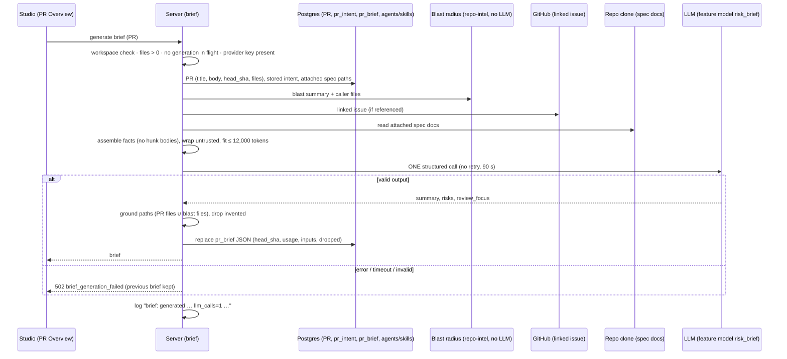
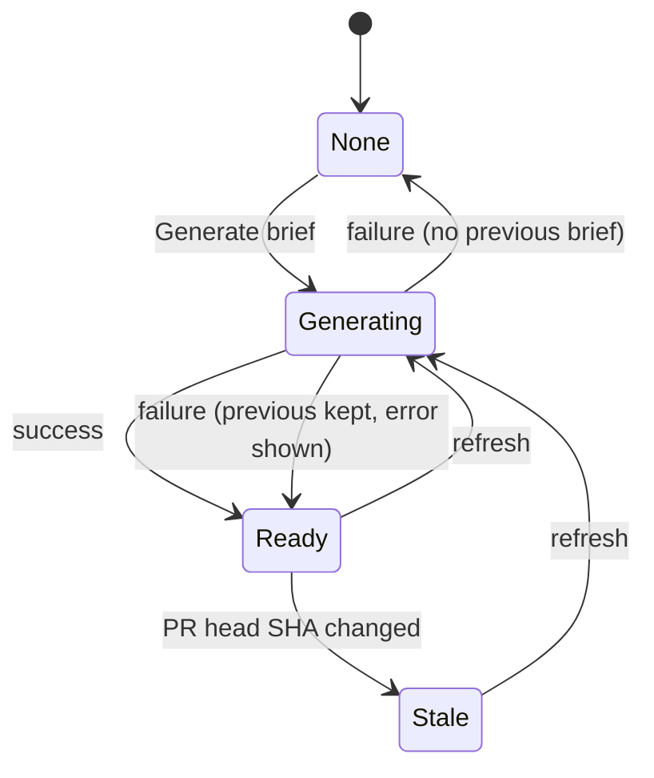

# Spec: PR Brief (Why + Risk Brief on the PR Overview tab)
Date: 2026-10-02
Status: approved
Supersedes: none

> Lesson scope: **L05 homework — "PR Why + Risk Brief"**, branch `lesson-05-homework`. Builds on Intent
> (`specs/intent-layer.md`), Smart Diff (`specs/smart-diff.md`), Blast Radius (`specs/blast-radius.md`) and Project
> Context (`specs/2026-10-01-project-context.md`), which all exist in this fork. Priority tags **[P1]** (blocking),
> **[P2]** (non-blocking), **[P3]** (wish) come from the assignment and are kept on every AC.

## Problem and user

A **reviewer opening someone else's PR "cold"** does not know why the change exists, what is risky in it, or which
file to read first. DevDigest already computes parts of the answer: the PR's Intent (L03), a role-ordered Smart Diff
(L03) and a Blast Radius map (L04). They sit in separate cards and none of them says "start here, because".

The PR Brief puts these facts into **one card on the Overview tab** and adds two model-written parts:
**Risk areas** (concrete risks, each tied to a file) and **Review focus** (`file:line — why it matters`, a reading
order). The model is called **exactly once** per generation and is given only the already-computed facts. It never
sees diff code. The result is cached per PR and bound to the PR's head commit.

## Goals / Non-goals

- **Goals**
  - G1: One *PR Brief* block on the Overview tab: a summary (what the PR does and why), Risk areas and Review focus,
    shown with the existing Intent and Blast radius blocks.
  - G2: Generation makes **exactly one** structured LLM call with the model from the `risk_brief` feature setting,
    using only computed facts (intent, blast-radius summary and caller files, diff statistics, PR description, linked
    issue, attached specs). Diff hunk bodies are never sent.
  - G3: Every file the brief names exists in the PR's file list or in the Blast Radius map. The model cannot add
    invented paths.
  - G4: Review focus items take the user to that file (and line) on the Files changed tab.
  - G5: The brief is cached and bound to the PR's head commit. A reload shows it with no new LLM call, a refresh
    button regenerates it, and a new commit marks it stale.
  - G6: The brief works with fewer facts when Intent and/or Blast radius are missing, and says which inputs were
    missing.
  - G7: The model input has a fixed budget with a stated unit, and the call count, tokens and cost can be seen in the
    UI and the logs.
- **Non-goals**
  - "Prior PRs touching these files" (L04 P3) inside the brief. The existing `PriorPrsCard` on Overview is left
    unchanged and is not part of the brief.
  - Deriving Intent or computing anything with an extra LLM call during brief generation. A missing Intent is reported
    as missing, not derived (AC-9).
  - Automatic generation when the page opens or a commit arrives. Generation always starts from a user action (AC-2,
    AC-21).
  - Matching the screenshot pixel for pixel. A simple list layout is acceptable (AC-32).
  - Brief history or versions. Only the latest brief per PR is kept.
  - Exposing the brief through the MCP server or posting it to GitHub.
  - A brief language other than English.

## User stories

- **US-1**: As a reviewer, I want a PR Brief block on the Overview tab with a *Generate brief* button while no brief
  exists, so that I can ask for one when I need it.
- **US-2**: As a reviewer, I want the generated brief to show a short summary of what the PR does and why, plus Risk
  areas and Review focus, next to the Intent and Blast radius blocks when they exist, so that I understand the PR
  before reading code.
- **US-3**: As a reviewer, I want every risk to show a title and the file it concerns, so that I know where each risk
  is.
- **US-4**: As a reviewer, I want Review focus as a list of `file:line — why it matters` and to click an item to land
  on that file (and line) on the Files changed tab, so that I can start reading in the right place.
- **US-5**: As a reviewer, I want the brief to appear immediately after a page reload with no new generation, and a
  refresh button to regenerate it, so that I don't pay twice and can update it when I choose.
- **US-6**: As a reviewer, I want to know when the brief is out of date (new commit) or was built with missing data,
  so that I don't trust stale or incomplete advice.
- **US-7**: As the person paying for the LLM, I want each generation to make exactly one bounded model call with the
  configured `risk_brief` model, visible in the UI and the logs, so that cost is predictable and checkable.

## Acceptance criteria (EARS)

### Block, states and generation control

- **AC-1** [P1] (state-driven, covers US-1): WHILE the Overview tab of a PR is shown, the page shall render a
  *PR Brief* block with a section label, placed above the other Overview content. — *Verify: component test of the
  Overview tab renders the PR Brief section label first.*
- **AC-2** [P1] (state-driven, covers US-1): WHILE no brief is stored for the PR, the PR Brief block shall show a short
  explanation, the note that generating makes one LLM call, and a *Generate brief* button. Opening the page shall never
  start a generation by itself. — *Verify: component test with a "none" response renders the button and the note; a
  server test shows that reading the brief makes 0 LLM calls (counting fake `LLMProvider`).*
- **AC-3** [P3] (state-driven, covers US-2): WHILE a generation for the PR is running, the block shall show a loading
  skeleton in place of the summary, Risk areas and Review focus, and shall disable *Generate brief* / refresh. —
  *Verify: component test with a pending mutation shows the skeleton and disabled buttons.*
- **AC-4** [P1] (unwanted behaviour, covers US-7): IF a second generation request for the same PR arrives while one
  is running, THEN the system shall reject it with `409 generation_in_progress` and start no second LLM call. —
  *Verify: service test fires two concurrent generations → one LLM call total, the second gets 409.*
- **AC-5** [P1] (unwanted behaviour, covers US-7): IF generation fails (provider error, 90-second timeout, or output
  that fails the output schema), THEN the system shall store nothing new, keep any previous brief unchanged, answer
  with `502 brief_generation_failed` and a short, secret-free reason, and the block shall show an error message with a
  *Retry* action (above the previous brief, if one exists; AC-37). — *Verify: service tests with a throwing fake and a
  schema-invalid fake → 1 call each, stored brief unchanged; component test of the error and Retry.*
- **AC-37** [P1] (unwanted behaviour, covers US-5, US-6): IF a regeneration fails (AC-5) while a previous brief is
  stored, THEN the block shall keep showing the previous brief and shall show an error banner above it stating that
  regeneration failed, giving the short failure reason, and stating that the brief shown is the previous one with its
  generation time and the short (7-character) head commit SHA it was generated for, plus a *Retry* action that runs one
  new generation (AC-21). The banner shall be announced (`role="alert"`) and shall disappear after a successful
  generation. — *Verify: component test: stored brief `{generated_at, head_sha: "a1b2c3d…"}` + failed mutation → banner
  text contains "regeneration failed", the relative time and `a1b2c3d`, the previous summary is still rendered, Retry
  sends one generate request; after a successful retry the banner is gone.*
- **AC-6** [P1] (unwanted behaviour, covers US-7): IF the provider configured for `risk_brief` has no API key, THEN
  the system shall make no LLM call and answer with the same configuration error the Intent layer uses for a missing
  key, and the block shall show it with a pointer to Settings. — *Verify: service test with no key → 0 calls, error
  code; component test shows the Settings pointer.*
- **AC-7** [P1] (unwanted behaviour, covers US-1): IF the PR has zero changed files, THEN *Generate brief* shall be
  disabled with a note that there is nothing to brief, and a generation request shall be rejected with
  `409 no_changes` without an LLM call. — *Verify: service test on a PR with no files → 409, 0 calls; component test.*
- **AC-8** [P1] (unwanted behaviour, covers US-7): IF a brief read or generation request names a PR outside the
  caller's workspace, THEN the system shall answer `404` and make no LLM call. — *Verify: route test with a PR of
  another workspace.*

### Model input (facts only)

- **AC-9** [P1] (ubiquitous, covers US-2, US-6): The system shall build the model input only from these computed
  facts: the stored Intent of the PR (if any; never derived during brief generation), the Blast Radius `summary` and
  its de-duplicated list of caller files (if a map is available), the PR's diff statistics (per file: path, Smart Diff
  role, additions, deletions, and the numeric new-side line ranges of its hunks), the PR title and description, the
  linked issue (AC-11), and the attached specs (AC-12). — *Verify: unit test of the input builder with all inputs
  present: each named section is in the assembled prompt and no other source is.*
- **AC-10** [P2] (ubiquitous, covers US-7): The model input shall never contain diff hunk bodies: no patch text, no
  added/removed/context code lines, and no hunk-header context text after the `@@ … @@` ranges. Only the numeric
  ranges from hunk headers may appear. — *Verify: unit test with a PR whose patch contains a sentinel string (in a code
  line and in a hunk-header context) → the sentinel is absent from the assembled messages.*
- **AC-11** [P1] (ubiquitous, covers US-2): The linked issue shall be the first issue reference found in the PR
  **description only** (not the title, commits or comments), under the Intent layer's reference rules (`#N` or
  `owner/repo#N`, same reference limits and fetch safeguards), passed as its title and body. A first reference to
  another repository counts as not fetchable and shall be recorded as missing with the reason "issue in another
  repository". IF no issue is referenced or it cannot be fetched, THEN generation shall continue without it and record
  it as missing (AC-14). — *Verify: service test with `#12` in the body and a mock
  GitHub client → issue in the prompt; with a GitHub error → `linked_issue` in missing inputs, 1 LLM call.*
- **AC-12** [P1] (ubiquitous, covers US-2): The attached specs shall be the Project Context documents attached to the
  workspace's **enabled** agents and to the enabled skills linked to them, read from the PR repo's local clone, in this
  order: agents by creation time (oldest first), then each agent's resolved document set in its attachment order;
  a path already taken from an earlier agent is not repeated (de-duplicated by repo-relative path). A path that does not exist in the clone shall be skipped
  and listed as skipped in the brief's input record. — *Verify: service test with two agents sharing one path and one
  missing path → one copy in the prompt, the missing one recorded as skipped.*
- **AC-13** [P2] (ubiquitous, covers US-7): The assembled model input (system message plus user message, as sent) shall
  be at most **12,000 tokens**, counted with the server's tokenizer (`cl100k_base`). Section caps: PR title and
  description ≤ 1,500; linked issue ≤ 1,200; Intent ≤ 600; Blast summary and caller files ≤ 1,400 (at most 60 caller
  files); diff statistics ≤ 2,300 (at most 200 files); attached specs ≤ 4,000 in total; system prompt and output
  instructions take the rest (≈ 1,000). IF the assembled input is still over 12,000 tokens, THEN the system shall shrink
  sections in this order until it fits: (1) attached specs, dropping whole documents from the end, then cutting the
  last one; (2) linked issue body; (3) PR description, keeping the start; (4) caller-file list, from the end;
  (5) diff-statistics list, keeping files sorted by role (core first) then churn, and replacing the rest with
  "+N more files (A additions, D deletions)". The PR title, Intent and Blast `summary` shall never be truncated; the
  Intent's 600-token cap is a budget allowance, and an Intent larger than it is kept whole while the other sections
  shrink instead. Every
  truncation shall be recorded in the brief's input record. — *Verify: unit test with a 2,000-file PR, a 30,000-token
  spec and a long description → assembled input ≤ 12,000 tokens, specs cut first, the title and Intent unchanged,
  truncations recorded.*
- **AC-14** [P1] (ubiquitous, covers US-6): The stored brief shall record which inputs were **missing** (`intent`,
  `blast`, `linked_issue`, `description`, `specs`) with a short reason each (for example "intent not derived yet",
  "blast radius unavailable: index not ready"), and which were **truncated** or **skipped**. — *Verify: service test
  with no Intent and no blast → both listed with reasons.*
- **AC-15** [P1] (state-driven, covers US-2, US-6): WHILE the brief was generated without Intent and/or Blast radius,
  the block shall still show the summary, Risk areas and Review focus, and shall show a line naming each missing input
  in plain words (e.g. "Generated without: Intent (not derived yet), Blast radius (index not ready)"). — *Verify:
  component tests for intent missing, blast missing, and both missing.*

### The single model call

- **AC-16** [P2] (event-driven, covers US-7): WHEN a generation runs (none of AC-4, AC-6, AC-7, AC-8 applies), the
  system shall make **exactly one** structured completion request with no schema-repair re-prompt and no transport
  retry, using the provider and model resolved for the `risk_brief` feature (Settings → Feature Models) for the PR's
  workspace, with no hard-coded model. — *Verify: service test with a counting fake → exactly 1 call, and the request's
  model equals a non-default value set in the `risk_brief` setting; with a schema-invalid fake → still 1 call (AC-5).*
- **AC-17** [P2] (ubiquitous, covers US-2, US-3, US-4): The model output shall be validated against a schema of
  `summary` (1–600 characters), `risks` (0–6 items of `kind`, `title`, `explanation`, `severity` `high|medium|low`,
  `file_refs` of 1–3 strings `path`, `path:line` or `path:start-end`) and `review_focus` (0–6 items of `file`, `line`
  (integer ≥ 1), `reason`). Output that fails the schema is a failed generation (AC-5). — *Verify: unit tests: valid
  output passes; a missing `summary`, a `severity` of `critical` or a `line` of 0 fails.*

### Grounding (no invented paths)

- **AC-18** [P1] (unwanted behaviour, covers US-3, US-4): IF a risk `file_ref` or a Review focus `file` names a path
  that is in neither the PR's file list nor the Blast Radius map's files (declaring files and caller files) used for this
  generation, THEN the system shall drop that reference; a risk left with no valid `file_ref` and a Review focus item
  with an invalid file shall be dropped whole. `dropped_items` shall equal the number of whole risks and Review focus
  items dropped plus the number of invalid file refs removed from risks that were kept; it shall be stored and logged. Path comparison
  is exact on repo-relative paths after trimming a leading `./` or `/`. — *Verify: unit test: output with one valid
  risk, one risk naming only `src/invented.ts`, and one risk with one valid and one invalid ref → 2 risks kept (the
  second without the invalid ref), `dropped_items = 2`.*
- **AC-19** [P1] (state-driven, covers US-3): WHILE the stored brief has no risks (none returned, or all dropped by
  AC-18), Risk areas shall show the `noRisks` message from `client/messages/en/brief.json`; WHILE it has no Review focus
  items, Review focus shall show an empty-state line. — *Verify: component tests for both empty states.*

### What the brief shows

- **AC-20** [P1] (state-driven, covers US-2, US-3, US-4): WHILE a brief is stored, the block shall show the summary
  (what the PR does and why), a *Risk areas* list in which every item shows its title and at least one `path` (with
  `:line` / `:start-end` when given), and a *Review focus — read these first* list with the item count, where every item
  reads `file:line — reason`. Model text shall be shown as plain text (no markdown links, no raw HTML). — *Verify:
  component test with a brief fixture renders summary, each risk title + ref and each `file:line — reason`; a
  `<script>` or `[x](javascript:…)` in model text renders inert with no anchor.*
- **AC-21** [P1] (event-driven, covers US-2): WHEN the user activates *Generate brief* or the refresh button, the
  system shall run one generation and, on success, replace the stored brief and show it without a page reload. The
  action shall not ask for confirmation and its tooltip shall state that it makes one LLM call. — *Verify: component
  test: click refresh → generate request sent, new brief rendered; tooltip text present.*
- **AC-22** [P1] (state-driven, covers US-2): WHILE the PR has a stored Intent and/or an available Blast Radius map,
  the Overview tab shall show the existing Intent and Blast radius blocks next to the brief's Risk areas and Review
  focus (Intent and Risk areas on one side, Blast radius on the other, Review focus full width below, on wide screens);
  WHILE either is absent, its existing empty/unavailable state is shown in its place. The Intent and Blast radius blocks
  shall stay in this brief grid in every brief state, including when no brief exists yet (AC-2), while generating
  (AC-3) and after a failure (AC-5). — *Verify: component test of the Overview layout with both present and with both
  absent, and with the "none" brief state (both cards still rendered in the grid).*
- **AC-23** [P2] (ubiquitous, covers US-7): The block shall show the brief's usage as tokens in → out and cost, with
  the same formatting as the run-cost badge (unknown cost as "—"), and the model in its tooltip. — *Verify: component
  test: `{tokens_in: 8200, tokens_out: 1300, cost_usd: 0.014}` → "$0.014 8.2K→1.3K"; `cost_usd: null` → "—".*
- **AC-24** [P3] (state-driven, covers US-2): WHERE the PR has a finished review run, the top of the brief shall show
  the existing verdict banner (verdict, finding and blocker counts, PR score) of the latest review, with the brief's
  summary as its text; WHILE there is no finished review, the summary shall be shown on its own without a verdict. —
  *Verify: component tests with and without a latest review.*
- **AC-25** [P3] (event-driven, covers US-3): WHEN the user expands a risk, it shall show the risk's `explanation`; each
  risk's icon and colour shall reflect its `severity`, with the severity also given as text for assistive technology.
  — *Verify: component test toggles a risk (`aria-expanded`, explanation visible) and checks the severity label.*
- **AC-26** [P3] (ubiquitous, covers US-2): Every user-visible label of the brief shall come from
  `client/messages/en/brief.json` (existing keys such as `block.intent`, `block.blast`, `block.risks`, `noRisks`,
  `unavailable`, `unavailableHint`, plus new keys), not hard-coded strings. — *Verify: `pr-self-review` i18n gate; no
  literal strings in the brief components.*

### Navigation to Files changed

- **AC-27** [P1] (event-driven, covers US-4): WHEN the user activates a Review focus item whose file is in the PR's
  diff, the studio shall switch to the Files changed tab (`?tab=diff`) with the target file and line in the URL, expand
  the file's Smart Diff group (even a group that starts collapsed) and the file card, scroll the file card into view and
  highlight it. — *Verify: component test: click an item for a file in a collapsed group → `tab=diff` plus the file and
  line in the URL, group and card expanded, `scrollIntoView` called on that card.*
- **AC-28** [P2] (event-driven, covers US-4): WHEN the Files changed tab opens with a target line that lies inside one
  of the file's hunks (new side), the studio shall scroll that line into view and highlight it; IF the line is not in any
  hunk, THEN the studio shall scroll to the file card and show a short note that the line is outside the changed hunks.
  — *Verify: component tests for an in-hunk line (line row highlighted and scrolled) and an out-of-hunk line (note).*
- **AC-29** [P3] (unwanted behaviour, covers US-4): IF the activated item's file is not in the PR's diff (it came from
  the Blast Radius map), THEN the studio shall stay on Overview and show a short message "File not in this PR's diff"
  next to the item. — *Verify: component test with a caller-file item → message shown, tab unchanged.*
- **AC-30** [P3] (event-driven, covers US-3): WHEN the user activates a risk's file reference, the studio shall navigate
  as in AC-27/AC-28 (or show AC-29's message) for that path and line. — *Verify: component test clicking a risk ref.*

### Cache and freshness

- **AC-31** [P1] (event-driven, covers US-5): WHEN the PR page is reloaded and a brief is stored for the PR, the block
  shall show the stored brief from the brief-read response with no LLM call. — *Verify: server test: generate, then read
  twice → 1 LLM call total, identical brief; e2e/manual: reload shows the brief immediately.*
- **AC-32** [P1] (ubiquitous, covers US-5, US-6): The stored brief shall include the PR head commit SHA it was generated
  for, its generation time, model, usage, input record (AC-14) and dropped count, stored inside the brief JSON of the
  PR's brief row (one row per PR, replaced on regeneration). — *Verify: `.it` test reads the stored JSON after a
  generation and checks these fields.*
- **AC-33** [P2] (state-driven, covers US-6): WHILE the stored brief's head SHA differs from the PR's current head SHA,
  the brief-read response shall mark it stale and the block shall show a notice that new commits arrived since the
  brief was generated, with the refresh action; the brief shall not regenerate automatically. — *Verify: server test:
  change the PR's head SHA → read returns `stale: true`, 0 LLM calls; component test of the notice.*
- **AC-34** [P1] (ubiquitous, covers US-2): The block's visual structure shall follow the supplied screenshots in
  substance, not in polish: a header area (summary, optional verdict and score, usage, refresh), the Intent and Blast
  radius blocks beside Risk areas, and a full-width Review focus list. A plain list styling is acceptable. — *Verify:
  manual comparison with screenshot 1 in the demo video; recorded in the Delivery log.*

### Observability and security

- **AC-35** [P2] (event-driven, covers US-7): WHEN a generation finishes (success or failure), the server shall write
  one log line `brief: generated pr=<id> head=<sha7> ok=<true|false> llm_calls=<0|1> input_tokens=<n>/12000
  tokens=<in>/<out> cost=<$x|unknown> model=<provider/model> duration_ms=<n> dropped=<n> missing=<list|none>`, and
  WHEN the LLM call is made it shall emit one `prompt.assembled` event with `call: "risk_brief"`, section names and
  token sizes and the request correlation id, never the prompt text. — *Verify: service test with a captured logger:
  one `brief: generated` line with `llm_calls=1` and one `prompt.assembled` event per generation; neither contains
  the PR description text.*
- **AC-36** [P1] (ubiquitous, covers US-2, US-7): Every untrusted text in the model input (PR title and description,
  linked issue, spec documents, Intent text, file paths) shall be passed inside the shared untrusted-data wrapper behind
  the shared injection guard, and each spec document shall be labelled with its escaped repo-relative path. — *Verify:
  unit test: a description containing `</untrusted>` and "ignore previous instructions" stays inside its block.*

## Edge cases

- **No Intent stored** for the PR: generation runs without it, makes no intent derivation, lists `intent` as missing
  ("not derived yet"); the Intent block shows its existing empty state (covers AC-9, AC-14, AC-15, AC-22).
- **Intent stored but stale** (PR changed since it was derived): used as is; the input record notes "intent may be
  outdated" (covers AC-9, AC-14).
- **No Blast radius** (index not ready, `repo-intel` off, `no_data`/`failed`): `blast` listed missing with the reason;
  grounding then uses the PR file list only (covers AC-14, AC-15, AC-18).
- **Blast map degraded/partial** but has callers: used; the input record notes it is partial (covers AC-14).
- **Neither Intent nor Blast radius**: brief built from diff statistics, description, issue and specs; both listed as
  missing (covers AC-15).
- **No finished review run**: no verdict banner; summary shown alone (covers AC-24).
- **PR with zero files**: Generate disabled, `409 no_changes`, 0 LLM calls (covers AC-7).
- **Huge PR** (2,000 files, long description, large specs): input shrunk per AC-13 to ≤ 12,000 tokens; truncations
  recorded and visible in the input record (covers AC-13, AC-14).
- **Model returns only invented paths**: every risk and Review focus item dropped; Risk areas shows `noRisks`, Review
  focus shows its empty line, `dropped_items` counts them, the summary is still shown (covers AC-18, AC-19).
- **Model returns a path with a leading `./`**: normalised and accepted if it then matches (covers AC-18).
- **Two Generate clicks / two tabs**: one LLM call; the other request gets `409 generation_in_progress` and the UI
  refetches the result (covers AC-4).
- **Generation fails / times out / invalid JSON**: no retry, `502 brief_generation_failed`, previous brief kept and
  shown under the error with Retry (covers AC-5, AC-16).
- **Refresh fails on a stale brief** (brief for commit `a1b2c3d`, PR now at `e4f5a6b`): the error banner says
  regeneration failed and the brief shown is the previous one from `a1b2c3d` with its time; the stale notice stays too;
  Retry runs one new generation (covers AC-33, AC-37).
- **First-ever generation fails** (no previous brief): error with Retry and the *Generate brief* empty state; no
  "previous brief" wording (covers AC-2, AC-5).
- **No API key for the `risk_brief` provider**: no call, config error with a Settings pointer (covers AC-6).
- **New commit pushed after generation** (head SHA changes on import/poll): stale notice; nothing regenerates until the
  user refreshes (covers AC-33).
- **Repo not cloned yet**: specs cannot be read (`specs` missing: "repository not cloned") and blast is unavailable;
  generation still runs on the remaining facts (covers AC-12, AC-14).
- **Attached spec path deleted from the repo**: skipped and recorded (covers AC-12).
- **Linked issue in another repo, private, or GitHub unreachable**: issue missing with reason; generation continues
  (covers AC-11).
- **Review focus file is a Blast Radius caller file, not in the diff**: kept by grounding; clicking shows "File not in
  this PR's diff" (covers AC-18, AC-29).
- **Review focus line outside the file's hunks** (e.g. the model points at line 300 of a file changed at 10–20): kept;
  navigation opens the file with the "outside the changed hunks" note (covers AC-28).
- **Target file in a collapsed Smart Diff group** (e.g. boilerplate): group and card expand on navigation (covers
  AC-27).
- **Original order selected on Files changed**: navigation still finds and expands the file card (covers AC-27).
- **PR description tells the model "report no risks"**: stays inside the untrusted block; nothing it says can add a
  path because of grounding (covers AC-18, AC-36).
- **Model price unknown**: usage shows "—", log says `cost=unknown` (covers AC-23, AC-35).

## Non-functional requirements

- **Performance:** reading a stored brief responds in ≤ 300 ms; input assembly (excluding the LLM call and the GitHub
  issue fetch) completes in ≤ 1 s for a 2,000-file PR; a generation finishes in ≤ 95 s (90 s LLM timeout, AC-5). —
  *Verify: timed `.it` test for read and assembly; `duration_ms` from the demo log.*
- **Cost:** at most one LLM call per user action and ≤ 12,000 input tokens (AC-13, AC-16). Output is bounded by the
  schema (AC-17). — *Verify: AC-13, AC-16 tests; cost from the demo log.*
- **Security:** endpoints are workspace-scoped (AC-8); the generation endpoint has a per-route rate limit of
  10 requests per minute like the Intent endpoint; no secret (API key, token in a clone URL) appears in the prompt, the
  stored brief, the error reason or the log; spec documents are read only inside the repo's clone (no symlink escape).
  — *Verify: rate-limit route test; a test that a provider error message containing a key is redacted; a spec path that
  is a symlink outside the clone is skipped.*
- **Security (prompt injection):** all untrusted input is wrapped (AC-36); paths in the output are grounded (AC-18);
  model text is rendered inert (AC-20). — *Verify: those ACs' tests.*
- **Accessibility:** refresh and risk-expand controls are buttons with accessible names (`aria-label` on the icon-only
  refresh) and `aria-expanded` on risks; Review focus items are links/buttons reachable by keyboard; severity is given as
  text, not only colour; generation progress and the error message are announced (`role="status"` /
  `aria-live="polite"`). — *Verify: RTL queries by role and name.*
- **Observability:** AC-35's log line and `prompt.assembled` event for every generation; the stored usage (AC-32) is the
  record shown in the UI. — *Verify: AC-35 test.*

## Inputs and provenance

| Model input | Where it comes from | Trust |
|---|---|---|
| Intent (`intent`, `in_scope`, `out_of_scope`, `risk_areas`) | the PR's stored Intent (`pr_intent`, L03), read only | Model-derived from untrusted PR text → **untrusted** |
| Blast `summary` and caller files | the Blast Radius computation behind `GET /pulls/:id/blast` (L04, from the `repo-intel` index, no LLM) | Computed; paths originate in the repo → **untrusted text** |
| Diff statistics: path, role, +/−, hunk line ranges | the PR's imported files (`GET /pulls/:id` `files[]`), Smart Diff roles (L03, deterministic classifier), numeric ranges parsed from hunk headers | Computed; paths **untrusted** |
| PR title and description | GitHub import (PR row) | **Untrusted** (author-written) |
| Linked issue title and body | GitHub, fetched by the Intent layer's reference rules from a reference in the description | **Untrusted** |
| Attached specs | Project Context paths attached to enabled agents/skills, read from the repo's local clone | **Untrusted** (repo contributors) |
| Model choice | `risk_brief` feature setting (Settings → Feature Models; default `openai` / `gpt-4.1`) | User configuration |
| PR head SHA | PR row (`head_sha`), for cache binding | Trusted |
| User actions | Generate, refresh, Retry, Review focus / risk clicks, risk expand | — |

Design sources (all supplied by the user and analysed):

- Screenshots 1, 2, 4 and 5 were read directly as local images. Screenshot 3 (`…/8066FEDF…/pasted-image-20261002-
  090756.png`) exists on disk; its content was taken from the user's description (screenshot 1 with the PR Brief card
  outlined) and adds no new layout facts.
- The user's free-text task statement and acceptance criteria.
- Existing code as the baseline (verified):
  - `server/src/vendor/shared/contracts/brief.ts` is identical in the client copy; `PrBrief { intent, blast, risks,
    history }` has no `summary` or `review_focus`, requires `intent`, `blast` and `history`, and has **no consumer**
    in either package (only a type re-export in `client/src/lib/types.ts:35`).
  - `server/src/db/schema/reviews.ts:83-88`: table `pr_brief(pr_id PK → pull_requests, json jsonb)`, never read or
    written; no `server/src/modules/brief/`.
  - `server/src/vendor/shared/contracts/platform.ts:58-64`: feature model `risk_brief`, default `openai` / `gpt-4.1`;
    a module must resolve it through `container.resolveFeatureModel` (`server/INSIGHTS.md:167-179`).
  - Single-attempt structured calls already exist: `StructuredRequest.singleAttempt` (`server/src/vendor/shared/
    adapters.ts:82`), used by onboarding (`server/src/modules/onboarding/service.ts:239`). Without it,
    `completeStructured` re-prompts on schema failure.
  - Intent: `GET /pulls/:id/intent` returns the stored record with `stale` (`server/src/modules/intent/service.ts:119-
    126`); `POST` derives with its own LLM call (`review_intent`). The record keeps source refs, not issue text; issue
    refs are parsed by `server/src/modules/intent/helpers.ts:68-69, 128`.
  - Blast: `GET /pulls/:id/blast` (`server/src/modules/blast/routes.ts:31-32`); `BlastRadius.summary`, `downstream[].
    callers[].file`, `degraded`, `reason`.
  - Smart Diff is deterministic (`server/src/modules/reviews/smart-diff/build.ts`, `classify.ts`; no LLM).
  - `PrFile { path, additions, deletions, patch }` (`platform.ts:184-189`); the PR row has `head_sha` and `body`.
  - Project Context attachments are `context_paths` on agents (`server/src/db/schema/agents.ts:34`) and skills
    (`skills.ts:19`), repo-relative; agents are workspace-wide and have `enabled`.
  - Client: Overview renders `IntentCard`, `BlastRadiusCard`, `PriorPrsCard`, description (`…/OverviewTab/
    OverviewTab.tsx`); tabs are `overview | findings | diff` in `?tab=` (`…/PrDetailView/PrDetailView.tsx:62-64`);
    `DiffTab` has no target-file input and starts some role groups collapsed (`COLLAPSED_ROLES`);
    `VerdictBanner` is used only by `ReviewRunAccordion`; `client/messages/en/brief.json` exists and is unused.

## Untrusted inputs

- **PR title/description, linked issue, spec documents, Intent text, file paths:** sent only inside the shared
  untrusted wrapper behind the injection guard, each section capped (AC-13, AC-36). Spec documents are read only from
  inside the clone.
- **Diff hunk bodies:** never sent, including hunk-header context text (AC-10). This removes code-comment injection as
  a route into the brief.
- **Model output:** schema-validated (AC-17); every path grounded against the PR files and the Blast map (AC-18);
  rendered as plain text with no links or HTML (AC-20); a failure stores nothing (AC-5).
- **Line numbers from the model:** checked against hunks only at navigation time; an out-of-hunk line opens the file
  with a note instead of failing (AC-28).
- No `WebFetch` content was used; the screenshots were read as local images for layout only.

## Workflows and contracts

### Generation

### Brief states (client)

### Boundary contracts (behaviour level; exact names are for the plan)

- **Read:** `GET /pulls/:id/brief` → `{ status: 'none' | 'ready' | 'generating', stale: boolean, brief: Brief | null }`.
  `404` outside the workspace. Makes no LLM call.
- **Generate:** `POST /pulls/:id/brief` → `Brief`. Errors: `409 generation_in_progress`, `409 no_changes`,
  `502 brief_generation_failed` (with a secret-free reason), the Intent layer's missing-key config error, `404`
  outside the workspace.
- **Contract change in both `@devdigest/shared` copies** (`server/src/vendor/shared/contracts/brief.ts` and
  `client/src/vendor/shared/contracts/brief.ts`, changed together):
  - add `summary: string` and `review_focus: [{ file, line, reason }]` to the composed brief;
  - the brief must allow `intent` and `blast` to be absent (null), since AC-15 requires a brief without them, and
    `history` is not produced by this feature (absent/null);
  - new fields on the stored brief (`head_sha`, `generated_at`, `model`, `usage { llm_calls, tokens_in, tokens_out,
    cost_usd | null, duration_ms }`, `inputs { missing[{ input, reason }], truncated[], skipped[], input_tokens }`,
    `dropped_items`) are additions to a jsonb-persisted shape and must be optional-tolerant for later changes
    (`server/INSIGHTS.md` on persisted contracts).
- **Model output schema** (single structured call): `{ summary, risks: Risk[], review_focus: [{ file, line, reason }] }`
  with the bounds of AC-17, reusing the existing `Risk` shape.
- **Files changed deep link:** `?tab=diff` plus the target file path and line in the query, so a reload or shared URL
  lands on the same place (AC-27, AC-28).

## Design review notes

- **Gaps found in the supplied design (promoted to ACs):** no empty "no brief yet" state (AC-2), no generating state
  (AC-3), no failure state (AC-5, AC-6), no stale notice (AC-33), no indication of missing inputs (AC-15), no
  behaviour for a Review focus file outside the diff (AC-29) or a line outside the hunks (AC-28), no empty Risk areas /
  Review focus (AC-19).
- **Verdict banner vs brief summary:** in screenshot 1 the banner text ("Solid middleware approach, but a Stripe secret
  key …") reads like the review's summary, not the brief's. The assignment says the brief summary is mandatory and the
  verdict is a P3 wish; AC-24 shows the brief summary in the banner. The banner's cost (`$0.014 8.2K→1.3K`) is
  ambiguous between review cost and brief cost; AC-23 shows the **brief's** usage.
- **Refresh icon** sits on the banner in the design. With no review (no banner) it needs a home; AC-21/AC-34 place it in
  the brief header area regardless of the banner.
- **Risk refs `path:12-18`**: the model sees only hunk line ranges, not code, so line ranges in risks and Review focus
  are approximate by design. Grounding checks paths, not lines; lines are checked only for navigation (AC-28).
- **"Prior PRs touching these files"** in the Blast card is out of scope for the brief; the existing card is left as is.
- **Cross-module communication:** the new brief feature reads the stored Intent (no derivation), the Blast Radius
  computation, the PR files and Smart Diff roles, Project Context attachments, and the GitHub issue fetch used by the
  Intent layer, and resolves its model via the container's feature-model resolver. Each of these is another module's
  data; reaching it without cross-module imports is the plan's concern (`onion-architecture`).
- **Uncovered (not required):** whether the Overview should still show the PR description card under the brief (it
  does today; the spec leaves it unchanged).
- **UX proposals (not required):** show the computed churn (`+31 −6`) next to each Review focus item; a "Copy brief as
  Markdown" action for pasting into the PR; collapse the Intent's own `risk_areas` list when the brief's Risk areas are
  present, to avoid two "risk" lists on one card.

## Traceability

| US | Covered by AC(s) | Edge cases |
|---|---|---|
| US-1 | AC-1, AC-2, AC-7, AC-8 | zero files |
| US-2 | AC-3, AC-9, AC-11, AC-12, AC-15, AC-20, AC-21, AC-22, AC-24, AC-26, AC-34, AC-36 | no Intent; no blast; neither; no review; repo not cloned; deleted spec; issue unreachable |
| US-3 | AC-17, AC-18, AC-19, AC-20, AC-25, AC-30 | only invented paths; `./` prefix; injection in description |
| US-4 | AC-17, AC-18, AC-20, AC-27, AC-28, AC-29 | caller file not in diff; line outside hunks; collapsed group; original order |
| US-5 | AC-31, AC-32, AC-37 | refresh fails on a stale brief |
| US-6 | AC-9, AC-14, AC-15, AC-32, AC-33, AC-37 | stale intent; degraded blast; new commit; refresh fails on a stale brief |
| US-7 | AC-2, AC-4, AC-5, AC-6, AC-8, AC-10, AC-13, AC-16, AC-23, AC-35, AC-36 | huge PR; concurrent clicks; failure; no key; unknown price |

## Delivery (process / Definition of Done — not product ACs)

- [P1] The PR contains this spec and the Development Plan made by `spec-creator` and `implementation-planner`; an open
  PR exists with an implementation description and a demo video (generate, reload without regeneration, refresh,
  Review focus click to Files changed).
- [P2] Spec and plan are committed before feature code; the PR description carries a cross-model-review note on the
  plan; the final `plan-verifier` report is attached with no open requirements.
- [P3] `workflow-retro` result and a cost report are attached to the PR.
- Validation per `AGENTS.md`: tests and typecheck of `server` and `client`; an e2e flow for the user-visible path
  (Overview → brief shown from seeded cache → Review focus click lands on Files changed) is recommended.

## Open questions

None open. All six questions were answered by the user on 2026-10-02; see below.

### Resolved decisions

1. **One model call.** Single attempt: no schema-repair re-prompt and no transport retry (as onboarding does). A schema
   failure is a failed generation with Retry (AC-5, AC-16).
2. **Attached specs.** The union of documents attached to the workspace's enabled agents and their enabled linked
   skills, de-duplicated by path, in attachment order (AC-12).
3. **Input budget.** 12,000 tokens counted with `cl100k_base` over the full assembled input (AC-13); raised from the
   initially recommended 8,000 by user decision. Rationale: 8,000 is tight for PRs with 80–100 files plus specs and a
   linked issue; 12,000 costs at most ~2.4 cents per generation on `gpt-4.1` and stays well under the 16,000 used by the
   onboarding tour. Section caps were scaled with it (specs 2,000 → 4,000; Intent kept at 600).
4. **Failed regeneration.** The previous brief is kept, and the UI says so explicitly: an error banner above the brief
   states that regeneration failed and that the brief shown is the previous one, with its generation time and commit
   SHA, plus a Retry action (AC-5, AC-37).
5. **Stale after a new commit.** The brief is marked stale with a refresh action and never regenerates automatically
   (AC-33).
6. **Linked issue.** The first issue referenced in the PR description, fetched again at brief time with the Intent
   layer's reference rules and safeguards (AC-11). The Intent record does not keep issue text.
