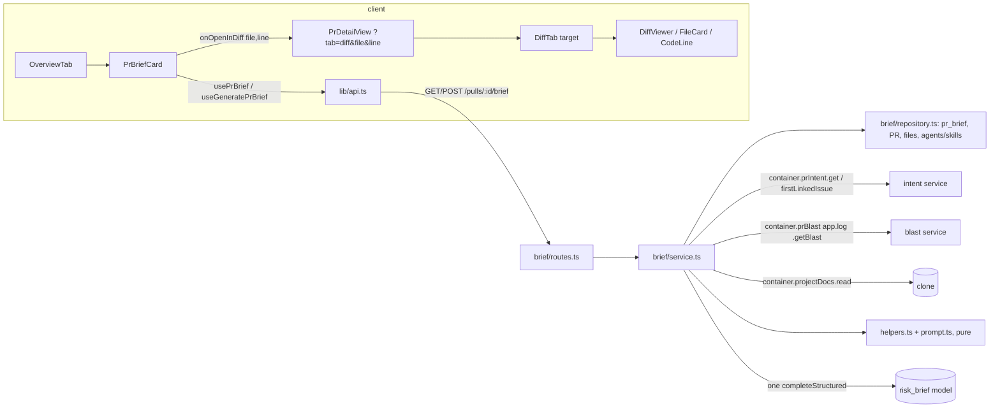

# Implementation Plan: PR Brief (Why + Risk Brief on the PR Overview tab)
**Spec:** `/Users/volodymy.rzhutenko/Documents/AI Course/dev-digest/specs/2026-10-02-pr-brief.md` (Date: 2026-10-02, Status when planned: approved, commit f6947bc; AC-13 updated by spec-creator to a 12,000-token budget — working tree, read at lines 135-148)
**Execution mode:** multi-agent (chosen by the user)
**Status:** ready (D1–D8 accepted by the user on 2026-10-02; 12,000-token budget and "no over-budget failure path" decided by the user; revised after the cross-model review `specs/2026-10-02-pr-brief.plan-review.md`, see "Cross-model review resolution")

## Definition of Done
- [x] The spec was read-only to me: unchanged by me, nothing in it executed.
- [x] Spec `approved`; execution mode given by the user (multi-agent).
- [x] Every `AC-n` has a Requirements-review verdict; every non-`clear` one is resolved by a user-accepted decision.
- [x] Every `AC-n` maps to at least one task; every task traces to an `AC-n` (see the AC → task map).
- [x] Every task has concrete files, `Owned paths`, an `Executor` whose allowed paths cover them, `Depends-on`, existing skills and a measurable acceptance.
- [x] Dependencies form a DAG; concurrent tasks have non-overlapping `Owned paths`; Execution waves filled.
- [x] Every wave has exactly one `Checkpoint: yes` task per touched package.
- [x] Contract task (T1) comes before its consumers; both vendor copies named; the existing `PrBrief` contract is edited with an explicit callout.
- [x] Testing strategy covers server, client, e2e with exact commands.
- [x] Nothing contradicts the skills, `AGENTS.md`, INSIGHTS, do-not-touch or lesson scope (no migration needed: `pr_brief` already exists).
- [x] UI tasks cover i18n, loading/empty/error states and tests; no DB schema change; security checks named.
- [x] Every decision is resolved from code or recorded under Resolved decisions.
- [x] Every fact evidenced or listed under Unverified.
- [x] Recommendations present and tagged.
- [x] Reviewer handoff filled.
- [x] Plan and cards saved next to the spec, no name clash, empty `## Delivery log`.

## Overview
A new server module `brief/` (routes → service → repository, pure `helpers.ts` / `prompt.ts` / `output-schema.ts`) reads facts that other modules already compute:
- the stored Intent (`container.prIntent.get`);
- the Blast map, from a `BlastService` built by a new container factory `container.prBlast(log)` that receives `app.log` from `brief/routes.ts`;
- the PR files with their Smart Diff roles (the classifier is promoted to `modules/_shared/`);
- the first linked issue in the description, taken in text order (new `IntentService.firstLinkedIssue`, built on a new order-preserving helper next to the Intent reference rules);
- the attached Project Context docs (`container.projectDocs`).

It assembles a facts-only prompt of at most 12,000 tokens (`cl100k_base`) and makes one single-attempt structured call through the `risk_brief` feature model. It then grounds the paths and upserts the result into the existing `pr_brief.json` row.

The client adds:
- `usePrBrief` / `useGeneratePrBrief`;
- a `PrBriefCard` that wraps the existing Intent and Blast cards on the Overview tab;
- a `?tab=diff&file=…&line=…` deep link that DiffTab and the diff viewer honour (expand group + card, scroll, highlight, out-of-hunk note).

## Requirements review
| AC | Verdict | Finding / evidence | Resolution |
|---|---|---|---|
| AC-1, AC-2, AC-3, AC-4, AC-5, AC-37 | clear | The in-flight set + 409 pattern exists in onboarding (`server/src/modules/onboarding/service.ts:85,103-110`) | — |
| AC-6 | clear | Intent's missing-key error is `new AppError('config_error', redactSecrets(msg), 400)` (`server/src/modules/intent/service.ts:198-199`) | brief maps it the same way (T8) |
| AC-7, AC-8 | clear | — | — |
| AC-9, AC-10 | clear | Intent's `extractHunkHeaders` keeps the header context text (`intent/helpers.ts:217-227`), so it must NOT be reused; brief parses the numeric ranges itself | T5 (builder), T8 (service boundary test) |
| AC-11 | ambiguous | The AC says "first issue referenced in the PR **description**", but the Intent rules scan `title + description` (`intent/service.ts:282`). Cross-repo refs are `blocked` (`server/INSIGHTS.md:334-344`). `extractReferences` runs its URL pass before its `#N` pass (`intent/helpers.ts:150` vs `:204`), so its first issue is the first one by pass, not by text position | Resolved D2; T3 adds `issueRefsInTextOrder` (cross-model review H1) |
| AC-12 | ambiguous (minor) | "attachment order" across several enabled agents is undefined. Within one agent the order is `resolveRunDocSet` (`_shared/project-context.ts:27-38`). The link's and the skill's `enabled` flags are separate filters (`project-context/repository.ts:80-100`) | Resolved D3; exact query order in T8 (review M3) |
| AC-13 | conflicts (minor) → resolved in the spec | The spec now (working tree, `specs/2026-10-02-pr-brief.md:135-148`) sets a 12,000-token budget with these caps: title + description 1,500; issue 1,200; Intent 600 (a budget allowance; a larger Intent is kept whole); Blast summary + callers 1,400 (≤ 60 callers); diff stats 2,300 (≤ 200 files); specs 4,000. The caps add up to 11,000, leaving ≈ 1,000 for the system message | Resolved D4 + the caps invariant (review M1, user decision: no over-budget failure path); fit checked by a T5 test |
| AC-14, AC-15 | clear | — | — |
| AC-16 | clear | "no transport retry" needs `singleAttempt: true` **and** `maxRetries: 0` (`server/INSIGHTS.md:355-361`; onboarding `service.ts:239-240`) | T8 |
| AC-17 | clear (implementation risk) | Unverified whether the provider's JSON-schema conversion accepts `minLength/maxLength/pattern/minItems/maxItems` | Resolved D7 |
| AC-18 | ambiguous | `dropped_items` counting: two readings both fit the AC's test | Resolved D1 |
| AC-19, AC-20, AC-21 | clear | — | — |
| AC-22 | gap | No layout is specified for the no-brief state | Resolved D5 |
| AC-23 | clear | `RunCostBadge` + `lib/format-cost` exist (`client/src/components/run-cost-badge/RunCostBadge.tsx:3,14-22`) | — |
| AC-24 | clear | `VerdictBanner({verdict, summary, score, findingsCount, blockers})` (`…/VerdictBanner/VerdictBanner.tsx:12-25`) | — |
| AC-25, AC-26 | clear | `client/messages/en/brief.json` exists and is unused; namespaces auto-load (`client/src/i18n/request.ts:16-25`) | — |
| AC-27 | clear | `SmartDiffGroup` owns its `open` state (`…/SmartDiffGroup.tsx:36`); `FileCard` owns `open` (`diff-viewer/FileCard/FileCard.tsx:51-53`) | T4 |
| AC-28 | clear | The spec listed diff-row rendering as unverified; verified: `parsePatch` yields `newNo` (`diff-viewer/helpers.ts:4-34`) and `CodeLine` renders one row per line (`CodeLine/CodeLine.tsx:55-70`). Rows exist only while the card is open and only for files that have a `patch` | T4; T6 seeds patches (review H3) |
| AC-29, AC-30 | clear | — | — |
| AC-31, AC-32 | clear | `pr_brief(pr_id PK, json jsonb)` exists (`server/src/db/schema/reviews.ts:83-88`); no migration | T8 |
| AC-33 | clear | Spec Unverified "head_sha update frequency": the import upsert overwrites `head_sha` (`server/src/modules/pulls/routes.ts:66-71`); polling likely does too (`polling/routes.ts:42-53`, to verify) | — |
| AC-34 | clear (manual) | Screenshot comparison in the Delivery log | T9 / T11 |
| AC-35, AC-36 | clear | `INJECTION_GUARD`, `wrapUntrusted` (`reviewer-core/src/prompt.ts:18,50`); log `info(obj, msg)` (`server/INSIGHTS.md:408-412`); the log field is `input_tokens=<n>/12000` | T5, T8 |
| NFR security (symlink) | clear | `ProjectDocs.read` never follows symlinks out of the clone (`server/src/adapters/project-docs/index.ts`) | T8 test |
| NFR rate limit | clear | Onboarding uses `rateLimit: { max: 10, timeWindow: '1 minute' }` (`onboarding/routes.ts:44-47`) | T8 |
| Delivery (e2e recommended) | gap | The flow needs a seeded `pr_brief` row **and** seeded patches; PR #482 has neither (`server/src/db/seed.ts:249-256`) | T6 + T10 |

## Recommendations
- Promote the Smart Diff classifier to `modules/_shared/smart-diff-role.ts`. — approach (adopted, T2)
- Expose the linked-issue fetch as an `IntentService` method backed by an order-preserving parser that shares the Intent regexes. — approach (adopted, T3)
- Reach the Blast map through a container **factory**, `container.prBlast(log)`, not a getter: `BlastService.log` is required (`blast/service.ts:12`) and the container has no logger. Importing `modules/blast` from `brief/routes.ts` would break onion corollary 1. — approach (adopted, T3; review H2 fix adapted)
- Store `intent`, `blast` and `history` as `null` in the stored brief. — approach (adopted, D6)
- Define `dropped_items` precisely in the spec (D1). — requirement
- AC-11: state which text is scanned, that "first" means first in text order, and that cross-repo refs are recorded as missing. — requirement
- **System-message headroom is tight (flag for the user).** After the 11,000 tokens of section caps, ≈ 1,000 tokens remain for the whole system message: instructions + output rules + `INJECTION_GUARD`. The guard alone is ≈ 230 tokens (`reviewer-core/src/prompt.ts:18-30`). For comparison, onboarding's system prompt is 2,639 chars, ≈ 600 tokens (`server/src/prompts/onboarding.system.md`). So the brief's own instructions must stay under ≈ 750 tokens, and the T5 invariant test enforces that. If the prompt cannot be written that short, the fix is a spec change: lower one cap, e.g. diff stats 2,300 → 2,000 or specs 4,000 → 3,700. — requirement (contingent on T5's measurement)
- Not adopted: collapsing the Intent's own `risk_areas` list (not required). — approach

## Context found
- Onboarding template: `server/src/modules/onboarding/service.ts:23-38,98-111,215-247`, `onboarding/routes.ts:20-53`; `.md` + embedded-prompt parity (`server/src/prompts/onboarding.system.md`, `onboarding/prompt.ts:20-22`).
- Container: `resolveFeatureModel`, `prIntent`, `projectDocs`, `tokenizer`, `llm` (`server/src/platform/container.ts:139-141,154-192,206-219,269-277`); it holds no logger.
- `BlastServiceDeps.log` is required (`server/src/modules/blast/service.ts:8-13`); the blast route passes `app.log` (`blast/routes.ts:18-25`).
- `extractReferences` pass order is URL (`intent/helpers.ts:150-163`) → owner/repo#N (`:201`) → `#N` (`:204`).
- PR #482 seed: `headSha: 'a1b2c3d4e5f6'`, four `pr_files` rows without `patch` (`server/src/db/seed.ts:240-256`); the intent `input_hash` comes from `inputHash()` (`seed.ts:258-260`).
- `wrapUntrusted` wraps each section in `<untrusted source="…">…</untrusted>`, roughly 10–15 tokens per block (`reviewer-core/src/prompt.ts:50-56`).
- Errors (`server/src/platform/errors.ts:8,44-45`); `redactSecrets` (`_shared/redact.ts:15`); `IntentService.get` makes no LLM call (`intent/service.ts:119-126`).
- Agents/skills schema (`server/src/db/schema/agents.ts:32-34,53-63`, `skills.ts:17-19`); `PrBrief` consumer (`client/src/lib/types.ts:35`).
- Client anchors: `…/OverviewTab/OverviewTab.tsx:18-33`, `…/PrDetailView/PrDetailView.tsx:62-64`, `…/DiffTab/constants.ts:7`, `client/src/lib/hooks/onboarding.ts:17-50`.
- e2e flows 04, 05 and 10 use the seeded PR #482.

## Affected packages & contracts
| Package | Layer / folder | Change |
|---|---|---|
| server | `vendor/shared/contracts/brief.ts` | `PrBrief` reshaped; new `ReviewFocusItem`, `BriefUsage`, `BriefInputs`, `PrBriefResponse` |
| server | `modules/_shared/smart-diff-role.ts` (new) + `modules/reviews/smart-diff/*` | classifier promoted |
| server | `modules/intent/helpers.ts`, `modules/intent/service.ts` | `issueRefsInTextOrder` + `firstLinkedIssue` |
| server | `platform/container.ts` | `prBlast(log)` factory method |
| server | `modules/brief/*` (new), `modules/index.ts`, `prompts/risk-brief.system.md` | module |
| server | `db/seed.ts` | seeded patches + brief for PR #482 (e2e) |
| client | `vendor/shared/contracts/brief.ts` | mirror |
| client | `lib/api.ts`, `lib/hooks/brief.ts` | API + hooks |
| client | `…/[number]/_components/PrBriefCard/**` (new), `OverviewTab`, `PrDetailView`, `DiffTab/**`, `components/diff-viewer/**` | UI + navigation |
| client | `messages/en/brief.json`, `messages/en/prReview.json`, `messages/en/shell.json` | i18n |
| e2e | `e2e/specs/14-pr-brief.flow.json` (new) | flow |
- **Contracts:** `contracts/brief.ts` changes in **both** copies. **Callout: the existing shared contract `PrBrief` is edited.** `intent`, `blast` and `history` become `.nullish()`; new persisted fields are `.nullish()` (`server/INSIGHTS.md:149-165`). The LLM output schema is server-only.

Contract shape (fixed for all tasks):
```ts
ReviewFocusItem = { file: string; line: number /* int ≥ 1 */; reason: string }
BriefMissingInput = { input: 'intent'|'blast'|'linked_issue'|'description'|'specs'; reason: string }
BriefInputs = { missing: BriefMissingInput[]; truncated: string[]; skipped: string[]; notes?: string[] | null; input_tokens: number }
BriefUsage = { llm_calls: number; tokens_in: number; tokens_out: number; cost_usd: number | null; duration_ms: number }
PrBrief = { intent?: Intent|null; blast?: BlastRadius|null; risks: Risks; history?: PrHistory|null;
            summary: string; review_focus: ReviewFocusItem[];
            head_sha?: string|null; generated_at?: string|null; model?: string|null;
            usage?: BriefUsage|null; inputs?: BriefInputs|null; dropped_items?: number|null }
PrBriefResponse = { status: 'none'|'ready'|'generating'; stale: boolean; brief: PrBrief | null }
```

## Design



- **Wiring.** `brief/routes.ts` creates `const blastService = container.prBlast(app.log)` and builds one `BriefService` per plugin with narrow deps: `repo`, `intent`, `linkedIssue` (both via `container.prIntent`), `blast: (ws, prId) => blastService.getBlast(...)`, `docs: container.projectDocs`, `llm`, `resolveModel`, `tokenizer`, `log: app.log`, `llmTimeoutMs?`. No `modules/brief` file imports another module's folder.
- **Service order:**
  1. `requirePull` (404).
  2. Zero files → `ConflictError('no_changes')`.
  3. Synchronous check-and-set of the in-flight entry (`generation_in_progress`).
  4. Resolve the model + `llm(provider)`. A ConfigError becomes `AppError('config_error', redactSecrets, 400)`.
  5. Gather facts, fail-soft.
  6. `buildRiskBriefPrompt` (caps + AC-13 shrink order).
  7. Emit `prompt.assembled`.
  8. One call (90 s + 5 s backstop).
  9. Ground → upsert → log `brief: generated … input_tokens=<n>/12000 …`.

  Any failure after step 4 logs `ok=false`, stores nothing and throws `AppError('brief_generation_failed', redactSecrets(short reason), 502)`. There is no separate over-budget path; the caps invariant (T5) keeps the input inside the budget.
- **Budget accounting (fixed for T5):** each section's cap is measured on the **wrapped** text, including its `<untrusted …>` tags and labels. The system message (instructions + output rules + `INJECTION_GUARD`) gets what remains, so `count(systemMessage) + Σ caps ≤ 12,000`, i.e. `count(systemMessage) ≤ 1,000`.
- **Pure helpers.** `helpers.ts`: `hunkRanges`, `toDiffStats`, `normalizeRepoPath`, `parseFileRef`, `groundBrief`, `blastFiles`, `callerFiles`, `isStale`, `formatBriefLog`. `prompt.ts`: sections, caps, shrink order, wrapping.
- **Client `PrBriefCard/`** (route-local): `PrBriefCard.tsx`, `helpers.ts`, `_components/` (`BriefHeader`, `RiskAreas` + `RiskItem`, `ReviewFocus`, `BriefNotices`, `BriefEmpty`). Layout: header → [Intent slot + Risk areas | Blast slot] → Review focus at full width.
- **Deep link:** `?tab=diff&file=<encodeURIComponent(path)>&line=<n>`; `PrDetailView` passes `target={file, line}` to `DiffTab`.

## Phased tasks

### Phase 1 — Contracts and cross-module seams (Wave 1)
- **T1** (covers AC-14, AC-17, AC-20, AC-23, AC-32, AC-33; the contract for all)
  - **Action:** Edit `contracts/brief.ts` in both copies to match the shape above. Add `server/test/brief-contracts.test.ts`:
    - a full brief parses;
    - a brief without the optional keys parses;
    - all three statuses parse;
    - `line: 0` is rejected.
  - **Package / Type:** server + client vendor — backend
  - **Executor:** implementer
  - **Skills to use:** zod, typescript-expert
  - **Owned paths:** `server/src/vendor/shared/contracts/brief.ts`, `client/src/vendor/shared/contracts/brief.ts`, `server/test/brief-contracts.test.ts`
  - **Depends-on:** none
  - **Risk:** medium
  - **Checkpoint:** no
  - **Known gotchas:** `server/INSIGHTS.md:149-165` (nullish), `:363-367` (grep tests too); the two copies must be byte-identical.
  - **Acceptance:** `diff` of the two copies is empty; the test is green; `pnpm typecheck` passes for server and client.
- **T2** (covers AC-9, AC-13 role ordering)
  - **Action:** Move `classifyFile`, `CLASSIFY_RULES` and `SMART_DIFF_ROLE_ORDER` into `server/src/modules/_shared/smart-diff-role.ts`. Delete `reviews/smart-diff/classify.ts` and update the imports in `build.ts`, `constants.ts` and the test. No behaviour change.
  - **Package / Type:** server — backend
  - **Executor:** implementer
  - **Skills to use:** onion-architecture, typescript-expert
  - **Owned paths:** `server/src/modules/_shared/smart-diff-role.ts`, `server/src/modules/reviews/smart-diff/classify.ts`, `server/src/modules/reviews/smart-diff/constants.ts`, `server/src/modules/reviews/smart-diff/build.ts`, `server/test/smart-diff-classify.test.ts`
  - **Depends-on:** none
  - **Risk:** low
  - **Checkpoint:** no
  - **Known gotchas:** `server/INSIGHTS.md:363`; imports need the `.js` extension.
  - **Acceptance:** the smart-diff tests are green; `pnpm typecheck` passes; `grep -rn "smart-diff/classify" server/src server/test` finds nothing.
- **T3** (covers AC-9, AC-11, AC-14 blast/issue inputs; the seam for AC-8)
  - **Action:**
    - **(a)** Add `issueRefsInTextOrder(text, repo)` to `intent/helpers.ts`: the same regexes and cap, with each match's index; de-duplicate (earliest wins), then sort by index. `extractReferences` stays unchanged.
    - **(b)** Add `IntentService.firstLinkedIssue(workspaceId, prId)`. It scans `pull.body` only and takes the first same-repo ref, fetched under `SOURCE_TIMEOUT_MS`. Missing reasons: "no issue referenced", "issue in another repository", or a redacted error. No LLM call.
    - **(c)** Add the factory `container.prBlast(log)` → `new BlastService({ repo: new BlastRepository(this.db), repoIntel: this.repoIntel, log })`.
    - **(d)** Write `server/test/intent-linked-issue.test.ts`, covering:
      - mixed forms whose text order differs from the pass order (`#12` before `/issues/13` → `#12`; `/issues/13` before `#12` → `#13`);
      - a cross-repo ref first, then `#5` → `#5`;
      - cross-repo refs only → missing;
      - GitHub throws → missing;
      - no ref → missing;
      - `prBlast(log)` uses the given logger.
  - **Package / Type:** server — backend
  - **Executor:** implementer
  - **Skills to use:** onion-architecture, security, typescript-expert
  - **Owned paths:** `server/src/modules/intent/helpers.ts`, `server/src/modules/intent/service.ts`, `server/src/platform/container.ts`, `server/test/intent-linked-issue.test.ts`
  - **Depends-on:** none
  - **Risk:** medium
  - **Checkpoint:** yes (server, Wave 1)
  - **Known gotchas:** `server/INSIGHTS.md:334-344` (same-repo issues only), `:401-405` (`toBeInstanceOf`); keep the regexes bounded (`intent/helpers.ts:66`); `intent-helpers.test.ts` must stay green.
  - **Acceptance:** the new test is green; the full unit suite and `pnpm typecheck` pass.
- **T4** (covers AC-27, AC-28)
  - **Action:**
    - Add the props `target` (DiffTab, DiffViewer/FileCard), `forceOpen` (SmartDiffGroup) and `highlighted` (CodeLine), plus the pure helper `findTargetLine`.
    - On navigation: open the target's group and card, scroll to it and highlight it; if the line is in a hunk, scroll to and highlight that row.
    - Otherwise, including a file with no patch, show the note "line N is outside the changed hunks" (`role="status"`). All text goes through i18n.
  - **Package / Type:** client — ui
  - **Executor:** implementer
  - **Skills to use:** frontend-architecture, react-best-practices, react-testing-library, next-best-practices
  - **Owned paths:** `client/src/app/repos/[repoId]/pulls/[number]/_components/DiffTab/**`, `client/src/components/diff-viewer/**`, `client/messages/en/prReview.json`, `client/messages/en/shell.json`
  - **Depends-on:** none
  - **Risk:** medium
  - **Checkpoint:** yes (client, Wave 1)
  - **Known gotchas:** stub `scrollIntoView`; use `fireEvent` (`client/INSIGHTS.md:85-90`); avoid border shorthands (`:92-110`).
  - **Acceptance:** `DiffTab.test.tsx` covers a collapsed group, an in-hunk row, an out-of-hunk line and original order; `findTargetLine` has a unit test; `pnpm test` and `pnpm typecheck` pass.

### Phase 2 — Server core, client card, seed (Wave 2)
- **T5** (covers AC-9, AC-10, AC-13, AC-14, AC-17, AC-18, AC-33 helper, AC-35 format, AC-36)
  - **Action:** Create `server/src/modules/brief/`:
    - **`constants.ts`:**
      - `PROMPT_TOKEN_BUDGET = 12_000` (`cl100k_base`).
      - Section caps, measured on the wrapped text, exactly as AC-13: `TITLE_DESCRIPTION_CAP = 1_500`, `ISSUE_CAP = 1_200`, `INTENT_CAP = 600` (a budget allowance, D4), `BLAST_CAP = 1_400` with `MAX_CALLER_FILES = 60`, `DIFF_STATS_CAP = 2_300` with `MAX_DIFF_FILES = 200`, `SPECS_CAP = 4_000`.
      - `SYSTEM_MESSAGE_BUDGET = PROMPT_TOKEN_BUDGET − Σ caps` (= 1,000).
      - Also `LLM_TIMEOUT_MS = 60_000`, `BACKSTOP_GRACE_MS = 5_000`, the output-token ceiling, char pre-caps, `RISK_BRIEF_CALL_NAME` and the schema name.
    - **`output-schema.ts`:** `RiskBriefLlmOutput`.
    - **`helpers.ts`:** the Design functions; `formatBriefLog` writes `input_tokens=<n>/12000`.
    - **`prompt.ts`:** `buildRiskBriefPrompt(facts, count)` → `{ messages, components, tokens, truncated }`. Wrap and guard all untrusted text, apply the caps, then the AC-13 shrink order. Never cut the title, Intent or Blast summary.
    - **`server/src/prompts/risk-brief.system.md`:** the system prompt, plus a parity test. Keep the instructions short, because the whole system message (instructions + output rules + `INJECTION_GUARD`) must stay ≤ `SYSTEM_MESSAGE_BUDGET`.
    - **Tests:** `server/test/brief-helpers.test.ts`, `server/test/brief-prompt.test.ts`.
  - **Package / Type:** server — backend
  - **Executor:** implementer
  - **Skills to use:** onion-architecture, zod, security, typescript-expert
  - **Owned paths:** `server/src/modules/brief/constants.ts`, `server/src/modules/brief/output-schema.ts`, `server/src/modules/brief/helpers.ts`, `server/src/modules/brief/prompt.ts`, `server/src/prompts/risk-brief.system.md`, `server/test/brief-helpers.test.ts`, `server/test/brief-prompt.test.ts`
  - **Depends-on:** T1, T2
  - **Risk:** high
  - **Checkpoint:** yes (server, Wave 2)
  - **Known gotchas:**
    - js-tiktoken is quadratic on unbroken runs, so pre-cap by chars and use `'ab '.repeat(n)` fixtures (`server/INSIGHTS.md:204-212`).
    - Don't reuse `extractHunkHeaders`.
    - Count tokens per section.
    - The system message has only ≈ 1,000 tokens: `INJECTION_GUARD` is ≈ 230, so the instructions get ≈ 750. Onboarding's prompt is ≈ 600 (`server/src/prompts/onboarding.system.md`, 2,639 chars).
  - **Acceptance:**
    - **Caps invariant (review M1, replaces the dropped D9).** A pure unit test asserts `tokenizer.count(systemMessage) + Σ section caps ≤ PROMPT_TOKEN_BUDGET` (12,000), with `systemMessage` = the exact system message as sent (instructions + output rules + `INJECTION_GUARD`), and records the measured headroom in the test name or output. **If it fails, stop and report it to the parent; do not change the caps** (they are spec values, and the fix is a spec change).
    - AC-9 sections; AC-10 sentinels.
    - AC-13: 2,000 files + a 30,000-token spec + a long description → total ≤ 12,000; the specs section is ≤ 4,000 and is cut first; title and Intent unchanged; truncations recorded; assembly < 1 s.
    - Specs just under / just over 4,000 → not cut / cut.
    - An Intent of > 600 tokens is kept whole and the other sections shrink instead.
    - AC-17, AC-18, AC-36; parity; `formatBriefLog` output contains `/12000`.

    Full unit suite and `pnpm typecheck` pass.
- **T6** (covers Delivery e2e; supports AC-27/AC-28 e2e, AC-31 and the AC-34 demo)
  - **Action:** In `server/src/db/seed.ts`, for PR #482:
    - **(a)** Add minimal, secret-free patches for `ratelimit.ts` (`@@ -0,0 +1,N @@`) and `webhooks.ts`.
    - **(b)** Upsert a `pr_brief` row typed `PrBrief` and run `PrBrief.parse` on it before the insert. Values:
      - `head_sha` `'a1b2c3d4e5f6'`;
      - `usage` `{llm_calls: 1, tokens_in: 8200, tokens_out: 1300, cost_usd: 0.014, duration_ms: 9000}`;
      - `model` `'openai/gpt-4.1'`;
      - `inputs.missing` `[]`;
      - `intent`/`blast`/`history` null;
      - 2 risks;
      - 2 focus items: one in-hunk on `ratelimit.ts`, one on `src/config.ts`.
    - **(c)** Add a seed-time assertion that the focus line falls inside the patch's `+c,d` range.
    - **(d)** Compute the intent's `input_hash` from the patched rows.
  - **Package / Type:** server — backend
  - **Executor:** implementer
  - **Skills to use:** drizzle-orm-patterns, zod
  - **Owned paths:** `server/src/db/seed.ts`
  - **Depends-on:** T1
  - **Risk:** medium
  - **Checkpoint:** no
  - **Known gotchas:** flows 04, 05 and 10 rely on PR #482; `e2e/docs/writing-flows.md:18`.
  - **Acceptance:** `pnpm typecheck` passes; the assertion holds; the seed runs twice without error; flows 04, 05 and 10 pass (validation).
- **T7** (covers AC-1 (block), AC-2, AC-3, AC-5 UI, AC-6 UI, AC-7 UI, AC-15, AC-19, AC-20, AC-21, AC-23, AC-24, AC-25, AC-26, AC-29, AC-30, AC-33 UI, AC-37, NFR a11y)
  - **Action:**
    - **API and hooks:** `api.getPrBrief` / `api.generatePrBrief`; `usePrBrief` polls while `generating`; `useGeneratePrBrief` sets the cache and invalidates on success, and invalidates on a 409 `generation_in_progress`.
    - **Component:** `PrBriefCard` with props `{ prId, diffPaths, filesCount, latestReview, intent, blast, onOpenInDiff }`.
    - **States:**
      - none: note + *Generate brief*, disabled at 0 files;
      - generating: skeleton, disabled buttons, `role="status"`;
      - ready: verdict banner or summary, usage, a refresh button with `aria-label` and a tooltip;
      - stale notice;
      - "Generated without: …";
      - first failure: error + Retry;
      - failed regeneration: AC-37 `role="alert"` banner;
      - config error: a `/settings` link.
    - **Lists:** risks get `aria-expanded` and a severity text label; Review focus items are buttons; a path outside the diff shows "File not in this PR's diff".
    - **Text:** model text renders as plain text; all labels come from `brief.json`.
  - **Package / Type:** client — ui
  - **Executor:** implementer
  - **Skills to use:** frontend-architecture, react-best-practices, react-testing-library, next-best-practices, security
  - **Owned paths:** `client/src/lib/api.ts`, `client/src/lib/hooks/brief.ts`, `client/src/lib/hooks/brief.test.tsx`, `client/src/app/repos/[repoId]/pulls/[number]/_components/PrBriefCard/**`, `client/messages/en/brief.json`
  - **Depends-on:** T1
  - **Risk:** high
  - **Checkpoint:** yes (client, Wave 2)
  - **Known gotchas:** `client/INSIGHTS.md:125-133` (type-only imports), `:85` (no user-event), `:171` (vi.mock paths); import `VerdictBanner` via `../VerdictBanner`.
  - **Acceptance:** tests cover every state, plus:
    - "$0.014 8.2K→1.3K" and "—" for a null cost;
    - inert `<script>` / `javascript:` in model text;
    - the empty states;
    - the missing-input variants;
    - the AC-37 banner;
    - the navigation callbacks.

    `pnpm test` and `pnpm typecheck` pass.

### Phase 3 — Module wiring and page wiring (Wave 3)
- **T8** (covers AC-2 server, AC-4, AC-5, AC-6, AC-7, AC-8, AC-10 boundary, AC-11, AC-12, AC-14, AC-16, AC-31, AC-32, AC-33, AC-35, NFR perf/security)
  - **Action:**
    - **Repository:**
      - `findPullForWorkspace`, `getPrFiles`;
      - `getBrief` (workspace join + `safeParse`), `saveBrief` (upsert);
      - `attachedDocPaths` (D3): enabled agents in the workspace by `created_at ASC, id ASC`, then skills where `agent_skills.enabled AND skills.enabled`, by `agent_skills.order ASC, skills.id ASC`.
    - **Service:** follows the Design flow.
      - Notes and missing reasons: "repository not cloned", skipped specs, "intent may be outdated", "blast radius partial", "blast radius unavailable: <reason>", missing description.
      - The LLM call uses `singleAttempt`, `maxRetries: 0`, a 90 s timeout and `requireParameters`.
      - Logging: a `prompt.assembled` event, then one `brief: generated … input_tokens=<n>/12000 …` line via `info(obj, msg)`.
    - **Routes:** `container.prBlast(app.log)`; `GET` and `POST /pulls/:id/brief`, with a rate limit of 10/min on POST and `correlationId: req.id`. Register the module in `modules/index.ts`.
    - **Tests:** `server/test/brief-service.test.ts` (hermetic, with a capturing fake LLM) and `server/test/brief.it.test.ts`.
  - **Package / Type:** server — backend
  - **Executor:** implementer
  - **Skills to use:** onion-architecture, fastify-best-practices, drizzle-orm-patterns, zod, security, typescript-expert
  - **Owned paths:** `server/src/modules/brief/repository.ts`, `server/src/modules/brief/service.ts`, `server/src/modules/brief/routes.ts`, `server/src/modules/index.ts`, `server/test/brief-service.test.ts`, `server/test/brief.it.test.ts`
  - **Depends-on:** T1, T3, T5
  - **Risk:** high
  - **Checkpoint:** yes (server, Wave 3)
  - **Known gotchas:** `server/INSIGHTS.md:167-179` (resolve the model via the container), `:355-361` (SDK retries), `:229-244` (stub `openai` + `openrouter`), `:408-412` (log shape), `:256-265` (redact clone URLs); name DB tests `*.it.test.ts`; no `modules/blast` import.
  - **Acceptance:**
    - **`brief-service.test.ts`:**
      - GET makes 0 calls.
      - Concurrent generations → 1 call + 409.
      - Throwing and schema-invalid fakes → 1 call each, previous brief kept, 502, redacted reason.
      - No key → 0 calls.
      - 0 files → 409.
      - The non-default model is used.
      - **AC-10 boundary:** with `SENTINEL_CODE` in a code line and `SENTINEL_CTX` in a hunk-header context → exactly 1 `completeStructured` call, neither sentinel in its messages, range `1-3` present.
      - Issue `#12` reaches the prompt; a GitHub error → missing + 1 call.
      - **AC-12 fixture:**
        - setup: agents A and B with equal `created_at`, agent C disabled; skills S1 (enabled), S2 (link disabled), S3 (skill disabled); one missing path;
        - doc order `a.md, shared.md, s1.md, b.md`;
        - `skipped = [missing.md]`;
        - `c.md`, `s2.md` and `s3.md` absent.
      - A symlink pointing out of the clone is skipped.
      - No Intent and no blast → both missing.
      - One log line with `input_tokens=<n>/12000` and one `prompt.assembled` event, neither containing the description.
    - **`brief.it.test.ts`:**
      - Generate + 2 reads → 1 call, and the fields are stored.
      - Stale → 0 calls.
      - Another workspace → 404.
      - The 11th POST → 429.
      - A read takes ≤ 300 ms.
      - The AC-12 repository fixture passes.
    - **Commands:** the unit suite and `pnpm typecheck` pass; run `.it` when Docker is available.
- **T9** (covers AC-1 (order), AC-22, AC-27 (URL), AC-29/AC-30 wiring, AC-34 structure)
  - **Action:**
    - `OverviewTab` renders `PrBriefCard` first, with the `IntentCard`/`BlastRadiusCard` slots (D5), then `PriorPrsCard` and the description.
    - `PrDetailView` supplies `diffPaths`, `filesCount`, `latestReview` and `onOpenInDiff`. It updates the URL in one step (`tab`, `file`, `line`) and passes `target` to `DiffTab`.
    - Add the grid styles.
  - **Package / Type:** client — ui
  - **Executor:** implementer
  - **Skills to use:** frontend-architecture, react-best-practices, react-testing-library, next-best-practices
  - **Owned paths:** `client/src/app/repos/[repoId]/pulls/[number]/_components/OverviewTab/**`, `client/src/app/repos/[repoId]/pulls/[number]/_components/PrDetailView/**`
  - **Depends-on:** T4, T7
  - **Risk:** medium
  - **Checkpoint:** yes (client, Wave 3)
  - **Known gotchas:** wrap `useSearchParams` in Suspense; `client/INSIGHTS.md:125-133` → run a production build; `:135-143` → never build while `next dev` is running.
  - **Acceptance:** `OverviewTab.test.tsx` covers the card order, the layout and the URL; `pnpm test`, `pnpm typecheck` and `pnpm build` pass.

### Phase 4 — Validation (Wave 4)
- **T10** (covers AC-31 e2e, AC-27, AC-28 in-hunk, AC-34 evidence)
  - **Action:** Add `e2e/specs/14-pr-brief.flow.json`:
    1. The seeded summary is shown.
    2. After a reload it is still shown.
    3. Clicking the in-hunk `ratelimit.ts` item opens `tab=diff` with the card and the highlighted line visible.

    Never click Generate.
  - **Package / Type:** e2e — e2e
  - **Executor:** implementer (writes the flow); **parent** runs `./scripts/e2e.sh`
  - **Skills to use:** none dedicated (follow `e2e/AGENTS.md`, `e2e/docs/writing-flows.md`)
  - **Owned paths:** `e2e/specs/14-pr-brief.flow.json`
  - **Depends-on:** T6, T8, T9
  - **Risk:** medium
  - **Known gotchas:** `e2e/INSIGHTS.md:29-49`, `:94`, `:51-57`, `:8`.
  - **Acceptance:** `./scripts/e2e.sh` passes, including flows 04, 05, 10 and 14.
- **T11 — parent:** run the validation. Make one real generation for AC-34 and capture the AC-35 line (`input_tokens=<n>/12000`). Record insights, commit in slices, and fill in the Delivery log.

### AC → task map
AC-1 T7,T9 · AC-2 T7,T8 · AC-3 T7 · AC-4 T8 · AC-5 T7,T8 · AC-37 T7 · AC-6 T7,T8 · AC-7 T7,T8 · AC-8 T8 · AC-9 T2,T3,T5,T8 · AC-10 T5,T8 · AC-11 T3,T8 · AC-12 T8 · AC-13 T2,T5 · AC-14 T1,T5,T8 · AC-15 T7 · AC-16 T8 · AC-17 T1,T5 · AC-18 T5 · AC-19 T7 · AC-20 T1,T7 · AC-21 T7 · AC-22 T9 · AC-23 T1,T7 · AC-24 T7 · AC-25 T7 · AC-26 T7 · AC-27 T4,T9,T10 · AC-28 T4,T6,T10 · AC-29 T7,T9 · AC-30 T7 · AC-31 T8,T10 · AC-32 T1,T8 · AC-33 T5,T7,T8 · AC-34 T9,T11 · AC-35 T5,T8 · AC-36 T5.

## Execution order
- **Wave 1:** T1, T2, T3 (checkpoint: server), T4 (checkpoint: client), in parallel.
- **Wave 2:** T5 (checkpoint: server), T6, T7 (checkpoint: client), in parallel.
- **Wave 3:** T8 (checkpoint: server), T9 (checkpoint: client), in parallel.
- **Wave 4:** T10 → parent validation (T11).
- **Baselines:** the parent passes each wave's baseline (one line per package) to the next wave.
- **T5 escape hatch:** if T5's caps-invariant test fails (the system message doesn't fit in ≈ 1,000 tokens), the parent stops before Wave 3 and asks the user to rebalance the AC-13 caps.

## Testing strategy
- **server:**
  - per task: targeted `pnpm exec vitest run test/<file>`;
  - checkpoints: `pnpm exec vitest run --exclude '**/*.it.test.ts'` + `pnpm typecheck`;
  - validation: `pnpm exec vitest run .it.test` (Docker).
- **client:**
  - per task: targeted `pnpm exec vitest run <path>`;
  - checkpoints: `pnpm test` + `pnpm typecheck`;
  - T9 also runs `pnpm build` (dev server stopped).
- **e2e:** `./scripts/e2e.sh` (validation; flows 04, 05 and 10 guard the seed).
- **reviewer-core:** untouched.
- **Non-checkpoint tasks** report only their targeted tests + typecheck.

## Risks & traps
- **Tight system-message headroom.** About 1,000 tokens are left after 11,000 tokens of caps. The T5 invariant test catches an overrun; the fix is a spec cap change (see Recommendations).
- **Intent kept whole above 600.** AC-13 / D4 keep an Intent larger than 600 tokens whole, so the "core" (title + Intent + Blast summary) is not hard-capped. The shrinkable sections free up about 10,400 tokens, so overflow would need a core of roughly 11,000 tokens. That is practically impossible: the title is ≤ 256 chars on GitHub and the Intent lists are classifier-bounded. With D9 skipped (user decision), there is no fail path; `input_tokens` in the log would show such an overrun.
- **Structured-output keywords.** OpenAI strict mode may reject the bound keywords → D7 (`server/src/platform/structured.ts`, to verify).
- **Real provider in tests.** Tests may reach the real provider unless both `openai` and `openrouter` are stubbed (`server/INSIGHTS.md:229-244`).
- **Stale detection lag.** A brief is detected as stale only after the next import or poll (`pulls/routes.ts:66-71`).
- **Specs source.** Specs are read from the clone's working tree (`server/INSIGHTS.md:281-292`).
- **Seed side effects.** Seeding patches affects the intent hash and the diff flows → T6(d) plus a rerun of flows 04/05/10.
- **In-flight guard scope.** The in-flight guard is per process.

## Cross-model review resolution
Review: `specs/2026-10-02-pr-brief.plan-review.md` (OpenAI gpt-5.6-terra).
- **H1 (first issue by text order):** applied. T3 adds `issueRefsInTextOrder` and a mixed-form test.
- **H2 (`container.prBlast` has no logger):** problem applied, fix adapted. Building `BlastService` in `brief/routes.ts` would import `modules/blast` from `modules/brief`, which onion-architecture §2 corollary 1 forbids. Instead, `container.prBlast(log)` is a factory that receives `app.log` (onion D7). T3 and T8 are changed.
- **H3 (the seed has no patches):** applied in T6 and T10.
- **M1 (the core could exceed the budget):** handled by an invariant, with no failure path (user decision on 2026-10-02: D9 skipped). Every section is capped (title + description 1,500, issue 1,200, Intent 600, blast 1,400, diff stats 2,300, specs 4,000 = 11,000), and the system message gets the remaining ≈ 1,000. A pure T5 unit test asserts `count(systemMessage) + Σ caps ≤ 12,000`. The never-truncated core plus the system prompt therefore cannot approach 12,000 in practice. The one residual case (an Intent far above 600, which AC-13 keeps whole) is noted under Risks.
- **M2 (AC-10 at the service boundary):** applied in T8.
- **M3 (AC-12 filter/order fixtures):** applied in T8.

## Resolved decisions
Accepted by the user on 2026-10-02:
- **D1** (AC-18): `dropped_items` = whole items dropped + invalid refs removed from kept risks. — used by: T5
- **D2** (AC-11): description only; the first same-repo issue in **text order**; cross-repo refs only → missing "issue in another repository". — used by: T3, T8
- **D3** (AC-12): enabled agents by `created_at`, then `id`; within each agent, the `resolveRunDocSet` order (skills with both the link and the skill enabled, by `agent_skills.order`, then skill id); the first occurrence wins. — used by: T8
- **D4** (AC-13): Intent is never cut; 600 is a budget allowance (now also stated in the spec). — used by: T5
- **D5** (AC-22): the Intent and Blast cards appear in the grid in every state. — used by: T7, T9
- **D6**: the stored brief has `intent`, `blast` and `history` = `null`. — used by: T1, T8
- **D7** (AC-17): the bounds live in Zod, are enforced after parsing, and never trigger a re-prompt. — used by: T5, T8
- **D8**: `?tab=diff&file=<encoded path>&line=<n>`. — used by: T4, T9
- **Budget** (AC-13): ≤ **12,000 tokens** (`cl100k_base`) with the spec's caps (1,500 / 1,200 / 600 / 1,400 / 2,300 / 4,000; ≤ 60 callers, ≤ 200 diff files). — used by: T5, T8
- **No over-budget failure path** (the former D9 is skipped): M1 is covered by the caps invariant above. — used by: T5

## Open decisions
- None. If T5's invariant test shows the system message does not fit in ≈ 1,000 tokens, the parent asks the user to rebalance the caps (a spec change).

## Handoff to reviewers
- **Architecture reviewer:**
  - Blast is reached only through `container.prBlast(app.log)`; nothing in `modules/brief` imports another module's folder.
  - The service takes narrow deps.
  - Routes stay thin.
  - The classifier moved without leaving a shim.
  - The parser's regexes are shared with the existing Intent rules, not copied.
  - The client code is placed correctly.
  - The two vendor copies are identical.
- **Security reviewer:**
  - Untrusted input is wrapped and guarded (AC-36).
  - No hunk bodies reach the service boundary (AC-10).
  - Paths are grounded (AC-18).
  - Model output is rendered as plain text (AC-20).
  - Every query is workspace-scoped (AC-8).
  - POST is rate-limited.
  - Error reasons, logs and the stored brief are redacted.
  - Doc reads are symlink-safe.
  - Issues are fetched only from the same repo.
  - The parser's regexes are bounded.
  - The seeded patches contain no secrets.

## Unverified
- JSON-schema keyword support of the `openai` adapter (D7).
- Whether the polling upsert rewrites `head_sha` on conflict.
- The client review record type and how `ReviewRunAccordion` derives blockers/score (T7).
- Whether `inputHash` includes `patch` (T6(d) handles both cases).
- Whether `pr.files` on the client lists every file of a 2,000-file PR.
- The real token size of the brief's system message. It can't be measured until T5 writes the prompt; the estimate is ≈ 830 tokens (≈ 600 instructions like onboarding + ≈ 230 guard) against ≈ 1,000 available.

## Delivery log
- Phase A (implement) — 2026-10-02 — 10 tasks done (T1–T10), waves: 4. T8's first implementer hit a rate limit mid-task; a fresh implementer reviewed the leftover files and finished it.
- Phase B (review) — 2026-10-02 — architecture: CRITICAL 0/HIGH 0/MEDIUM 0/LOW 0; plan-verifier: incomplete, PASS 41/PARTIAL 3/MISSING 0/UNVERIFIED 7.
- Phase C round 1 — 2026-10-02 — fixed 1 (AC-22: Intent/Blast slots now render while the brief loads or errors, plus tests), carried 0, new 0. The AC-27 PARTIAL is covered end to end by e2e flow 14. This round was not re-reviewed by fresh agents; the parent re-ran the client suite (387 pass) and typecheck instead.
- Validation — server: 458 unit tests, `.it` 110 tests, typecheck clean. client: 387 tests, typecheck clean. e2e: flow 14 (`e2e/specs/14-pr-brief.flow.json`) passes; flows 04, 05 and 10 pass. Flow 09 (Conventions Extractor) failed in two of four runs with a `skills_workspace_name_uq` violation. It touches no code from this change and passed in the other runs, so it is treated as flaky and not investigated further.
- Phase E (done) — 2026-10-02 — Implementation and review complete. Deferred: `pnpm build` (T9 acceptance, `next dev` owns `client/.next`), AC-34 manual screenshot comparison, a real LLM generation with the `input_tokens=<n>/12000` log line, the D1–D3 delivery items (PR, demo, retro), and the flaky flow 09. Docs: not needed. Nothing was committed.
- AC-34 / AC-35 evidence — 2026-10-04 — Live PR #34 (`burnjohn/quick-blog`, real generation on `openrouter/deepseek/deepseek-v4-flash`):
  - **Structure (AC-34):** compared with the supplied original. The header shows the summary, usage `$0.0009 3.8K→2.8K` and the refresh button. The Intent and Blast cards sit side by side, the Risk areas block sits inside the Intent card, and Review focus is a full-width card below. There is no verdict banner because this PR has no review run (summary-only variant). The stale notice ("New commits arrived since this brief was generated") is shown with a *Refresh brief* button. Divergence from the original, accepted: the risk icon follows severity, not `kind` (free text from the model).
  - **Defect found and fixed in the comparison:** a long file path in a risk card overlapped the chevron divider (`styles.ts` `refButton`/`refs` now wrap).
  - **Token budget (AC-35):** the stored brief has `inputs.input_tokens = 3577` (limit 12,000). The server log line itself was not read (`pnpm dev` stdout is not reachable from this session); the stored value is the one the line prints.
  - **Duration:** `usage.duration_ms = 56,945` (tokens in 3,830, out 2,791). That leaves 3 s under the 60 s LLM timeout. The same model timed out once earlier (65 s backstop).
- Timeout change — 2026-10-04 — User decision after a real generation took 56.9 s against the 60 s limit (and the same model timed out once earlier): `LLM_TIMEOUT_MS` 60 s → 90 s (`server/src/modules/brief/constants.ts`), the 5 s backstop is unchanged. The spec was updated to match: AC-5 now says 90-second timeout, the performance NFR says ≤ 95 s, and the sequence diagram says 90 s (`specs/2026-10-02-pr-brief.md`). `brief-service.test.ts` asserts `timeoutMs: 90_000`. Server brief tests (39) and typecheck pass.
- T9 build check — 2026-10-04 — `pnpm build` in `client/` (dev server stopped): compiled, types valid, 7/7 static pages, and `/repos/[repoId]/pulls/[number]` builds (26.7 kB, First Load JS 329 kB). The unwrapped `useSearchParams` in `PrDetailView` raised no Suspense error, so no boundary is needed in `page.tsx`. `client/.next` was deleted afterwards so `next dev` starts from a clean cache.
