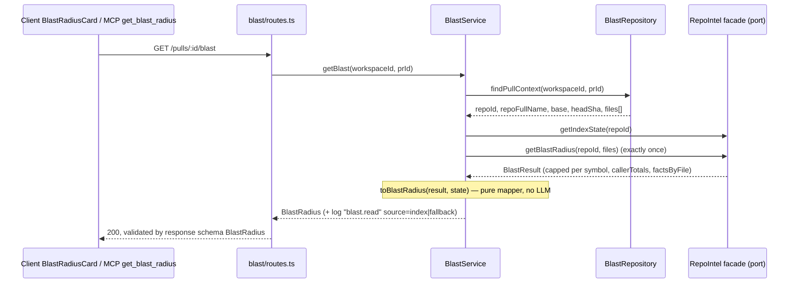
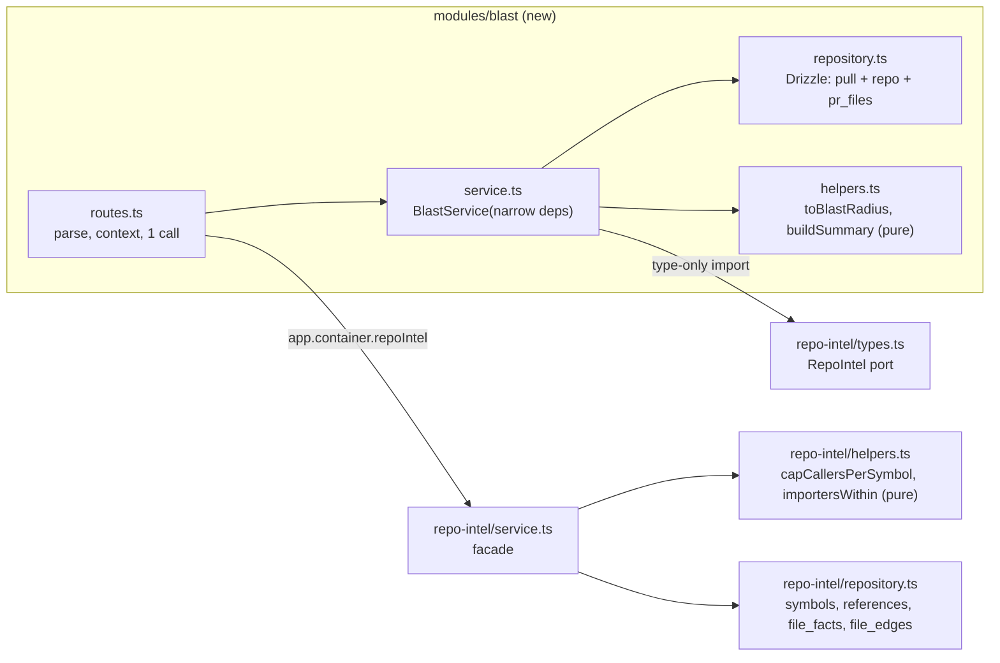

# Development Plan: Blast Radius (L04 homework)
**Status:** needs decisions. OD1–OD6 and OD8 below have recommended defaults and every task is written against them. The parent confirms them with the user: OD3 changes a user-approved verbatim MCP text, and OD6/OD8 are outward-facing GitHub actions.

The requirements, traps 1–13 and the agreed decisions D1–D6 come from `specs/blast-radius.md` and are not re-litigated here. This file is both the Development Plan and the task cards. **Implementers:** read your `T#` block under "Phased tasks", plus the "Design" subsection it points to. Each block is self-contained: Action, Owned paths, Known gotchas and Acceptance.

## Definition of Done
- [x] Every requirement (P1.1–P3.7) maps to at least one task, and every task traces back to a requirement. See the matrix in "Requirements".
- [x] Every task has concrete files, `Owned paths`, an `Executor` whose allowed paths cover them (checked against `.claude/agents/{implementer,doc-writer,test-writer}.md`), `Depends-on`, existing skills and a measurable acceptance.
- [x] Dependencies form a DAG, and concurrent tasks have disjoint `Owned paths` (see "Parallel lanes").
- [x] The contract task T1 comes before every consumer, and both `vendor/shared` copies are named. The existing `BlastRadius`/`PrHistory` contracts are edited **additively only** (explicit callout in T1).
- [x] The testing strategy covers server, client, reviewer-core, mcp-server and e2e with exact commands. `.it` tests and e2e are validation-phase.
- [x] Nothing contradicts the skills, the package `AGENTS.md` files, INSIGHTS, the do-not-touch list or the lesson scope (no L05+ features, no migration).
- [x] UI tasks cover i18n keys, the loading/empty/error/incomplete states and tests. There is no DB schema change (none is needed). Security checks are named in T4, T5, T7, T12 and T13.
- [ ] Every decision is resolved or listed. **7 open decisions have defaults** (OD1–OD6, OD8); OD7 is resolved: this single file replaces the old `blast-radius.plan.md`.
- [x] Every fact is evidenced with `path:line` or listed under "Unverified". The second-pass verification of the earlier Unverified items is in "Context found" (entries marked **[verified 2026-09-26]**).
- [x] The reviewer handoff is filled in.
- [x] The plan is saved without a name clash and has an empty `## Delivery log`.

## Overview
The feature adds a read-only *Blast radius* map for a PR, in three parts:
- a server module `blast/` with `GET /pulls/:id/blast`. It reads the already-built `repo-intel` index once and maps it to the shared `BlastRadius` contract;
- a *Blast radius* block on the PR Overview tab;
- a real `get_blast_radius` MCP tool that returns the same map through that route.

After that, in strict priority order: cheap P3 polish, a Tree/Graph switch, and a "Prior PRs touching these files" block fed from GitHub.

**Non-goals:**
- re-indexing or re-parsing on request;
- any LLM call (D5);
- DB schema changes or migrations;
- hunk-level "edited symbol" detection (trap 6: every symbol declared in a changed file counts);
- L05+ features;
- fixing pre-existing starter deviations (onion §8) that this work does not touch.

**Priority and drop order (D4):**
- Phases 1–4 are the P1 core and must ship.
- Phase 5 is the remaining P2, Phase 6 is cheap P3, Phase 7 is the Graph view and Phase 8 is Prior PRs.
- Phase 9 (validation and delivery) always runs, over whatever scope shipped.

No task in an earlier phase depends on a later one, so cutting from the tail never breaks the core.

## Requirements
The requirement IDs are the acceptance IDs of `specs/blast-radius.md:31-59`.

| Req | Task(s) |
|---|---|
| P1.1 block on Overview | T5 |
| P1.2 summary numbers | T3 (stats + summary), T5 |
| P1.3 callers `file:line` + endpoints per symbol | T2, T3, T5 (depth-2 endpoints: T10) |
| P1.4 ≥ 2 real callers + ≥ 1 endpoint on a test PR | T0 (demo PR), T10 (endpoints behind a service layer), T17 |
| P1.5 click opens the line on GitHub | T3 (`indexed_sha`, D2), T5 |
| P1.6 no-callers text; incomplete marker with reason | T1, T3, T4 (`getIndexState`, trap 2), T5 |
| P1.7 working `get_blast_radius` | T6, T7, T8, T9 |
| P1.8 open PR + video | T18 |
| P2.1 logs show index read, no re-parse | T4 |
| P2.2 route response validated by contract | T1, T4 |
| P2.3 mapping unit test | T3 |
| P2.4 no LLM in main path | T4 |
| P2.5 decl file never among its callers | T2, T3 |
| P2.6 limits from `constants.ts` | T2 (cap), T10 (depth); the client hard-codes no limit (T5) |
| P2.7 `degraded`/`reason` reach UI | T1, T3, T4, T5 |
| P2.8 MCP lab rules | T6, T7 |
| P2.9 PR says which subagent did what | T18 |
| P3.1 collapse/expand | T11 |
| P3.2 Tree/Graph switch | T12 |
| P3.3 Prior PRs block (GitHub) | T13, T14 |
| P3.4 crons separate | T5 |
| P3.5 sort by rank | T3 |
| P3.6 resync button | T11 |
| P3.7 labels from `blast.json` | T5, T11, T12, T14 |
| Workflow: e2e, review pipeline, insights, pr-self-review, Delivery log | T15, T16, T17, T18 |

## Context found

**Facade (`server/src/modules/repo-intel/service.ts`)**
- `getBlastRadius` → the persistent path `tryPersistentBlast` returns `null` unless the state is `full`/`partial` — `service.ts:220-226,315-320`.
- **Trap 1 confirmed:** the facade applies a global cap `callers.slice(0, MAX_CALLERS_PER_SYMBOL)` after a rank sort across all symbols — `service.ts:372,386`.
- **Trap 2 confirmed:** the persistent path returns `degraded: false` for `partial` — `service.ts:320,389`. `getIndexState` always answers. When there is no row it synthesises `status:'degraded', degradedReason:'no_data', lastIndexedSha:''` — `service.ts:189-205`.
- **The flag-off reason is wrong today.** With `REPO_INTEL_ENABLED=false` the facade skips the persistent path and returns `reason:'no_data'`, not `'flag_off'` — `service.ts:223,228-234`. The facade test only asserts "one of" the reasons — `server/test/repo-intel-facade-degraded.test.ts:54-66`. The flag defaults to ON — `server/src/platform/config.ts:96`.
- **Trap 4 confirmed:** the ripgrep fallback has `rank: 0`, no `factsByFile` and a flat `impactedEndpoints`, and skips `r.fromPath === sym.file` — `service.ts:264-303`.
- `factsByFile` covers only the caller files themselves (depth 1) — `service.ts:374-382`.
- Endpoints come from `file_facts`, detected by `extractEndpoints`: a per-line regex `(app|router|fastify|server|api).verb('path'`. A call whose path is on the next line is not matched — `server/src/adapters/codeindex/extract.ts:182-196`. Crons come from `extractCrons` — `extract.ts:202-216`.
- The import graph is persisted and readable: `repo.getEdges(repoId)` → `{fromFile,toFile}[]` — `repo-intel/repository.ts:432-436`. `BFS_DEPTH = 2` and `MAX_CALLERS_PER_SYMBOL = 20` — `repo-intel/constants.ts:30,49`.

**Index tables [verified 2026-09-26]**
- The `symbols` and `references` tables live in `server/src/db/schema/context.ts:61-117`, **not** in `repo-intel.ts`. `repo-intel.ts` holds `repo_index_state`, `file_edges`, `file_facts`, `file_rank` and `repo_map_cache` (`repo-intel.ts:35-138`).
- Columns: `symbols(repo_id, path, name, kind, line, end_line, exported, …)` and `"references"(repo_id, from_path, to_symbol, line, decl_file, …)`.
- `references` is a SQL reserved word and must be quoted — `repo-intel/repository.ts:397-403`.
- **Decl file vs caller file [verified 2026-09-26]:** `references.decl_file` is resolved only through an import edge `file_edges.from_file = references.from_path → to_file` whose target exports that name, and only when that target is unique — `repo-intel/repository.ts:386-424`. A file does not import itself, so on the persistent path a caller row's file is structurally never the file that declares the symbol.
- `getResolvedCallers` filters `decl_file IN changedFiles AND to_symbol IN names` but does **not** return `decl_file` — `repository.ts:502-530`. When two changed files declare the same name, the facade therefore cannot tell which one a caller resolved to. The P2.5 filter stays as a cheap defensive check in T2/T3.
- `getResolvedCallers` **inner-joins `file_rank`** — `repository.ts:516-523`. References from files without a rank row are silently dropped.

**Server architecture and routes**
- `RepoIntel` is a **port** (ring 2); a feature may import its type — `.claude/skills/onion-architecture/references/layer-map.md:24,47`.
- Importing `repo-intel/constants.ts` from another module is deviation D6 — `layer-map.md:49`.
- The container exposes `container.repoIntel` and `ContainerOverrides.repoIntel` — `server/src/platform/container.ts:59,142-146`.
- New-module precedents:
  - `intent` takes narrow deps — `server/src/modules/intent/service.ts:53-66`; its route has a response schema — `intent/routes.ts:17-24`.
  - Smart-diff validates via `response: { 200: SmartDiff }` — `server/src/modules/reviews/routes.ts:136-143`.
  - Registry — `server/src/modules/index.ts:28-40`.
  - `IdParams` — `server/src/modules/_shared/schemas.ts:11`.
  - Route rate-limit precedent `config: { rateLimit: { max: 20, timeWindow: '1 minute' } }` — `server/src/modules/settings/routes.ts:72`.
  - `withTimeout`/`withRetry` — `server/src/platform/resilience.ts:13,46`.
- The PR's changed files live in `pr_files` (path only). They are filled when `GET /pulls/:id` runs — `server/src/modules/pulls/routes.ts:195-229`, schema `server/src/db/schema/pulls.ts:36-44`.
- **Empty-diff trap:** `pr_files` stays empty until the PR detail is opened — `server/INSIGHTS.md:57-72`.

**Contracts and i18n**
- Contracts `BlastRadius`/`DownstreamImpact`/`PrHistory` — `server/src/vendor/shared/contracts/brief.ts:48-76,98-112`. The client copy is identical (`diff` clean, 2026-09-26).
- New fields on contracts that may be persisted must be `.nullish()` — `server/INSIGHTS.md:139-156`.
- `PrDetail` has `base` and `head_sha` — `server/src/vendor/shared/contracts/platform.ts:165-166,208-214`.
- **Trap 12 resolved [verified 2026-09-26]:** `loadMessages` reads every `messages/en/*.json` and keys it by file name, so `blast.json` needs no registration — `client/src/i18n/request.ts:17-27`.
- Current `blast.json` keys: `stat.{symbols,callers,endpoints,crons}`, `view.{tree,graph}`, `callerCount`, `noDownstream` (`"{count} changed symbol(s), no downstream callers found."`), `graph.{empty,ariaLabel}` — `client/messages/en/blast.json`.

**Client**
- `OverviewTab` takes only `prId` and `prBody` and renders `IntentCard` followed by the description — `OverviewTab/OverviewTab.tsx:9-27`.
- `PrDetailView` defaults to the Overview tab (`search.get("tab") ?? "overview"`) and mounts `OverviewTab` only after the detail resolved — `PrDetailView.tsx:62,133`.
- **`repoFullName` is `string | null`** (`activeRepo?.full_name ?? null`) — `PrDetailView.tsx:75-78` [verified 2026-09-26].
- Client patterns:
  - Hooks call `api.get<T>(path)` directly — `client/src/lib/hooks/repo-intel.ts:33-50` (`useRepoIntelStatus`, `useResyncRepoIntel`).
  - `githubPrUrl` and `githubBlobUrl(repoFullName, sha, file, startLine)` — `client/src/lib/github-urls.ts:16,24-38`.
  - Card precedent `IntentCard`. Its test wraps in `NextIntlClientProvider` and uses `vi.mock("@/lib/hooks/…")` — `…/_components/IntentCard/IntentCard.test.tsx:1-50`.
  - `@testing-library/user-event` is not installed, so tests use `fireEvent` — `client/INSIGHTS.md:85-90`.
  - Import `@devdigest/ui` only in `'use client'` files — `client/INSIGHTS.md:56-66`.
- `MermaidDiagram` (strict security level, parse-before-render) has no consumer yet — `client/src/components/mermaid-diagram/MermaidDiagram.tsx:1-40`.

**GitHub**
- The `GitHubClient` port has no history or commit-search method — `server/src/vendor/shared/adapters.ts:149-173`.
- The container builds Octokit from `SecretsProvider` `GITHUB_TOKEN` — `server/src/platform/container.ts:211-218`.
- Local-port precedents (`DepGraph`, `Tokenizer`, `TicketFetcher`) — `container.ts:33-37`.
- A fine-grained PAT only sees the repos chosen when it was created — `server/INSIGHTS.md:230-240`.

**MCP [contracts verified 2026-09-26]**
- `DEFAULT_BLAST_LIMIT = 20` — `mcp-server/src/contracts.ts:33`.
- `getBlastRadiusShape = { repo, pr, limit: int 1–50 default DEFAULT_BLAST_LIMIT }` — `contracts.ts:73-77`.
- `BlastRadiusResult` (`status:'ok'`, `changed_symbols`, `downstream[{symbol, callers_total, callers[{name,where}], endpoints_affected?, crons_affected?}]`, `shown`, `total`, `hint?`) — `contracts.ts:181-202`.
- `sanitizeText(input, max, opts)` — `mcp-server/src/format/sanitize.ts:17`.
- The stub is `get-blast-radius.ts:1-25`, with registry title "Get PR blast radius (not implemented)" — `mcp-server/src/tools/index.ts:81-87`.
- **`resolvePr` uses `api.listPulls`, not `getPull`** — `mcp-server/src/resolve.ts:83`. `pr_files` is therefore not primed by resolution, and T7 must call `api.getPull(prId)` (`api/client.ts:104`).
- The exact-text test is `mcp-server/test/tools-list.test.ts:15-35`. The verbatim rule is at `specs/devdigest-mcp.md:112-138`.
- Stub mentions to update: `mcp-server/README.md:5,41`, `mcp-server/AGENTS.md:3`, root `AGENTS.md:22`, `docs/devdigest-mcp.md:3,58,88,161-167`.
- `tools/list` currently uses 4,406 of its 6,000-character budget — `specs/devdigest-mcp.md:409`.
- The `pr-self-review` gates do not cover `mcp-server/` — root `INSIGHTS.md:196-205`.

**Demo data [re-checked 2026-09-26]**
- The fork is `origin` = `vzhut/dev-digest`; `upstream` = `ai-agentic-engineering-neo/dev-digest`. `origin/main` = `23e6c2c`.
- On `origin/main`, `server/src/modules/_shared/finding-previews.ts` is imported by exactly two files: `server/src/modules/pulls/routes.ts` and `server/src/modules/reviews/repository/run.repo.ts` (`git grep -l finding-previews origin/main`).
- `pulls/routes.ts` has single-line `app.get('/repos/:id/pulls'` and `app.get('/pulls/:id'` (lines 27 and 195 on `origin/main`), which `extractEndpoints` matches. The local clone `server/clones/vzhut/dev-digest` was at `477e1b4` at the first planning pass and needs a resync.
- Precedent demo branch: `origin/demo/smart-diff-main`.
- Branches: `lesson-04-homework` = `lesson-04-laba`, both 6 commits ahead of `origin/main`; `lesson-04-laba` is **not pushed**.

**e2e [verified 2026-09-26]**
- Flows `01…10` exist.
- `10-pr-intent.flow.json` opens seeded PR **#482 "Add rate limiting to public API endpoints"**: `wait --text` the title, `find text … click`, `wait --url /pulls/482`, `wait --load networkidle`.
- The seed repo `acme/payments-api` has `clonePath: null` — `server/src/db/seed.ts:217`. The seed inserts `pr_files` for #482 (`seed.ts:249-256`) and **no `repo_index_state` row** (no match in `seed.ts`). The blast route is therefore degraded on #482: with the flag on, the facade returns `no_data` (no state → fallback → no clone); with the flag off it returns `flag_off` after T2. Either way the incomplete marker shows, which is deterministic.

## Affected packages & contracts
| Package | Layer / folder | Change |
|---|---|---|
| `server/src/vendor/shared` + `client/src/vendor/shared` | contract (`contracts/brief.ts`) | additive optional fields on `DownstreamImpact`, `BlastRadius`, `PrHistory` (T1) |
| `server/` | `modules/repo-intel/` (facade, port type, new pure `helpers.ts`) | per-symbol cap + totals, defensive decl-file filter, `flag_off` reason (T2); depth-2 endpoint reach (T10) |
| `server/` | new `modules/blast/` (routes, service, repository, helpers, constants; later `history-service.ts`) + `modules/index.ts` | `GET /pulls/:id/blast` (T3, T4); `GET /pulls/:id/history` (T13) |
| `server/` | `adapters/github/history.ts`, `adapters/mocks.ts`, `platform/container.ts` | local port `GitHubHistory` + Octokit impl + mock + getter/override (T13) |
| `client/` | `lib/hooks/blast.ts`, `messages/en/blast.json`, PR route `_components/{BlastRadiusCard,PriorPrsCard}`, `OverviewTab`, `PrDetailView` | block, states, tree, resync, graph, prior PRs (T5, T11, T12, T14) |
| `mcp-server/` | `api/`, `contracts.ts`, `format/blast.ts`, `tools/`, tests, README/AGENTS | real `get_blast_radius` (T7) |
| `e2e/` | `specs/11-pr-blast-radius.flow.json`, `specs/README.md` | deterministic incomplete-index flow on PR #482 (T15) |
| docs/specs | `specs/devdigest-mcp.md` (spec-first), `docs/devdigest-mcp.md`, `docs/README.md`; root `AGENTS.md` | T6, T8, T9 |

- **Contracts (T1, explicit callout: existing shared contracts edited additively).** The change goes into BOTH `server/src/vendor/shared/contracts/brief.ts` and `client/src/vendor/shared/contracts/brief.ts`. The two files must stay byte-identical; nothing else is synced.
  - `BlastIndexStatus = z.enum(['full','partial','degraded','failed'])`
  - `BlastDegradedReason = z.enum(['flag_off','index_failed','index_partial','repo_too_large','no_data'])`
  - `BlastStats = z.object({ symbols_changed, symbols_affected, callers, endpoints, crons })`, all `z.number().int()`
  - `DownstreamImpact` gains `file: z.string().nullish()` (the declaring file) and `callers_total: z.number().int().nullish()` (the pre-cap count)
  - `BlastRadius` gains `degraded: z.boolean().nullish()`, `reason: BlastDegradedReason.nullish()`, `index_status: BlastIndexStatus.nullish()`, `indexed_sha: z.string().nullish()`, `stats: BlastStats.nullish()`, `unattributed_endpoints: z.array(z.string()).nullish()`
  - `PrHistoryDegradedReason = z.enum(['no_github_token','github_error'])`; `PrHistory` gains `degraded: z.boolean().nullish()` and `reason: PrHistoryDegradedReason.nullish()`
  - Use `.nullish()` rather than `.optional()`/`.nullable()`, because `PrBrief` embeds `BlastRadius` and brief-like documents may be persisted (`server/INSIGHTS.md:139-156`). Existing fields are unchanged.
- **Server-internal port type (T2/T10):** `BlastResult` in `server/src/modules/repo-intel/types.ts` gains `callerTotals?: Record<string, number>`. T10 widens the `factsByFile` JSDoc to "facts of the caller file and of its importers within `BFS_DEPTH`".
- **MCP-internal contract (T7):** `BlastRadiusResult` in `mcp-server/src/contracts.ts` — see T7.

## Design

### Request flow `GET /pulls/:id/blast`

### Layer placement

- `blast/helpers.ts` is the domain ring. The flat→grouped mapping, the D3 filter, the degraded merge, the rank sort, the stats and the summary are pure functions with unit tests (onion §3, §6).
- The service receives `{ repo, repoIntel: Pick<RepoIntel,'getBlastRadius'|'getIndexState'>, log }` (onion §5 narrow deps). `routes.ts` builds it once per plugin from `app.container`.
- The service has no `Container` import and no cross-module value import. `blast/` does **not** import `repo-intel/constants.ts`; the cap is applied inside the facade.
- Client: `BlastRadiusCard` sits next to `IntentCard` under `app/repos/[repoId]/pulls/[number]/_components/`. It is route-local with one consumer (frontend-architecture §2, §7). Data comes only through `lib/hooks/blast.ts`, and pure view logic lives in the card's `helpers.ts`.

### Mapping rules (T3, `toBlastRadius(result, state)`)
1. Group `result.callers` by `viaSymbol`. Drop any caller whose `file` declares that symbol name. This is P2.5, kept defensive: on the persistent path it cannot happen structurally (`repository.ts:386-424`), and T2 already filters.
2. Sort callers within a group by rank desc, then `file`, then `line`. `callers_total = result.callerTotals?.[symbol] ?? callers.length`.
3. `endpoints_affected` and `crons_affected` per group = the sorted distinct union of `result.factsByFile[callerFile]` over the group's caller files. When `factsByFile` is absent (ripgrep fallback, trap 4), both are `[]` and `unattributed_endpoints = result.impactedEndpoints`. Never invent attribution.
4. D3: drop groups with 0 callers. `changed_symbols` = the symbols that have a group. `stats.symbols_changed = result.changedSymbols.length` (used by the no-callers text).
5. Order groups by max caller rank desc, then `callers_total` desc, then symbol name (P3.5).
6. Degraded merge (trap 2):
   - `index_status = state.status`
   - `degraded = result.degraded === true || state.status !== 'full'`
   - `reason = result.reason ?? {partial:'index_partial', failed:'index_failed', degraded: state.degradedReason ?? 'no_data'}[state.status] ?? null`
   - `indexed_sha = state.lastIndexedSha || null` (D2)
7. Build `summary` from numbers only (D5). Examples:
   - `"2 of 5 changed symbols have callers: 3 callers, 4 endpoints, 0 crons."`
   - `"None of 5 changed symbols has callers in the indexed code."`
   - `"No indexed symbols in the changed files."`
   - When `degraded`, append `" Index incomplete (<reason>)."`.

### GitHub link (D2)
`href = githubBlobUrl(repoFullName, blast.indexed_sha ?? baseRef, caller.file, caller.line)`.
- `baseRef` = `pr.base`, used only when there is no indexed SHA (the ripgrep fallback reads the clone's checked-out default branch).
- The link opens in a new tab with `rel="noopener noreferrer"`.
- `repoFullName` can be `null` while the repo loads (`PrDetailView.tsx:78`). In that case render `file:line` as plain text, not a link.

### Prior PRs (T13, OD5)
`GET /pulls/:id/history` returns `PrHistory`.
- **Data source.** A local port `GitHubHistory.mergedPrsTouching(repo, paths, opts)` in `server/src/adapters/github/history.ts`. The Octokit implementation calls `repos.listCommits({path, per_page})` per changed path, then `repos.listPullRequestsAssociatedWithCommit` per distinct commit, and keeps PRs with `merged_at != null`.
- **Caps** in `blast/constants.ts`: `HISTORY_MAX_PATHS = 10`, `HISTORY_COMMITS_PER_PATH = 10`, `HISTORY_MAX_COMMITS = 30`, `HISTORY_MAX_ITEMS = 5`. That is at most 40 GitHub calls per cache miss.
- **Cache.** An in-process TTL cache in `PrHistoryService`, keyed `repoId:headSha`, `HISTORY_CACHE_TTL_MS = 15 min`, at most 200 entries. No DB table, so no migration.
- **Output.**
  - The current PR is excluded, and results are ordered newest `merged_at` first.
  - `files_overlap` = the changed paths that PR touched.
  - `notes` is numbers-only text ("touched 2 of 7 changed files").
- **Failures.**
  - No token → `{history:[], degraded:true, reason:'no_github_token'}`.
  - GitHub failure → `reason:'github_error'`, not cached.
- **Rate limit:** 20 requests/min on the route.

## Parallel lanes
After T1, four lanes run in parallel:
- **server lane:** T2 → T3 → T4 (→ T10, T13)
- **client lane:** T5 → T11 → T12 → T14
- **MCP lane:** T6 → T7 → T8 ∥ T9
- **parent:** T0 at any time (needs user confirmation)

Owned paths never overlap across lanes. Inside a lane the tasks are sequential because they share files (`blast/routes.ts`, `blast.json`, `lib/hooks/blast.ts`, `OverviewTab.tsx`).

## Phased tasks

### Phase 1 — Contracts and demo data (P1 core)
- **T0** (covers P1.4 and the P1.6 demo scenarios; D6, OD6)
  - **Action:** Prepare demo data on the fork `vzhut/dev-digest`. **This is outward-facing: ask the user before any push or PR creation.**
    1. From `origin/main`, create branch `demo/blast-radius-main`. Make one small real change in `server/src/modules/_shared/finding-previews.ts` (e.g. `previewSummary` trims/collapses whitespace) and open PR "demo: blast radius — shared finding-preview helper" against the fork's `main`.
    2. No-callers PR: create branch `demo/blast-radius-no-callers` that changes a source file whose exported symbols have no resolved callers. Pick the file after step 3 with `psql` (note the quoted `"references"`, a reserved word; tables per `server/src/db/schema/context.ts:61-117`):
       `SELECT s.path FROM symbols s WHERE s.repo_id = '<repoId>' AND s.path LIKE 'server/src/%' AND s.exported GROUP BY s.path HAVING NOT EXISTS (SELECT 1 FROM "references" r WHERE r.repo_id = '<repoId>' AND r.decl_file = s.path) LIMIT 5;`
    3. In DevDigest, resync the fork repo (`POST /repos/<repoId>/resync`; the clone was at `477e1b4`). Wait until `curl localhost:3001/repos/<repoId>/index-state` shows `status: full` at `23e6c2c` (or the then-current `origin/main`), then import PRs.
    4. Incomplete-index scenario (no push needed): use seeded PR #482 of `acme/payments-api` (no index state and no clone → `degraded`/`no_data`, see Context "e2e"), or restart the API with `REPO_INTEL_ENABLED=false` (→ `flag_off` after T2).
    5. Record the repo id, PR numbers and index SHA in the Delivery log.
  - **Package / Type:** repo/GitHub — manual
  - **Executor:** parent
  - **Skills to use:** security (no token in commands or logs)
  - **Owned paths:** the fork branches `demo/blast-radius-main` and `demo/blast-radius-no-callers`; `server/src/modules/_shared/finding-previews.ts` **only on the demo branch**, never on `lesson-04-homework`
  - **Depends-on:** none (user confirmation, OD6)
  - **Risk:** medium (outward-facing; PAT scope `server/INSIGHTS.md:230-240`)
  - **Known gotchas:**
    - Do the demo branch in a separate worktree, or after committing the homework work. Never switch `lesson-04-homework` with a dirty tree.
    - The fine-grained PAT must include the fork (404 otherwise).
    - The index snapshot is not the PR head (trap 5): the helper must exist on `main` at the indexed SHA.
    - Callers in files without a `file_rank` row are dropped (`repository.ts:516-523`).
    - `.claude/worktrees/agent-*` pollute `grep -r` (trap 10).
  - **Acceptance:**
    - Both PRs are visible in DevDigest's PR list for `vzhut/dev-digest`.
    - `index-state` returns `"status":"full"` with `lastIndexedSha` = the fork's `main` head.
    - After T4, `curl localhost:3001/pulls/<demoPrId>/blast` lists ≥ 2 callers (`server/src/modules/pulls/routes.ts`, `server/src/modules/reviews/repository/run.repo.ts`) and ≥ 1 endpoint (e.g. `GET /pulls/:id`).

- **T1** (covers P1.6, P2.2, P2.7, D1; prepares P3.3)
  - **Action:** Make the additive contract change from "Affected packages & contracts" in both `brief.ts` copies; the two files must be byte-identical afterwards. Add parse cases to `server/test/contracts.test.ts`:
    - an old-shape `BlastRadius` (no new keys) still parses;
    - a full new-shape `BlastRadius` parses;
    - `reason: 'bogus'` fails;
    - an old-shape `PrHistory` still parses.
  - **Package / Type:** server + client — contract
  - **Executor:** implementer
  - **Skills to use:** zod, typescript-expert
  - **Owned paths:** `server/src/vendor/shared/contracts/brief.ts`, `client/src/vendor/shared/contracts/brief.ts`, `server/test/contracts.test.ts`
  - **Depends-on:** none
  - **Risk:** low
  - **Known gotchas:**
    - New fields are `.nullish()` (`server/INSIGHTS.md:139-156`).
    - Mirror only `brief.ts`; never sync other drifted files (root `INSIGHTS.md:51-63`; spec trap 11).
    - `reviewer-core` aliases the server copy. Its typecheck stays green because the change is additive.
  - **Acceptance:** all of the following pass:
    - `diff server/src/vendor/shared/contracts/brief.ts client/src/vendor/shared/contracts/brief.ts` prints nothing;
    - `cd server && pnpm typecheck && pnpm exec vitest run test/contracts.test.ts`;
    - `cd client && pnpm typecheck`;
    - `cd reviewer-core && npm run build`.

### Phase 2 — Server core (P1/P2)
- **T2** (covers P1.3, P2.5, P2.6 and the P1.6 flag-off reason; trap 1; OD1)
  - **Action:**
    1. Add a pure `server/src/modules/repo-intel/helpers.ts` with `capCallersPerSymbol(callers, declFilesBySymbol, max)` → `{ callers, totals }`. It:
       - drops callers whose file declares that symbol (defensive; structurally impossible on the persistent path, possible on the ripgrep path when a name is declared in two changed files);
       - sorts by rank desc, then file, then line;
       - keeps at most `max` callers per `viaSymbol`;
       - returns `totals` = the pre-cap count per symbol.
    2. In `tryPersistentBlast`, replace the global `callers.slice(0, MAX_CALLERS_PER_SYMBOL)` with the helper and return `callerTotals`. Facts are still computed for **all** caller files before capping.
    3. Apply the same helper in the ripgrep fallback.
    4. When `repoIntelEnabled` is false, return `reason: 'flag_off'`.
    5. Add `callerTotals?` to `BlastResult` in `types.ts` with JSDoc.

    The signature of `getBlastRadius` is unchanged, and it still never throws.
  - **Package / Type:** server — backend (facade) + core helper
  - **Executor:** implementer
  - **Skills to use:** onion-architecture, typescript-expert, drizzle-orm-patterns (read-only, to understand the repo methods)
  - **Owned paths:** `server/src/modules/repo-intel/helpers.ts` (new), `server/src/modules/repo-intel/service.ts`, `server/src/modules/repo-intel/types.ts`, `server/test/repo-intel-blast.test.ts` (new), `server/test/repo-intel-facade-degraded.test.ts`
  - **Depends-on:** none
  - **Risk:** medium (touches starter infrastructure; keep the diff to `getBlastRadius`/`tryPersistentBlast`)
  - **Known gotchas:**
    - Trap 1 (`service.ts:372,386`).
    - `getResolvedCallers` returns no `decl_file`; build `declFilesBySymbol` from `changedSymbols` (`repository.ts:502-530`).
    - Qualified `Class.method` names are skipped (`service.ts:329`); keep that.
    - Do not import `repo-intel/constants.ts` anywhere new outside repo-intel.
    - Test with the patched-repo pattern of `repo-intel-facade-degraded.test.ts:18-40` (no Postgres).
  - **Acceptance:** `cd server && pnpm exec vitest run test/repo-intel-blast.test.ts test/repo-intel-facade-degraded.test.ts` passes, covering:
    - symbol A with 25 callers + symbol B with 3 → A keeps 20 with `callerTotals.A === 25`, B keeps all 3 (B is not starved);
    - a caller row in A's declaring file is excluded by the helper;
    - flag off → `reason === 'flag_off'`;
    - the fallback path is also capped per symbol.

    `pnpm typecheck` passes.

- **T3** (covers P1.2, P1.3, P1.5, P1.6, P2.3, P2.5, P2.7, the P3.4 data and P3.5; traps 2, 4, 6; D2, D3, D5)
  - **Action:**
    - Create `server/src/modules/blast/helpers.ts` with pure `toBlastRadius(result: BlastResult, state: Pick<IndexState,'status'|'lastIndexedSha'|'degradedReason'>): BlastRadius`, implementing Design "Mapping rules" 1–7, plus an exported `buildSummary(stats, degraded, reason)`.
    - Create `server/src/modules/blast/constants.ts` with only blast-local constants, e.g. the log event name `BLAST_LOG_EVENT = 'blast.read'`.
    - Import the facade types with `import type` from `../repo-intel/types.js` (the port).
    - Add the unit test `server/test/blast-helpers.test.ts`.
  - **Package / Type:** server — core
  - **Executor:** implementer
  - **Skills to use:** onion-architecture, zod, typescript-expert
  - **Owned paths:** `server/src/modules/blast/helpers.ts`, `server/src/modules/blast/constants.ts`, `server/test/blast-helpers.test.ts`
  - **Depends-on:** T1, T2
  - **Risk:** low
  - **Known gotchas:**
    - A symbol name can be declared in two changed files. Group by name, record the first declaring file in `file`, and exclude callers in **any** of its declaring files.
    - Never attribute the fallback `impactedEndpoints` to a symbol (trap 4).
    - `lastIndexedSha` is `''` when synthesised; map it to `null`.
  - **Acceptance:** `cd server && pnpm exec vitest run test/blast-helpers.test.ts` passes with these cases:
    - flat callers of 2 symbols → 2 groups with the right callers (P2.3);
    - a decl-file caller is excluded (P2.5);
    - a zero-caller symbol is absent from `downstream` and `changed_symbols` but counted in `stats.symbols_changed` (D3);
    - endpoints and crons are attributed per group from `factsByFile`, with crons separate;
    - fallback (no `factsByFile`) → per-group `[]` + `unattributed_endpoints`;
    - `partial` + `degraded:false` → `degraded:true, reason:'index_partial'`;
    - groups are ordered by max rank;
    - the summary strings match Design rule 7 exactly;
    - every output passes `BlastRadius.parse`.

- **T4** (covers the P1.1 data, P1.6, P2.1, P2.2, P2.4, P2.7; trap 2)
  - **Action:**
    - Create `server/src/modules/blast/repository.ts`: `BlastRepository(db)` with `findPullContext(workspaceId, prId)` → `{ prId, number, repoId, repoFullName, base, headSha, files: string[] } | undefined`. Use one pull+repo query and one `pr_files` query, both scoped by `workspaceId`.
    - Create `server/src/modules/blast/service.ts`: `BlastService({ repo, repoIntel, log })` with `getBlast(workspaceId, prId)`. The method:
      1. loads the context, or throws `NotFoundError('Pull request not found')`;
      2. calls `getIndexState`;
      3. calls `getBlastRadius(repoId, files)` **once**;
      4. maps with `toBlastRadius`;
      5. writes one structured log line: `log.info({ event, prId, repoId, files, source, indexStatus, indexedSha, degraded, reason, symbols, callers, endpoints, crons, ms }, msg)`, where `source` is `'fallback'` when the facade reported degraded and `'index'` otherwise, and `msg` is `"blast: read repo-intel index (no re-parse, no LLM)"` or `"blast: index unusable — ripgrep fallback (degraded)"`.
    - Create `server/src/modules/blast/routes.ts`: `GET /pulls/:id/blast` with `schema: { params: IdParams, response: { 200: BlastRadius } }`; the handler is parse → `getContext` → one call.
    - Register `blast` in `server/src/modules/index.ts`.
    - Tests:
      - hermetic `server/test/blast-service.test.ts`, with a fake repo object and a fake `RepoIntel` whose `indexRepo`/`refreshIndex` throw;
      - `server/test/blast.it.test.ts`, against real Postgres via `test/helpers/pg.ts`, with an `overrides.repoIntel` mock and `app.inject`.
  - **Package / Type:** server — backend
  - **Executor:** implementer
  - **Skills to use:** onion-architecture, fastify-best-practices, drizzle-orm-patterns, zod, security, typescript-expert
  - **Owned paths:** `server/src/modules/blast/repository.ts`, `server/src/modules/blast/service.ts`, `server/src/modules/blast/routes.ts`, `server/src/modules/index.ts`, `server/test/blast-service.test.ts`, `server/test/blast.it.test.ts`
  - **Depends-on:** T3
  - **Risk:** medium
  - **Known gotchas:**
    - No `container.db`/`drizzle-orm` outside `repository.ts` (onion §9 grep).
    - Narrow deps, not `Container` (onion §8 D3).
    - The type import of `../repo-intel/types.js` is the sanctioned port import. No value import from `repo-intel/`.
    - The `.it` suffix is mandatory for the Postgres test (`server/AGENTS.md`).
    - Workspace scoping is the IDOR guard (security A01).
    - Empty `pr_files` → still exactly one facade call, and the map says "No indexed symbols…". The UI opens the detail first (`PrDetailView.tsx:133`), and the MCP tool primes with `getPull` (T7).
  - **Acceptance:** `cd server && pnpm typecheck && pnpm exec vitest run test/blast-service.test.ts` passes, showing:
    - `getBlastRadius` is called exactly once with the PR's files;
    - `indexRepo`/`refreshIndex` are never called;
    - no LLM dependency exists in the service deps;
    - `partial` state → `index_status:'partial', degraded:true`;
    - unknown PR → `NotFoundError`;
    - the log payload has `source:'index'` on the persistent path.

    With Docker, `pnpm exec vitest run test/blast.it.test.ts` shows a 200 body that passes `BlastRadius.parse`, and a 404 envelope for another workspace's PR and for a random uuid. The onion §9 greps print nothing for `src/modules/blast/`.

### Phase 3 — Client core (P1)
- **T5** (covers P1.1, P1.2, P1.3, P1.5, P1.6, the P2.6 client side, P2.7, P3.4, P3.7)
  - **Action:**
    - **Hook.** `client/src/lib/hooks/blast.ts` → `useBlastRadius(prId)`, with `queryKey ["blast", prId]`, `api.get<BlastRadius>(\`/pulls/${prId}/blast\`)` and `enabled: !!prId`.
    - **Card.** A new route-local folder `…/pulls/[number]/_components/BlastRadiusCard/`:
      - `BlastRadiusCard.tsx`, the container, with loading/error/empty/incomplete states;
      - `helpers.ts`, pure:
        - `callerHref(repoFullName | null, ref, file, line)` → `string | null`;
        - `incompleteNotice(blast)` → `{ show, reasonKey }`;
        - `statsOf(blast)`, the fallback when `stats` is null;
      - `styles.ts`, `index.ts`, `BlastRadiusCard.test.tsx`, `helpers.test.ts`;
      - child components:
        - `_components/BlastSummary/`;
        - `_components/SymbolList/`: symbol + file → callers as `file:line` links → an "Endpoints" list, then a separate "Cron / jobs" list;
        - `_components/IndexNotice/`: the marker plus the translated reason.
    - **Wiring.** Give `OverviewTab` the new props `repoId`, `repoFullName: string | null` and `baseRef`, and render the card between `IntentCard` and the description. Pass the props from `PrDetailView`: `repoId` from params, `repoFullName`, and `pr.base`.
    - **i18n.** Keep the existing keys and add to `blast.json`:
      - `title`, `loading`, `error`, `retry`, `noSymbols`, `unattributed`;
      - `callersShown` ("showing {shown} of {total}");
      - `section.endpoints`, `section.crons`;
      - `openAt` ("Open {file}:{line} on GitHub");
      - `incomplete.title`, `incomplete.status`, `incomplete.reason.{flag_off,index_failed,index_partial,repo_too_large,no_data}`.

      Use the existing `stat.*` and `noDownstream` keys.
  - **Package / Type:** client — ui
  - **Executor:** implementer
  - **Skills to use:** frontend-architecture, react-best-practices, next-best-practices, react-testing-library, security, typescript-expert
  - **Owned paths:** `client/src/lib/hooks/blast.ts`, `client/messages/en/blast.json`, `client/src/app/repos/[repoId]/pulls/[number]/_components/BlastRadiusCard/**`, `client/src/app/repos/[repoId]/pulls/[number]/_components/OverviewTab/OverviewTab.tsx`, `client/src/app/repos/[repoId]/pulls/[number]/_components/OverviewTab/styles.ts`, `client/src/app/repos/[repoId]/pulls/[number]/_components/PrDetailView/PrDetailView.tsx`
  - **Depends-on:** T1
  - **Risk:** medium
  - **Known gotchas:**
    - Use `fireEvent`, not `userEvent` (`client/INSIGHTS.md:85-90`).
    - Import `@devdigest/ui` only in `'use client'` files (`client/INSIGHTS.md:56-66`).
    - No `fetch`/`api.*` in components.
    - No hard-coded caller limit: show `callers_total` against `callers.length` from the server.
    - The link ref follows Design "GitHub link". `repoFullName` may be `null` (`PrDetailView.tsx:78`) → render plain text.
    - Write `{count > 0 && …}`, not `{count && …}`.
    - Take wire types from `@devdigest/shared`; never redefine them.
    - Set up test providers like `IntentCard.test.tsx:44-50`, with `{ blast: messages }`.
    - i18n needs no registration (`client/src/i18n/request.ts:17-27`).
  - **Acceptance:** `cd client && pnpm typecheck && pnpm test` pass. `BlastRadiusCard.test.tsx` covers:
    - (a) data → the summary numbers come from `stats`; a symbol → caller link with `href === "https://github.com/vzhut/dev-digest/blob/<indexed_sha>/server/src/modules/pulls/routes.ts#L42"`; endpoints and crons are in separate lists;
    - (b) `stats.symbols_changed: 5` with an empty `downstream` → the `noDownstream` text, no empty list;
    - (c) `degraded:true, reason:'index_partial'` → the incomplete marker with the translated reason, and the map is still rendered;
    - (d) hook error → the error state with retry.

    `helpers.test.ts` covers the ref fallback to `baseRef` when `indexed_sha` is null, and a `null` href when `repoFullName` is null. `grep -rn '"20"\|\b20\b' …/BlastRadiusCard` finds no caller cap.

### Phase 4 — MCP (P1.7, P2.8)
- **T6** (covers P1.7, P2.8; trap 7; OD3, OD4)
  - **Action:** Spec-first edit of `specs/devdigest-mcp.md`, after the user approves OD3:
    - In "Tool descriptions (verbatim)", replace the `get_blast_radius` row with the approved text and its char count.
    - Update the tool-contract table row: `status: "ok" | "incomplete"`, the fields per T7, downstream in server order, callers per symbol capped per OD4 with `callers_total`.
    - Update the ordering sentence to "blast radius downstream in server order (caller rank desc)".
    - Update the state table: incomplete index → `status:"incomplete"` + reason + resync hint, with `isError:false`; no callers on a full index → an explicit `summary`.
    - Mark the `get_blast_radius` "Now" text as superseded by L04 (dated), and leave the rest of the historical spec intact.

    Do not touch its `## Delivery log`.
  - **Package / Type:** docs — spec
  - **Executor:** doc-writer
  - **Skills to use:** none (writing only)
  - **Owned paths:** `specs/devdigest-mcp.md` (the sections "Tool contracts", "Tool descriptions (verbatim)" and the state table only)
  - **Depends-on:** none (OD3 answered)
  - **Risk:** low
  - **Known gotchas:** Verbatim strings change only with user approval (`specs/devdigest-mcp.md:112-113`). The description must be ≤ 200 chars, and `tools/list` ≤ 6,000 chars (currently 4,406, `specs/devdigest-mcp.md:409`).
  - **Acceptance:**
    - `grep -n "get_blast_radius" specs/devdigest-mcp.md` shows the approved description with its char count.
    - The words "NOT IMPLEMENTED" no longer appear in the verbatim table.
    - The Delivery log is untouched: `git diff` shows no hunk below `## Delivery log`.

- **T7** (covers P1.7, P2.8; traps 7, 8, 9)
  - **Action:** In `mcp-server/`:
    - `src/api/schemas.ts`: add a Zod parser for the consumed subset of the `/pulls/:id/blast` response. It is the package's own copy, with no import from server/shared.
    - `src/api/client.ts`: add `getBlast(prId)`.
    - `src/contracts.ts`: extend `BlastRadiusResult` to `{ status: "ok" | "incomplete", repo, pr, summary, index_status?, reason?, changed_symbols:[{name,file,kind}], downstream:[{symbol, file?, callers_total, callers:[{name, where:"file:line"}], endpoints_affected?, crons_affected?}], unattributed_endpoints?, shown, total, hint? }`. Keep the existing `DEFAULT_BLAST_LIMIT = 20` (`contracts.ts:33`) and the `limit` arg (`contracts.ts:73-77`) for `downstream`. Add only `BLAST_CALLERS_SHOWN = 5` (OD4), and update the stale JSDoc at `contracts.ts:181-185`.
    - New pure `src/format/blast.ts`. It:
      - keeps the server order;
      - applies `limit` to `downstream` and caps callers per symbol;
      - runs `sanitizeText(input, max)` (`format/sanitize.ts:17`) on names and paths;
      - returns `incomplete` + the hint "repo index is <status> (<reason>) — callers may be missing; resync the repo in DevDigest, then retry";
      - never returns an empty map without that status.
    - Rewrite `src/tools/get-blast-radius.ts`: resolve repo/pr → `api.getPull(prId)` to prime `pr_files` (the resolver uses `listPulls` only, `resolve.ts:83`) → `api.getBlast(prId)` → format. A 404 gives the PR-not-found lead-on text.
    - `src/tools/index.ts`: the new title and description, verbatim from T6.
    - Tests:
      - rewrite `test/tools-get-blast-radius.test.ts`;
      - new `test/format-blast.test.ts`;
      - update the expected strings in `test/tools-list.test.ts`;
      - update `test/response-size.test.ts` with a blast fixture of 50 symbols × 20 callers; the default response must be ≤ 10,000 chars;
      - update `test/api-client.test.ts` (getBlast parse + 404);
      - update `test/respond.test.ts` if the shape list changes.
    - Update `mcp-server/README.md` (lines 5, 41) and `mcp-server/AGENTS.md` (line 3) to drop "stub".
  - **Package / Type:** mcp-server — backend
  - **Executor:** implementer
  - **Skills to use:** zod, typescript-expert, security
  - **Owned paths:** `mcp-server/src/api/schemas.ts`, `mcp-server/src/api/client.ts`, `mcp-server/src/contracts.ts`, `mcp-server/src/format/blast.ts`, `mcp-server/src/tools/get-blast-radius.ts`, `mcp-server/src/tools/index.ts`, `mcp-server/test/tools-get-blast-radius.test.ts`, `mcp-server/test/format-blast.test.ts`, `mcp-server/test/tools-list.test.ts`, `mcp-server/test/response-size.test.ts`, `mcp-server/test/api-client.test.ts`, `mcp-server/test/respond.test.ts`, `mcp-server/test/fixtures/**`, `mcp-server/README.md`, `mcp-server/AGENTS.md`
  - **Depends-on:** T1 (wire shape), T6 (approved text)
  - **Risk:** medium
  - **Known gotchas:**
    - stdout is the protocol channel: no `console.log` (`mcp-server/AGENTS.md`).
    - `fetch` only in `api/client.ts`; errors come from `api/errors.ts`.
    - Flat scalar args stay unchanged (`repo`, `pr`, `limit`).
    - Follow the API-schema sync rule (`mcp-server/AGENTS.md` "API-schema sync").
    - Empty-diff trap: prime with `getPull` (`server/INSIGHTS.md:57-72`).
    - Never answer "zero impact" for a degraded map (trap 9).
  - **Acceptance:** `cd mcp-server && pnpm typecheck && pnpm test` pass, and the tests assert:
    - ok map → `status:"ok"`, `where:"server/src/modules/pulls/routes.ts:42"`, `callers_total` ≥ the shown callers;
    - degraded fixture → `status:"incomplete"`, `reason`, a hint containing "resync", `isError:false`;
    - unknown PR → the error text names the open PRs;
    - `getPull` is called before `getBlast`;
    - `tools/list` is ≤ 6,000 chars and the blast description equals the T6 text;
    - the default blast response is ≤ 10,000 chars (value printed).

- **T8** (covers the P1.7 docs)
  - **Action:** Update `docs/devdigest-mcp.md`: lines 3, 58 and 88, and rename § "Homework hook" to "Blast radius (L04)" with the route, data source, states and `path:line` to the new code. If a new doc is written, add its row to `docs/README.md`. (The `specs/README.md` row for this plan is added by the parent at planning time; not part of T8.)
  - **Package / Type:** docs
  - **Executor:** doc-writer
  - **Skills to use:** mermaid-diagram (only if a diagram is added)
  - **Owned paths:** `docs/devdigest-mcp.md`, `docs/README.md`
  - **Depends-on:** T7
  - **Risk:** low
  - **Known gotchas:** doc-writer may not edit INSIGHTS, AGENTS, package READMEs or a Delivery log (`.claude/agents/doc-writer.md:20-21`).
  - **Acceptance:** `grep -n "not implemented\|stub" docs/devdigest-mcp.md` returns nothing about `get_blast_radius`, and every cited `path:line` exists.

- **T9** (covers the P1.7 root docs)
  - **Action:** In root `AGENTS.md:22`, replace "`get_blast_radius` stub" with "`get_blast_radius`". Check that `README.md:85` still reads correctly (no change expected).
  - **Package / Type:** root — docs
  - **Executor:** parent
  - **Skills to use:** none
  - **Owned paths:** `AGENTS.md`
  - **Depends-on:** T7
  - **Risk:** low
  - **Known gotchas:** implementer and doc-writer may not touch root `AGENTS.md`.
  - **Acceptance:** `grep -n "stub" AGENTS.md` has no `get_blast_radius` hit.

### Phase 5 — Remaining P2 (droppable after Phase 4)
- **T10** (covers P1.3/P1.4 endpoints behind a service layer, and the P2.6 depth; OD2)
  - **Action:** In the facade's persistent path:
    1. Load `repo.getEdges(repoId)` (existing method).
    2. Compute the importers with a pure `importersWithin(edges, callerFiles, BFS_DEPTH - 1)` in `repo-intel/helpers.ts`.
    3. Fetch `file_facts` for the caller files plus those importers.
    4. Set `factsByFile[callerFile]` to the union of its own facts and its importers' facts. Depth counts from the changed file: hop 1 = caller, hop 2 = importer of the caller.
    5. Include those facts in `impactedEndpoints`, and update the `factsByFile` JSDoc in `types.ts`.

    The blast mapper needs no change.
  - **Package / Type:** server — backend (facade) + core helper
  - **Executor:** implementer
  - **Skills to use:** onion-architecture, typescript-expert
  - **Owned paths:** `server/src/modules/repo-intel/helpers.ts`, `server/src/modules/repo-intel/service.ts`, `server/src/modules/repo-intel/types.ts`, `server/test/repo-intel-blast.test.ts`
  - **Depends-on:** T2 (same files); by priority, runs after T4
  - **Risk:** medium
  - **Known gotchas:**
    - `getEdges` loads all edges of the repo (≤ `MAX_INDEXED_FILES = 5000` files) in one query, which is acceptable.
    - Exclude the changed files themselves, and handle cycles.
    - Take the depth constant from `repo-intel/constants.ts` (P2.6).
  - **Acceptance:** `cd server && pnpm exec vitest run test/repo-intel-blast.test.ts` passes this case: `helper.ts` ← `service.ts` (caller) ← `routes.ts` (facts `GET /x`) → `factsByFile['service.ts'].endpoints` contains `GET /x`, and a hop-3 importer's endpoint is **not** included. `pnpm typecheck` passes.

### Phase 6 — Cheap P3 (droppable)
- **T11** (covers P3.1, P3.6, P3.7)
  - **Action:**
    - **Collapsible symbols** in `SymbolList`: a button with `aria-expanded`; the first symbol is expanded by default and the others collapsed; keys `blast.json` `tree.expand`/`tree.collapse`.
    - **Resync button** in `IndexNotice`, via `useResyncRepoIntel(repoId)`:
      - while a resync is pending, poll `useRepoIntelStatus(repoId, true)`;
      - when `lastIndexedSha`/`updatedAt` changes, refetch the blast query (expose `refetch` from `useBlastRadius`; no query keys in components);
      - keys `resync.button`, `resync.pending`, `resync.queued`, `resync.failed`.
  - **Package / Type:** client — ui
  - **Executor:** implementer
  - **Skills to use:** frontend-architecture, react-best-practices, react-testing-library
  - **Owned paths:** `client/src/app/repos/[repoId]/pulls/[number]/_components/BlastRadiusCard/**`, `client/src/lib/hooks/blast.ts`, `client/messages/en/blast.json`
  - **Depends-on:** T5
  - **Risk:** low
  - **Known gotchas:**
    - `/resync` answers 202 even when the enqueue failed (`degraded:true, reason:'no_handler'`); show `resync.failed` then (`server/src/modules/repo-intel/routes.ts:44-62`).
    - Stop polling on completion or unmount.
  - **Acceptance:** `cd client && pnpm test` covers:
    - clicking a collapsed symbol shows its callers (`aria-expanded` flips);
    - the resync button calls the mutation once and shows `resync.queued`.

    `pnpm typecheck` passes.

### Phase 7 — Graph view (droppable)
- **T12** (covers P3.2, P3.7)
  - **Action:**
    - Add a Tree/Graph segmented switch in `BlastRadiusCard` (keys `view.tree`, `view.graph`; local state).
    - Add a new `_components/BlastGraph/` that renders `MermaidDiagram` (`@/components/mermaid-diagram`).
    - The chart comes from a pure `toMermaidFlowchart(blast, { maxCallersPerSymbol, maxNodes })` in its `helpers.ts`:
      - `flowchart LR`, with ids `s0/c0/e0`;
      - labels are escaped: `"`→`#quot;`, and newlines, backticks and `[]{}()<>` are stripped.
    - Put the limits in its `constants.ts`: `GRAPH_MAX_CALLERS_PER_SYMBOL = 5`, `GRAPH_MAX_NODES = 40`.
    - Empty → `graph.empty`. The container's `aria-label` = `graph.ariaLabel`.
  - **Package / Type:** client — ui
  - **Executor:** implementer
  - **Skills to use:** frontend-architecture, react-best-practices, react-testing-library, security, mermaid-diagram
  - **Owned paths:** `client/src/app/repos/[repoId]/pulls/[number]/_components/BlastRadiusCard/**`, `client/messages/en/blast.json`
  - **Depends-on:** T11
  - **Risk:** medium (mermaid in jsdom; mock `@/components/mermaid-diagram` in component tests)
  - **Known gotchas:**
    - Repo-derived names reach the diagram source, so escape them (security A05).
    - `MermaidDiagram` already uses `securityLevel: "strict"` and parse-before-render (`MermaidDiagram.tsx:18-40`).
    - It becomes the first consumer, so the frontend-architecture "no consumer" exception goes stale. Report it; don't edit the skill.
  - **Acceptance:** `pnpm typecheck && pnpm test` pass, with:
    - `helpers.test.ts`: a symbol named `a"b]` yields a line without raw `"`/`]`; node count ≤ 40; empty downstream → `null`;
    - a component test: switching to Graph renders the mocked diagram with the generated chart, and switching back to Tree restores the list.

### Phase 8 — Prior PRs (droppable)
- **T13** (covers the P3.3 server side; OD5)
  - **Action:**
    - **Port and adapter.** `server/src/adapters/github/history.ts`:
      - `interface GitHubHistory { mergedPrsTouching(repo: RepoRef, paths: string[], opts): Promise<PriorPr[]> }`;
      - `OctokitGitHubHistory`, using `withTimeout`/`withRetry` from `platform/resilience.ts` and mapping errors to `ExternalServiceError`.
    - **Mock:** `MockGitHubHistory` in `adapters/mocks.ts`.
    - **Container:** a lazy `githubHistory()` getter (token via `SecretsProvider`; `ConfigError` when missing) plus `ContainerOverrides.githubHistory` in `platform/container.ts`.
    - **Service:** `server/src/modules/blast/history-service.ts` with `PrHistoryService({ repo, history, now, log })` and the TTL cache from Design "Prior PRs".
    - **Mapping and caps:** a pure `toPrHistory(...)` in `blast/helpers.ts`; the caps in `blast/constants.ts`.
    - **Route:** `GET /pulls/:id/history` in `blast/routes.ts`, with `response: { 200: PrHistory }` and `config.rateLimit` 20/min.
    - **Tests:**
      - `server/test/blast-history.test.ts`, hermetic: the service with `MockGitHubHistory`, a fake repo and an injected clock. It covers caching, TTL expiry, the current PR excluded, the sort, the caps, `no_github_token`, and `github_error` not cached.
      - a `toPrHistory` case in `server/test/blast-helpers.test.ts`.
  - **Package / Type:** server — backend (new port/adapter)
  - **Executor:** implementer
  - **Skills to use:** onion-architecture, fastify-best-practices, zod, security, typescript-expert
  - **Owned paths:** `server/src/adapters/github/history.ts`, `server/src/adapters/mocks.ts`, `server/src/platform/container.ts`, `server/src/modules/blast/history-service.ts`, `server/src/modules/blast/helpers.ts`, `server/src/modules/blast/constants.ts`, `server/src/modules/blast/routes.ts`, `server/test/blast-history.test.ts`, `server/test/blast-helpers.test.ts`
  - **Depends-on:** T4, T1
  - **Risk:** medium (external API volume, token scope)
  - **Known gotchas:**
    - The adapter must not import `modules/*`/`db/*` (onion §2 corollary 2).
    - Never log the token or the clone URL (`server/INSIGHTS.md:230-240`).
    - The fine-grained PAT needs Contents + Pull requests read access on the fork.
    - Calls per cache miss are bounded (≤ 40).
    - Commit→PR association for squash merges is Unverified.
  - **Acceptance:** `cd server && pnpm typecheck && pnpm exec vitest run test/blast-history.test.ts test/blast-helpers.test.ts` pass, showing:
    - a second call within the TTL makes zero adapter calls, and after the TTL one call is made;
    - the current PR number is never listed;
    - at most `HISTORY_MAX_ITEMS` items, newest first;
    - missing token → `degraded:true, reason:'no_github_token'`, HTTP 200.

    The onion §9 adapter grep prints nothing.

- **T14** (covers the P3.3 client side and P3.7)
  - **Action:**
    - Add `usePrHistory(prId)` in `client/src/lib/hooks/blast.ts` (`staleTime` 10 min).
    - Add a new `…/_components/PriorPrsCard/`, rendered in `OverviewTab` after `BlastRadiusCard`. It shows a list: `#number title` linking `githubPrUrl(repoFullName, n)`, the author, the merge date and the overlap files. It has loading/empty/error/degraded states.
    - Add the `blast.json` keys `history.title`, `history.empty`, `history.error`, `history.overlap` ("{count} overlapping files") and `history.degraded.{no_github_token,github_error}`.
  - **Package / Type:** client — ui
  - **Executor:** implementer
  - **Skills to use:** frontend-architecture, react-best-practices, react-testing-library
  - **Owned paths:** `client/src/lib/hooks/blast.ts`, `client/src/app/repos/[repoId]/pulls/[number]/_components/PriorPrsCard/**`, `client/src/app/repos/[repoId]/pulls/[number]/_components/OverviewTab/OverviewTab.tsx`, `client/messages/en/blast.json`
  - **Depends-on:** T13, T12
  - **Risk:** low
  - **Known gotchas:** Same as T5, including a nullable `repoFullName` (render the title without a link). PR titles are GitHub text, so render them as text only.
  - **Acceptance:** `pnpm typecheck && pnpm test` pass, and `PriorPrsCard.test.tsx` covers:
    - items render with the correct PR links;
    - empty → `history.empty`;
    - degraded `no_github_token` → its own message, not the empty text.

### Phase 9 — Validation and delivery (always runs, over the shipped scope)
- **T15** (covers P1.1 and P1.6 as a browser flow)
  - **Action:** Write `e2e/specs/11-pr-blast-radius.flow.json`. Reuse the opening steps of `10-pr-intent.flow.json`:
    1. `open {BASE}/`
    2. `wait --url /pulls`
    3. `wait --text "Add rate limiting to public API endpoints"`
    4. `find text "Add rate limiting to public API endpoints" click`
    5. `wait --url /pulls/482`
    6. `wait --load networkidle`

    Overview is the default tab (`PrDetailView.tsx:62`). Then assert `wait --text "Blast radius"` (the `blast.title` value) and `wait --text` on the `incomplete.title` value. The seed has no `repo_index_state` for `acme/payments-api` and `clonePath: null`, so the block is deterministically degraded. Assert the title only, not the reason text: the reason is `no_data` with the flag on and `flag_off` with it off. Add the coverage row to `e2e/specs/README.md`.
  - **Package / Type:** e2e
  - **Executor:** implementer (writes) · parent (runs `./scripts/e2e.sh`)
  - **Skills to use:** none (follow `e2e/AGENTS.md`, `e2e/docs/writing-flows.md`)
  - **Owned paths:** `e2e/specs/11-pr-blast-radius.flow.json`, `e2e/specs/README.md`
  - **Depends-on:** T4, T5
  - **Risk:** medium
  - **Known gotchas:**
    - Deterministic locators only; substring button names are flaky, and `--exact` fails on names with counts.
    - The first run needs `cd e2e && npm install` (`e2e/INSIGHTS.md:54-71,72-101`).
    - Never click anything that calls an LLM.
  - **Acceptance:** `./scripts/e2e.sh` passes all flows, including `11-pr-blast-radius`. The result and duration go in the Delivery log.

- **T16** (covers the L03 pipeline requirement; input for P2.9)
  - **Action:**
    - After each phase's implementer tasks, spawn `architecture-reviewer` and `plan-verifier` in parallel on the phase diff, with this plan's path.
    - Route findings back to `implementer` (same task IDs, fix-only) until both reviewers are clean.
    - Optionally use `test-writer` for coverage gaps in `server/test/` or `client/`.
    - Keep a table of task → agent → outcome for the PR description.
  - **Package / Type:** process
  - **Executor:** parent
  - **Skills to use:** none
  - **Owned paths:** none (reports go in the scratchpad)
  - **Depends-on:** the last task of each phase
  - **Risk:** low
  - **Known gotchas:** One owner per file at a time (user memory "Spawn agents sparingly"). Reviewers never edit code.
  - **Acceptance:** architecture-reviewer has 0 open findings; plan-verifier has no `MISSING` for shipped requirements; the table exists.

- **T17** (covers P1.4, P1.5, P1.7 and P2.1 live)
  - **Action:** Run the full verify of the touched packages (commands in "Testing strategy"), including `.it` with Docker. Then, on the running stack:
    1. `curl localhost:3001/repos/<repoId>/index-state` → `full`.
    2. Open the T0 demo PR → Overview, and compare it with `curl localhost:3001/pulls/<prId>/blast`.
    3. Click a caller link → the correct line opens on GitHub.
    4. The API log shows the `blast.read` line with `source:"index"` and no indexer job.
    5. Check the no-callers PR and incomplete-index PR states.
    6. In a fresh Claude Code chat, ask "impact map of PR #N in vzhut/dev-digest" → the `get_blast_radius` answer matches the block.
  - **Package / Type:** validation — manual
  - **Executor:** parent (with the user for Claude Code)
  - **Skills to use:** run (optional)
  - **Owned paths:** none
  - **Depends-on:** T16
  - **Risk:** medium
  - **Known gotchas:** Restart the API after pulling server changes. The index must be at the fork's `main` head (T0).
  - **Acceptance:** each check is recorded (pass/fail + value) in the Delivery log.

- **T18** (covers P1.8, P2.9; workflow completion)
  - **Action:**
    1. **Insights.** Do an `engineering-insights` sweep. At minimum, record in `server/INSIGHTS.md`, if T2 has not already done so: trap 1 (global cap), trap 2 (partial not degraded), the flag-off `no_data` reason, and the `file_rank` inner join that drops unranked callers. Client and mcp findings go to their own files.
    2. **Self-review.** Run `/pr-self-review` (manual). Run the `mcp-server` typecheck and tests by hand, because the gates don't cover it (root `INSIGHTS.md:196-205`).
    3. **Commits** on `lesson-04-homework`, in slices: contract · facade · blast module · client · mcp · docs · e2e · P3/graph/history.
    4. **Delivery log:** append it to `specs/blast-radius.md` and to this file.
    5. **PR** (with user confirmation): push and open the PR per OD8. The description covers:
       - what/why, and how to verify;
       - the subagent table: planner → this plan; implementer → T1–T5, T7, T10–T15; doc-writer → T6, T8; architecture-reviewer + plan-verifier → T16; parent → T0, T9, T16–T18;
       - the test results, demo-PR links and video link;
       - the known limits: hunk-less symbols, index snapshot ≠ PR head, unranked callers dropped.
    6. **Video:** follow the checklist below.
  - **Package / Type:** completion
  - **Executor:** parent
  - **Skills to use:** engineering-insights, pr-self-review
  - **Owned paths:**
    - `server/INSIGHTS.md`, `client/INSIGHTS.md`, `mcp-server/INSIGHTS.md`, `e2e/INSIGHTS.md`, `INSIGHTS.md` (append only);
    - `specs/blast-radius.md` and `specs/blast-radius.tasks.md` (`## Delivery log` only).
  - **Depends-on:** T17
  - **Risk:** medium (deadline 2026-09-27 23:45)
  - **Known gotchas:** Ask before committing others' changes (`specs/README.md` is already modified; `specs/blast-radius.md` is untracked) — user memory. Commit to the lesson branch, not a new topic branch.
  - **Acceptance:** `/pr-self-review` PASS; the PR URL, video URL and subagent table are present; the Delivery log has one entry per phase.
  - **Video checklist (1–3 min, = `specs/blast-radius.md:70-78`):**
    1. index-state `full`
    2. demo PR Overview → summary numbers
    3. a symbol's callers as `file:line` + endpoints (+ the crons section)
    4. open 1–2 callers in code
    5. click a link → the GitHub line
    6. the no-callers PR
    7. the incomplete-index PR (+ the resync button)
    8. the Tree/Graph switch and Prior PRs, if shipped
    9. the Claude Code `get_blast_radius` answer matches
    10. one sentence: "reads the index built at clone time; one facade call, no model, no re-parse"

## Testing strategy
- **server** (T1–T4, T10, T13):
  - unit: `cd server && pnpm exec vitest run --exclude '**/*.it.test.ts'`. New: `repo-intel-blast.test.ts`, `blast-helpers.test.ts`, `blast-service.test.ts`, `blast-history.test.ts`. Updated: `contracts.test.ts`, `repo-intel-facade-degraded.test.ts`.
  - typecheck: `pnpm typecheck`.
  - validation-phase: `pnpm exec vitest run .it.test` (needs Docker; new `blast.it.test.ts`).
- **client** (T1, T5, T11, T12, T14): `cd client && pnpm typecheck && pnpm test` (component tests and a `helpers.test.ts` next to each component).
- **reviewer-core** (T1 ripples through the alias): `cd reviewer-core && npm run build`, plus `npm test` (no code change expected).
- **mcp-server** (T7): `cd mcp-server && pnpm typecheck && pnpm test`. The `pr-self-review` gates don't cover it, so run it by hand.
- **e2e** (validation-phase, T15): `./scripts/e2e.sh` from the repo root.
- **Manual/live** (validation-phase, T17): curl route vs UI, the GitHub link, the API log line, the Claude Code MCP answer.

## Risks & traps
- The facade is "starter infrastructure — you don't write it" (`server/src/modules/repo-intel/README.md:8-12`). **Mitigation:** limit changes to `getBlastRadius`/`tryPersistentBlast` plus a new pure helper, keep the signature and the never-throws contract. OD1 confirms this.
- **Same-name symbols in two changed files merge into one group.** The facade keys callers by name only (`types.ts:66-67`), and `getResolvedCallers` does not return `decl_file` (`repository.ts:502-530`). **Mitigation:** document it as a limitation in the PR.
- **Callers in files without a `file_rank` row are dropped silently** (inner join, `repository.ts:516-523`), and so are ambiguous references (`decl_file` NULL, `repository.ts:386-424`). The map favours precision over recall. **Mitigation:** state it in the PR limits; do not "fix" it (out of scope).
- **The demo endpoint depends on attribution.** With `finding-previews.ts` it is depth 1 (`pulls/routes.ts` is a caller). T10 is needed only for helpers reached through a service layer. **Mitigation:** keep T0's helper choice if T10 is dropped.
- **The index is built from the clone's last indexed SHA, not the PR head** (trap 5). New or renamed files have no symbols, and lines/links refer to `indexed_sha` (D2).
- **Parallel implementers may append to the same `INSIGHTS.md`.** **Mitigation:** append only, at the end of a section; the parent resolves textual conflicts.
- **`pr_files` is empty for a PR never opened.** **Mitigation:** the UI mounts the card after the detail loaded (`PrDetailView.tsx:133`), and the MCP tool primes with `getPull` (T7, since `resolve.ts:83` uses only `listPulls`).
- **GitHub volume for Prior PRs** (T13). **Mitigation:** caps, a TTL cache and a route rate limit. Rate-limit or 403 errors surface as `github_error`.
- **Deadline 2026-09-27 23:45.** **Mitigation:** cut from the tail: Phase 8, then 7, then 6, then 5. Never skip T16–T18.
- **Out of scope, noticed:**
  - `repo-intel/README.md:40-47` claims only three facade methods are wired.
  - The frontend-architecture exception "mermaid-diagram has no consumer" goes stale after T12.
  - The `references` table is defined in `db/schema/context.ts` while the facade docs point at repo-intel.

  Report these; don't fix them.

## Open decisions
- **OD1 — Fix the per-symbol cap in the facade?** (trap 1) Recommended default: yes, T2 as written (per-symbol cap + `callerTotals` + defensive decl-file filter + `flag_off` reason). The mapper alone cannot recover rows the facade already dropped.
- **OD2 — Depth-2 endpoint attribution (T10)?** Recommended default: yes, as a droppable Phase-5 task, with `BFS_DEPTH` from `repo-intel/constants.ts`.
- **OD3 — New verbatim MCP texts** (need user approval, trap 7). Recommended default:
  - title `Get PR blast radius` (19 chars);
  - description (187 chars): `Impact map of a PR from the repo index: changed symbols, callers as file:line, affected HTTP endpoints and crons. Free, no LLM. Flags an incomplete index; never reports it as zero impact.`
- **OD4 — MCP compaction.** Recommended default:
  - the existing `limit` (1–50, default `DEFAULT_BLAST_LIMIT = 20`) caps `downstream`;
  - at most `BLAST_CALLERS_SHOWN = 5` callers per symbol, with `callers_total`;
  - the server order (rank) is kept;
  - degraded → `status:"incomplete"`, `isError:false`.
- **OD5 — Prior PRs source & cache.** Recommended default: as in Design "Prior PRs" — GitHub REST commits-per-path → associated PRs, ≤ 40 calls per miss, an in-process TTL of 15 min keyed `repoId:headSha`, no DB table, route `GET /pulls/:id/history`.
- **OD6 — Demo PRs.** Recommended default:
  - `demo/blast-radius-main` changes `server/src/modules/_shared/finding-previews.ts`;
  - a second PR, `demo/blast-radius-no-callers`, is picked by the T0 query;
  - the incomplete index comes from seeded PR #482 or `REPO_INTEL_ENABLED=false`.

  Pushing both branches and opening the PRs on `vzhut/dev-digest` needs explicit user confirmation.
- **OD7 — Plan file layout.** Resolved: this file (`specs/blast-radius.tasks.md`) is the single plan and task-card file. `specs/blast-radius.plan.md` is retired.
- **OD8 — PR strategy.** `lesson-04-laba` (MCP lab, 6 commits) is not pushed, and `lesson-04-homework` sits on it. Recommended default:
  - push `lesson-04-laba` and open its PR against the fork's `main` first;
  - open the homework PR from `lesson-04-homework` with base `lesson-04-laba`, so the homework diff is reviewable;
  - retarget the homework PR to `main` after the lab PR merges.

## Handoff to reviewers
- **Architecture reviewer:**
  - `modules/blast/` follows routes → service → repository/helpers.
  - `drizzle-orm`/`db/schema` appear only in `blast/repository.ts`.
  - Each handler is parse → `getContext` → one service call.
  - `BlastService`/`PrHistoryService` take narrow deps, not `Container`.
  - The only cross-module reference is an `import type` from `repo-intel/types.ts` (a port, `layer-map.md:24,47`); there is no value import from `repo-intel/`.
  - Mapping, summary and degraded merge are pure functions in `blast/helpers.ts` with unit tests.
  - The facade keeps its signature and never-throws contract.
  - `GitHubHistory` is a local port with adapter + mock + container override, and the adapter imports no `modules/*`/`db/*`.
  - Both routes have response schemas.
  - Client: the card is route-local, data comes only via `lib/hooks/blast.ts`, pure logic sits in `helpers.ts`, there are no hard-coded limits, and i18n covers every string.
  - mcp-server imports nothing from other packages.
  - Both `brief.ts` copies are byte-identical and changed additively.
- **Security reviewer:**
  - Workspace scoping in `findPullContext` (IDOR: a foreign PR → 404, covered by the `.it` test).
  - No LLM and no secret on the blast path.
  - The GitHub token comes only via `SecretsProvider` and is never logged; history calls are bounded and rate-limited.
  - Repo-derived strings (symbol/file names, PR titles) are rendered as React text or escaped for Mermaid (`securityLevel: strict` is already set).
  - GitHub links are built by `githubBlobUrl` (path-encoded) with `rel="noopener noreferrer"`.
  - MCP sanitises names and paths, and keeps the loopback-only API.
  - The resync button reuses the existing workspace-scoped route.

## Unverified
- That a resync of the local `vzhut/dev-digest` clone reaches `status: full` at the current `origin/main` within the index budget (`INDEX_SOFT_BUDGET_MS`, `constants.ts:43`). The dependency-cruiser edges from `pulls/routes.ts` and `run.repo.ts` to `finding-previews.ts` are needed for `decl_file` to resolve. Both files have a `file_rank` row. Checking this needs a running stack.
- That the local dev DB still holds seeded PR #482 (the e2e stack re-seeds, so T15 is unaffected).
- GitHub REST behaviour of `listPullRequestsAssociatedWithCommit` on squash/rebase merges and with the fine-grained PAT, and the Octokit method names in the installed version.
- `MermaidDiagram` behaviour under jsdom (tests mock it).
- Claude Code tool-call behaviour for the live MCP check (as in `specs/devdigest-mcp.md` "Unverified").
- The exact line numbers in `docs/devdigest-mcp.md` (3, 58, 88, 161-167) and `mcp-server/README.md` (5, 41), carried over from the first pass and not re-read.

## Delivery log
