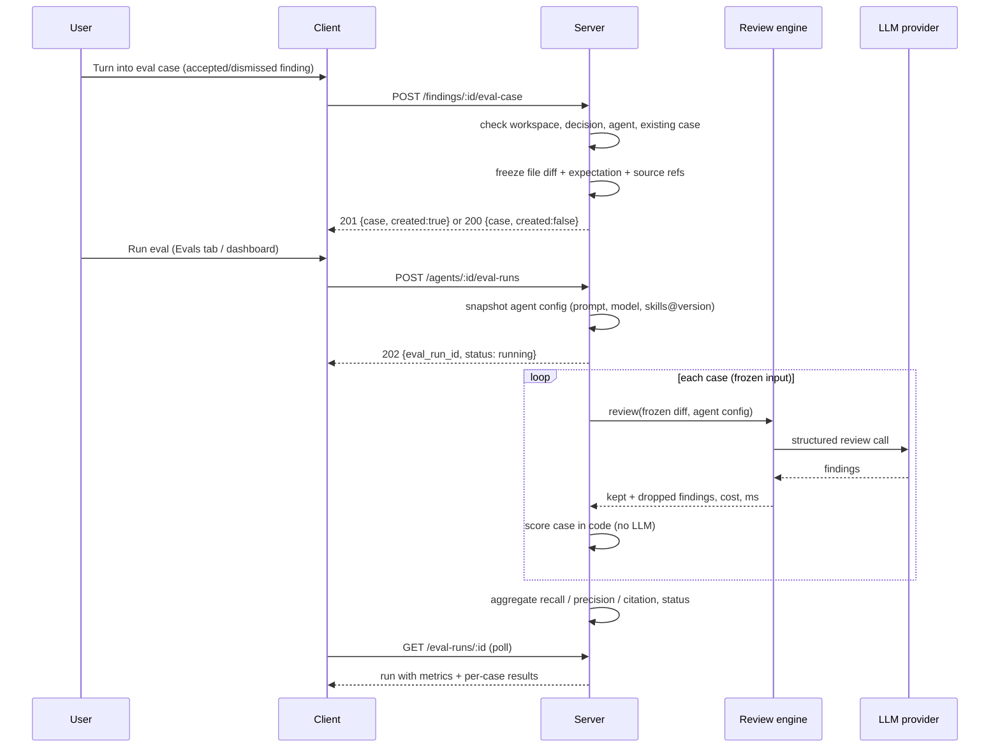
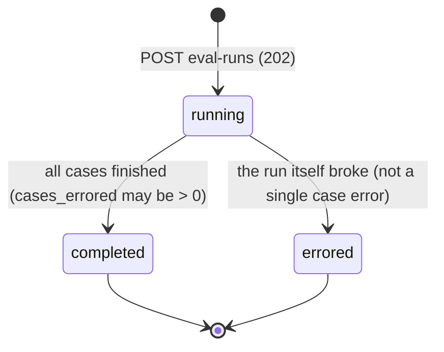

# Spec: Eval Pipeline (regression evals for review agents, built from accept/dismiss decisions)
Date: 2026-10-08
Status: approved
Supersedes: none

> Lesson scope: **L06 homework — "Eval Pipeline"** (README roadmap row L06: *Eval pipeline · Secret/Phantom gates ·
> Plan Verifier · Export to CI*). This spec covers **only the Eval pipeline**. Secret/Phantom gates, Plan Verifier and
> Export to CI are separate L06 features and are not specified here. Spans `@devdigest/shared` contracts (both copies),
> `server/`, `client/`, and possibly `reviewer-core/` and `e2e/`, hence root `specs/`.
>
> The homework submission checklist names the file `specs/eval-pipeline.md`; this repo's spec convention is
> date-prefixed — see Open questions (OQ-7).

## Problem and user

A **person who maintains a review agent** (its system prompt, model, linked skills) has no way to tell whether a change
made the agent better or worse. Today they edit the prompt, re-run the agent on a PR and eyeball the findings. That is
slow, not repeatable (the PR, clone and intent change under them) and not measurable.

DevDigest already holds the ground truth: every finding a user **accepted** is something the agent *should* find, and
every finding a user **dismissed** is something it *should not* say (`server/src/modules/reviews/findings.ts:6-10`
names these decisions "the dataset later lessons build on"). The Eval pipeline turns those decisions into **eval
cases** with frozen inputs, runs an agent over all its cases, and scores the output **in code** (no model) as recall,
precision and citation accuracy, so two versions of an agent can be compared by numbers.

### What exists today (verified)

- Tables `eval_cases` and `eval_runs` exist in `server/src/db/schema/eval.ts:7-35` (already migrated). `eval_cases` has
  `owner_kind` (`skill`|`agent`), `owner_id` (no FK), `name`, `input_diff`, `input_files`, `input_meta`,
  `expected_output` (jsonb), `notes`. `eval_runs` is **one row per case execution** (`case_id`, `ran_at`,
  `actual_output`, `pass`, `recall`, `precision`, `citation_accuracy`, `duration_ms`, `cost_usd`) — it has **no**
  suite-level run, agent id, agent version, prompt snapshot or source-finding link (see OQ-1).
- Zod contracts exist: `EvalCase`, `EvalRun`, `EvalPerTrace`, `EvalOwnerKind` in `contracts/knowledge.ts`;
  `EvalCaseInput`, `EvalRunRecord`, `EvalRunResult`, `EvalTrendPoint`, `EvalDashboard` in `contracts/eval-ci.ts`. The
  eval parts are identical in the server and client copies. `expected_output` is `z.unknown()`; the dashboard uses the
  lab's "traces" naming (`traces_passed`, `per_trace`).
- No server module, route or service for evals; no client route, Evals tab or FindingCard button. `AgentEditor` ships
  Config / Skills / Context tabs. Client i18n namespace `client/messages/en/eval.json` and the `/eval` → `"eval"` sidebar
  key mapping (`client/src/components/app-shell/helpers.ts:38`) already exist; `client/src/vendor/ui/nav.ts` has no Eval
  Dashboard item yet.
- Agent config is versioned: every config change bumps `agents.version` and snapshots provider, model,
  `system_prompt`, strategy, output schema and **enabled skill ids** into `agent_versions`
  (`server/src/modules/agents/repository.ts:149-169`); `GET /agents/:id/versions` exists. Skills have their own
  `version` + `skill_versions`.
- Findings carry `file`, `start_line`, `end_line`, `accepted_at`, `dismissed_at`; reviews carry `agent_id` and
  `run_id`. Seeded findings (`server/src/db/seed.ts:340-381`) are 2 findings on one PR, **no `agent_id`**, neither
  accepted nor dismissed.
- The grounding gate is `groundFindings()` in `reviewer-core/src/grounding.ts:52`; a review outcome exposes kept and
  `dropped` findings.
- The `evals/` folder is a **separate lab harness** for the Claude Code tooling (skills, subagents, workflow) running on
  the Claude Agent SDK / subscription with an LLM judge. It is not product code and the product feature does not depend
  on it.
- `pnpm verify:l06` **does not exist**: there is no root `package.json` and no `verify:*` script in any package (OQ-6).

## Goals / Non-goals

- **Goals**
  - G1: One click on a decided finding creates an eval case: accepted → `must_find`, dismissed → `must_not_flag`.
  - G2: A case freezes everything needed to replay it, so runs of different agent versions are comparable.
  - G3: Run an agent over all its cases; persist the run with the exact agent config it used.
  - G4: Score in code only — recall, precision, citation accuracy, per-case pass — with **zero LLM calls** in scoring.
  - G5: Run history per agent and a side-by-side compare of two runs (metric deltas + system prompt diff).
  - G6: An "Evals" tab in the Agent editor and an "Eval Dashboard" page in the sidebar.
  - G7: `pnpm verify:l06` green as the homework gate.
- **Non-goals**
  - Skill-owned eval cases (`owner_kind = 'skill'`) — the column exists, this spec only uses `agent`.
  - Any LLM-as-judge or semantic matching of finding text. Matching is file + line overlap only.
  - **Promote** (making an older/newer version the active one) — see OQ-4; default out of scope.
  - Manual authoring/editing of cases (the "New eval case" editor with JSON expected output, "Run case", "Run on
    save") — see OQ-11; default out of scope beyond a read-only case view.
  - "Learn" and "Reply to author" finding actions (L07 memory / later lessons).
  - Using the `evals/` harness, its judge or its records from the product.
  - Secret/Phantom gates, Plan Verifier, Export to CI (other L06 features).
  - Scheduled/automatic eval runs (on prompt save, nightly, in CI).

## User stories

- **US-1**: As a reviewer who accepted a finding, I want to turn it into a `must_find` eval case in one click, so that
  the agent is held to finding it again.
- **US-2**: As a reviewer who dismissed a finding, I want to turn it into a `must_not_flag` eval case in one click, so
  that the agent is penalised if it raises that noise again.
- **US-3**: As an agent maintainer, I want to see all eval cases of an agent's set, so that I know what the agent is
  measured on.
- **US-4**: As an agent maintainer, I want to run the agent over all its cases on frozen inputs, so that results of
  different agent versions are comparable.
- **US-5**: As an agent maintainer, I want to see a run's recall, precision, citation accuracy, cases passed, cost and
  duration, plus per-case results, so that I can judge quality by numbers.
- **US-6**: As an agent maintainer, I want run history and a side-by-side compare of two runs with the system prompt
  diff, so that I can see whether "new prompt" beat "old prompt".
- **US-7**: As a workspace user, I want an Eval Dashboard page that shows the latest eval results of every agent, so
  that I see regressions across agents at a glance.
- **US-8**: As the course grader / maintainer, I want scoring to be deterministic with zero LLM calls and a single
  `pnpm verify:l06` gate, so that the result is trustworthy and checkable.

## Acceptance criteria (EARS)

### Creating cases from findings

- **AC-1** (event-driven, covers US-1): WHEN the user activates *Turn into eval case* on an **accepted** finding, the
  system shall create one eval case owned by the agent that produced the finding, with expectation type `must_find` and
  the finding's `file`, `start_line`, `end_line`. — *Verify: integration test on a seeded accepted finding → one
  `eval_cases` row, `owner_kind='agent'`, expectation `{type:'must_find', file, start_line, end_line}`.*
- **AC-2** (event-driven, covers US-2): WHEN the user activates *Turn into eval case* on a **dismissed** finding, the
  system shall create one eval case with expectation type `must_not_flag` and the finding's `file`, `start_line`,
  `end_line`. — *Verify: same test with a dismissed finding → `type:'must_not_flag'`.*
- **AC-3** (ubiquitous, covers US-1, US-2, US-4): The system shall freeze into the case, at creation time: (a) the
  unified diff of the finding's file from the source PR, verbatim including the original hunk headers (new-side line
  numbers unchanged); (b) the expectation (type, file, start_line, end_line); (c) the finding's title, category and
  severity as informational labels; (d) the source finding id, source review/run id and the agent version that produced
  the finding; (e) the source PR's repo, number, head SHA, title and description. — *Verify: integration test reads the
  case back and asserts every field; then mutates `pr_files`/the finding and re-reads the case unchanged.*
- **AC-4** (ubiquitous, covers US-4): The system shall never re-read a case's input from the PR, `pr_files`, the clone,
  GitHub or `repo-intel` after the case is created. — *Verify: run an eval with the git/GitHub adapters mocked to throw;
  the run succeeds.*
- **AC-5** (ubiquitous, covers US-1, US-2): Creating a case shall take a single user action with no form; the case name
  shall be generated as `<expectation type>-<slug of finding title>`. — *Verify: RTL test — one click fires one create
  request, no dialog opens.*
- **AC-6** (unwanted behaviour, covers US-1, US-2): IF an eval case already exists for the same source finding and the
  same owning agent, THEN the system shall not create a second case, shall return the existing case, and the UI shall
  state that the case already exists. — *Verify: integration test — two create calls → one row, second response
  `created:false` with the same id.*
- **AC-7** (unwanted behaviour, covers US-1, US-2): IF the finding is neither accepted nor dismissed, THEN the button
  shall be disabled with the reason "Accept or dismiss this finding first", and the server shall reject a direct
  request with `422 finding_not_triaged`. — *Verify: RTL test on an undecided finding; route test for the 422.*
- **AC-8** (unwanted behaviour, covers US-1, US-2): IF the finding has no producing agent (its review has no
  `agent_id`, as with seeded findings), THEN the button shall be disabled with the reason, and the server shall reject
  with `422 finding_has_no_agent`. — *Verify: route test against the seeded finding.*
- **AC-9** (unwanted behaviour, covers US-1, US-2): IF the diff of the finding's file cannot be resolved (no patch
  stored, binary file, file absent from the PR diff), THEN the server shall reject with `422 diff_unavailable` and
  persist nothing; IF the patch exists but the finding's lines fall outside every frozen hunk (including hunks trimmed
  by the 400-line cap), THEN the server shall reject with `422 expectation_not_grounded` and persist nothing. —
  *Verify: integration tests with a `pr_files` row whose `patch` is null, and with a finding outside the hunks.*
- **AC-10** (state-driven, covers US-1, US-2): WHILE a finding has an eval case, its FindingCard shall show a tag naming
  the case type (`must_find` / `must_not_flag`) in place of the enabled button. — *Verify: RTL test with a finding that
  has a linked case.*

### Seeing the set

- **AC-11** (ubiquitous, covers US-3): The Agent editor shall have an **Evals** tab listing every eval case owned by the
  agent, each with name, expectation type, `file:start-end`, source PR and last result (`passed`, `failed`, `error`,
  `never run`), and a count "N / M passing". — *Verify: RTL test with 3 cases in different states.*
- **AC-12** (event-driven, covers US-3): WHEN the user opens a case, the system shall show it read-only: the frozen
  diff, the expectation and a link to the source finding's PR. — *Verify: RTL test.*
- **AC-13** (event-driven, covers US-3): WHEN the user deletes a case and confirms, the system shall remove it from the
  agent's set, and past eval runs shall keep their stored per-case results. — *Verify: integration test — delete a case,
  re-read an older run, its per-case result is still there.*

### Running

- **AC-14** (event-driven, covers US-4): WHEN the client calls `POST /agents/:id/eval-runs`, the system shall start one
  eval run over **all** cases currently owned by the agent, respond `202` with the run id and status `running`, and
  execute the cases in the background. — *Verify: route test — 202 and a persisted run in `running`.*
- **AC-15** (ubiquitous, covers US-4): The system shall run each case with the case's frozen diff and PR title/
  description plus the agent's **current** config: system prompt, provider, model, strategy, output schema and enabled
  linked skills; it shall inject **no** derived intent, repo map, callers digest, project context or memory. —
  *Verify: unit test captures the assembled prompt for one case and asserts the absent sections; the intent classifier
  mock records zero calls.*
- **AC-16** (ubiquitous, covers US-4, US-6): The system shall record on each eval run: agent id, agent version,
  provider, model, the full system prompt text, the enabled skills with their versions, start and finish time, the set
  of case ids run, and status (`running`, `completed`, `errored`), plus the count of errored cases (`cases_errored`). — *Verify: integration test
  reads a finished run and asserts every field.*
- **AC-17** (state-driven, covers US-4): WHILE an eval run is running, the UI shall show progress "k / n cases" and
  disable *Run eval* for that agent, and a page reload shall show the same state. — *Verify: RTL test with a running
  run; manual reload in the app.*
- **AC-18** (unwanted behaviour, covers US-4): IF an eval run for the same agent is already running, THEN the system
  shall reject a new one with `409 eval_run_in_progress`. — *Verify: route test.*
- **AC-19** (unwanted behaviour, covers US-4): IF the agent has no eval cases, THEN the system shall reject with
  `422 no_eval_cases` and the UI shall disable *Run eval* with an empty-state message. — *Verify: route + RTL test.*
- **AC-20** (unwanted behaviour, covers US-4, US-5): IF the agent call for one case fails (provider error, timeout,
  invalid structured output), THEN the system shall record that case as `error` with the reason, continue with the
  remaining cases, and finish the run as `completed` with `cases_errored` > 0. — *Verify: unit test with a fake LLM that fails on
  case 2 of 3.*

### Scoring (code only)

- **AC-21** (ubiquitous, covers US-5, US-8): A produced finding shall **match** an expectation if and only if it passed
  the grounding gate, its file path equals the expectation's file after normalisation (strip leading `a/`, `b/`, `./`),
  and the closed line ranges `[min(start,end), max(start,end)]` overlap. — *Verify: unit tests: same file overlapping /
  adjacent-not-overlapping / single-line / different file / reversed range.*
- **AC-22** (ubiquitous, covers US-5): **recall** shall equal (number of `must_find` expectations matched by at least
  one grounded finding) / (number of `must_find` expectations across all cases of the run); errored cases (`pass: null`) are
  excluded from every numerator and denominator, and a run in which every case errored has all metrics `null`. — *Verify: unit test on a fixed fixture with a hand-computed value.*
- **AC-23** (ubiquitous, covers US-5): **precision** shall equal (grounded findings that do not match any
  `must_not_flag` expectation of their case) / (all grounded findings), summed across cases; findings that match no
  expectation are counted as "unlabeled" and reported separately (definition default — OQ-2). — *Verify: unit test on a
  fixture containing one noise hit and one unlabeled finding.*
- **AC-24** (ubiquitous, covers US-5): **citation_accuracy** shall equal (findings kept by the grounding gate) /
  (findings kept + findings dropped by the gate), summed across cases. — *Verify: unit test feeding a dropped finding.*
- **AC-25** (unwanted behaviour, covers US-5): IF a metric's denominator is 0 (no `must_find` cases; no findings
  produced), THEN the metric shall be stored as `null` and shown as "—", never as 0 % or 100 %. — *Verify: unit test on
  a `must_not_flag`-only set with zero findings.*
- **AC-26** (ubiquitous, covers US-5): A case shall **pass** if and only if it did not error, every `must_find`
  expectation in it is matched, and no grounded finding matches a `must_not_flag` expectation in it. — *Verify: unit
  tests per branch.*
- **AC-27** (ubiquitous, covers US-8): Scoring shall make **zero** LLM, network or database calls and shall be
  deterministic: the same produced findings and cases always give the same metrics. — *Verify: unit test runs scoring
  with an LLM fake that throws on any call, twice, and compares the results; the run-level test asserts LLM call count
  = number of review calls only.*

### Results, history, compare

- **AC-28** (event-driven, covers US-5): WHEN an eval run finishes, the system shall show recall, precision and
  citation accuracy as percentages, cases passed `p / n`, total cost and duration, and for each case the expected vs
  produced findings marked `matched`, `missed`, `noise`, `unlabeled` or `dropped`. — *Verify: RTL test on a finished
  run fixture.*
- **AC-29** (unwanted behaviour, covers US-5): IF the cost of any case is unknown (`null`), THEN the run's cost shall be
  shown as the sum of known costs with a marker that it is partial, never as `$0`. — *Verify: unit test of the
  aggregation + RTL test of the marker.*
- **AC-30** (ubiquitous, covers US-6): The Evals tab and the per-agent dashboard shall list the agent's eval runs newest
  first, each with ran-at, agent version, recall, precision, citation, cases passed and cost. — *Verify: RTL test with
  3 runs out of order.*
- **AC-31** (event-driven, covers US-6): WHEN the user selects exactly two runs of the same agent and activates
  *Compare*, the system shall show, older run as "old" and newer as "new" regardless of selection order: each metric
  `old → new` with a signed delta, cost and cases passed `old → new`, the cases whose pass/fail changed, and a line diff
  of the two system prompts; differences in provider, model and skills (id@version) shall be listed. — *Verify: RTL
  test selecting newer-then-older; the diff shows added/removed lines.*
- **AC-32** (state-driven, covers US-6): WHILE fewer or more than two runs are selected, *Compare* shall be disabled. —
  *Verify: RTL test.*
- **AC-33** (unwanted behaviour, covers US-6): IF the two runs were made over different case sets, THEN the compare view
  shall warn with the number of common, added and removed cases. — *Verify: RTL test with differing `case_ids`.*

### Eval Dashboard

- **AC-34** (ubiquitous, covers US-7): The sidebar's *Skills Lab* group shall contain an **Eval Dashboard** item that
  opens the dashboard page and is highlighted while that page or its per-agent view is open. — *Verify: RTL test of the
  sidebar; e2e navigation.*
- **AC-35** (ubiquitous, covers US-7): The dashboard shall show one card per agent that has at least one eval case, with
  agent name, model, latest run's version and time, recall / precision / citation, cases passed `p / n`, and a
  sparkline of recent runs; activating a card opens that agent's view. — *Verify: RTL test with 2 agents.*
- **AC-36** (ubiquitous, covers US-7): The dashboard shall show a table of recent eval runs across all agents, newest
  first, with agent, time, version, the three metrics and cases passed. — *Verify: RTL test.*
- **AC-37** (ubiquitous, covers US-6, US-7): The per-agent view shall show metric tiles for the latest run with the
  delta to the previous run, a metric trend chart over runs, the run history with row selection and *Compare*, and a
  *Run eval* action. — *Verify: RTL test.*
- **AC-38** (unwanted behaviour, covers US-3, US-7): IF there are no eval cases at all, or an agent has cases but no
  runs, THEN the page shall show an explicit empty state explaining the next step (create a case from a finding / run
  the eval), not an empty chart or zeros. — *Verify: RTL tests for both states.*
- **AC-39** (optional feature, covers US-7): WHERE *Run all agents* is offered, the system shall start one eval run per
  agent that has at least one case, skip agents that already have a running run, and report which agents were started
  and which were skipped. — *Verify: route/service test with one agent busy.*
- **AC-40** (optional feature, covers US-7): WHERE the latest run of an agent is lower than the previous run on any
  metric by at least 0.05, the per-agent view shall show a regression banner naming the metric and the drop. —
  *Verify: RTL test with a precision drop of 0.06.*

### Gate

- **AC-41** (ubiquitous, covers US-8): `pnpm verify:l06`, run from `server/`, shall exit 0 only when the scoring, frozen-input
  and executor unit tests, the shared-contract parity test, the contracts test and the DB-backed `eval.it.test.ts`
  (case creation, dedup, run persistence) all pass, and shall exit non-zero on the first failure (exact file list under
  "Alignment with the reference"). It shall need no API key and make no paid LLM call. Client tests (FindingCard button,
  Evals tab, Compare) run separately via `client` `pnpm test`. — *Verify: run it on a clean checkout (green); break one
  scoring assertion (red).*

## Edge cases

- Finding accepted, case created, then the user changes the decision to dismissed → the existing case stays
  `must_find` (frozen); the card keeps showing the linked case. Re-deciding does not create a second case (AC-6; whether
  to offer "update expectation" is OQ-15).
- The same lines were flagged by two agents and the user accepted both → two cases, one per owning agent (dedup key is
  finding + agent, AC-6).
- Two findings of one agent on the same file/lines (one accepted, one dismissed, e.g. from different runs) → two cases
  with contradictory expectations; the case list shows both; a produced finding there satisfies the `must_find` and is
  noise for the `must_not_flag`, so at most one can pass (AC-21, AC-26). Recommend a warning — see Design review notes.
- A `must_not_flag` range of `45-52` and a produced finding at `52-60` in the same file → overlap → noise (AC-21).
- A produced finding outside every hunk of the frozen diff → dropped by the grounding gate → lowers citation accuracy
  only, never counted as a match or noise (AC-21, AC-24).
- A case whose frozen diff is a renamed file → expectation uses the new path; old-path findings do not match (AC-21).
- Huge file diff (thousands of lines) → case creation still freezes it; the agent's `strategy` may map-reduce it (AC-15).
  A size cap is OQ-3.
- Agent edited (prompt change → new version) while an eval run is running → the running run keeps the config snapshot it
  started with (AC-16); the next run uses the new version.
- Case deleted while a run is in progress → the run finishes with the cases it started with; its `case_ids` reflect
  that (AC-16, AC-13).
- Agent deleted → its cases and runs are no longer reachable from any page; storage handling is OQ-14 (`owner_id` has
  no FK).
- Provider key missing for the agent's provider → every case errors; run ends `completed` with `cases_errored` = n and all metrics
  `null` per AC-20/AC-22/AC-25; the UI shows the provider error once, not n times (AC-20).
- Eval run on a set containing only `must_not_flag` cases and the agent stays silent → recall `null`, precision `null`,
  citation `null`, all cases pass (AC-25, AC-26).
- Finding from another workspace id passed to the create endpoint → `404` (see Security NFR).
- Selecting two runs of different agents for Compare is impossible from the per-agent view; the API rejects it with
  `422 compare_different_agents` (AC-31).

## Non-functional requirements

- Performance: an eval run of 8 small cases (≤ 200 diff lines each) with a default model shall finish within 3 minutes;
  the `POST` returns within 1 s; progress updates are visible within 5 s of each case finishing. — *Verify: timed
  manual run during the demo; route test asserts the 202 without awaiting cases.*
- Performance: scoring of 50 cases × 20 findings shall take under 50 ms. — *Verify: unit benchmark-style test.*
- Cost: one eval run makes exactly one review call per case (more only when the agent's strategy map-reduces a large
  diff) and no other LLM call (no intent, no judge). — *Verify: fake-LLM call counter
  in the run test.*
- Security: every eval endpoint is scoped to the caller's workspace; a case, run, agent or finding from another
  workspace returns `404`. — *Verify: integration test with two workspaces.*
- Security: frozen diff and PR text are untrusted and enter the prompt through the same untrusted wrapping as normal
  reviews; the UI renders them as plain text, never as HTML. Secrets inside a frozen diff (e.g. `sk_live_…`) are stored
  as they already are in `pr_files` and are never written to logs. — *Verify: prompt-assembly unit test; log-capture
  test with a secret-like string.*
- Observability: each eval run logs start, per-case finish (case id, ms, cost, status) and finish with the three
  metrics, under one correlation id. — *Verify: log-capture test.*
- Accessibility: run-row checkboxes have accessible names ("Select run v7, 2026-10-08 09:14"); metric deltas are not
  conveyed by colour alone (sign and arrow); the disabled create button exposes its reason to screen readers. —
  *Verify: RTL queries by role/name.*

## Inputs and provenance

- Findings and their accept/dismiss state — DevDigest DB, produced by the agent's LLM output and the user's decision.
- Source PR diff — the persisted `pr_files` patches / git diff of the imported PR (GitHub content).
- Source PR title and description — GitHub, author-controlled.
- Agent config (system prompt, provider, model, strategy, skills) — DB, user-edited.
- Skill bodies — DB; may be imported (untrusted per the L02 trust split).
- LLM output during an eval run — provider response, parsed with the existing structured-output schema.
- Design screenshots supplied by the user (6 local PNGs from the lab harness mock).

## Untrusted inputs

- Frozen diff, PR title/description, file paths: attacker-controllable via the PR. Handled as untrusted prompt content
  (existing wrapping) and rendered as text; file paths are compared as strings only, never used to touch the filesystem.
- LLM output during an eval run: validated by the existing structured output schema; invalid output → case `error`
  (AC-20). Its text is never executed or rendered as HTML.
- Untrusted (imported) skills keep their existing untrusted marking in the prompt.
- No content was fetched via `WebFetch` for this spec.

## Workflows and contracts

### Package ownership (behaviour level)

| Package | Owns |
|---|---|
| `@devdigest/shared` (both copies, mirrored) | wire shapes of eval case, expectation, eval run (suite + per-case results), compare, dashboard; error codes |
| `server/` | case creation from a finding, freezing, dedup, run orchestration and persistence, scoring, endpoints, workspace scoping |
| `reviewer-core/` | unchanged review engine reused per case (diff → prompt → LLM → grounding); scoring may live here or in server — planner's call, it must stay pure |
| `client/` | FindingCard button + tag, Evals tab, case view, Eval Dashboard page + per-agent view, Compare modal, sidebar item |
| `e2e/` | optional flow: decided finding → *Turn into eval case* → case visible in the Evals tab (a real eval run needs a paid LLM, so it is not part of e2e; data source OQ-8) |

### Create case from a finding and run

### Eval run states

### Boundary contracts (shapes; final names are for the planner, behaviour is fixed)

- **Expectation** (stored in `expected_output`): `{ type: 'must_find' | 'must_not_flag', file: string, start_line: int,
  end_line: int, label?: { title, category, severity } }`.
- **Case meta** (stored in `input_meta`): `{ source_finding_id, source_review_id, source_run_id,
  repo: 'owner/name', pr_number, head_sha, pr_title, pr_body }`.
- `POST /findings/:id/eval-case` → `201 {case, created:true}` | `200 {case, created:false}` | `404` |
  `422 finding_not_triaged | finding_has_no_agent | diff_unavailable | expectation_not_grounded`.
- `GET /agents/:id/eval-cases` → cases with last result per case.
- `GET /eval-cases/:id` → case detail; `DELETE /eval-cases/:id` → `204`.
- `POST /agents/:id/eval-runs` (homework-given) → `202 {eval_run_id, status}` | `404` | `409 eval_run_in_progress` |
  `422 no_eval_cases`.
- `GET /agents/:id/eval-runs` → run history (suite level, newest first).
- `GET /eval-runs/:id` → suite run with config snapshot, metrics, cost, duration, status, progress, per-case results.
- Compare: either `GET /eval-runs/compare?a=&b=` or the client composes two `GET /eval-runs/:id` — planner's call;
  `422 compare_different_agents` if the API form is used.
- `GET /eval/dashboard` → per-agent latest summary + recent runs across agents (the existing `EvalDashboard` shape is
  per-owner; a workspace-wide list is needed — OQ-1/OQ-10).
- Per-case result: `{ case_id, status: 'passed'|'failed'|'error', error?, produced: Finding[], dropped: {finding,
  reason}[], outcomes: { expectation, matched_by: finding index[] }[], noise: index[], unlabeled: index[], cost_usd,
  duration_ms }`.

## Design review notes

Sources analysed: all six supplied screenshots (FindingCard actions, Eval Dashboard, per-agent dashboard, Compare
modal, AgentEditor Evals tab, case editor modal), the existing code listed under "What exists today", and the `evals/`
harness README. Where the mock diverges from the homework text, the homework wins:

- Gaps / divergences in the supplied design:
  - The case editor (screenshot 6) uses a hand-written **JSON expected output** (severity/category/title/file/
    start_line) and "Files" / "PR meta" tabs; the homework expects **must_find / must_not_flag** expectations born from
    findings, matched by file + line only. Severity/category/title are kept only as labels (AC-3), not matched.
  - "Traces" wording (`20-trace gold set`, `TRACES PASSED`, contract fields `traces_passed`, `per_trace`) → the product
    says **cases**. Wire names are "given ready" (OQ-10).
  - Model labels `gpt-4.1` / `gpt-4o` are mock data; the real label is the agent's provider/model.
  - **Promote v7** button and the agent dropdown / "30 days" range filter on the per-agent view are not in the homework
    (OQ-4; filters are nice-to-have).
  - FindingCard mock shows *Learn* and *Reply to author*; neither exists in this repo's card (only Accept / "Reject"
    for `dismiss`). Only *Turn into eval case* is added.
  - The mock shows *Turn into eval case* enabled on a finding with no decision; the homework maps the expectation from
    the decision, so the button is disabled until a decision exists (AC-7).
  - The Evals-tab mock shows no expectation type per case; this spec adds it (AC-11), since `must_not_flag` cases with
    "expected 0 findings" are otherwise indistinguishable from empty cases.
- Uncovered corner cases not yet turned into an AC:
  - Contradictory cases on the same lines (see Edge cases) — recommend a non-blocking warning in the Evals tab.
  - LLM non-determinism: two runs of the **same** prompt can differ, so a small delta may be noise. Recommend showing
    "same config" in Compare when both snapshots are identical, and running each version twice in the experiment.
  - The sensitivity experiment ("break the prompt → precision drops") only moves precision under the AC-23 default if
    the broken prompt flags lines covered by `must_not_flag` cases; the dataset needs several dismissed-noise cases for
    the demo to show it (≥ 3 recommended).
- Cross-module communication: the eval run reuses the review engine as a library call with an injected LLM provider and
  a frozen diff; it does not go through the PR run executor (which loads diff/intent/repo-intel/project context). Agent
  config and versions are read from the agents data owner; findings from the reviews data owner — the server's
  cross-module rule (go through the container, not another module's internals) applies. Contract changes must be
  mirrored into both shared copies.
- UX improvement proposals: show the per-case diff of results inside Compare ("newly failing: stripe-key-leak"); a
  "View in eval dashboard →" link from the Evals tab (as in the mock); keyboard shortcut for the sidebar item following
  the existing `g`-nav pattern (optional).

## Traceability

| US | Covered by AC(s) | Edge cases |
|---|---|---|
| US-1 | AC-1, AC-3, AC-5, AC-6, AC-7, AC-8, AC-9, AC-10 | decision changed after creation; same lines two agents; foreign workspace |
| US-2 | AC-2, AC-3, AC-5, AC-6, AC-7, AC-8, AC-9, AC-10 | contradictory cases; overlapping must_not_flag range |
| US-3 | AC-11, AC-12, AC-13, AC-38 | case deleted mid-run; agent deleted |
| US-4 | AC-3, AC-4, AC-14, AC-15, AC-16, AC-17, AC-18, AC-19, AC-20 | prompt edited mid-run; huge diff; missing provider key |
| US-5 | AC-20, AC-21, AC-22, AC-23, AC-24, AC-25, AC-26, AC-28, AC-29 | finding outside hunks; renamed file; must_not_flag-only set |
| US-6 | AC-16, AC-30, AC-31, AC-32, AC-33, AC-37 | compare across agents rejected |
| US-7 | AC-34, AC-35, AC-36, AC-37, AC-38, AC-39, AC-40 | — |
| US-8 | AC-21, AC-27, AC-41 | — |

### Homework acceptance → this spec

| Homework criterion | Where |
|---|---|
| ≥ 8 cases in the set | dataset built from real decisions (OQ-8); no cap below that in AC-11/AC-14 |
| One-click case from a finding; both types work | AC-1, AC-2, AC-5 |
| Changing the system prompt visibly moves recall/precision | AC-16, AC-31 + demo (Design review notes) |
| Scoring makes zero LLM calls | AC-27 |
| `pnpm verify:l06` green | AC-41, OQ-6 |

## Open questions

- [NEEDS CLARIFICATION] **OQ-1 Schema gap.** The "given ready" `eval_runs` table is per case and has no suite-level run,
  agent id/version, config snapshot, status/progress or `case_ids`; `eval_cases` has no source-finding column for dedup
  (AC-6, AC-16 need them). — recommended default: extend the schema (a suite-level eval run record + per-case results
  linked to it; a source-finding reference on cases with uniqueness per owner) via `src/db/schema/*` + generated
  migration, and add the matching contracts to both shared copies; keep existing columns/fields unchanged.
- [NEEDS CLARIFICATION] **OQ-2 Precision definition.** "Share of findings that are not noise": count only findings that
  hit a `must_not_flag` as noise (unlabeled findings neutral), or count every finding that matches no `must_find` as
  noise? — recommended default: only `must_not_flag` hits are noise; unlabeled findings are reported separately
  (AC-23). The stricter alternative makes precision collapse whenever the agent raises valid-but-unlabeled findings.
- [NEEDS CLARIFICATION] **OQ-3 Frozen diff scope.** Freeze only the hunk(s) intersecting the finding, or all hunks of
  the finding's file? — recommended default: all hunks of that file (gives the agent room to produce noise and keeps
  context), with a cap of 400 changed lines beyond which only intersecting hunks ± 1 neighbour are kept.
- [NEEDS CLARIFICATION] **OQ-4 Promote.** Is *Promote vN* (restore/make a version current) in scope? — recommended
  default: out of scope; Compare shows no Promote button. Agents have no "active version" concept today.
- [NEEDS CLARIFICATION] **OQ-5 Run all agents.** Required or optional? — recommended default: optional P2 (AC-39).
- [RESOLVED 2026-10-08] **OQ-6 Where `pnpm verify:l06` lives.** The mentor's reference (`upstream/full-functionality`,
  `server/package.json`) defines it as a plain `vitest run <files>` script in `server/package.json`. Decision: do the same;
  no root `package.json`. See "Alignment with the reference" below. (Original question follows.)
  **OQ-6 (superseded):** No root `package.json` exists and the repo is
  deliberately not a workspace. — recommended default: a scripts-only root `package.json` (private, no dependencies, no
  workspace file) whose `verify:l06` runs one shell script doing the checks in AC-41 package by package; alternative:
  `verify:l06` in `server/package.json` invoking the client checks by path.
- [NEEDS CLARIFICATION] **OQ-7 File name.** The submission checklist expects `specs/eval-pipeline.md`; repo convention
  is date-prefixed. — recommended default: keep `specs/eval-pipeline.md` and cite it in the submission; if
  the grader requires the exact name, the human renames/copies it.
- [NEEDS CLARIFICATION] **OQ-8 Getting ≥ 8 cases.** Seed data has 2 findings with no agent and no decisions, so it
  yields 0 cases. — recommended default: no seed change; build the set by running review agents on imported PRs and
  accepting/dismissing ≥ 8 findings of one agent (≥ 3 dismissed for the precision experiment). Alternative: extend the
  seed with agent-attributed decided findings so e2e and the demo start with a ready set.
- [NEEDS CLARIFICATION] **OQ-9 Findings without an agent.** Allow picking an owner agent for such findings? —
  recommended default: no; the button is disabled (AC-8).
- [NEEDS CLARIFICATION] **OQ-10 Contract naming.** Keep `traces_passed` / `per_trace` wire names from the given
  contracts or rename to cases? — recommended default: keep existing wire names, label them "cases" in the UI; add new
  fields rather than renaming.
- [NEEDS CLARIFICATION] **OQ-11 Manual cases.** Is the "New eval case" editor (hand-written diff + expected output, Run
  case, Run on save) required? — recommended default: out of scope; read-only case view only (AC-12).
- [NEEDS CLARIFICATION] **OQ-12 Determinism.** Force a fixed temperature for eval runs? — recommended default: use the
  agent's config unchanged (evals must measure what users get); mitigate with repeat runs in the experiment.
- [NEEDS CLARIFICATION] **OQ-13 Frozen context sections.** Should intent, project context or repo map be frozen into the
  case and replayed? — recommended default: no; eval runs use the frozen diff + PR text + agent config only (AC-15), so
  they measure prompt/model/skill changes alone.
- [NEEDS CLARIFICATION] **OQ-14 Agent deletion.** `eval_cases.owner_id` has no FK. — recommended default: deleting an
  agent deletes its cases and eval runs in the same operation.
- [NEEDS CLARIFICATION] **OQ-15 Decision changed after case creation.** Offer "update expectation"? — recommended
  default: no; the case stays frozen; the user deletes and recreates it.
- [NEEDS CLARIFICATION] **OQ-16 Execution model.** Async `202` + polling (AC-14) vs a blocking request. — recommended
  default: async with polling, cases run sequentially or with small bounded concurrency within the existing job queue.

## Alignment with the reference (decided 2026-10-08)

Source: read-only look at `upstream/full-functionality` (mentor's reference build). We build our own implementation; we
align only names, file locations and metric formulas so a grader's `verify:l06` has something to run. Nothing is copied.

- **`verify:l06` is a script in `server/package.json`**, run from `server/`: `vitest run` over
  `src/modules/eval/scoring.test.ts`, `src/modules/eval/frozen-input.test.ts`, `src/modules/eval/executor.test.ts`,
  `test/eval-contract-parity.test.ts`, `test/contracts.test.ts`, `test/eval.it.test.ts` (the last needs Docker). Supersedes
  the root-`package.json` default in OQ-6 and the scope of AC-41 (client tests stay a separate `client` `pnpm test`).
- **Server module** `server/src/modules/eval/`: `scoring.ts` (pure: `matches`, `scoreCase`, `errorCaseOutcome`,
  `scoreRun`), `frozen-input.ts` (`synthesizeFrozenDiff`, `isExpectationGrounded` reusing `groundFindings`),
  `executor.ts`, `service.ts`, `repository.ts`, `routes.ts`, `ports.ts`, `constants.ts`, `prompt-diff.ts`, `callout.ts`.
- **Contracts** live in the existing `contracts/eval-ci.ts` (+ Eval region in `knowledge.ts`) in BOTH shared copies; a
  parity test must keep them byte-identical outside known drift.
- **Client** routes: `app/eval/page.tsx` (dashboard), `app/eval/agents/[agentId]/page.tsx` (per-agent + Compare),
  `EvalsTab` inside AgentEditor, hooks in `lib/hooks/eval.ts`, formatting in `lib/eval-format.ts`, i18n `messages/en/eval.json`.
- **Scoring semantics to match (resolves OQ-2):** `must_find` passes with >=1 matching grounded finding; `must_not_flag`
  passes with 0 matching findings; an errored case has `pass: null` and is excluded from every numerator and denominator;
  every ratio is `null` (never 0) on a zero denominator. recall = passed must_find / scored must_find;
  precision = 1 - FP/total where FP = findings matching a `must_not_flag` and total = all kept findings in the run;
  citation_accuracy = grounding_kept / grounding_total. Only grounded (kept) findings are ever scored.
- **Out of scope here:** the reference also ships skill-owned eval cases (SPEC-15, two-arm ablation). Not part of this homework.

## Decisions on open questions (2026-10-08, confirmed by the user)

| OQ | Decision |
|---|---|
| OQ-1 | Extend schema: run-level record (agent version, config/prompt snapshot, status) + source-finding reference on cases with uniqueness per agent; generated migration; contracts mirrored in both shared copies. |
| OQ-2 | Resolved by the reference formula: precision = 1 − FP/total (see "Alignment with the reference"). |
| OQ-3 | Freeze all hunks of the finding's file; cap 400 changed lines, beyond that only intersecting hunks ± 1 neighbour. |
| OQ-4 | Promote out of scope; Compare has no Promote button. |
| OQ-5 | "Run all agents" optional (P2). |
| OQ-6 | `verify:l06` in `server/package.json` (see above). |
| OQ-7 | File renamed to `specs/eval-pipeline.md` (README index updated). |
| OQ-8 | Extend the seed with agent-attributed accepted/dismissed findings: ≥ 8 cases, ≥ 3 `must_not_flag`. |
| OQ-9 | Button disabled for a finding with no agent. |
| OQ-10 / OQ-11 | Keep existing `traces_*` contract field names, UI says "cases"; no manual case editor, read-only case view. |
| OQ-12 | Use the agent's own temperature/settings unchanged. |
| OQ-13 | Run on the frozen diff only; no intent / project context / repo map replay. |
| OQ-14 | Deleting an agent cascades to its cases and eval runs. |
| OQ-15 | A later accept/dismiss change does not alter an existing case. |
| OQ-16 | Async: `POST` returns 202, client polls. |

## Pages and navigation (explicit map)

| Surface | Route / location | Covers |
|---|---|---|
| FindingCard action | PR review page, `FindingCard` action row, between Learn and Reply (button *Turn into eval case*, tag on cases already created) | AC-1–AC-8 |
| Evals tab | AgentEditor tab `Evals` (after Context, per the mock: Config · Skills · Context · Evals), `?tab=evals` deep link | AC-9–AC-13, AC-28, AC-30 |
| Eval Dashboard | `/eval` — sidebar item in the *Skills Lab* group (`client/src/vendor/ui/nav.ts` + `nav.test.ts`), label from `messages/en/eval.json` | AC-34–AC-36, AC-38, AC-39 |
| Per-agent eval view | `/eval/agents/[agentId]` — breadcrumb *Skills Lab › Eval Dashboard › <Agent>*, *All agents* back link, agent switcher, *Run eval* | AC-37, AC-40 |
| Compare | Modal on the per-agent view (two runs selected → *Compare*), metric deltas + system-prompt diff, no Promote | AC-31–AC-33 |
| Run detail | Case-level results inside the Evals tab / per-agent view (progress while `running`, per-case pass/fail, produced findings) | AC-14–AC-16 |

## Amendments after reference check (2026-10-08)

- Error codes follow the reference: `finding_not_triaged`, `finding_has_no_agent`, `expectation_not_grounded` (+ `diff_unavailable` for an unresolvable diff).
- Run status is `running | completed | errored`; a case error is counted in `cases_errored`, only a run-level failure is `errored`. No `completed_with_errors` / `failed`.
- The agent version lives on the run (the config version it executed against), not on the case; "version that produced the finding" is dropped.
- Case → agent link has an FK with cascade-on-delete (OQ-14); source finding link has no FK (a case outlives its finding), unique per (finding, agent).
- Sidebar entry: `key: "eval"`, `href: "/eval"`, icon `BarChart`, `gKey: "e"` (`g e` shortcut), label from `shell.json`.

## Amendment 2 - manual case editor, per-case run, richer case rows (2026-10-09, requested by the user)

Supersedes OQ-10/OQ-11 ("no manual editor, read-only case view") and the "no per-case Run / Edit / New eval case / Run all evals" deviations. Source: design mocks 5 and 6 (Evals tab, case editor modal). Homework criteria are unchanged: cases still can be created from a finding in one click; the editor is an additional path.

- **AC-42** (event-driven): WHEN the user activates *New eval case* on the Evals tab, the system shall open the case editor with empty name, diff, expectation and a disabled *Save* until the form is valid. - *Verify: RTL.*
- **AC-43** (event-driven): WHEN the user saves a new case, the server shall create an agent-owned case with `source_finding_id = null` from `{ name, input_diff, expectation { type, file, start_line, end_line, title? }, notes? }`, reject an expectation whose lines are not inside a hunk of the supplied diff with `422 expectation_not_grounded`, and reject an unparsable or empty diff with `422 diff_unavailable`. `POST /agents/:id/eval-cases` -> `201 {case}`. - *Verify: route test (valid, ungrounded, empty diff, foreign workspace 404), RTL.*
- **AC-44** (event-driven): WHEN the user edits a case, the same validation as AC-43 shall apply and `PUT /eval-cases/:id` shall update name, diff, expectation and notes; stored run results of earlier runs shall be untouched; a case created from a finding keeps its `source_finding_id`. - *Verify: route test, RTL.*
- **AC-45** (ubiquitous): The case editor shall follow mock 6: header `Eval case - <name>` and agent subtitle, *Name*, an *Input* area with *Diff / Files / PR meta* tabs (Files and PR meta read-only for finding-born cases, editable files list / title+body for manual ones), an *Expected output* panel with structured fields (type must_find / must_not_flag, file, start line, end line, optional title) and a validity indicator, a last-run banner for the case, and the footer *Run on save* toggle, *Cancel*, *Run case*, *Save*. - *Verify: RTL + screenshot against the mock.*
- **AC-46** (event-driven): WHEN the user starts a run for a subset of cases (the per-row play button, *Run case* in the editor, or *Run on save*), `POST /agents/:id/eval-runs` shall accept an optional body `{ case_ids: uuid[] }`; without a body it still runs every case. A subset run is a normal suite run (same lock/409, same snapshot, `case_ids` = the subset, shown in history and usable in Compare, which already warns when case sets differ, AC-33). Unknown or foreign case ids -> `422 unknown_case`. - *Verify: route/service test.*
- **AC-47** (state-driven): WHILE a run is `running`, every run control (Run all evals, row play buttons, Run case, Run on save) shall be disabled. - *Verify: RTL.*
- **AC-48** (ubiquitous): *Run on save* shall default to OFF (a run is a paid LLM call); the toggle state is remembered per browser. - *Verify: RTL.*
- **AC-49** (ubiquitous): Each case row on the Evals tab shall show: status icon (passed / failed / error / never run), monospace name, a subline `expected <n> finding(s), got <m>` (n = 1 for must_find, 0 for must_not_flag; m = findings matching the expectation in the last run of this case) or `never run`, a chip `<SEVERITY> - <category>` from the expectation label (or `empty []` style chip for must_not_flag), and buttons run / edit / delete. `GET /agents/:id/eval-cases` shall return per case `last_result { status, findings_total, findings_matched, duration_ms, cost_usd }`. - *Verify: route test, RTL.*
- **AC-50** (ubiquitous): The Evals tab header shall offer the primary *New eval case* button and a secondary *Run all evals* button (the former *Run eval*), next to the `N / M passing` chip. - *Verify: RTL.*
- Out of scope still: Promote, a 30-days range filter, raw JSON editing of the expectation, files other than the single diff file per case.

## Delivery log

- **Phase 1 Initiation — 2026-10-08.** Searched specs/docs/INSIGHTS and the `evals/` harness; found `eval_cases`/`eval_runs` tables and `eval-ci.ts` contracts already present but unwired, no `verify:l06` anywhere. A read-only look at the mentor's reference (`upstream/full-functionality`) fixed names, file locations and the metric formulas.
- **Phase 2 Planning — 2026-10-08.** This spec (EARS, 41 ACs; all open questions decided), `eval-pipeline.plan.md` (20 tasks, single-agent) and `eval-pipeline.tasks.md`. Decisions D1–D6 aligned with the reference (see "Amendments after reference check").
- **Phase 3 Implementation — 2026-10-08.** T1–T17 by one `implementer`: shared contracts in both copies, migration `0016_keen_hobgoblin.sql`, `server/src/modules/eval/` (scoring, frozen-input, executor, service, repository, routes), seed with 10 decided findings, `verify:l06`, FindingCard action, Evals tab, `/eval` dashboard + sidebar item, `/eval/agents/[agentId]` with Compare, e2e flow 15.
- **Phase 4 Validation — 2026-10-08.**
  - Server: `pnpm typecheck` green; `pnpm verify:l06` green with no API keys (6 files, 73 tests); unit suite 54 files / 511 tests; `.it` suite 24 files / 126 tests (Docker). Client: typecheck green, 87 files / 431 tests.
  - Review: architecture-reviewer CRITICAL 0 / HIGH 0 / MEDIUM 3 / LOW 0 (two MEDIUM fixed: `EvalRunDetail` moved under `EvalsTab`, `eval-chart` moved to `app/eval/helpers.ts`; the `routes.ts` wiring note left as is); plan-verifier PASS 52 / PARTIAL 5 / MISSING 0 / UNVERIFIED 4 (the PARTIALs were checks needing e2e / manual runs, since done: e2e).
  - e2e: `./scripts/e2e.sh` 15/15 flows (flow 15 fixed once: the locator hit a disabled twin button, see `e2e/INSIGHTS.md`).
  - Defect found by the real run and fixed: the per-case timeout did not bound a provider call (cases ran ~930 s); the executor now passes `singleAttempt` + `timeoutMs` (`server/INSIGHTS.md`).
  - T18 prompt-sensitivity experiment, General Reviewer, 10 cases (6 `must_find`, 4 `must_not_flag`), claude-sonnet-4.6 via OpenRouter, ~$2.0 total:

    | run | prompt | recall | precision | citation | passed | time | cost |
    |---|---|---|---|---|---|---|---|
    | baseline-1 | v2 | 0.667 | 0.926 | 1.0 | 6/10 | 174 s | $0.25 |
    | baseline-3 | v2 | 0.667 | 0.966 | 1.0 | 7/10 | 179 s | $0.26 |
    | improved-1 | v3 | 1.000 | 0.897 | 1.0 | 7/10 | 162 s | $0.25 |
    | improved-2 | v3 | 1.000 | 0.935 | 1.0 | 8/10 | 164 s | $0.26 |
    | broken-1 | v4 | 0.833 | 0.938 | 1.0 | 7/10 | 205 s | $0.26 |
    | broken-2 | v6 | 0.833 | 0.926 | 1.0 | 7/10 | 174 s | $0.25 |

    recall visibly moves with the prompt (0.667 → 1.0 → 0.833). **precision does not fall on the deliberately broken prompts** (two attempts): `1 − FP/total` only counts hits on the four dismissed ranges and the model ignores "comment on every line" — recorded in `server/INSIGHTS.md`; the homework criterion "precision drops" is therefore only partly demonstrated (open: OQ-2 wider noise definition). The original prompt is restored (agent version 7 = text of v2). A discarded run (276a228c, 35 min, 3 timeout errors) is the one that exposed the timeout defect. Compare screenshot v2 → v3: `~/Desktop/eval-compare-v2-vs-v3.png`.
  - Not done: webpack check (`next build` into a separate dist dir), manual reload during a running eval (AC-17), the screencast.
- **Phase 5 Completion — 2026-10-08.** Insights recorded (`server/INSIGHTS.md` ×3 incl. the orphan-sweep entry, `client/INSIGHTS.md` ×1, `e2e/INSIGHTS.md` ×1); commits in logical slices on `lesson-06/homework` (see `git log`); `/pr-self-review` to be run by hand before pushing.
- **Amendment 2 (manual case editor, per-case run, richer rows) — 2026-10-09.** Requested after comparing the UI with the design mocks (mocks 5 and 6). Added AC-42..AC-50; server: `POST /agents/:id/eval-cases`, `PUT /eval-cases/:id`, optional `{ case_ids }` on `POST /agents/:id/eval-runs`, `last_run` per case; client: New eval case / Run all evals buttons, case editor modal, row run/edit/delete and `expected n, got m` subline. Verified: `verify:l06` 6 files / 82 tests (no keys), server unit 518 / `.it` 129, client 447, e2e 15/15. Known differences from the mock: structured expectation fields instead of a JSON panel, plain textarea diff, one-decimal percentages, `last_result` kept as a string enum with the richer object in `last_run`.
