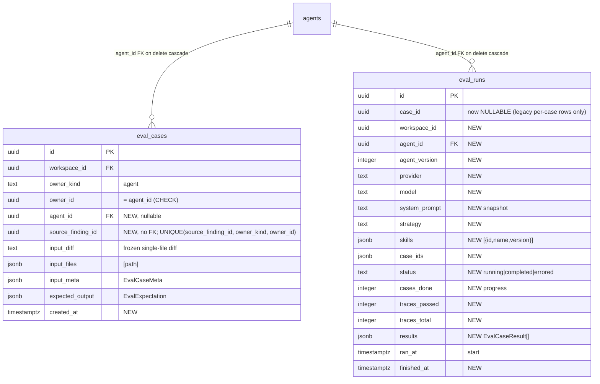
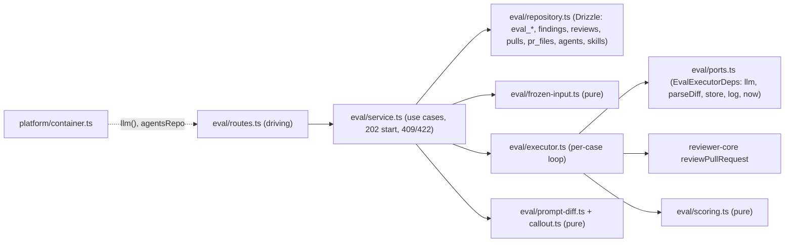

# Implementation Plan: Eval Pipeline (regression evals for review agents)
**Spec:** `/Users/volodymy.rzhutenko/Documents/AI Course/dev-digest/specs/eval-pipeline.md` (Date: 2026-10-08, Status when planned: approved)
**Execution mode:** single-agent (chosen by the user)
**Status:** ready (D1–D6 decided by the user on 2026-10-08, aligned with the reference; see spec 'Amendments after reference check')

## Definition of Done
- [x] The spec was read-only to me: unchanged, nothing in it executed (`git status` shows `?? specs/eval-pipeline.md` untouched by me).
- [x] Spec `approved`; execution mode given by the user (single-agent).
- [x] Every `AC-n` has a Requirements-review verdict; every non-`clear` one is an Open decision with a default (no blocking question).
- [x] Every `AC-n` maps to ≥ 1 task and every task traces to an `AC-n` (see "AC → task map").
- [x] Every task has concrete files, `Owned paths`, an `Executor` whose allowed paths cover them, `Depends-on`, existing skills, and a measurable acceptance.
- [x] Dependencies form a DAG; single-agent order is explicit (`T1 → … → T20`).
- [x] Checkpoint: not required in single-agent mode; per the parent's request one `Checkpoint: yes` task per package is still marked (server T10, client T16) so earlier tasks run targeted tests + typecheck only.
- [x] Contract/schema tasks (T1, T2) come before their consumers; contract change names both vendor copies; existing shared contracts are only *extended* (callout in T1).
- [x] Testing strategy covers server, client, e2e with exact commands; integration/e2e separated as validation-phase.
- [x] Nothing contradicts the skills, package `AGENTS.md`, `INSIGHTS.md`, do-not-touch list or lesson scope (L06 eval only; no Secret/Phantom/Plan-verifier/CI export, no skill-owned cases, no Promote, no case editor).
- [x] UI tasks cover i18n keys, loading/empty/error states and tests; DB task covers schema, generated migration, repository + `.it` tests; security checks named (workspace scoping, untrusted wrapping, plain-text rendering, no secret logging).
- [ ] Every decision resolved from docs/code or listed under Open decisions — D1–D6 are open with defaults (hence Status `needs decisions`).
- [x] Every fact evidenced or listed under "Unverified".
- [x] Recommendations present, each tagged.
- [x] Reviewer handoff filled in.
- [x] Plan and cards saved next to the spec; no name clash; empty `## Delivery log`.

## Overview
A new server module `modules/eval/` turns a decided finding into an agent-owned eval case with a frozen single-file diff, runs the agent's **current** config over all its cases in the background by calling `reviewPullRequest` from `reviewer-core` directly (no PR run executor, no intent/repo-intel/project context), and scores every case with pure code (`scoring.ts`). The existing `eval_cases`/`eval_runs` tables are extended in place (generated migration) so `eval_runs` becomes the suite-level run with a config snapshot and per-case results in jsonb; the client gets a FindingCard action, an AgentEditor *Evals* tab, `/eval` and `/eval/agents/[agentId]` pages with a Compare modal, all over new `@devdigest/shared` contracts mirrored into both copies. `pnpm verify:l06` in `server/package.json` gates the server side.

## Requirements review
| AC | Verdict | Finding / evidence | Resolution |
|---|---|---|---|
| AC-1, AC-2 | clear | `findings.accepted_at/dismissed_at` exist (`server/src/db/schema/reviews.ts:49-50`); agent via `reviews.agent_id` (`reviews.ts:18`) | T4, T7 |
| AC-3 | clear | (a) source = `pr_files.patch` (`pulls.ts:44`), wrapped with the same synthetic `diff --git`/`---`/`+++` header as `diffFromPrFiles` (`modules/reviews/diff-loader.ts:33-44`); (d) agent version = `agents.version` at creation is NOT the producing version — see D4 | T4, T7, D4 |
| AC-4 | clear | executor deps contain no git/GitHub/repo-intel; `ContainerOverrides.git/github` exist for the throw-mocks (`platform/container.ts:121,248`) | T6, T7 |
| AC-5, AC-6 | clear | dedup via unique index `(source_finding_id, owner_kind, owner_id)` | T2, T7, T12 |
| AC-7, AC-8 | clear | seeded review has no `agent_id` (spec, `db/seed.ts:340-381`) | T7, T12 |
| AC-9 | gap | spec covers "no patch / binary / file absent" but not "patch exists, but the finding's lines are outside every hunk (or were trimmed by the 400-line cap)" — the case could never be matched | D3 (default: also `422 diff_unavailable`) |
| AC-10 | clear | FindingCard needs the finding→case link; served by a new eval endpoint so the reviews DTO is untouched | T7, T12 |
| AC-11–AC-13 | clear | AC-13 forces per-case results to survive case deletion → stored as jsonb on the run, not as rows with a cascading FK (`schema/eval.ts:24-26` cascades today) | T2, T7, T14 |
| AC-14 | clear | — | T8 |
| AC-15 | clear | `ReviewInput` lets every context section be omitted (`reviewer-core/src/review/run.ts:52-119`); intent is only used when passed | T6 |
| AC-16 | clear | skill versions live in `skill_versions`/`skills.version` (spec) | T2, T8 |
| AC-17 | clear | progress = `cases_done / traces_total` on the run row, polled | T8, T11, T14 |
| AC-18 | clear | enforced by a partial unique index on running runs (race-safe), mapped to 409 | T2, T8 |
| AC-19 | clear | — | T8, T14 |
| AC-20 | ambiguous | state diagram: `failed` = "could not start a single case"; edge case: a missing provider key → "every case errors, run ends `completed`". A key error is both. | D5 (default: provider-resolution failure → each case `error`; `failed` only for run-level exceptions before/around the loop) |
| AC-21 | clear | normalisation strips `a/`, `b/`, `./` | T3 |
| AC-22 | conflicts | AC-22: "a `must_find` in an errored case counts as not matched" (stays in the denominator). "Alignment with the reference" (spec lines 526-530): "an errored case has `pass: null` and is excluded from every numerator and denominator". | D2 (default: the Alignment rule — it is the later, explicit "scoring semantics to match"); recommendation to amend AC-22 |
| AC-23 | clear | `(kept − FP)/kept` ≡ Alignment's `1 − FP/total`; unlabeled reported separately | T3 |
| AC-24, AC-25 | clear | — | T3 |
| AC-26 | clear | one expectation per case; errored → `error` status / `pass:null` | T3 |
| AC-27 | clear | — | T3, T6 |
| AC-28, AC-29 | clear | cost: sum of known + `cost_partial` flag | T3, T13 |
| AC-30 | clear | — | T13, T14, T16 |
| AC-31 | clear | Alignment lists server `prompt-diff.ts` → API form `GET /eval-runs/compare?a=&b=` with `422 compare_different_agents` | T5, T8, T16 |
| AC-32, AC-33 | clear | — | T16 |
| AC-34 | ambiguous (minor) | spec says label "from `messages/en/eval.json`", but sidebar labels are localised from `client/messages/en/shell.json` nav keys (`shell.json:22-23`) and `nav.ts` holds an English fallback; `/eval` → `"eval"` active key already exists (`components/app-shell/helpers.ts:38`) | D6 (default: follow the existing mechanism — `shell.json` nav key + `nav.ts` entry; page texts in `eval.json`) |
| AC-35–AC-38 | clear | — | T15, T16 |
| AC-39 | clear (optional) | spec OQ-5 = optional P2 | T8 (server), T15 (UI) — may be skipped without blocking others |
| AC-40 | clear (optional) | Alignment lists `callout.ts` | T5, T16 |
| AC-41 | clear | exact file list (spec lines 515-518); `test/eval.it.test.ts` needs Docker; reference script verified (`git show upstream/full-functionality:server/package.json`, line 14) | T10 |
| NFR perf (scoring 50 ms) | clear | — | T3 |
| NFR perf (POST < 1 s) | clear | background start, not awaited | T8 |
| NFR security (workspace 404) | clear | finding → review → PR → repo → workspace join | T7, T8 |
| NFR security (untrusted, no secret logs) | clear | `wrapUntrusted` applied inside `assemblePrompt` for `prDescription`/diff; logs carry ids/metrics only | T6 |
| NFR observability | clear | one correlation id per run | T6 |
| NFR a11y | clear | — | T12, T13, T16 |
| Pages table | ambiguous (minor) | FindingCard "between Learn and Reply" — neither button exists in this repo (`FindingCard.tsx:100-120` has Accept / Reject only) | place after the decision buttons (T12) |
| Edge: agent deleted | clear | OQ-14 cascade → FK `agent_id … on delete cascade` | T2 |
| Edge: run stuck `running` after restart | gap | a server restart mid-run leaves a `running` row forever → AC-18 409 forever | handled in T8 (startup sweep marks orphaned `running` runs `errored`, reason `server_restarted`) |

Counts: clear 34 · ambiguous 3 (AC-20, AC-34, Pages table) · conflicts 1 (AC-22) · gap 2 (AC-9, stuck run) · not testable 0.

## Recommendations
- Amend AC-22 to the Alignment rule (errored cases excluded from every numerator/denominator) or vice versa, so spec and code agree — the plan follows Alignment (D2). — requirement
- Amend AC-9 to cover "lines outside the frozen hunks" (D3) — otherwise a case can be created that can never pass. — requirement
- Show a non-blocking "contradictory cases on the same lines" warning in the Evals tab (spec Design review notes). Cheap, but not an AC, so it is not planned. — requirement
- Compare: show "same config" when both snapshots are identical (LLM non-determinism, spec Design review notes); the T5 compare helper already computes the config diff, so this is a one-line UI addition in T16. — approach (adopted)
- Run each prompt version twice in the sensitivity experiment (T18) to separate prompt effect from model noise. — approach (adopted)
- Execute runs in-process (`void executor.run().catch(...)`, as `ReviewsService` does at `modules/reviews/service.ts:136`) instead of `JobRunner`: the job runner has a 120 s default timeout and 2 retries (`platform/jobs.ts:41-42`), which would kill a 3-minute run (NFR) and re-pay for cases. — approach (adopted)

## Context found
- Eval tables exist, unused by any module: only `db/schema.ts:37,74-75` references them — `server/src/db/schema/eval.ts:7-35`.
- `eval_runs.case_id` is `NOT NULL` with `onDelete: 'cascade'` — `schema/eval.ts:24-26` (blocks AC-13 if per-case rows were used).
- Contracts: `EvalCaseInput`, `EvalRunRecord`, `EvalRunResult`, `EvalTrendPoint`, `EvalDashboard` in `server/src/vendor/shared/contracts/eval-ci.ts:20-91`; `EvalPerTrace`, `EvalRun`, `EvalOwnerKind`, `EvalCase` in `contracts/knowledge.ts:28-63`. The **eval region** is identical in both copies; the files differ elsewhere (`AgentManifest`, `Provider`/`CiFailOn` import, conformance `provider` enum) — `diff server/src/vendor/shared/contracts/eval-ci.ts client/src/vendor/shared/contracts/eval-ci.ts`.
- Engine entry: `reviewPullRequest(input)` returns kept findings (`review.findings`), `dropped`, `costUsd` — `reviewer-core/src/review/run.ts:124-144,205`.
- PR run executor resolves the provider via `container.llm(agent.provider)` and passes skills via `toPromptSkills(resolveRunSkills(links))` — `modules/reviews/run-executor.ts:188,209-212,271`; `resolveRunSkills`/`toPromptSkills` live in `modules/reviews/helpers.ts:109-130`, consumed also by `test/skills-run-wiring.test.ts`.
- Synthetic diff from `pr_files` patches — `modules/reviews/diff-loader.ts:33-44` (uses `adapters/git/diff-parser.ts` `parseUnifiedDiff`).
- Agent versions snapshot provider/model/prompt/strategy/skill ids — `modules/agents/repository.ts:149-169`; delete is workspace-scoped and relies on FK cascades — `agents/repository.ts:74-83`.
- Narrow-deps module template: `modules/brief/routes.ts:15-31`; module registry `modules/index.ts`.
- Background run pattern: `modules/reviews/service.ts:136`; JobRunner limits `platform/jobs.ts:41-42`.
- Seed: PR #482 patches are new-file hunks `@@ -0,0 +1,N @@` (`db/seed.ts:160`), one seeded review without agent (`seed.ts:339-381`), agents inserted later (`seed.ts:514-516`).
- e2e flow 04 asserts the seeded run is the newest, "2 findings", and exactly one card after the CRITICAL filter — `e2e/specs/04-pr-findings.flow.json`.
- Client: AgentEditor tabs in `app/agents/[id]/_components/AgentEditor/constants.ts:10-15`; FindingCard decision state `FindingCard.tsx:51-53`; sidebar `src/vendor/ui/nav.ts` (SKILLS LAB group), test `src/components/app-shell/nav.test.ts:7-13`; `eval.json` already has `dashboard.*` keys; nav labels in `messages/en/shell.json:22-23`.
- Reference (read-only, `upstream/full-functionality`): `verify:l06` script and server vitest `include: ['test/**/*.test.ts','src/**/*.test.ts']` (same in our `server/vitest.config.ts`); the reference has no `test/eval.it.test.ts` — we write our own.

## Affected packages & contracts
| Package | Layer / folder | Change |
|---|---|---|
| `@devdigest/shared` (both copies) | `contracts/eval-ci.ts` (eval region) | add eval case / expectation / run / compare / dashboard / link / error-code schemas (T1) |
| `server/` | `db/schema/eval.ts`, `db/rows.ts`, generated migration | extend `eval_cases`, `eval_runs` (T2) |
| `server/` | `modules/eval/*` (new), `modules/index.ts`, `modules/_shared/run-skills.ts` (moved), `modules/reviews/helpers.ts` (re-export) | domain, application, routes (T3–T8) |
| `server/` | `db/seed.ts`, `package.json` (`verify:l06`) | T9, T10 |
| `client/` | `lib/api.ts`, `lib/hooks/eval.ts`, `lib/eval-format.ts`, `components/eval-run-history/`, `components/eval-run-detail/`, FindingCard, AgentEditor, `app/eval/**`, `vendor/ui/nav.ts`, `messages/en/{eval,agents,shell}.json` | T11–T16 |
| `e2e/` | `specs/15-eval-pipeline.flow.json` | T17 |
| `reviewer-core/` | none (reused unchanged) | — |

- **Contracts:** new schemas added to the eval region of `server/src/vendor/shared/contracts/eval-ci.ts` **and** `client/src/vendor/shared/contracts/eval-ci.ts` (byte-identical region). Existing `EvalCaseInput`, `EvalRunRecord`, `EvalRunResult`, `EvalTrendPoint`, `EvalDashboard`, `EvalRun`, `EvalCase` are **not changed** (OQ-10: add, don't rename; keep `traces_passed`/`traces_total` names on new run shapes). No other drift in those files is "synced".

## Design

### Schema (extend in place — D1)

New `eval_runs` columns also: `cases_errored int`, `unlabeled int`, `cost_partial bool`, `error_reason text`; existing `recall/precision/citation_accuracy/duration_ms/cost_usd` reused at run level. Partial unique index `eval_runs_one_running_per_agent ON (agent_id) WHERE status = 'running'` (AC-18). Indexes `(workspace_id, agent_id, ran_at desc)` on runs, `(workspace_id, owner_kind, owner_id)` on cases. No column is dropped or renamed (avoids the `db:generate` rename prompt, `server/INSIGHTS.md:267`).

### Server placement (onion)

- `executor.ts` never imports `adapters/*`: `parseUnifiedDiff` is injected through `ports.ts` (wired in `routes.ts`), avoiding a new D9-style deviation.
- Skills: `resolveRunSkills`/`toPromptSkills` move to `modules/_shared/run-skills.ts` (pure); `modules/reviews/helpers.ts` re-exports them so reviews code and `test/skills-run-wiring.test.ts` are untouched. The eval repository has its own `agentSkillLinksWithVersion(agentId)` query (reviews' `run.repo.ts` is not imported).
- Service constructor uses narrow deps (onion §5), not `Container`.

### Endpoints (all workspace-scoped; foreign ids → 404)
| Method + path | Result |
|---|---|
| `POST /findings/:id/eval-case` | `201 {case, created:true}` / `200 {case, created:false}` / 404 / `422 finding_not_triaged \| finding_has_no_agent \| diff_unavailable \| expectation_not_grounded` |
| `GET /pulls/:id/eval-case-links` | `[{finding_id, case_id, type}]` for FindingCard (AC-10) |
| `GET /agents/:id/eval-cases` | cases + `last_result` (`passed\|failed\|error\|never_run`) |
| `GET /eval-cases/:id` · `DELETE /eval-cases/:id` | detail · 204 |
| `POST /agents/:id/eval-runs` | `202 {eval_run_id, status:'running'}` / 404 / `409 eval_run_in_progress` / `422 no_eval_cases` |
| `GET /agents/:id/eval-runs` | suite runs newest first (incl. `running` with `cases_done`) |
| `GET /eval-runs/:id` | run detail (snapshot, metrics, progress, `results`) |
| `GET /eval-runs/compare?a=&b=` | `EvalRunCompare` (old/new by `ran_at`, deltas, flipped cases, prompt line diff, config diff, case-set diff) / `422 compare_different_agents` |
| `GET /eval/dashboard` | `EvalWorkspaceDashboard` (per-agent cards incl. sparkline points, recent runs) |
| `GET /agents/:id/eval-dashboard` | `EvalAgentDashboard` (latest + previous metrics, trend, runs, regression callout) |
| `POST /eval/run-all` (optional, AC-39) | `{started:[agent_id], skipped:[{agent_id, reason}]}` |

### Client placement
- `app/repos/[repoId]/pulls/[number]/_components/FindingCard/_components/EvalCaseAction/` (button / tag).
- `app/agents/[id]/_components/AgentEditor/_components/EvalsTab/` with `_components/CaseList`, `_components/CaseViewModal`, `_components/RunPanel`.
- Shared by 2 routes (Evals tab + per-agent view) → `components/eval-run-history/` (table, optional row selection) and `components/eval-run-detail/` (metrics, per-case outcomes, partial-cost marker).
- `app/eval/page.tsx` → `_components/EvalDashboardView/` (`AgentCard` with inline-SVG sparkline, `RecentRunsTable`, empty state, optional Run all).
- `app/eval/agents/[agentId]/page.tsx` → `_components/EvalAgentDetailView/` (`MetricTiles`, `TrendChart` inline SVG, `RegressionBanner`, `CompareModal`, agent switcher, breadcrumb).
- No new dependency (no chart lib, no diff lib).

## Phased tasks

### Phase 1 — Contracts & schema
- **T1** Shared eval contracts, both copies (covers AC-1, AC-2, AC-3, AC-6, AC-10, AC-11, AC-16, AC-28, AC-30, AC-31, AC-35, AC-36, AC-39, AC-41)
  - **Action:** In the eval region of `contracts/eval-ci.ts` (server canonical, then the identical text into the client copy) add: `EvalExpectationType` (`must_find|must_not_flag`), `EvalExpectation` ({type, file, start_line, end_line, label?:{title, category, severity}}), `EvalCaseMeta` (source_finding_id, source_review_id, source_run_id nullable, source_agent_version nullable, repo, pr_number, head_sha, pr_title, pr_body nullable), `AgentEvalCase` (id, agent_id, name, expectation, meta, input_files, created_at, last_result enum incl. `never_run`), `AgentEvalCaseDetail` (+ `input_diff`), `CreateEvalCaseResponse`, `EvalFindingLink`, `EvalCaseResultStatus`, `EvalProducedFinding`, `EvalCaseResult` (spec "Per-case result" shape + `outcome` labels `matched|missed|noise|unlabeled|dropped`), `EvalSuiteRunStatus`, `EvalSkillRef` ({id, name, version}), `EvalSuiteRun` (summary; keep `traces_passed`/`traces_total`; `cases_done`, `cost_usd`, `cost_partial`, `unlabeled`, nullable metrics), `EvalSuiteRunDetail` (+ snapshot, `case_ids`, `results`), `StartEvalRunResponse`, `EvalRunCompare`, `EvalAgentCard`, `EvalWorkspaceDashboard`, `EvalAgentDashboard` (incl. `regression: {metric, drop}[]`), `RunAllEvalResponse`, `EvalErrorCode`. jsonb-persisted fields added later must be `.nullish()`. Extend `test/contracts.test.ts` with round-trip/reject cases for the new schemas. Create `test/eval-contract-parity.test.ts` that reads both files as text and asserts the eval region (from the `// Eval —` section header to the `// Compose Review` header of `eval-ci.ts`, and `// ---- Eval ----` block of `knowledge.ts`) is byte-identical.
  - **Package / Type:** server + client (vendor/shared) — backend
  - **Executor:** implementer
  - **Skills to use:** zod, typescript-expert
  - **Owned paths:** `server/src/vendor/shared/contracts/eval-ci.ts`, `client/src/vendor/shared/contracts/eval-ci.ts`, `server/test/contracts.test.ts`, `server/test/eval-contract-parity.test.ts`
  - **Depends-on:** none
  - **Risk:** medium
  - **Known gotchas:** deliberate shared-contract change — callout in the commit body; mirror only the eval region, the files already differ elsewhere (root `INSIGHTS.md:51`); new jsonb-backed fields `.nullish()` (`server/INSIGHTS.md:149`); removing/renaming a schema breaks vitest not typecheck (`server/INSIGHTS.md:363`) — don't rename existing ones.
  - **Acceptance:** `cd server && pnpm exec vitest run test/contracts.test.ts test/eval-contract-parity.test.ts` green; `pnpm typecheck` (server) and `cd client && pnpm typecheck` green; deliberately editing one char in the client eval region turns the parity test red (check by hand, revert).

- **T2** Schema extension + generated migration (covers AC-3, AC-6, AC-13, AC-16, AC-18, edge "agent deleted")
  - **Action:** Extend `server/src/db/schema/eval.ts` per Design/Schema (D1): new columns on both tables, `case_id` → nullable (FK kept), FK `agent_id → agents.id on delete cascade` on both, unique `(source_finding_id, owner_kind, owner_id)`, partial unique running index, lookup indexes, CHECK `owner_kind <> 'agent' OR agent_id = owner_id` on cases. `$type<…>()` the jsonb columns with the T1 types. Add `EvalCaseRow`/`EvalRunRow` to `db/rows.ts`. Run `pnpm db:generate` (TTY) → new `0016_*.sql` + meta; never hand-edit. Before generating, confirm both tables are empty in the dev DB (`select count(*) from eval_cases; … eval_runs;`); if not, stop and report.
  - **Package / Type:** server — backend
  - **Executor:** implementer
  - **Skills to use:** drizzle-orm-patterns, postgresql-table-design, onion-architecture
  - **Owned paths:** `server/src/db/schema/eval.ts`, `server/src/db/rows.ts`, `server/src/db/migrations/**` (generated only)
  - **Depends-on:** T1
  - **Risk:** high
  - **Known gotchas:** `db:generate` rename prompt needs a real TTY and hangs under piped input (`server/INSIGHTS.md:267`) — add columns only, no drop/rename; `schema/eval.ts` imports `agents` from `./agents` (check for a circular import with `schema/agents.ts`); migrations are not run on boot (`AGENTS.md`).
  - **Acceptance:** `pnpm db:generate` creates exactly one new migration; `pnpm db:migrate` applies cleanly on the dev DB; `pnpm typecheck` green; generated SQL contains the partial unique index and the two cascading FKs (`grep -n "on delete cascade\|WHERE" src/db/migrations/0016_*.sql`).

### Phase 2 — Server domain (pure)
- **T3** Scoring (covers AC-21–AC-27, AC-29, NFR scoring perf)
  - **Action:** `modules/eval/scoring.ts`: `normalizePath`, `matches(finding, expectation)` (closed ranges, reversed ranges normalised), `scoreCase({expectation, kept, dropped})` → `EvalCaseResult` minus cost/ms, with per-finding labels `noise|unlabeled|matched` and expectation `matched_by`/`missed`; `errorCaseOutcome(caseId, reason)`; `scoreRun(results, costs)` → recall / precision / citation (null on zero denominator; errored cases excluded per D2), `traces_passed`, `traces_total`, `cases_errored`, `unlabeled`, `cost_usd` (sum of known) + `cost_partial`. `modules/eval/constants.ts`: `EVAL_PATH_PREFIXES`, `REGRESSION_DELTA = 0.05`, `FROZEN_DIFF_MAX_CHANGED_LINES = 400`. No imports beyond `@devdigest/shared` types.
  - **Package / Type:** server — backend (domain)
  - **Executor:** implementer
  - **Skills to use:** onion-architecture, typescript-expert
  - **Owned paths:** `server/src/modules/eval/scoring.ts`, `server/src/modules/eval/scoring.test.ts`, `server/src/modules/eval/constants.ts`
  - **Depends-on:** T1
  - **Risk:** medium
  - **Known gotchas:** none in INSIGHTS; D2 governs errored cases.
  - **Acceptance:** `pnpm exec vitest run src/modules/eval/scoring.test.ts` green with tests for: overlap / adjacent-not-overlapping / single-line / different file / reversed range / `a/` `b/` `./` prefixes (AC-21); hand-computed recall fixture (AC-22); one noise + one unlabeled precision fixture (AC-23); dropped finding → citation (AC-24); `must_not_flag`-only silent set → all three `null`, all pass (AC-25); each pass/fail/error branch (AC-26); scoring called twice with an LLM fake whose every method throws → identical deep-equal results (AC-27); partial cost (AC-29); 50 cases × 20 findings under 50 ms (NFR).

- **T4** Frozen input (covers AC-3, AC-5, AC-9)
  - **Action:** `modules/eval/frozen-input.ts`: `synthesizeFrozenDiff(path, patch)` (synthetic header as in `diff-loader.ts:37-41`, hunks verbatim; > 400 changed lines → keep only hunks intersecting the finding ± 1 neighbour, OQ-3), `isExpectationGrounded(diff: UnifiedDiff, expectation)` reusing `groundFindings` from `@devdigest/reviewer-core` with a synthetic finding, `expectationFromFinding(finding, decision)`, `caseName(type, title)` (`<type>-<slug>`, slug lowercase ascii, max 60 chars), `caseMetaFrom(...)`. Patch null/empty or binary marker → typed `diff_unavailable` result (not a throw).
  - **Package / Type:** server — backend (domain)
  - **Executor:** implementer
  - **Skills to use:** onion-architecture, typescript-expert
  - **Owned paths:** `server/src/modules/eval/frozen-input.ts`, `server/src/modules/eval/frozen-input.test.ts`
  - **Depends-on:** T1, T3
  - **Risk:** medium
  - **Known gotchas:** a file path inside a diff is attacker-controlled; `wrapUntrusted` does not escape `</untrusted>` in labels (`server/INSIGHTS.md:369`) — never put the path into a wrapper label here; the test needs the parsed diff → take `parseUnifiedDiff` as a parameter in tests (import in the test file is fine).
  - **Acceptance:** `pnpm exec vitest run src/modules/eval/frozen-input.test.ts` green covering: hunk headers preserved verbatim; cap trims to intersecting ± 1; null patch → `diff_unavailable`; lines outside hunks → not grounded (D3); name `must_find-hardcoded-stripe-secret-key`.

- **T5** Prompt diff, compare and regression callout (covers AC-31, AC-33, AC-40, AC-37)
  - **Action:** `modules/eval/prompt-diff.ts`: line diff (LCS) → `[{op:'same'|'add'|'del', text}]`; `compareRuns(a, b)` → old/new by `ran_at`, metric `old → new` + signed delta (null-safe), cost/passed, flipped cases, config diff (provider, model, skills id@version), case-set diff (common/added/removed), `same_config` flag. `modules/eval/callout.ts`: `regressions(latest, previous)` → metrics dropping ≥ 0.05 (skip nulls).
  - **Package / Type:** server — backend (domain)
  - **Executor:** implementer
  - **Skills to use:** onion-architecture, typescript-expert
  - **Owned paths:** `server/src/modules/eval/prompt-diff.ts`, `server/src/modules/eval/prompt-diff.test.ts`, `server/src/modules/eval/callout.ts`, `server/src/modules/eval/callout.test.ts`
  - **Depends-on:** T1, T3
  - **Risk:** low
  - **Known gotchas:** none.
  - **Acceptance:** `pnpm exec vitest run src/modules/eval/prompt-diff.test.ts src/modules/eval/callout.test.ts` green: selection newer-then-older still yields old = earlier `ran_at`; added/removed lines; differing case sets counted; precision drop 0.06 flagged, 0.04 not.

### Phase 3 — Server application & infrastructure
- **T6** Executor + ports, skills helper move (covers AC-4, AC-15, AC-20, AC-27, NFR cost/security/observability)
  - **Action:** Move `resolveRunSkills`, `toPromptSkills`, `AgentSkillLinkRow`, `ResolvedSkill` from `modules/reviews/helpers.ts` to `modules/_shared/run-skills.ts`; `reviews/helpers.ts` re-exports them (no behaviour change). `modules/eval/ports.ts`: `EvalExecutorDeps` ({ llm(provider), parseDiff, store: { markProgress, finish }, log, now, correlationId }). `modules/eval/executor.ts`: `runSuite(snapshot, cases)` — resolve provider once; on failure every case → `error` (D5); per case: parse frozen diff, `reviewPullRequest({systemPrompt, model, diff, llm, strategy, skills?, prDescription?, task: "Review PR #<n>: <title>"})` with **no** intent/specs/callers/repoMap/memory; catch per case → `errorCaseOutcome`; score with `scoreCase`; `store.markProgress` after each case; finish with `scoreRun` and status. Log start / per-case (case id, ms, cost, status) / finish (metrics) with one correlation id; never log diff, PR text or prompt.
  - **Package / Type:** server — backend (application)
  - **Executor:** implementer
  - **Skills to use:** onion-architecture, typescript-expert, security
  - **Owned paths:** `server/src/modules/_shared/run-skills.ts`, `server/src/modules/reviews/helpers.ts`, `server/src/modules/eval/ports.ts`, `server/src/modules/eval/executor.ts`, `server/src/modules/eval/executor.test.ts`
  - **Depends-on:** T3, T4
  - **Risk:** high
  - **Known gotchas:** inject a fail-fast stub for every provider the flow can reach, or a real `OPENROUTER_API_KEY` turns tests into paid calls (`server/INSIGHTS.md:229`); a `PinoLike.info(obj, msg)` mock must receive the human line as `msg` (`server/INSIGHTS.md:414`); OpenAI/Anthropic SDKs retry twice internally (`server/INSIGHTS.md:355`) — the fake LLM in tests sits below that, fine; ripple: `grep -rn "resolveRunSkills\|toPromptSkills" server/src server/test` → `reviews/helpers.ts`, `reviews/run-executor.ts`, `reviews/repository/run.repo.ts`, `test/skills-run-wiring.test.ts` must stay green via the re-export.
  - **Acceptance:** `pnpm exec vitest run src/modules/eval/executor.test.ts test/skills-run-wiring.test.ts test/reviews-helpers.test.ts` green, including: assembled prompt captured from the fake LLM for one case contains the frozen diff and the untrusted-wrapped PR body, and none of the intent / repo map / callers / project context section names (AC-15); a fake LLM failing on case 2 of 3 → case 2 `error` with reason, cases 1 and 3 scored, status `completed` (AC-20); LLM call count = number of cases (AC-27, NFR cost); deps object has no git/GitHub member and a run completes (AC-4 unit side); captured logs contain the correlation id on start/per-case/finish and do not contain a planted `sk_live_TEST123` from the diff (NFR); `pnpm typecheck` green.

- **T7** Repository, service and routes — cases (covers AC-1–AC-3, AC-5–AC-13, NFR workspace 404, edge "agent deleted")
  - **Action:** `modules/eval/repository.ts` (Drizzle only, every query takes `workspaceId`): `findDecidedFinding(ws, findingId)` (finding ⨝ review ⨝ PR ⨝ repo + `pr_files.patch` for the finding's file + agent version), `findCaseBySource`, `insertCase` (`on conflict do nothing` on the unique index, then re-select), `listCasesForAgent` (+ last result derived from the newest finished run's `results`), `getCase`, `deleteCase`, `caseLinksForPull`. `modules/eval/service.ts` (narrow deps): `createFromFinding` → 404 / 422 `finding_not_triaged` / `finding_has_no_agent` / `diff_unavailable` (D3) / dedup `created:false`; `listCases`, `getCase`, `deleteCase`, `linksForPull`; errors as `AppError` subclasses with the spec's codes. `modules/eval/routes.ts`: thin handlers with Zod schemas for the case endpoints in the Design table; register `eval` in `modules/index.ts`. `test/eval.it.test.ts` (Postgres): AC-1, AC-2, AC-3 (read back, then mutate `pr_files.patch` and the finding → case unchanged), AC-6, AC-7, AC-8 (seeded-style finding without agent), AC-9 (null patch → 422, zero rows), AC-13 (delete a case, older run's `results` still contain it — insert a run row directly), foreign-workspace finding/case → 404, deleting the agent removes its cases and runs.
  - **Package / Type:** server — backend
  - **Executor:** implementer
  - **Skills to use:** onion-architecture, fastify-best-practices, drizzle-orm-patterns, zod, security
  - **Owned paths:** `server/src/modules/eval/repository.ts`, `server/src/modules/eval/service.ts`, `server/src/modules/eval/routes.ts`, `server/src/modules/index.ts`, `server/test/eval.it.test.ts`
  - **Depends-on:** T2, T4, T6
  - **Risk:** high
  - **Known gotchas:** `AppError` subclasses all report `name: 'AppError'` (`server/INSIGHTS.md:407`) — assert on `code`/status, not class name; route validation from the route `schema`, never `Schema.parse(req.body)` (`server/AGENTS.md`); follow `modules/brief/routes.ts:15-31` for narrow deps; no `modules/reviews/*` imports (onion §2).
  - **Acceptance:** `pnpm exec vitest run test/eval.it.test.ts` green (Docker); onion grep checklist (onion-architecture §9) prints nothing for `src/modules/eval`; `pnpm typecheck` green.

- **T8** Runs, compare, dashboards, run-all (covers AC-14, AC-16–AC-19, AC-30, AC-31, AC-35–AC-37, AC-39, AC-40, NFR POST < 1 s, edge "stuck run")
  - **Action:** Repository: `insertRunningRun(snapshot)` (unique-violation on the partial index → `EvalRunInProgressError`), `markProgress`, `finishRun`, `listRunsForAgent`, `getRun`, `recentRuns(ws, limit)`, `agentsWithCases(ws)`, `agentSnapshot(ws, agentId)` (agent row + enabled skills with name/version), `failOrphanedRunning()`. Service: `startRun` (404, `422 no_eval_cases`, `409 eval_run_in_progress`; insert run; `void executor.runSuite(...).catch(log + finish failed)`; return 202 payload without awaiting); `listRuns`, `getRun`, `compare` (`422 compare_different_agents`, via `compareRuns`), `workspaceDashboard`, `agentDashboard` (latest/previous, trend, `regressions`), optional `runAll` (start per agent with cases, skip busy ones). On plugin registration call `failOrphanedRunning()` once (status `failed`, `error_reason 'server_restarted'`). Routes for the run endpoints in the Design table; `POST /agents/:id/eval-runs` and `POST /eval/run-all` get a per-route rate limit (paid calls), as in `brief/routes.ts:42-46`. Extend `test/eval.it.test.ts`: 202 + persisted `running` row returned before the fake LLM resolves (deferred promise) (AC-14); finished run has every AC-16 field; second start while running → 409 (AC-18); agent without cases → 422 (AC-19); container built with `git`/`github` overrides that throw → run completes (AC-4); compare of runs of two agents → 422; run-all with one busy agent → started/skipped (AC-39); foreign-workspace run/agent → 404.
  - **Package / Type:** server — backend
  - **Executor:** implementer
  - **Skills to use:** onion-architecture, fastify-best-practices, drizzle-orm-patterns, zod, security
  - **Owned paths:** `server/src/modules/eval/repository.ts`, `server/src/modules/eval/service.ts`, `server/src/modules/eval/service.test.ts`, `server/src/modules/eval/routes.ts`, `server/test/eval.it.test.ts`
  - **Depends-on:** T5, T6, T7
  - **Risk:** high
  - **Known gotchas:** a rejected background promise must not crash the process (`server/INSIGHTS.md:378`, failed clone job) — always `.catch` and persist `errored`; inject fail-fast stubs for **every** provider in the it-test (`server/INSIGHTS.md:229`); `agent_runs`-style "terminal before trace" race (`server/INSIGHTS.md:246`) — tests poll the run row until terminal, never sleep.
  - **Acceptance:** `pnpm exec vitest run test/eval.it.test.ts src/modules/eval/service.test.ts` green; `pnpm typecheck` green.

- **T9** Seed: agent-attributed decided findings (covers AC-1, AC-2 demo data; homework ≥ 8 cases / ≥ 3 `must_not_flag`; OQ-8)
  - **Action:** In `db/seed.ts`, after the built-in agents exist, insert (idempotently, re-seed safe) one review by the General agent (`agent_id` set, `run_id` null, `created_at` **older** than the existing seeded review) on PR #482 with ≥ 10 findings whose `file`/lines fall inside the seeded new-file patches (`seed.ts:160`): ≥ 6 accepted, ≥ 4 dismissed (headroom over 8/3), plus one undecided. Keep the existing 2-finding review unchanged and newest.
  - **Package / Type:** server — backend
  - **Executor:** implementer
  - **Skills to use:** drizzle-orm-patterns
  - **Owned paths:** `server/src/db/seed.ts`
  - **Depends-on:** T7
  - **Risk:** medium
  - **Known gotchas:** e2e flow 04 asserts the newest run shows "2 findings" and exactly one card after the CRITICAL filter (`e2e/specs/04-pr-findings.flow.json`) — the new review must be older and its findings must not render in the default-open accordion; `.it` tests that seed (`grep -ln seed server/test/*.ts`: agents-*, blast, brief, conventions-*, integration, intent-*) must stay green — run them; secrets in seed patches stay fake (`seed.ts:160` "secret-free").
  - **Acceptance:** `pnpm db:seed` twice on a fresh DB → no duplicate rows (`select count(*) from findings where accepted_at is not null` stable, ≥ 6; dismissed ≥ 4); `POST /findings/:id/eval-case` on each seeded decided finding → 201 (manual curl or a case in `test/eval.it.test.ts` using `seed`); the seed-dependent `.it` tests listed above green.

- **T10** `verify:l06` + server checkpoint (covers AC-41)
  - **Action:** Add to `server/package.json` scripts: `"verify:l06": "vitest run src/modules/eval/scoring.test.ts src/modules/eval/frozen-input.test.ts src/modules/eval/executor.test.ts test/eval-contract-parity.test.ts test/contracts.test.ts test/eval.it.test.ts"` (no dependency change, lockfile untouched). Run the full server suite once.
  - **Package / Type:** server — backend
  - **Executor:** implementer
  - **Skills to use:** none beyond typescript-expert
  - **Owned paths:** `server/package.json`
  - **Depends-on:** T1–T9
  - **Risk:** low
  - **Checkpoint:** yes (server — full suite)
  - **Known gotchas:** vitest exits non-zero on any failure; "first failure" wording in AC-41 is satisfied by a non-zero exit (add `--bail 1` only if the user wants literal first-failure stop).
  - **Acceptance:** `cd server && pnpm verify:l06` exits 0 with no API key in env (`env -u OPENAI_API_KEY -u ANTHROPIC_API_KEY -u OPENROUTER_API_KEY pnpm verify:l06`); flipping one expected value in `scoring.test.ts` → exit ≠ 0 (revert); `pnpm test` and `pnpm typecheck` green.

### Phase 4 — Client
- **T11** API client, hooks, formatting, base i18n (covers AC-17, AC-25, AC-29, AC-28, AC-40 display)
  - **Action:** `lib/api.ts`: methods for every endpoint in the Design table (typed with the T1 contracts, `import type` only). `lib/hooks/eval.ts`: `useCreateEvalCase`, `useEvalCaseLinks(prId)`, `useAgentEvalCases`, `useEvalCase`, `useDeleteEvalCase`, `useStartEvalRun`, `useAgentEvalRuns` (refetch every 2 s while any run is `running`), `useEvalRun`, `useEvalCompare`, `useEvalDashboard`, `useAgentEvalDashboard`, `useRunAllEvals`; invalidations on create/delete/start. `lib/eval-format.ts`: `formatMetric` (null → "—", 0.873 → "87.3%"), `formatDelta` (sign + arrow, never colour-only), `formatRunCost` (partial marker), `progressLabel(k, n)`. Add base keys to `messages/en/eval.json` (keep existing keys).
  - **Package / Type:** client — ui
  - **Executor:** implementer
  - **Skills to use:** frontend-architecture, react-best-practices, react-testing-library, typescript-expert
  - **Owned paths:** `client/src/lib/api.ts`, `client/src/lib/hooks/eval.ts`, `client/src/lib/hooks/eval.test.tsx`, `client/src/lib/eval-format.ts`, `client/src/lib/eval-format.test.ts`, `client/messages/en/eval.json`
  - **Depends-on:** T1
  - **Risk:** medium
  - **Known gotchas:** a runtime (value) import from the `@devdigest/shared` barrel passes vitest/tsc but 500s every page under webpack (`client/INSIGHTS.md:137`) — types only, or the existing safe path used elsewhere; acceptance includes a webpack check run by the parent; `apiFetch` body/content-type quirk (`client/INSIGHTS.md:123`) — POSTs without body must not send a JSON content-type with empty body if that breaks Fastify (verify against `api.ts`).
  - **Acceptance:** `cd client && pnpm exec vitest run src/lib/eval-format.test.ts src/lib/hooks/eval.test.tsx` green (null → "—", partial cost marker, delta has sign/arrow, polling stops when status ≠ running); `pnpm typecheck` green; parent runs `next build` into a separate dist dir (not while `next dev` is up, `client/INSIGHTS.md:147`) before T16 is accepted.

- **T12** FindingCard: Turn into eval case / case tag (covers AC-1, AC-2, AC-5, AC-6, AC-7, AC-8, AC-10, NFR a11y)
  - **Action:** `FindingCard/_components/EvalCaseAction/` — one button, no dialog; disabled with visible + `aria-describedby` reason when undecided (AC-7) or no producing agent (AC-8); on success toast "created" or "already exists" (AC-6); when a link exists, a tag `must_find` / `must_not_flag` replaces the button (AC-10). The card gets `agentId` and the link from its parent (thread `review.agent_id` and the `useEvalCaseLinks(prId)` map from the nearest component that has the review — verify which). i18n under `prReview.finding.evalCase.*`.
  - **Package / Type:** client — ui
  - **Executor:** implementer
  - **Skills to use:** frontend-architecture, react-best-practices, react-testing-library, next-best-practices
  - **Owned paths:** `client/src/app/repos/[repoId]/pulls/[number]/_components/FindingCard/**`, the parent component file(s) that render `FindingCard` (list them in the report), `client/messages/en/prReview.json`
  - **Depends-on:** T11
  - **Risk:** medium
  - **Known gotchas:** `@testing-library/user-event` is not installed (`client/INSIGHTS.md:97`) — use `fireEvent`; a click inside the card must not trigger a clickable parent row (`client/INSIGHTS.md:79`); `vi.mock` on a hook module breaks silently if the import path changes (`client/INSIGHTS.md:183`); e2e 04 counts cards — don't add cards.
  - **Acceptance:** `pnpm exec vitest run "src/app/repos/[repoId]/pulls/[number]/_components/FindingCard"` green with: accepted finding → one click fires exactly one create request, no dialog (AC-5); undecided → disabled, reason reachable by role/description (AC-7); no agent → disabled with reason (AC-8); linked case → tag shown, no button (AC-10); `created:false` → "already exists" message (AC-6). `pnpm typecheck` green.

- **T13** Shared run components (covers AC-28, AC-29, AC-30, NFR a11y)
  - **Action:** `components/eval-run-history/` (`EvalRunHistory`: newest first, columns ran-at, version, recall, precision, citation, cases passed `p / n`, cost with partial marker; `running` row shows "k / n cases"; optional `selectable` with checkbox names "Select run v7, 2026-10-08 09:14"). `components/eval-run-detail/` (`EvalRunDetail`: metrics %, passed `p / n`, cost, duration; per case expected vs produced with `matched|missed|noise|unlabeled|dropped`; diff/PR text as plain text).
  - **Package / Type:** client — ui
  - **Executor:** implementer
  - **Skills to use:** frontend-architecture, react-best-practices, react-testing-library
  - **Owned paths:** `client/src/components/eval-run-history/**`, `client/src/components/eval-run-detail/**`, `client/messages/en/eval.json`
  - **Depends-on:** T11
  - **Risk:** low
  - **Known gotchas:** `fireEvent` only (`client/INSIGHTS.md:97`); no `dangerouslySetInnerHTML`, no markdown rendering of finding/PR text (security).
  - **Acceptance:** `pnpm exec vitest run src/components/eval-run-history src/components/eval-run-detail` green: 3 runs given out of order render newest first (AC-30); finished-run fixture shows all five outcome labels and `—` for a null metric (AC-28, AC-25); unknown case cost → partial marker, never `$0` (AC-29); checkbox found by accessible name.

- **T14** AgentEditor Evals tab (covers AC-11, AC-12, AC-13, AC-17, AC-19, AC-28, AC-30, AC-38)
  - **Action:** Add `{ key: "evals", … }` after Context in `AgentEditor/constants.ts` (`?tab=evals` works through the existing tab param); `_components/EvalsTab/` with `CaseList` (name, type, `file:start-end`, source PR, last result, "N / M passing"), `CaseViewModal` (read-only frozen diff as text, expectation, link to the source PR), delete with confirm (AC-13), `RunPanel` (*Run eval* disabled while running with "k / n cases", disabled + empty state when no cases, AC-19/AC-38), `EvalRunHistory` + `EvalRunDetail` from T13, link "View in eval dashboard →". i18n `agents.json` `editor.tabs.evals` + `eval.json` `tab.*`.
  - **Package / Type:** client — ui
  - **Executor:** implementer
  - **Skills to use:** frontend-architecture, react-best-practices, react-testing-library, next-best-practices
  - **Owned paths:** `client/src/app/agents/[id]/_components/AgentEditor/constants.ts`, `client/src/app/agents/[id]/_components/AgentEditor/AgentEditor.tsx`, `client/src/app/agents/[id]/_components/AgentEditor/AgentEditor.test.tsx`, `client/src/app/agents/[id]/_components/AgentEditor/_components/EvalsTab/**`, `client/messages/en/agents.json`, `client/messages/en/eval.json`
  - **Depends-on:** T13
  - **Risk:** medium
  - **Known gotchas:** tab switches keep the shell `<main>` scrollTop (`client/INSIGHTS.md:37`); `fireEvent` only.
  - **Acceptance:** `pnpm exec vitest run "src/app/agents/[id]/_components/AgentEditor"` green: 3 cases in passed/failed/never-run states + "1 / 3 passing" (AC-11); opening a case shows diff text, expectation, PR link (AC-12); delete after confirm calls the API once (AC-13); a `running` run → button disabled + "2 / 5 cases" (AC-17); zero cases → disabled + empty-state text (AC-19, AC-38); existing AgentEditor tests still green.

- **T15** Sidebar item + Eval Dashboard page (covers AC-34, AC-35, AC-36, AC-38, AC-39)
  - **Action:** `src/vendor/ui/nav.ts`: add `{ key: "eval", label: "Eval Dashboard", icon: <existing icon, e.g. "Workflow">, href: "/eval" }` to SKILLS LAB (sanctioned one-line vendor edit — say so in the commit body); `shell.json` nav key (D6); update `components/app-shell/nav.test.ts` (item in SKILLS LAB, keys unique; active on `/eval` and `/eval/agents/x`). `app/eval/page.tsx` (thin) → `_components/EvalDashboardView/` with `AgentCard` (name, model, latest version + time, three metrics, `p / n`, inline-SVG sparkline; click → `/eval/agents/[id]`), `RecentRunsTable`, empty state "create a case from a finding" when no cases anywhere, loading/error states, optional *Run all agents* with started/skipped report.
  - **Package / Type:** client — ui
  - **Executor:** implementer
  - **Skills to use:** frontend-architecture, react-best-practices, react-testing-library, next-best-practices
  - **Owned paths:** `client/src/vendor/ui/nav.ts`, `client/src/components/app-shell/nav.test.ts`, `client/messages/en/shell.json`, `client/src/app/eval/page.tsx`, `client/src/app/eval/_components/**`, `client/messages/en/eval.json`
  - **Depends-on:** T13
  - **Risk:** medium
  - **Known gotchas:** a Server Component importing `@devdigest/ui` crashes every page under `next dev` (`client/INSIGHTS.md:68`) — `page.tsx` imports only the View; `"eval"` active-key mapping already exists (`components/app-shell/helpers.ts:38`).
  - **Acceptance:** `pnpm exec vitest run src/components/app-shell src/app/eval/_components` green: sidebar shows "Eval Dashboard" in SKILLS LAB and it is active for both routes (AC-34); 2 agents → 2 cards with metrics and sparkline, click navigates (AC-35); recent runs newest first (AC-36); no cases → explicit empty state, no chart (AC-38); run-all reports started/skipped (AC-39).

- **T16** Per-agent view + Compare modal + client checkpoint (covers AC-30–AC-33, AC-37, AC-38, AC-40, NFR a11y)
  - **Action:** `app/eval/agents/[agentId]/page.tsx` (thin) → `_components/EvalAgentDetailView/` with breadcrumb *Skills Lab › Eval Dashboard › <Agent>*, *All agents* back link, agent switcher, `MetricTiles` (latest + delta to previous, sign/arrow), `TrendChart` (inline SVG over runs), `RegressionBanner` (AC-40), `EvalRunHistory selectable` + *Compare* enabled only with exactly two selected (AC-32), *Run eval*, `CompareModal` (`useEvalCompare`; old/new by time, metric deltas, cost & passed, flipped cases, prompt line diff with added/removed lines, provider/model/skills differences, case-set warning (AC-33), "same config" note; no Promote), empty state "run the eval" for an agent with cases but no runs (AC-38). Then run the full client suite.
  - **Package / Type:** client — ui
  - **Executor:** implementer
  - **Skills to use:** frontend-architecture, react-best-practices, react-testing-library, next-best-practices
  - **Owned paths:** `client/src/app/eval/agents/[agentId]/**`, `client/messages/en/eval.json`
  - **Depends-on:** T15
  - **Risk:** medium
  - **Checkpoint:** yes (client — full suite)
  - **Known gotchas:** `fireEvent` only (`client/INSIGHTS.md:97`); modal must trap focus and close on Escape (react-best-practices a11y); prompt diff rendered as text lines, never HTML.
  - **Acceptance:** `pnpm exec vitest run "src/app/eval/agents"` green: selecting newer-then-older shows the earlier run as "old" and +/- lines (AC-31); 1 or 3 selected → Compare disabled (AC-32); differing `case_ids` → "N common, A added, R removed" warning (AC-33); tiles + trend + history + Run eval present (AC-37); precision drop 0.06 → banner naming precision (AC-40); cases-but-no-runs empty state (AC-38). Then `cd client && pnpm test` and `pnpm typecheck` green (checkpoint).

### Phase 5 — Validation & completion
- **T17** e2e flow (covers AC-34 e2e verify, AC-1/AC-5/AC-11 end to end)
  - **Action:** `e2e/specs/15-eval-pipeline.flow.json`: from PR #482, open the older General-agent run, click *Turn into eval case* on a seeded accepted finding, see the `must_find` tag; open the sidebar *Eval Dashboard* (item highlighted), open the agent card / Agents → General → Evals tab → the case is listed. No eval run (would be paid). Implementer writes the flow; the parent runs `./scripts/e2e.sh` (all flows, including 02 and 04).
  - **Package / Type:** e2e — e2e
  - **Executor:** implementer (write) + parent (run)
  - **Skills to use:** none (follow `e2e/AGENTS.md`, `e2e/docs/writing-flows.md`)
  - **Owned paths:** `e2e/specs/15-eval-pipeline.flow.json`
  - **Depends-on:** T9, T16
  - **Risk:** medium
  - **Known gotchas:** exact button names, no substring matches (`e2e/INSIGHTS.md:85`); off-screen click silently no-ops in CI — scroll into view (`e2e/INSIGHTS.md:94`); wait for the list fetch after `wait --url` (`e2e/INSIGHTS.md:29`); `scripts/e2e.sh` does not isolate secrets (`e2e/INSIGHTS.md:51`) — the flow must not press *Run eval*; global rate limit near the end of fast runs (`e2e/INSIGHTS.md:112`).
  - **Acceptance:** `./scripts/e2e.sh` green for all flows (01–15).

- **T18** Prompt-sensitivity experiment (homework screenshot) (covers AC-31 demo, homework "changing the prompt visibly moves recall/precision", NFR perf 3 min)
  - **Action:** On the seeded dev DB with a real provider key (paid; user's consent and key required): create ≥ 8 cases from the seeded decided findings via the FindingCard (≥ 3 `must_not_flag`); run the General agent's current prompt **twice** (baseline "old"); edit the prompt to an improved version (new agent version) and run **twice** ("new"); edit to a deliberately broken prompt (e.g. "flag every changed line as a critical issue") and run once. Open `/eval/agents/<id>`, select old vs broken (and old vs new) → Compare; take the screenshot(s). Restore the original prompt afterwards (another version). Record run ids, metrics, cost and duration.
  - **Package / Type:** e2e/manual — validation
  - **Executor:** parent (with the user)
  - **Skills to use:** none
  - **Owned paths:** none in the repo (screenshots go wherever the user submits them; the numbers go into the Delivery log in T20)
  - **Depends-on:** T10, T16
  - **Risk:** medium (paid calls, non-determinism)
  - **Known gotchas:** a detailed reviewer prompt can make the comparison vacuous (`server/INSIGHTS.md:41`); deepseek-v4-flash latency is erratic (`server/INSIGHTS.md:294`) — the 3-minute NFR may need a faster model; precision only moves if the broken prompt flags lines covered by `must_not_flag` cases (spec Design review notes).
  - **Acceptance:** broken-prompt run shows a lower precision than baseline in the Compare modal (delta with sign/arrow) and the regression banner fires; each run of 8 small cases finishes within 3 min; screenshot saved.

- **T19** Insights sweep (covers AGENTS.md "Recording insights"; supports AC-41 traceability)
  - **Action:** Apply `engineering-insights`: route confirmed non-obvious findings from T1–T18 to `server/INSIGHTS.md`, `client/INSIGHTS.md`, `e2e/INSIGHTS.md` (root only for cross-package, e.g. the contract parity approach). Session Notes entry per touched package. Zero entries is acceptable when nothing passes the banality test.
  - **Package / Type:** server, client, e2e — docs
  - **Executor:** parent (implementer records as it goes; parent does the wrap-up sweep)
  - **Skills to use:** engineering-insights
  - **Owned paths:** `server/INSIGHTS.md`, `client/INSIGHTS.md`, `e2e/INSIGHTS.md`, `INSIGHTS.md`
  - **Depends-on:** T18
  - **Risk:** low
  - **Acceptance:** every new entry has `path:line` evidence and a `date +%F` date; nothing existing rewritten.

- **T20** Delivery log + commits (covers AGENTS.md phase 5)
  - **Action:** Commit in logical slices on `lesson-06/homework` (contracts+schema; server eval module; seed + verify script; client data layer; client UI; e2e) — shared-contract change and the `nav.ts` vendor edit called out in commit bodies. Append a `## Delivery log` to the spec (parent's job — the planner does not edit specs) and to this plan: one entry per phase with commit hashes, `pnpm verify:l06` result, client `pnpm test`, e2e result, experiment run ids/metrics, review outcomes. Then run `/pr-self-review` by hand before pushing.
  - **Package / Type:** repo — completion
  - **Executor:** parent
  - **Skills to use:** pr-self-review
  - **Owned paths:** `specs/eval-pipeline.md` (`## Delivery log` only), `specs/eval-pipeline.plan.md` (`## Delivery log` only)
  - **Depends-on:** T19
  - **Risk:** low
  - **Acceptance:** Delivery log present with links; `/pr-self-review` verdict PASS.

### AC → task map
AC-1/2 T1,T4,T7,T9,T12,T17 · AC-3 T1,T2,T4,T7 · AC-4 T6,T8 · AC-5 T4,T12 · AC-6 T2,T7,T12 · AC-7/8 T7,T12 · AC-9 T4,T7 · AC-10 T7,T12 · AC-11 T7,T14 · AC-12 T7,T14 · AC-13 T2,T7,T14 · AC-14 T8 · AC-15 T6 · AC-16 T2,T8 · AC-17 T8,T11,T14 · AC-18 T2,T8 · AC-19 T8,T14 · AC-20 T6 · AC-21–27 T3 (AC-27 also T6) · AC-28 T13,T14 · AC-29 T3,T11,T13 · AC-30 T8,T13,T14,T16 · AC-31 T5,T8,T16,T18 · AC-32/33 T5,T16 · AC-34 T15,T17 · AC-35/36 T8,T15 · AC-37 T5,T8,T16 · AC-38 T14,T15,T16 · AC-39 T8,T15 · AC-40 T5,T8,T16 · AC-41 T10.

## Execution order
- single-agent: `T1 → T2 → T3 → T4 → T5 → T6 → T7 → T8 → T9 → T10 (server checkpoint) → T11 → T12 → T13 → T14 → T15 → T16 (client checkpoint) → T17 (parent runs e2e) → T18 (parent + user, paid) → T19 → T20`.
- One implementer pass covers T1–T17 (writing the flow); validation (e2e run, webpack build, experiment, insights sweep, Delivery log) is the parent's.
- T15's run-all UI and T8's `POST /eval/run-all` (AC-39) are optional; skipping them changes no other task.

## Testing strategy
- **Per task (T1–T9, T11–T15):** only the task's own test files + `pnpm typecheck` of the package (as listed in each Acceptance). The full suite runs once per package at the checkpoint tasks (requested by the parent even in single-agent mode).
- **server (T10 checkpoint):** `cd server && pnpm verify:l06` · `pnpm exec vitest run --exclude '**/*.it.test.ts'` · `pnpm exec vitest run .it.test` (Docker) · `pnpm typecheck`. New tests: `src/modules/eval/{scoring,frozen-input,executor,prompt-diff,callout,service}.test.ts`, `test/eval-contract-parity.test.ts`, `test/eval.it.test.ts`, updated `test/contracts.test.ts`.
- **client (T16 checkpoint):** `cd client && pnpm test` · `pnpm typecheck`. New tests next to code: `lib/eval-format.test.ts`, `lib/hooks/eval.test.tsx`, FindingCard, `components/eval-run-{history,detail}`, EvalsTab, `components/app-shell/nav.test.ts`, EvalDashboardView, EvalAgentDetailView.
- **reviewer-core:** unchanged; CI's `server-unit` already type-checks against it. No command needed unless a reviewer-core file is touched (it should not be).
- **Validation phase (parent):** webpack check `next build` into a separate dist dir with no dev server on :3000; `./scripts/e2e.sh` (all flows); manual reload during a running eval (AC-17); T18 experiment.

## Risks & traps
- Background run promise rejection crashing the API → always `.catch` and persist `errored` — `server/INSIGHTS.md:378`.
- Orphaned `running` row after restart blocks the agent with 409 forever → startup sweep in T8.
- Real provider key on the dev machine turns tests into paid calls → fail-fast stubs for every provider — `server/INSIGHTS.md:229`.
- `db:generate` prompts on ambiguous renames and hangs without a TTY → add-only schema change — `server/INSIGHTS.md:267`.
- Seed change breaking e2e 04 / seed-dependent `.it` tests → older review, run those suites — `e2e/specs/04-pr-findings.flow.json`.
- Client webpack-only failure from a shared-barrel value import → type-only imports + parent's `next build` — `client/INSIGHTS.md:137`.
- Prompt injection through frozen diff / PR body → reuse `assemblePrompt` wrapping, never put a path into a wrapper label — `server/INSIGHTS.md:369`.
- LLM non-determinism makes small deltas meaningless → repeat runs in T18, "same config" note in Compare.
- Out of scope, noticed: the legacy per-case `eval_runs` contract (`EvalRunRecord`, `case_id`) stays unused; `EvalDashboard`'s non-null metrics can't represent `null` — left as is (OQ-10), new shapes added instead.

## Open decisions
- **D1: Schema shape for the suite-level run.** Extend `eval_runs` in place (add columns, relax `case_id` to nullable, per-case results in jsonb `results`) vs. a new `eval_suite_runs` table leaving `eval_runs` dead. — DECIDED: extend in place (no dead table, matches the spec's "extend" wording and the reference's direction; tables are unused) — used by: T1, T2, T7, T8.
- **D2: Errored cases in recall (AC-22 vs Alignment).** — recommended default: Alignment rule — errored cases are excluded from every numerator and denominator (`pass:null`); a run where all cases errored has all metrics `null` — used by: T3, T13.
- **D3: Finding lines outside the frozen hunks (incl. after the 400-line cap).** — DECIDED (matches reference): reject with `422 expectation_not_grounded`, persist nothing; `422 diff_unavailable` stays for an unresolvable diff — used by: T4, T7.
- **D4: Agent version.** — DECIDED (matches reference): the version lives on the RUN (`eval_runs.agent_version`, the config version it executed against); no `source_agent_version` on the case — used by: T1, T7, T8.
- **D5: Provider/key failure.** — DECIDED (matches reference): each case errors with the reason, run ends `completed` with `cases_errored` = n and null metrics, UI shows the reason once; run status `errored` only for run-level exceptions — used by: T6, T8, T13.
- **D6: Sidebar label source.** — recommended default: existing mechanism — `nav.ts` entry + `messages/en/shell.json` nav key; all page texts in `eval.json` — used by: T15.

## Handoff to reviewers
- **Architecture reviewer:** `modules/eval` follows onion rings — pure `scoring.ts`/`frozen-input.ts`/`prompt-diff.ts`/`callout.ts` with no Drizzle/Fastify/SDK imports; `executor.ts` depends on `ports.ts` only (no `adapters/*` import); service uses narrow deps; no `modules/reviews/*` or `modules/agents/*` imports (skills helper moved to `_shared`, re-exported by reviews); routes are parse → context → one service call → reply; schema change generated, not hand-written; both shared copies identical in the eval region (parity test); client placement per frontend-architecture (thin pages, shared run components promoted only because two routes use them, hooks in `lib/hooks/eval.ts`, no `export *`).
- **Security reviewer:** every eval query scoped by `workspaceId` (foreign finding/case/run/agent → 404, covered in `test/eval.it.test.ts`); frozen diff and PR body enter the prompt only via `assemblePrompt`'s untrusted wrapping; file paths compared as strings, never touch the FS; UI renders diff/PR/finding/prompt text as plain text (no `dangerouslySetInnerHTML`, no markdown); logs carry ids/metrics only (planted `sk_live_` test); paid endpoints (`POST /agents/:id/eval-runs`, `/eval/run-all`) rate-limited; background errors cannot crash the process.

## Unverified
- Which component renders `FindingCard` and whether it already has the review's `agent_id` in scope — to verify by implementer (T12).
- Whether `agent_runs` stores the agent version used (D4) — to verify by implementer (T7).
- That `eval_cases`/`eval_runs` are empty in the user's dev DB before the migration — checked at the start of T2.
- That a Drizzle FK from `schema/eval.ts` to `schema/agents.ts` causes no circular import — to verify by implementer (T2).
- `client/src/lib/api.ts` handling of body-less POSTs (`client/INSIGHTS.md:123`) — to verify by implementer (T11).
- Whether `ContainerOverrides.llm` covers all three providers by id (`platform/container.ts:268` reads `overrides.llm?.[id]`) — assumed yes.
- Exact icon names available in `src/vendor/ui/icons` for the sidebar item — to verify by implementer (T15).

## Delivery log
