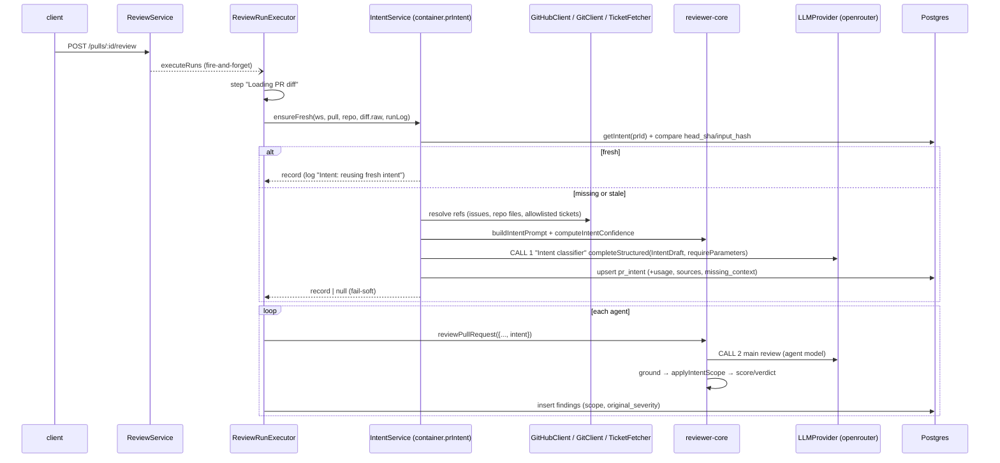
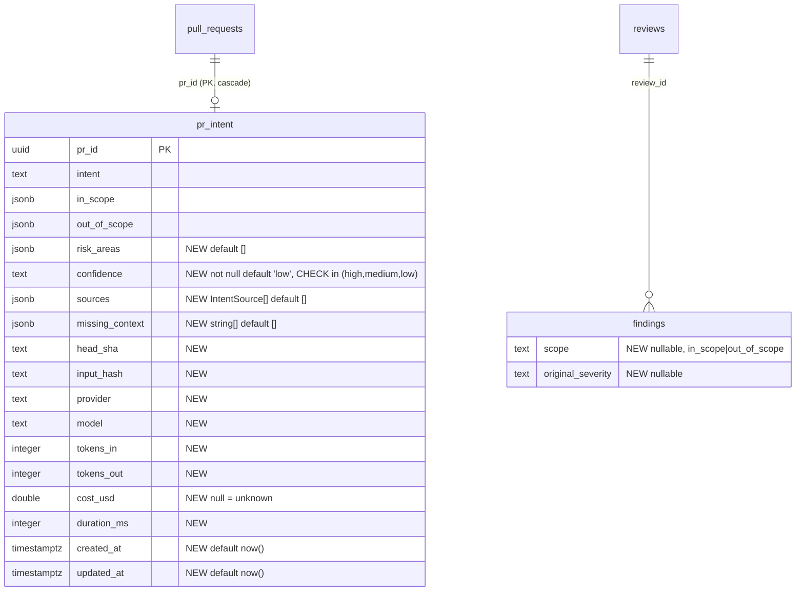

# Development Plan: Intent Layer (L03)
**Status:** implemented and committed on `lesson-03-laba`; T18 live smoke done; manual UI check pending

## Definition of Done
- [x] Every requirement (R1…R14) maps to at least one task, and every task traces to a requirement (matrix at the end of "Phased tasks").
- [x] Every task has concrete files, `Owned paths`, `Depends-on`, skills that exist in `.claude/skills`, and a measurable acceptance.
- [x] Dependencies form a DAG; concurrent tasks have non-overlapping `Owned paths` (shared files are serialised through `Depends-on`).
- [x] Contracts/schema tasks (T1, T2) come before their consumers; both vendor copies are named; the existing contracts `Intent`, `PrIntentRecord`, `Finding`, `FindingRecord`, `PromptAssembly`, `FEATURE_MODELS` and `StructuredRequest` are edited with an explicit callout.
- [x] Testing strategy covers server, client, reviewer-core and e2e with exact commands; integration/e2e/live smoke are separated as validation-phase.
- [x] Nothing contradicts the skills, package `AGENTS.md`, local `INSIGHTS.md`, do-not-touch list or lesson scope (Smart Diff, Blast Radius, PR Brief and the mock's verdict/blast cards are excluded).
- [x] UI tasks cover i18n keys, loading/empty/error/stale states and RTL tests; the DB task covers schema, `pnpm db:generate` flow and `.it` repository tests; security tasks name their checks.
- [x] Every decision is resolved from docs/code or listed under "Open decisions". D1–D4 were accepted at their recommended defaults by the user (see "Open decisions").
- [x] Every fact is evidenced or listed under "Unverified".
- [x] Reviewer handoff (architecture, security) is filled in.
- [x] The spec is saved, has an empty `## Delivery log`, and the file name did not clash. (Index line for `specs/README.md` is left to the parent, because the planner writes one file only.)

## Overview
Add an **Intent Layer**: a separate, cheap, flash-class LLM call (OpenRouter, the `review_intent` feature model) that reads PR metadata (title, description, linked issue/spec/ticket, file list, hunk headers; **never diff bodies**) and returns a structured `Intent` (summary, in scope, out of scope, risk areas). The server stores it per PR with a staleness key, lets the user re-run it, injects it into every reviewer prompt, and uses it to **tag and downgrade (never drop)** out-of-scope findings. Security and serious findings are never downgraded. The PR page shows an intent card so the user can check the model's understanding. Logs show the classifier call and the main review as two separate calls.

**Non-goals:** Smart Diff (the other half of L03 in `README.md:84`), Blast Radius (L04), the PR Brief card / `pr_brief` (L05), the mock's verdict card and blast-radius card, fetching arbitrary URLs, per-agent intent, intent history (only the latest row per PR is kept).

## Requirements
- **R1** A separate classifier call via the injected `LLMProvider`. The model comes from `container.resolveFeatureModel(ws, 'review_intent')`, with default `openrouter` / `deepseek/deepseek-v4-flash`. Structured output uses `json_schema` strict, sends `provider.require_parameters=true` on OpenRouter, and applies Zod validation with the existing retry.
- **R2** The Intent contract has `intent` (the summary), `in_scope[]`, `out_of_scope[]` and `risk_areas[]` (nullish). The persisted record adds `confidence` (computed by our code, not reported by the model), `sources[]` and `missing_context[]`.
- **R3** Inputs are PR title, description, linked issues, in-repo spec/plan files, the changed-file list and hunk headers (`@@ … @@` lines only). Diff bodies are never included.
- **R4** Link resolution:
  - GitHub issues in the forms `#N`, `owner/repo#N` and full issue URL, fetched through the `GitHubClient` port.
  - In-repo spec/plan paths and same-repo blob URLs, read from the clone.
  - Jira/Linear only from explicitly allowlisted hosts.
  - Arbitrary URLs are never fetched.
  - SSRF controls: no redirects, timeout, size cap. Fetched text is untrusted, delimiter-wrapped and length-capped.
- **R5** An unreachable or blocked link is recorded in `missing_context`, and the prompt tells the model the content is unavailable. The model never fills in missing content. An empty description falls back to title, file names and hunk headers, and sets confidence to `low`.
- **R6** One stored row per PR holds the intent plus `head_sha`, `input_hash`, provider, model, tokens, cost, duration and timestamps. `stale` is derived from these.
- **R7** When a review starts, intent is derived once if missing or stale, and reused if fresh. The derivation is fail-soft: an intent failure never fails a review.
- **R8** `GET /pulls/:id/intent` and `POST /pulls/:id/intent` (a forced re-run after the PR changes).
- **R9** The structured intent is injected into the reviewer prompt as its own untrusted-wrapped section and recorded in the trace's `PromptAssembly.intent`.
- **R10** Out-of-scope findings are tagged and downgraded, never dropped. CRITICAL, `security` and `bug` findings are never downgraded (the "one signal"); only `perf` / `style` / `test` WARNINGs drop to SUGGESTION (decided after the security review). Low-confidence intent downgrades nothing. Score, verdict and blocker count are recomputed after the downgrade.
- **R11** An intent card on the PR page: the quoted summary, IN SCOPE / OUT OF SCOPE lists, RISK AREAS chips, confidence, sources and missing context, model/cost metadata, a stale notice and a re-run button. It has loading, empty and error states. Findings show an "out of scope" tag and "downgraded from X".
- **R12** Settings has its own cheap-model picker for `review_intent`, and it shows the new default.
- **R13** Observability: log the prompt components (names + sizes), chosen provider/model, token estimate, sources and statuses, and usage/cost, with no secrets and no diff/description/issue text. The Live Log, the run trace and pino each show two distinct calls: `Intent classifier` and the main review.
- **R14** Tests (hermetic unit, `.it`, RTL), one e2e flow over seeded data, docs updates and a live smoke check.

## Context found
- `pr_intent` table exists but nothing uses it. Columns: `prId` (PK→pull_requests, cascade), `intent`, `inScope`, `outOfScope`. It has no workspace column, so access must go through a workspace-scoped `getPull`. — `server/src/db/schema/reviews.ts:48-55`
- `findings` has no scope/original-severity column. `kind` is `text not null default 'finding'`. — `server/src/db/schema/reviews.ts:28-46`
- `Intent = {intent, in_scope, out_of_scope}`, used by `PrBrief.intent`. — `server/src/vendor/shared/contracts/brief.ts:9-14,116-121`. `PrIntentRecord = Intent.extend({pr_id})`. — `review-api.ts:64-66`. Both copies are identical for `brief.ts`, `review-api.ts`, `findings.ts` and `platform.ts` (`diff` output was empty). `trace.ts` differs only in comments at lines 45-48.
- `Finding` is also the LLM structured-output schema (`Review.findings`), so a field added there is sent to every reviewer model. — `findings.ts:47-62,88-100`; `reviewer-core/src/review/run.ts:9,164-170`
- `FeatureModelId` already includes `review_intent`. Its default is `openai`/`gpt-4.1`. — `platform.ts:14-20,53-57`. Client hand-copy: `client/src/lib/feature-models.ts:21-27`.
- The Settings picker already renders every `FEATURE_MODELS` entry and saves `provider: "openrouter"` unconditionally. — `client/src/app/settings/[section]/_components/SettingsView/_components/SettingsModels/SettingsModels.tsx:30-33`
- Dead intent repository code: `upsertIntent`/`getIntent` in `server/src/modules/reviews/repository/pull.repo.ts:47-68`, wrapped at `repository.ts:130-138`. There are no other consumers (grep).
- No `intent` module. Modules are registered statically in `server/src/modules/index.ts:28-39`. Its header comment lists "intent/smart-diff" as a lesson module.
- The run executor loads the diff once (`run-executor.ts:95-105`), then loops agents (`:107-134`). Comments at `:39,51,62-64,148-150,302-303` already promise "diff + intent" shared pre-work. `reviewPullRequest` is called at `:207-231`. Findings are persisted at `:248`. `countBlockers` is at `:259`. The trace is built at `:275-305`.
- `taskLine` (trusted) already says "never withhold or downgrade a security or correctness finding". — `server/src/modules/reviews/helpers.ts:92-102`
- `INJECTION_GUARD` already names "derived intent/scope" as untrusted data that can never descope a real defect. — `reviewer-core/src/prompt.ts:16-28`. `wrapUntrusted` is at `:30`. `PromptParts` is at `:46`. `assemblePrompt` is at `:92`. The assembly record is at `:145`. The PR description is capped at 4000 (`:37`).
- `reviewPullRequest`: `ReviewInput` `run.ts:45`, `promptParts` `:131`, grounding `:198`. Score and verdict are recomputed from the grounded findings at `:209`. reviewer-core INSIGHTS: every field derived from findings needs the same recompute after a filtering step. — `reviewer-core/INSIGHTS.md` ("A grounding-dropped finding left a stale request_changes verdict")
- `OpenRouterProvider.completeStructured` sends `response_format json_schema strict`, `usage.include`, optional `session_id`. It does **not** send `provider.require_parameters`. It retries `maxRetries` times with a Zod reprompt. Cost is `costFromApi ?? estimateCost`. It does not honour `timeoutMs`. — `reviewer-core/src/llm/openrouter.ts:59-115`
- `StructuredRequest` has `sessionId`, and that field exists **only in the server copy** of `adapters.ts` (`diff -r` output). This is precedent for a server-only LLM-request field. — `server/src/vendor/shared/adapters.ts:55-70`
- GitHub port: `getIssue(repo, n)` exists (`adapters.ts:164`; `octokit.ts:351-363`). `resolveLinkedIssue` uses a weak regex, takes the first `#N` only and swallows errors silently (`octokit.ts:127-135`), and the result is not persisted.
- Git port: `readFile(repo, path)` joins the path onto the clone path with **no traversal guard**. — `server/src/adapters/git/simple-git.ts:129-131`
- `UnifiedDiff.raw` holds the full diff text. `DiffHunk` keeps line numbers only, not header context. — `adapters.ts:175-188`. `pr_files.patch` holds the raw patch with `@@` headers (`schema/pulls.ts:36-45`). The fallback diff is rebuilt from `pr_files` (`reviews/diff-loader.ts:33-44`).
- Trap: `pr_files` is filled only when the PR detail is opened (`GET /pulls/:id`). — `server/INSIGHTS.md:57-72`
- Container: `resolveFeatureModel` (`container.ts:115`), `llm(id)` (`:179`), `tokenizer` getter (`:144`), `github()` (`:169`), `git` (`:97`). `ContainerOverrides.llm` accepts an `openrouter` slot (`:52`). Never import `modules/settings/*` directly. — `server/INSIGHTS.md:157-169`
- `MockLLMProvider.id` is typed `'openai'|'anthropic'`. — `server/src/adapters/mocks.ts:58-67`
- A cheap model's self-reported confidence does not discriminate quality: deepseek-v4-flash gave 0.90–1.00 regardless of usefulness (`server/INSIGHTS.md:108-121`) and sometimes 0 (`INSIGHTS.md:198-206`). **So intent `confidence` is computed deterministically from the sources, not asked of the model.**
- New jsonb-persisted contract fields must be `.nullish()`. — `server/INSIGHTS.md:139-155`. `agent_runs` aggregates must filter `status='done'`. — `server/INSIGHTS.md:171-184`
- `drizzle-kit generate` hangs on rename prompts without a TTY. Pure additive columns do not trigger the prompt. — `server/INSIGHTS.md:200-213`
- A git error can print the clone URL with the token embedded. — `server/INSIGHTS.md:189-198`
- `RunLogger` fans out to all queued runs and `step(label, fn, {kind})` logs "label… / done (ms)". — `server/src/platform/run-logger.ts:37-94`
- The intent card's host tabs: `OverviewTab` (description only, `OverviewTab.tsx`) and `FindingsTab` (Agent runs). `VerdictBanner` renders per run inside `ReviewRunAccordion.tsx:128`. The page is `PrDetailView.tsx:133-150`.
- Client data hooks call `api.get/post` inside `client/src/lib/hooks/*.ts` (e.g. `useRunReview`, `reviews.ts:147-160`). i18n: `client/messages/en/prReview.json` (groups `finding`, `detail`, …). `brief.json:3` has only `"intent": "Intent"`.
- e2e flows run over seeded data and never call an LLM (`e2e/AGENTS.md`, `e2e/docs/writing-flows.md:19`). The seeded PR is #482 (`server/src/db/seed.ts:225-262`). Uppercase CSS text comes back uppercase from `find text`, and absence is asserted with a named ARIA list. — `e2e/INSIGHTS.md:8-27`
- L03 in the course is "Intent layer · Smart Diff". — `README.md:84`

## Affected packages & contracts
| Package | Layer / folder | Change |
|---|---|---|
| `server/src/vendor/shared` + `client/src/vendor/shared` | contracts | Intent, IntentSource, PrIntentRecord, PrIntentResponse, FindingScope, Finding.scope, FindingRecord.original_severity, PromptAssembly.intent, FEATURE_MODELS default. `StructuredRequest.requireParameters` goes in the server copy only |
| `server` | `db/schema/reviews.ts` + generated migration | extend `pr_intent`; add `findings.scope`, `findings.original_severity` |
| `server` | new module `modules/intent/` (routes, service, repository, helpers, constants) | derivation orchestration, source resolution, persistence, API |
| `server` | `platform/container.ts`, `modules/index.ts` | `container.prIntent` getter (composition root), module registration |
| `server` | `modules/reviews/{run-executor,helpers}.ts`, `repository/{review,pull}.repo.ts`, `repository.ts` | ensure-intent pre-work, pass intent to the engine, persist scope, DTO map, delete dead intent code |
| `server` | `adapters/tickets/` (new), `adapters/mocks.ts`, `platform/config.ts` | allowlisted Jira/Linear fetcher (per D2) |
| `server` | `db/seed.ts` | seeded intent + one out-of-scope finding for e2e |
| `reviewer-core` | `src/intent/*` (new), `src/prompt.ts`, `src/review/run.ts`, `src/llm/openrouter.ts`, `src/index.ts` | intent prompt builder + derive + confidence, prompt slot, scope policy, `require_parameters` |
| `client` | `lib/hooks/reviews.ts`, `lib/feature-models.ts` | `usePrIntent`, `useRerunIntent`, invalidate on run settle; default mirror |
| `client` | `app/repos/[repoId]/pulls/[number]/_components/{IntentCard (new),OverviewTab,FindingsTab,PrDetailView,FindingCard}` | card + placement + finding tag |
| `client` | `messages/en/prReview.json` | `intent.*`, `finding.outOfScope*` keys |
| `e2e` | `specs/10-pr-intent.flow.json`, `specs/README.md` | read-only flow over the seeded intent |
| docs | `reviewer-core/docs/pipeline.md`, `docs/agent-prompts/README.md`, `server/docs/review-run-lifecycle.md` | new step, prompt order, lifecycle |

**Contracts (callouts for existing shared contracts). Mirror field-by-field into BOTH copies; never sync whole files:**
1. `contracts/brief.ts`:
   - `Intent` gains `risk_areas: z.array(z.string()).nullish()`. This is an **edit of an existing contract** used by `PrBrief`, and it is additive and nullish.
   - `.describe()` texts are added to each field.
   - New `IntentConfidence = z.enum(['high','medium','low'])`.
   - New `IntentSourceKind = z.enum(['pr_title','pr_description','file_list','hunk_headers','github_issue','repo_file','external_ticket'])`.
   - New `IntentSourceStatus = z.enum(['used','truncated','missing','blocked'])`.
   - New `IntentSource = { kind, ref: string, status, reason: string.nullish(), chars: int }`.
   - The field name stays `intent`, meaning the summary. It is not renamed to `summary`, because a rename would break `PrBrief` and `upsertIntent` semantics.
2. `contracts/review-api.ts`:
   - **Edit** `PrIntentRecord` to `Intent.extend({ pr_id, head_sha, stale: boolean, confidence: IntentConfidence, sources: IntentSource[], missing_context: string[], provider: string.nullable(), model: string.nullable(), tokens_in: int.nullable(), tokens_out: int.nullable(), cost_usd: number.nullable(), duration_ms: int.nullable(), created_at: string, updated_at: string })`. This is wire-only, built from columns, so `.nullable()` is correct (`server/INSIGHTS.md:149-152`).
   - New `PrIntentResponse = z.object({ intent: PrIntentRecord.nullable() })`.
   - **Edit** `FindingRecord` to add `original_severity: Severity.nullish()`.
3. `contracts/findings.ts`:
   - New `FindingScope = z.enum(['in_scope','out_of_scope'])`.
   - **Edit** `Finding` to add `scope: FindingScope.nullish().describe('in_scope | out_of_scope relative to the "PR intent" section; null when there is no such section')`.
   - This changes the reviewer LLM's JSON schema for every run (see Risks).
4. `contracts/trace.ts`: **edit** `PromptAssembly` to add `intent: z.string().nullish()`. It must be nullish because the trace is jsonb. Only this field line is mirrored; the comment drift at `:45-48` is left alone.
5. `contracts/platform.ts`: **edit** the `review_intent` defaults to `defaultProvider: 'openrouter'`, `defaultModel: 'deepseek/deepseek-v4-flash'`, and mirror them into `client/src/lib/feature-models.ts`.
6. `server/src/vendor/shared/adapters.ts` (server copy only, same precedent as `sessionId`): **edit** `StructuredRequest` to add `requireParameters?: boolean`. The client copy is not touched, because the client never builds LLM requests.

## Design

### Data sources
| Source | How obtained | Cap | Status on failure |
|---|---|---|---|
| PR title | `pull_requests.title` | 300 chars | — (always present) |
| PR description | `pull_requests.body`, HTML comments stripped | 4000 chars (same as `MAX_PR_DESCRIPTION_CHARS`) | empty → confidence `low` |
| Changed-file list | `pr_files.path` (+adds/dels) | 300 files | missing → `missing_context: "file list not loaded — open the PR once"` (priming trap) |
| Hunk headers | `@@ … @@ <context>` lines only, from `diff.raw` (run path) or `pr_files.patch` (manual path) | 200 headers, 160 chars each | none → recorded as `missing` |
| GitHub issues | `#N`, `closes #N`, `https://github.com/<this repo>/issues/N` → `GitHubClient.getIssue`; an issue in ANOTHER repo is not fetched (blocked, `issue in another repository`), decided after the security review | max 3 refs, 3000 chars each | `missing` + reason (404/403/timeout) |
| In-repo spec/plan | repo-relative path (`specs/…`, `docs/…`, `*.md`) or `https://github.com/<same o/r>/blob/<ref>/<path>` → `container.git.readFile` after `isSafeRepoPath` | max 3 refs, 4000 chars each, `.md`/`.txt` only | `missing` (not found / not cloned) or `blocked` (unsafe path) |
| Jira / Linear (D2) | key parsed from link; request URL **built by us** from the allowlisted host + key (never the raw URL); API with token from `SecretsProvider` | max 2, 3000 chars each, 64 KB body, 5 s timeout, `redirect: 'manual'` | `blocked` (host not allowlisted / no token) or `missing` |
| Any other URL | never fetched | — | `blocked` ("arbitrary URL not fetched") → listed in `missing_context` |

Total untrusted context is capped at 12 000 chars. Every fetched body is `wrapUntrusted('intent-src:<kind>:<ref>', …)`.

### Confidence (deterministic, `computeIntentConfidence`, reviewer-core)
- `low`: the description has fewer than 40 meaningful chars, **or** at least one referenced source is `missing`/`blocked` and no linked source loaded.
- `low` (added after the live check on PR #482): also when no linked source loaded and the description has fewer than 200 meaningful chars (`SUBSTANTIVE_DESCRIPTION_CHARS`). A one-sentence description gave `medium` plus boilerplate `out_of_scope` items that would have downgraded real findings.
- `high`: the description has at least 40 chars, at least one linked source (issue/spec/ticket) is `used`/`truncated`, and nothing is `missing`/`blocked`.
- `medium`: everything else.

### Scope policy (`applyIntentScope`, reviewer-core, pure)
Runs after `groundFindings` and **before** `scoreFromFindings`/`verdictFromFindings`:
- The intent is absent, or `confidence === 'low'` → findings are returned unchanged. Their `scope` is kept (informational), and `original_severity` is null.
- `scope === 'out_of_scope'`:
  - `CRITICAL`, or `category === 'security'` or `'bug'` → unchanged (the single signal is kept; `bug` added after the security review because the scope claim comes from author-written text).
  - `WARNING` → severity becomes `SUGGESTION`, and `original_severity = 'WARNING'`.
  - `SUGGESTION` → tag only.
- Nothing is ever removed. The invariant `out.length === in.length` is asserted in tests.

### Call sequence (review run)


Manual re-run: `POST /pulls/:id/intent` → `routes.ts` → `IntentService.derive(ws, prId, {force:true})`, which uses `pr_files.patch` for hunk headers → the same CALL 1 path → `PrIntentRecord`. Pino only, because there is no run to stream into.

### Layer placement (onion)
- `reviewer-core/src/intent/`: the pure domain. `buildIntentPrompt`, `deriveIntent(llm, input)` (the injected LLM is the only side effect), `computeIntentConfidence`, `applyIntentScope`, `renderIntentSection`, and the `IntentDraft` schema (= shared `Intent`). It lives here and not in the server because it is prompt + LLM-output logic that the CI runner can reuse, and the package forbids DB/FS/GitHub. That boundary is respected, because all fetching stays in the server.
- `server/src/modules/intent/helpers.ts`: pure. `extractReferences(body, repoRef)`, `isSafeRepoPath`, `extractHunkHeaders(raw)`, `inputHash`, `isStale`, `redactSecrets`, `toPrIntentDto`.
- `modules/intent/service.ts`: the application layer. `IntentService` gets narrow deps `{repo, github, git, tickets, llm, resolveModel, tokenizer, log}` (onion §5; no `Container` locator). It owns the in-flight dedupe map keyed `prId:input_hash`.
- `modules/intent/repository.ts`: Drizzle only. The query is workspace-scoped through a join on `pull_requests.workspace_id`.
- `modules/intent/routes.ts`: thin handlers, with Zod params/response from shared.
- `platform/container.ts`: a `get prIntent(): IntentService` getter, so `reviews/run-executor.ts` never imports `modules/intent/*` (onion §2 corollary 1).
- `adapters/tickets/`: a local port `TicketFetcher` + `HttpTicketFetcher` + a mock (precedent: the local `Tokenizer`/`DepGraph` ports).

### Schema (ERD)

All changes are additive. Every NOT NULL column has a constant default, so there is no table rewrite and drizzle-kit shows no rename prompt.

### API
| Method | Path | Body | Response | Errors |
|---|---|---|---|---|
| GET | `/pulls/:id/intent` | — | `PrIntentResponse` (`{intent: null}` when never derived; `stale` computed against the current `pull.headSha` + `input_hash`) | 404 PR not in workspace |
| POST | `/pulls/:id/intent` | — | `PrIntentRecord` (forced derive, synchronous) | 404; 502 `ExternalServiceError` when the LLM fails after retries; 400 `ConfigError` when the provider key is missing |

### Prompt builder
- **Classifier prompt (CALL 1)**, `buildIntentPrompt` → `ChatMessage[]`:
  - system (trusted): the role ("classify what this PR intends to change; do not review code"), the field rules (≤ 8 items per list, ≤ 160 chars each, `risk_areas` = areas a reviewer should look at), "if a source is listed as unavailable, do not guess its content; say the scope is uncertain", plus `INJECTION_GUARD`, which is **exported** from `prompt.ts` so there is still exactly one guard.
  - user: the trusted header `PR #N` plus the untrusted blocks `pr-title`, `pr-description`, `file-list`, `hunk-headers`, and `intent-src:*` for each loaded source, then a **trusted** `## Unavailable context` list (ref + reason) built from our resolver output.
  - Output schema: the `Intent` Zod schema via `completeStructured` (`schemaName: 'Intent'`, `maxRetries: 2`, `temperature: 0`, `requireParameters: true`).
  - Post-parse, the code truncates lists and items to their caps. It does not trust the model to respect them.
- **Reviewer slot (CALL 2)**, `PromptParts.intent?: RenderedIntent`, rendered by `renderIntentSection` right after `## PR description`:
  - a trusted instruction line: "Tag each finding's `scope`. Out-of-scope never lowers the severity of a security or correctness defect."
  - `wrapUntrusted('intent', <summary / in / out / risk bullets / confidence / missing context>)`.
  - The section is omitted when the intent is absent, so the prompt is byte-identical to today's. `assembly.intent` records the block.

### UI
```
┌ INTENT ─────────────────────────────── confidence: MEDIUM · deepseek-v4-flash · $0.0003 [Re-run] ┐
│ "Add token-bucket rate limiting to public endpoints."                                             │
│ IN SCOPE            │ OUT OF SCOPE                                                                │
│ • rate limiter      │ • users endpoint refactor                                                   │
│ RISK AREAS  [webhooks] [config defaults]                                                           │
│ Sources: title · description · 4 files · 9 hunks · #12 ✓   Missing: specs/ratelimit.md (not found)  │
│ ⚠ PR changed since intent was detected — Re-run                       (stale only)                 │
└───────────────────────────────────────────────────────────────────────────────────────────────────┘
```
- The card renders at the top of **Overview** (above the description) and at the top of **Agent runs** (above the run accordions), so it is read before the review results (D1).
- States:
  - loading: `Skeleton`
  - empty: "No intent detected yet" + a "Detect intent" button
  - error: `ErrorState` + retry
  - stale: a banner
  - low confidence: a warning badge with the text "low confidence — not used to downgrade findings"
  - re-run pending: the button is disabled with a spinner
- `FindingCard` shows an "Out of scope" badge and, when `original_severity` is set, "downgraded from WARNING".

### Logging (per call; counts and refs only, never content)
- Live Log (run path), step `Intent classifier (openrouter/deepseek/deepseek-v4-flash)` kind `tool`, then:
  - `intent: sources — title, description 812ch, files 9, hunk headers 23, #12 ok, specs/x.md missing (not found), jira.acme.com/ABC-1 blocked (host not allowlisted)`
  - `intent: prompt components — system 1.1k ch, untrusted blocks 5, est ≈1,450 tokens (tiktoken)`
  - `intent: done — tokens 1402/188, cost $0.00031, confidence medium, missing_context 1`
  - or `intent: reusing fresh intent (head a1b2c3d)`, or `intent: failed — <redacted message>; reviewing without intent`.
- The main review keeps `Starting review with agent "X" (provider/model)` + `Reviewing … in one pass`. A new line `intent: injected (confidence medium, 2 in-scope, 1 out-of-scope)` or `intent: not injected (<reason>)` is added. After grounding the engine emits `scope: 2 out-of-scope finding(s) tagged, 1 downgraded, 1 kept (security/CRITICAL)`.
- pino: `log.info({ event:'intent.classify', prId, provider, model, estTokens, sources:[{kind,ref,status}], tokensIn, tokensOut, costUsd, durationMs, confidence }, 'intent: classifier call')`, separate from the existing `review: agent "X" started` entry (`run-executor.ts:109-112`).
- Trace: `tool_calls` gets `{tool:'intent_classify', args:model, meta:'fresh'|'cached', ms}` and `prompt_assembly.intent`.
- Redaction: `redactSecrets(msg)` masks `x-access-token:…@`, `Bearer …` and `ghp_/github_pat_/sk-` patterns before any error text is logged. Ticket refs are logged as `host/KEY` without the query string.

## Phased tasks

### Phase 1 — Contracts & schema
- **T1** (covers R2, R9, R10, R12, R1)
  - **Action:** Apply contract edits 1–6 above. In both copies, update the barrel `index.ts` only if the new names are not already re-exported through `contracts/*`. Update `client/src/lib/feature-models.ts` `review_intent` defaults. Extend `server/test/contracts.test.ts`:
    - a `PrIntentRecord` round-trip
    - `PromptAssembly` parses without an `intent` key
    - `Finding` parses without `scope`
    - `Intent` parses without `risk_areas`
  - **Package / Type:** server + client (shared contracts) — core
  - **Skills to use:** zod, typescript-expert
  - **Owned paths:** `server/src/vendor/shared/contracts/{brief,review-api,findings,trace,platform}.ts`, `server/src/vendor/shared/adapters.ts`, `client/src/vendor/shared/contracts/{brief,review-api,findings,trace,platform}.ts`, `client/src/lib/feature-models.ts`, `server/test/contracts.test.ts`
  - **Depends-on:** none
  - **Risk:** medium (the `Finding` change alters the reviewer JSON schema)
  - **Known gotchas:**
    - The client copy lags on lesson files, so edit field-by-field and don't sync whole files (`INSIGHTS.md:51-62`).
    - Only the jsonb-reachable fields (`PromptAssembly.intent`, `Finding.scope`) must be `.nullish()` (`server/INSIGHTS.md:139-155`).
    - The client may import only types from shared (`client/src/lib/feature-models.ts:1-12`).
  - **Acceptance:**
    - `cd server && pnpm typecheck` and `cd client && pnpm typecheck` pass.
    - `cd reviewer-core && npm run build` passes.
    - `pnpm exec vitest run test/contracts.test.ts` passes with the 4 new cases.
    - `diff server/src/vendor/shared/contracts/brief.ts client/src/vendor/shared/contracts/brief.ts` prints nothing (the same holds for `findings.ts`, `review-api.ts` and `platform.ts`).
- **T2** (covers R6, R10)
  - **Action:** In `server/src/db/schema/reviews.ts`, extend `prIntent` with the ERD columns: `confidence` with a `CHECK` via `check()`; jsonb `.$type<IntentSource[]>()` / `<string[]>()` with the default `'[]'::jsonb`. Add `findings.scope` and `findings.originalSeverity` (text, nullable). Update `db/rows.ts` if it exports these row types. Run `pnpm db:generate` and commit the generated SQL + meta untouched. Run `pnpm db:migrate` locally.
  - **Package / Type:** server — backend
  - **Skills to use:** drizzle-orm-patterns, postgresql-table-design
  - **Owned paths:** `server/src/db/schema/reviews.ts`, `server/src/db/rows.ts`, `server/src/db/migrations/**` (generated only)
  - **Depends-on:** T1
  - **Risk:** low
  - **Known gotchas:**
    - Never hand-edit migrations.
    - The drizzle-kit TTY prompt appears only for renames. If it appears, the change is not purely additive, so stop and re-check (`server/INSIGHTS.md:200-213`).
    - Migrations never run on boot.
  - **Acceptance:**
    - Exactly one new `NNNN_*.sql` under `server/src/db/migrations/` containing only `ALTER TABLE … ADD COLUMN` (+ `CHECK`).
    - `pnpm db:migrate` succeeds on a fresh DB.
    - `pnpm typecheck` passes.

### Phase 2 — reviewer-core (pure engine)
- **T3** (covers R1, R2, R3, R5, R13)
  - **Action:** Create `reviewer-core/src/intent/`:
    - `prompt.ts`: `buildIntentPrompt(input: IntentPromptInput)`, which returns the messages plus a `components` summary `{name, chars}[]` for logging.
    - `derive.ts`: `deriveIntent({llm, model, input, sessionId?})` calls `completeStructured` with `schema: Intent`, `requireParameters: true`, `maxRetries: 2`, `temperature: 0`. It post-truncates the lists/items and returns `{intent, usage, raw, attempts}`.
    - `confidence.ts`: `computeIntentConfidence(sources, descriptionChars)`.
    - `types.ts`: `IntentPromptInput` with title, description, files, hunkHeaders and loaded/unavailable sources.

    Export `INJECTION_GUARD` from `src/prompt.ts` as a named export. Only the export keyword is added; the text is unchanged. Export the intent API from `src/index.ts`. Tests:
    - `test/intent-prompt.test.ts`:
      - every untrusted source is wrapped
      - the "unavailable" list sits outside `<untrusted>`
      - no diff body is present when given a raw diff
      - an empty description still yields a title/files/hunks prompt
    - `test/intent-derive.test.ts` (fake `LLMProvider`):
      - the request carries `requireParameters: true` and `schemaName 'Intent'`
      - lists are capped at 8 items / 160 chars
      - usage is propagated
      - provider errors propagate
    - `test/intent-confidence.test.ts` covers the three rules plus the edge cases.
  - **Package / Type:** reviewer-core — core
  - **Skills to use:** zod, typescript-expert, security
  - **Owned paths:** `reviewer-core/src/intent/**`, `reviewer-core/src/index.ts`, `reviewer-core/test/intent-prompt.test.ts`, `reviewer-core/test/intent-derive.test.ts`, `reviewer-core/test/intent-confidence.test.ts`
  - **Depends-on:** T1
  - **Risk:** medium
  - **Known gotchas:**
    - No DB/FS/GitHub in reviewer-core (`reviewer-core/AGENTS.md`).
    - Never replace the guard with keyword scanning.
    - Model confidence is useless, so confidence comes from our own rules (`server/INSIGHTS.md:108-121`).
  - **Acceptance:**
    - `cd reviewer-core && npm test` passes with the 3 new files.
    - `npm run build` passes.
    - A test asserts that `buildIntentPrompt` output contains no line starting with `+` or `-` taken from a supplied diff fixture.
- **T4** (covers R9, R10)
  - **Action:** In `src/prompt.ts`:
    - add `PromptParts.intent?: RenderedIntent`
    - add `renderIntentSection`, placed after the PR description
    - set `assembly.intent`

    In `src/review/run.ts`:
    - add `ReviewInput.intent?: {intent: Intent; confidence: IntentConfidence; missingContext: string[]}`
    - thread it into `promptParts`
    - after `groundFindings` (`:198`), call `applyIntentScope` from `src/intent/scope.ts`
    - compute score, verdict and the returned findings from the scoped list
    - emit the `scope:` event
    - add `ReviewOutcome.scoped` counts

    `applyIntentScope` returns findings typed `ScopedFinding = Finding & { original_severity?: Severity | null }`. Tests:
    - `test/prompt.test.ts`: with no intent the output is byte-identical to the current snapshot/assertion; with an intent the section is wrapped and placed right after the description.
    - `test/intent-scope.test.ts` (policy table): CRITICAL/security untouched, WARNING→SUGGESTION, low-confidence no-op, count invariant.
    - `test/run.test.ts`: an out-of-scope WARNING-only review yields `verdict 'comment'` with the score recomputed from SUGGESTION.
  - **Package / Type:** reviewer-core — core
  - **Skills to use:** typescript-expert, zod, security
  - **Owned paths:** `reviewer-core/src/prompt.ts`, `reviewer-core/src/review/run.ts`, `reviewer-core/src/intent/scope.ts`, `reviewer-core/test/prompt.test.ts`, `reviewer-core/test/run.test.ts`, `reviewer-core/test/intent-scope.test.ts`
  - **Depends-on:** T1, T3 (`src/intent/` + `index.ts` exports, and the `INJECTION_GUARD` export edit in `prompt.ts`)
  - **Risk:** high (prompt shape + score semantics)
  - **Known gotchas:**
    - Recompute every field derived from findings after scoping (`reviewer-core/INSIGHTS.md`, the verdict entry).
    - Grounding stays mandatory and runs first.
  - **Acceptance:** `npm test` passes. `test/intent-scope.test.ts` asserts `out.length === in.length` for all cases. The prompt test proves the absent-intent output is identical.
- **T5** (covers R1)
  - **Action:** `OpenRouterProvider.completeStructured` sends `provider: { require_parameters: true }` when `req.requireParameters && this.id === 'openrouter'`, and otherwise leaves the request unchanged. Add a unit test that captures the request body by injecting a stub `fetch` into the OpenAI client. If the constructor cannot accept a `fetch`, add an optional `clientFactory` option; that option is in scope for this task.
  - **Package / Type:** reviewer-core — core
  - **Skills to use:** typescript-expert, security
  - **Owned paths:** `reviewer-core/src/llm/openrouter.ts`, `reviewer-core/test/openrouter.test.ts`
  - **Depends-on:** T1
  - **Risk:** medium (the provider is shared with the main review)
  - **Known gotchas:** The main review must be unaffected, so there is no flag unless it is requested.
  - **Acceptance:** `test/openrouter.test.ts` passes both cases: with `requireParameters` the body contains `"provider":{"require_parameters":true}`; without it, no `provider` key is present.

### Phase 3 — server
- **T6** (covers R3, R4, R5, R13)
  - **Action:** `server/src/modules/intent/constants.ts` holds the caps table above and `MIN_DESCRIPTION_CHARS = 40`. `helpers.ts` contains:
    - `extractReferences(body, repo)`, which returns issue refs (dedup, max 3; `#N` / `owner/repo#N` / issue URL), repo-file refs (paths + same-repo blob URLs), ticket refs (`{host, key}` from Jira `/browse/KEY-1` and `linear.app/<team>/issue/KEY-1`) and `blocked` other URLs
    - `isSafeRepoPath(p)`, which rejects absolute paths, `..`, backslashes, NUL, anything outside `.md`/`.txt`, and more than 200 chars
    - `extractHunkHeaders(raw)`
    - `stripHtmlComments`
    - `inputHash({title, body, files, headSha})` (sha256)
    - `isStale(row, pull, hash)`
    - `redactSecrets(msg)`
    - `toPrIntentDto(row, stale)`

    Tests go in `server/test/intent-helpers.test.ts`. They cover every ref form, ReDoS-safe regexes (a 100 KB body parses in under 50 ms), traversal cases, the hunk-header-only extraction and redaction.
  - **Package / Type:** server — backend
  - **Skills to use:** onion-architecture, security, typescript-expert
  - **Owned paths:** `server/src/modules/intent/constants.ts`, `server/src/modules/intent/helpers.ts`, `server/test/intent-helpers.test.ts`
  - **Depends-on:** T1
  - **Risk:** medium (security-relevant parsing)
  - **Known gotchas:**
    - `readFile` has no traversal guard (`simple-git.ts:129-131`), so `isSafeRepoPath` is the gate.
    - Tokens can appear in git errors (`server/INSIGHTS.md:189-198`).
  - **Acceptance:** `pnpm exec vitest run test/intent-helpers.test.ts` passes. It includes the cases `../../etc/passwd` → rejected, `https://evil.example/x` → `blocked`, and `https://github.com/<o>/<r>/blob/main/specs/a.md` → repo file `specs/a.md`.
- **T7** (covers R6)
  - **Action:** `modules/intent/repository.ts` (`IntentRepository(db)`) with these methods:
    - `getPullForWorkspace(ws, prId)`
    - `getRepo(repoId)`
    - `getPrFiles(prId)`
    - `getIntent(prId)`
    - `upsertIntent(prId, values)`, which sets `updated_at = now()` on conflict and keeps `created_at`

    Add the `.it` test `server/test/intent-repository.it.test.ts`: upsert twice (the row is updated and `created_at` preserved), a workspace mismatch returns undefined, and the cascade delete with the PR.
  - **Package / Type:** server — backend
  - **Skills to use:** drizzle-orm-patterns, onion-architecture, postgresql-table-design
  - **Owned paths:** `server/src/modules/intent/repository.ts`, `server/test/intent-repository.it.test.ts`
  - **Depends-on:** T2
  - **Risk:** low
  - **Known gotchas:** A DB-backed test must be named `*.it.test.ts` (`server/AGENTS.md`).
  - **Acceptance:** `pnpm exec vitest run .it.test -t intent` passes against the Postgres testcontainer.
- **T8** (covers R1, R4, R5, R6, R7, R8, R13)
  - **Action:**
    - `modules/intent/service.ts`: `IntentService` with narrow deps.
      - `derive(ws, prId, {force, diffRaw?, runLog?})`:
        1. load the PR (404 → `NotFoundError`)
        2. compute the hash and return early when fresh and not forced
        3. resolve the refs (GitHub issues through the port, repo files through `git.readFile` after `isSafeRepoPath`; tickets through the fetcher from T10, which is a no-op stub until then)
        4. build the prompt (T3)
        5. estimate tokens with `tokenizer.count`
        6. log sources/components
        7. resolve the model with `resolveFeatureModel('review_intent')`, then call `llm(provider)`
        8. run `deriveIntent` under a 90 s `Promise.race` timeout (raised from 45 s after the live smoke)
        9. compute the confidence
        10. upsert and return the DTO
      - In-flight dedupe map.
      - `ensureFresh(...)` wraps `derive` and returns `null` on any error after logging (fail-soft).
      - `get(ws, prId)`.
    - `routes.ts`: GET/POST as in the API table, schemas from shared.
    - `platform/container.ts`: a `get prIntent()` getter that builds the service with repo + deps.
    - Register `intent` in `modules/index.ts`.

    Tests:
    - `server/test/intent-service.it.test.ts`, using `ContainerOverrides.llm.openrouter` = a fake structured provider plus a mock github/git:
      - a fresh PR derives and persists sources, usage and confidence
      - a second call reuses the row with no LLM call
      - a head_sha change → stale → re-derive
      - a 404 issue → `missing_context` contains `#12`
      - a missing `OPENROUTER_API_KEY` → `ensureFresh` returns null and POST returns 400
      - an empty body → `confidence: 'low'`
      - the LLM request messages contain no diff body lines
    - Extend `server/test/routes-smoke.test.ts` with GET `/pulls/:id/intent` for an unknown id → 404.
  - **Package / Type:** server — backend
  - **Skills to use:** onion-architecture, fastify-best-practices, zod, security, typescript-expert
  - **Owned paths:** `server/src/modules/intent/service.ts`, `server/src/modules/intent/routes.ts`, `server/src/modules/index.ts`, `server/src/platform/container.ts`, `server/test/intent-service.it.test.ts`, `server/test/routes-smoke.test.ts`
  - **Depends-on:** T3, T5, T6, T7
  - **Risk:** high
  - **Known gotchas:**
    - Resolve the model only through `container.resolveFeatureModel` (`server/INSIGHTS.md:157-169`).
    - `MockLLMProvider.id` excludes `'openrouter'` (`mocks.ts:59`), so use a local fake implementing `LLMProvider` with `id: 'openrouter'` in the test.
    - Unprimed PR → `pr_files` is empty, so record the `missing_context` entry instead of silently deriving from nothing (`server/INSIGHTS.md:57-72`).
    - Handlers do parse → context → one service call → reply, with no try/catch.
  - **Acceptance:**
    - All the listed `.it` cases pass.
    - `pnpm typecheck` passes.
    - The onion grep checklist (onion skill §9) prints nothing for `src/modules/intent` and `src/modules/reviews`.
- **T9** (covers R7, R9, R10, R13)
  - **Action:**
    - `run-executor.ts`: after the diff is loaded (`:105`), call `runLog.step('Intent classifier (…)', () => this.container.prIntent.ensureFresh(ws, pull, repo, {diffRaw: diff.raw, runLog}))`. Pass the result into `runOneAgent` → `reviewPullRequest({ intent })`, and only when `confidence` is present. Log `intent: injected / not injected`. Add the `intent_classify` tool call to the trace.
    - `review.repo.ts` `insertFindings` persists `scope` and `original_severity`.
    - `helpers.ts` `findingRowToDto` maps both. The `taskLine` text is unchanged.
    - Delete the dead `upsertIntent`/`getIntent` from `repository/pull.repo.ts` and `repository.ts`.

    Tests:
    - Extend `server/test/reviews.it.test.ts`, or add `server/test/review-intent-run.it.test.ts`, using a fake openrouter provider for intent and a fake openai provider for the agent:
      - the persisted run trace log contains both `Intent classifier` and `Starting review with agent`
      - `prompt_assembly.intent` is set
      - an out-of-scope WARNING is persisted as SUGGESTION with `original_severity 'WARNING'`
      - an out-of-scope security CRITICAL is persisted unchanged
      - with intent failing (no key) the run still ends `done`
    - Extend `server/test/reviews-helpers.test.ts` for the DTO mapping.
  - **Package / Type:** server — backend
  - **Skills to use:** onion-architecture, drizzle-orm-patterns, security, typescript-expert
  - **Owned paths:** `server/src/modules/reviews/run-executor.ts`, `server/src/modules/reviews/helpers.ts`, `server/src/modules/reviews/repository/review.repo.ts`, `server/src/modules/reviews/repository/pull.repo.ts`, `server/src/modules/reviews/repository.ts`, `server/test/reviews.it.test.ts` (or new `server/test/review-intent-run.it.test.ts`), `server/test/reviews-helpers.test.ts`
  - **Depends-on:** T2, T4, T8
  - **Risk:** high
  - **Known gotchas:**
    - Pre-work failures currently fail every run (`run-executor.ts:95-104`). Intent must NOT use `failAll`.
    - Existing review tests inject only `openai`, so without fail-soft they would break.
    - `countBlockers` must use the scoped findings (`:259`).
  - **Acceptance:** `pnpm test` (unit + `.it`) passes. The new assertions pass. The existing `reviews.it.test.ts` cases pass unchanged.
- **T10** (covers R4; scope per **D2**)
  - **Action:**
    - `server/src/adapters/tickets/index.ts`: the local port `TicketFetcher { fetch(ref:{host,key}): Promise<{title, body} | {error:'blocked'|'missing', reason}> }`.
    - `http.ts`: `HttpTicketFetcher`.
      - The host must be in `config.intentTicketHosts`, parsed from the env `INTENT_TICKET_HOSTS` in `platform/config.ts`, with an empty default.
      - `https` only.
      - The URL is built from host + key only: Jira `https://<host>/rest/api/2/issue/<KEY>?fields=summary,description`; Linear `https://api.linear.app/graphql` with a fixed query.
      - `redirect:'manual'`, where any 3xx is `missing`.
      - `AbortSignal.timeout(5000)`.
      - The streamed body is capped at 64 KB.
      - Only `application/json` is accepted.
      - Tokens come from `SecretsProvider` (`JIRA_API_TOKEN` + `JIRA_EMAIL`, `LINEAR_API_KEY`). When a token is missing the result is `blocked`, and no request is made.
    - `MockTicketFetcher` in `adapters/mocks.ts`, a `tickets` slot in `ContainerOverrides`, and wiring into `IntentService` deps.
    - Tests go in `server/test/tickets-fetcher.test.ts` (stub `fetch`): non-allowlisted host → no fetch call; 302 → missing; oversize → truncated; wrong content-type → missing; the token never appears in a returned reason.
  - **Package / Type:** server — backend
  - **Skills to use:** security, onion-architecture, typescript-expert
  - **Owned paths:** `server/src/adapters/tickets/**`, `server/src/adapters/mocks.ts`, `server/src/platform/config.ts`, `server/src/vendor/shared/adapters.ts` (`SecretKey` union only; a server-only callout, and mirror it only if the client copy declares `SecretKey`), `server/test/tickets-fetcher.test.ts`, plus edits to `server/src/platform/container.ts` and `server/src/modules/intent/service.ts`
  - **Depends-on:** T8 (it shares `container.ts` and `service.ts`, and must run after T8). It must not run concurrently with T9 on the same files; T9 does not touch these files.
  - **Risk:** high (SSRF surface)
  - **Known gotchas:**
    - Secrets are read only via `SecretsProvider` (`server/AGENTS.md`).
    - Never fetch the user-supplied URL string.
  - **Acceptance:** `pnpm exec vitest run test/tickets-fetcher.test.ts` passes all 5 cases. With `INTENT_TICKET_HOSTS` unset, an `.it` case in `intent-service.it.test.ts` shows the Jira link as `blocked` with the reason `host not allowlisted`.

### Phase 4 — client
- **T11** (covers R8, R11)
  - **Action:**
    - `client/src/lib/hooks/reviews.ts`:
      - `usePrIntent(prId)`: `api.get<PrIntentResponse>('/pulls/${prId}/intent')`, key `['pr-intent', prId]`, enabled when `prId`.
      - `useRerunIntent(prId)`: POST, then `setQueryData` + invalidate.
      - `useInvalidatePrRuns` also invalidates `pr-intent`, because a review may have derived it.
    - Extend `reviews.test.tsx` with one hook flow (a mocked `api` returns the record; the rerun mutation updates the cache).
  - **Package / Type:** client — ui
  - **Skills to use:** frontend-architecture, react-best-practices, react-testing-library
  - **Owned paths:** `client/src/lib/hooks/reviews.ts`, `client/src/lib/hooks/reviews.test.tsx`
  - **Depends-on:** T1
  - **Risk:** low
  - **Known gotchas:** The SSE hook keys on the joined id string, so don't disturb `useRunEvents` (`client/INSIGHTS.md:31-47`).
  - **Acceptance:** `cd client && pnpm test -- reviews` passes. `pnpm typecheck` passes.
- **T12** (covers R11, R5)
  - **Action:**
    - New `app/repos/[repoId]/pulls/[number]/_components/IntentCard/`:
      - `IntentCard.tsx` (`'use client'`)
      - `index.ts`
      - `styles.ts`
      - `helpers.ts`: pure `confidenceTone`, `sourceSummary`, `formatIntentMeta`
      - `helpers.test.ts`
      - `IntentCard.test.tsx`
      - optional `_components/IntentSources/`
    - The card uses `usePrIntent`/`useRerunIntent` itself; props are `{prId}`.
    - Render it at the top of `OverviewTab` (new prop `prId`) and `FindingsTab` (it already has `prId`). Pass `prId` from `PrDetailView`.
    - i18n keys go under `prReview.intent.*`:
      - `title`, `inScope`, `outOfScope`, `riskAreas`, `confidence.{high,medium,low}`, `lowConfidenceNote`
      - `sources`, `missing`, `stale`, `rerun`, `detect`, `empty`, `error`, `meta` (ICU: model, cost)
      - `sourceStatus.{used,truncated,missing,blocked}`
    - The lists get `role="list"` with an `aria-label` that carries the count (e2e-friendly).
    - RTL tests (1–3 flows):
      - loaded card shows the quoted summary, both lists and the risk chips; clicking Re-run calls the mutation and disables the button
      - empty state → "Detect intent"
      - error → retry
      - stale + low-confidence notices render
  - **Package / Type:** client — ui
  - **Skills to use:** frontend-architecture, react-best-practices, next-best-practices, react-testing-library
  - **Owned paths:** `client/src/app/repos/[repoId]/pulls/[number]/_components/IntentCard/**`, `…/_components/OverviewTab/**`, `…/_components/FindingsTab/**`, `…/_components/PrDetailView/**`, `client/messages/en/prReview.json`
  - **Depends-on:** T11
  - **Risk:** medium
  - **Known gotchas:**
    - `page.tsx` stays untouched.
    - There are no hard-coded strings.
    - `{count && …}` renders 0 (react-best-practices).
    - Uppercase CSS labels are returned uppercase to e2e (`e2e/INSIGHTS.md:24-27`).
  - **Acceptance:**
    - `pnpm test -- IntentCard` passes (3 flows + helpers).
    - `pnpm typecheck` passes.
    - `grep -rn "intent\." client/messages/en/prReview.json` shows every key used in `IntentCard.tsx`, checked by the pr-self-review i18n gate.
- **T13** (covers R10, R11)
  - **Action:** In `FindingCard`, render a `Badge` "Out of scope" when `finding.scope === 'out_of_scope'`, and "downgraded from {severity}" when `original_severity` is set. Add keys `prReview.finding.outOfScope` and `prReview.finding.downgradedFrom`. Extend `FindingCard.test.tsx` (create it if absent).
  - **Package / Type:** client — ui
  - **Skills to use:** frontend-architecture, react-best-practices, react-testing-library
  - **Owned paths:** `client/src/app/repos/[repoId]/pulls/[number]/_components/FindingCard/**`, `client/messages/en/prReview.json`
  - **Depends-on:** T12 (it shares `prReview.json`)
  - **Risk:** low
  - **Known gotchas:** Keep severity filters working on the downgraded severity. That is intended, and the "downgraded from" note explains it.
  - **Acceptance:** `pnpm test -- FindingCard` passes, including an out-of-scope + downgraded fixture.
- **T14** (covers R12)
  - **Action:** Add `SettingsModels.test.tsx`: with empty settings, the "PR Review · Intent" row shows `deepseek/deepseek-v4-flash` + "using default"; choosing a model calls update with `{review_intent:{provider:'openrouter', model}}`. No code change beyond the T1 mirror unless the test reveals one.
  - **Package / Type:** client — ui
  - **Skills to use:** react-testing-library, frontend-architecture
  - **Owned paths:** `client/src/app/settings/[section]/_components/SettingsView/_components/SettingsModels/SettingsModels.test.tsx`
  - **Depends-on:** T1
  - **Risk:** low
  - **Known gotchas:** The hard-coded `provider: "openrouter"` is now consistent with the new default. Keep it (`SettingsModels.tsx:30-33`).
  - **Acceptance:** `pnpm test -- SettingsModels` passes.

### Phase 5 — seed, e2e, docs, validation
- **T15** (covers R14)
  - **Action:** In `server/src/db/seed.ts`, inside the PR #482 `if (!pr)` block, insert a `pr_intent` row with:
    - an intent summary
    - 2 in-scope and 1 out-of-scope items
    - 2 risk areas
    - confidence `medium`
    - sources incl. `repo_file specs/ratelimit.md missing`, plus `missing_context`
    - `head_sha = 'a1b2c3d4e5f6'`
    - model `seed`

    Also mark one seeded WARNING finding `scope 'out_of_scope'` with severity SUGGESTION and `original_severity 'WARNING'`.
  - **Package / Type:** server — backend
  - **Skills to use:** drizzle-orm-patterns
  - **Owned paths:** `server/src/db/seed.ts`
  - **Depends-on:** T2
  - **Risk:** low
  - **Known gotchas:** The seed inserts only when missing, so existing dev DBs need a reseed. Note this in the delivery log.
  - **Acceptance:** On a fresh DB, `pnpm db:seed` succeeds. `GET /pulls/<482 id>/intent` returns the seeded record with `stale:false`.
- **T16** (covers R11, R14)
  - **Action:** Add `e2e/specs/10-pr-intent.flow.json`:
    1. open the seeded PR (wait for the row text first)
    2. wait for the intent summary text
    3. `find role list --name "2 in-scope items" --exact`
    4. check the risk chip text and the missing-context text `specs/ratelimit.md`
    5. switch to the Agent runs tab
    6. assert the "Out of scope" badge and "downgraded from WARNING"

    It must not click Re-classify, because that would call the LLM. Update the coverage table in `e2e/specs/README.md`.
  - **Package / Type:** e2e — e2e
  - **Skills to use:** react-testing-library (locator discipline); read `e2e/docs/writing-flows.md`
  - **Owned paths:** `e2e/specs/10-pr-intent.flow.json`, `e2e/specs/README.md`
  - **Depends-on:** T12, T13, T15
  - **Risk:** low
  - **Known gotchas:**
    - The list fetch races (`e2e/INSIGHTS.md:29-53`).
    - Use `--exact` for names.
  - **Acceptance:** `./scripts/e2e.sh` from the repo root passes all flows, including 10.
- **T17** (covers R9, R10, R13, R14)
  - **Action:** Documentation:
    - `reviewer-core/docs/pipeline.md`: add step "5b Scope (applyIntentScope)" and the intent-in-prompt note.
    - `docs/agent-prompts/README.md`: add the `## PR intent` section to the user-message order list.
    - `server/docs/review-run-lifecycle.md`: add the intent pre-work to the sequence diagram and the fail-soft rule.

    Agent system prompts are unchanged (no DB/doc prompt pair to sync).
  - **Package / Type:** docs — core
  - **Skills to use:** mermaid-diagram
  - **Owned paths:** `reviewer-core/docs/pipeline.md`, `docs/agent-prompts/README.md`, `server/docs/review-run-lifecycle.md`
  - **Depends-on:** T4, T9
  - **Risk:** low
  - **Known gotchas:** none
  - **Acceptance:** Each doc names the new step/section, and `path:line` refs resolve.
- **T18** (covers R1, R13; validation-phase live smoke)
  - **Action:** This is a manual check with `OPENROUTER_API_KEY` set against a real PR opened once (primed).
    1. `POST /pulls/:id/intent`. Verify: 200; `model: deepseek/deepseek-v4-flash`; non-null `cost_usd` or null with an explanation; the pino line `event:'intent.classify'` carries `sources` and `estTokens` and no body text.
    2. Run a review. Verify that the Live Log shows `Intent classifier (…)` followed by `Starting review with agent` with a different model, and that `run_traces.trace->'prompt_assembly'->>'intent'` is non-null.
    3. Put a nonexistent `#99999` and a `https://evil.example` link in the PR body and re-run. Verify both appear in `missing_context`, and that the log shows `blocked` with no outbound request to `evil.example`.
    4. Record the observed price/latency and any json_schema failures in `server/INSIGHTS.md` via `engineering-insights`.
  - **Package / Type:** server — backend
  - **Skills to use:** engineering-insights, security
  - **Owned paths:** `server/INSIGHTS.md`, `reviewer-core/INSIGHTS.md`, `client/INSIGHTS.md`, `INSIGHTS.md`, `specs/intent-layer.md` (Delivery log only)
  - **Depends-on:** T9, T10, T12, T13, T14, T16, T17
  - **Risk:** medium
  - **Known gotchas:** Check `tokens_in` against the prompt size to rule out an empty-context run (`server/INSIGHTS.md:57-72`).
  - **Acceptance:** All 3 observations are recorded in the Delivery log with values.

**Dependency DAG:** T1 → {T2, T3, T5, T6, T11, T14}; T3 → T4; {T3, T5, T6, T7} → T8; T2 → {T7, T15}; {T2, T4, T8} → T9; T8 → T10; T11 → T12 → T13; {T12, T13, T15} → T16; {T4, T9} → T17; all → T18. There are no cycles. Parallel groups with disjoint paths: {T2, T3, T5, T6, T11, T14} after T1; {T7, T15} after T2; {T9, T10} after T8 (disjoint files); client T11–T14 run in parallel with server Phase 3.

**Coverage matrix:** R1 T1,T3,T5,T8,T18 · R2 T1,T3 · R3 T3,T6 · R4 T6,T8,T10 · R5 T3,T6,T8,T12 · R6 T2,T7,T8 · R7 T8,T9 · R8 T8,T11 · R9 T1,T4,T9,T17 · R10 T1,T2,T4,T9,T13 · R11 T11,T12,T13,T16 · R12 T1,T14 · R13 T3,T6,T8,T9,T18 · R14 T15,T16,T17,T18 (plus tests in every task).

## Testing strategy
- **reviewer-core:** new tests `intent-prompt`, `intent-derive`, `intent-confidence`, `intent-scope`, `openrouter`; updated tests `prompt`, `run`. Commands: `cd reviewer-core && npm test && npm run build`. A reviewer-core change also triggers CI `server-unit`.
- **server (unit, hermetic):** `intent-helpers.test.ts`, `tickets-fetcher.test.ts`, `contracts.test.ts`, `reviews-helpers.test.ts`, `routes-smoke.test.ts`. Command: `cd server && pnpm exec vitest run --exclude '**/*.it.test.ts' && pnpm typecheck`.
- **server (integration, validation-phase, needs Docker):** `intent-repository.it.test.ts`, `intent-service.it.test.ts`, `reviews.it.test.ts` / `review-intent-run.it.test.ts`, existing `settings-models.it.test.ts` (unaffected: it asserts `risk_brief`, not `review_intent`). Command: `cd server && pnpm exec vitest run .it.test`.
- **client:** `IntentCard.test.tsx`, `IntentCard/helpers.test.ts`, `FindingCard.test.tsx`, `SettingsModels.test.tsx`, `reviews.test.tsx`. Command: `cd client && pnpm test && pnpm typecheck`.
- **e2e (validation-phase):** `./scripts/e2e.sh` (flow 10 plus the regression of 01–09; flows 04 and 05 touch the same PR).
- **Live smoke (validation-phase, manual):** T18.
- **Gate before publishing:** `/pr-self-review`.

## Risks & traps
- **Changing `Finding` changes every reviewer's JSON schema.** Cheap models may fail strict parsing more often and trigger more retries, which costs more. Mitigation: the field is nullish and described; watch `attempts` in T18; fallback D3. — `findings.ts:47-62`, `openrouter.ts:67-114`
- **The model's `scope` tag is itself model judgment.** A cheap model can wrongly mark real issues out of scope. Mitigations: downgrade is capped at WARNING→SUGGESTION, CRITICAL/security are never touched, low confidence is a no-op, nothing is dropped, and the UI shows "downgraded from". — `server/INSIGHTS.md:91-106`
- **Score/verdict drift** if scoping runs after the recompute. Mitigation: scope sits between grounding and the recompute (T4). — `run.ts:198-209`
- **Intent failure blocking reviews.** Pre-work failures today fail every run. Mitigation: `ensureFresh` is fail-soft and never calls `failAll`, and T9 has a test for it. — `run-executor.ts:72-104`
- **Hanging intent call.** OpenRouter ignores `timeoutMs`. Mitigation: a 90 s `Promise.race` in the service (raised from 45 s after the live smoke). — `openrouter.ts:68-84`
- **SSRF via ticket links.** Mitigations: the URL is built from an allowlisted host + key, never the raw link; https only; `redirect:'manual'`; 5 s timeout; 64 KB cap; the allowlist is empty by default. DNS-rebinding to a private IP on an allowlisted host is not blocked; this is accepted because the operator controls the allowlist, and it is noted for the security reviewer.
- **Path traversal via spec links** (`readFile` is unguarded). Mitigation: the `isSafeRepoPath` gate. A symlink inside the clone could still escape. An optional follow-up is a realpath containment check in the adapter; it is out of scope unless the security reviewer requires it. — `simple-git.ts:129-131`
- **Prompt injection through the description, issues or specs** steering the classifier to "everything is out of scope". Mitigations: `wrapUntrusted` on every source, the shared `INJECTION_GUARD`, and the scope policy's hard floor (security/CRITICAL untouched). — `prompt.ts:16-34`
- **Secrets in logs.** Mitigation: `redactSecrets`. Log refs and counts only, never bodies. — `server/INSIGHTS.md:189-198`
- **Unprimed PR** yields an empty file list. Mitigation: an explicit `missing_context` entry and low confidence. — `server/INSIGHTS.md:57-72`
- **Concurrent derivations** (two reviews, or a review plus a manual re-run). Mitigation: the in-process in-flight map; the upsert is last-write-wins. It is not multi-instance safe, which is acceptable because the product is local-first.
- **Cost accounting.** The intent call is not an `agent_run`. If it were stored as one, it would pollute the `status='done'` aggregates and the timeline. Mitigation: usage lives on `pr_intent` (D4). — `server/INSIGHTS.md:171-184`
- **Out-of-scope discoveries, not planned:**
  - `resolveLinkedIssue` swallows errors silently (`octokit.ts:127-135`). It is left as is; intent uses its own resolver.
  - `JobRunner` unhandled rejection (`server/INSIGHTS.md` "A failed clone job crashes the whole API process") is unrelated.
  - `confidence: 0` on findings (`INSIGHTS.md:198`) is unrelated.

## Open decisions
**All four were accepted at their recommended defaults by the user.** Earlier user decisions also apply: out-of-scope findings are tagged and downgraded, never dropped; sources are GitHub + repo files + allowlisted Jira/Linear (`INTENT_TICKET_HOSTS`, narrower than the originally requested generic allowlist); `risk_areas` is in scope; the default model is `openrouter` / `deepseek/deepseek-v4-flash`.
- **D1 Card placement.** The mock puts the card "under the verdict card, beside blast radius", but the verdict is per-run and blast radius is L04. **Recommended default:** render `IntentCard` at the top of both the Overview and Agent runs tabs, and render no blast placeholder.
- **D2 Jira/Linear in this delivery.** **Recommended default:** ship T10 with an empty allowlist, so it is off unless `INTENT_TICKET_HOSTS` and the tokens are set, and treat Jira API v2 + Linear GraphQL as the only formats. The alternative is to defer T10: ticket links are then always `blocked` with the reason "external trackers not configured", and R4's allowlist part becomes a follow-up.
- **D3 Scope tag source.** **Recommended default:** the main reviewer model tags `Finding.scope` (a schema field), and deterministic policy decides the downgrade. The alternative avoids the schema change by adding a second cheap call to classify findings against the intent, which means more cost and a third LLM call in the logs.
- **D4 Intent cost surfacing.** **Recommended default:** show the cost on the intent card and in the Live Log; do NOT add it to the PR-list cost SUM or `agent_runs`. The alternative is to add it to the PR total.

## Handoff to reviewers
- **Architecture reviewer:**
  - `reviews/*` never imports `modules/intent/*`; it goes only through `container.prIntent`.
  - `IntentService` takes narrow deps, not `Container`.
  - Handlers are thin, with no Drizzle outside `repository.ts`.
  - reviewer-core `src/intent/*` has no I/O except the injected LLM.
  - The `INJECTION_GUARD` is still one constant (exported, not duplicated).
  - `applyIntentScope` sits between grounding and the score/verdict recompute.
  - The client hooks live in `lib/hooks/reviews.ts`, and `IntentCard` is route-local with thin page files.
  - Contract edits are mirrored field-by-field in both vendor copies (`diff` output is empty for the touched files except the known `trace.ts` comment drift).
  - The migration is generated, not hand-written.
- **Security reviewer:**
  - SSRF: the ticket fetcher never uses the user URL; check the allowlist, https, no redirects, timeout, size cap and content-type.
  - Path traversal: `isSafeRepoPath` cases, plus the symlink residual risk.
  - Prompt injection: every fetched or author text is `wrapUntrusted`, the unavailable list is trusted and generated by us, and the scope floor holds (CRITICAL/security are never downgraded, nothing is dropped, low confidence is a no-op).
  - Secret handling: tokens only via `SecretsProvider`, and `redactSecrets` on logged errors.
  - Logs contain no description, issue or diff text.
  - ReDoS-safe reference regexes.
  - The POST endpoint triggers paid calls; the in-flight dedupe and the disabled button during pending are in place.

## Unverified
- OpenRouter's current pricing and json_schema support for `deepseek/deepseek-v4-flash`, and whether `provider.require_parameters` leaves any endpoint available for it. External research, not checked here. T18 verifies.
- Whether `zodResponseFormat` (strict) accepts the nullish `scope`/`risk_areas` fields without errors. Existing `.nullish()` fields such as `suggestion` suggest yes, but a new enum-nullish has not been tested.
- Whether `OpenRouterProvider` can receive a stub `fetch` for T5's test without a small constructor option.
- Whether `container.git.readFile` reads the default-branch checkout or the PR head for blob URLs pointing at other refs. Other refs may be reported `missing`.
- The Jira API v2 `description` format (plain vs wiki markup) and the exact Linear GraphQL query/auth header.
- Whether `SecretKey` is declared in the client vendor copy (relevant to T10's mirror rule).
- Whether `MockLLMProvider.completeStructured` can return per-schema data, or tests need a local fake (T8/T9 assume a local fake).

## Delivery log

- **Initiation** (2026-09-24): repo research (`pr_intent`, `Intent`/`PrIntentRecord`, `review_intent` and the Settings picker already existed unused) and external research (OpenRouter `json_schema` + `require_parameters`, OWASP SSRF/LLM01, CodeRabbit/Qodo ticket handling). No competitor documents comment suppression by intent; model prices are unverified (T18).
- **Planning:** this spec. User decisions: tag+downgrade never drop, GitHub + repo files + allowlisted trackers, `risk_areas` in scope, model `openrouter/deepseek/deepseek-v4-flash`, D1–D4 at defaults. Deviation noted: the allowlist covers Jira/Linear only (`INTENT_TICKET_HOSTS`), not a generic host list.
- **Implementation:** T1–T17 done on `lesson-03-laba`, committed in slices (see Completion). Migration `0014_safe_rogue.sql` (generated, `ADD COLUMN` + one `CHECK`). Deviations: extra adapter `server/src/adapters/git/repo-file-reader.ts` (safe blob reads); missing OpenRouter key returns 400 (the existing `ConfigError` is 500); the ticket fetcher pre-checks DNS but cannot pin the connect address (rebinding window, see `server/INSIGHTS.md`); an oversize ticket body is `missing`, not truncated. An existing dev DB needs a reseed (delete PR #482, `pnpm db:seed`) to get the seeded intent.
- **Validation:** server typecheck clean, unit 227 pass, `.it` 73 pass; client typecheck clean, 208 pass; reviewer-core 61 pass, build clean; `./scripts/e2e.sh` 10/10 (flow 09 failed once and passed on rerun, unrelated). Architecture review: 0 critical/high, 1 MEDIUM (missing `MockRepoFileReader`, fixed after the review). Plan verification: 27 done / 4 partial / 3 unverifiable of 34, no code defects; the gaps are T18 and the seed/e2e/onion-grep commands it did not run. **Not done:** T18 live smoke against OpenRouter, manual browser check, security review.
- **Live smoke (T18), 2026-09-24, `openrouter/deepseek/deepseek-v4-flash`, real key, local dev DB (PR bodies restored after the test):**
  1. `POST /pulls/<#3 Skills Lab>/intent` -> 200 in 10.7 s, `model deepseek/deepseek-v4-flash`, 6652 in / 1037 out tokens, `cost_usd 0.0011`, confidence `medium`, 4 in-scope, risk_areas present, sources title/description(truncated 4000)/file list. `tokens_in` matches a non-empty context. Linked spec files reported missing because the local clone lacks the PR head (see `server/INSIGHTS.md`).
  2. Review of PR #2 (General Reviewer): run `done`, 2314 in / 222 out, 19 s. Live Log shows `Intent classifier (openrouter/deepseek/deepseek-v4-flash)` (562/395 tokens, $0.00029) then `Starting review with agent "General Reviewer"`; `intent: injected (confidence medium, 4 in-scope, 4 out-of-scope)`; trace has both `intent_classify` and `review_file`; `prompt_assembly.intent` is non-null (818 chars, `<untrusted source="intent">`). Logs hold only section sizes and counts, no description or diff text. The review call's strict `json_schema` (which now includes `Finding.scope`) was accepted by the provider; that run had 0 findings, so whether the model tags `scope` correctly is **still unobserved**. The classifier and the reviewer used the same model here (all seeded agents use deepseek-v4-flash); they are told apart by the two log steps, not by model.
  3. PR body extended with `Fixes #99999` and `https://evil.example/plan.md`: first attempt 502 (45 s classifier timeout), retry 200 in 26 s, confidence `low`, `missing_context ['#99999 (not found)', 'evil.example (arbitrary URL not fetched)']`, sources `github_issue #99999 missing`, `external_ticket evil.example blocked` (host only, no path). No outbound request to `evil.example` is claimed from a network trace, only from the code path (it is never fetched unless allowlisted) and the `blocked` status.
  - Observed latency 10.6-26 s and one timeout in four calls; cost $0.0003-$0.0011 per call. Not exercised: Jira/Linear against real hosts, a review whose findings carry `scope: out_of_scope`, the UI in a browser, the security review.
- **Security review (2026-09-24, done by hand, no agent):** read `adapters/tickets/{http,ip}.ts`, `adapters/git/repo-file-reader.ts`, `modules/intent/helpers.ts` (`extractReferences`, `isSafeRepoPath`, `redactSecrets`), the source gathering in `service.ts`, both routes, and the prompt log.
  - **Fixed:** `isPrivateAddress` treated the IPv4-compatible `::7f00:1`, 6to4 `2002::/16`, Teredo and `2001:db8::/32` as public (now non-public); `redactSecrets` did not mask a Jira `Basic <base64>` header or a Linear `lin_api_…` key (now masked). Tests added for both.
  - **Checked, no problem:** the reference regexes (worst-case inputs of 30–60k chars run in under 1 ms; the scan is capped at 20k); ticket URLs are built from a validated host and key only, https, `redirect:'manual'`, 5 s timeout that also covers the body read, 64 KB cap, JSON only; git reads use `execFile` with a validated ref and path, a symlink blob is `blocked`, a path through a symlinked directory does not resolve; the correlation id is server-generated (no client header is trusted); intent routes are workspace-scoped and rate-limited.
  - **Decided by the user (2026-09-24) and applied:** (1) issues from other repositories are no longer fetched (blocked, `issue in another repository`); (2) tickets on an allowlisted host stay as they are, a known confused-deputy shape bounded by the operator-owned allowlist and documented; (3) an out-of-scope `bug` finding is no longer downgraded (only `perf` / `style` / `test` WARNINGs are).
  - **Accepted, documented:** the DNS rebinding window in the ticket fetcher.
- **Prompt logging (added after the plan, requested separately):** `prompt.assembled` event per model call (section names, sources, sizes, model, correlation id; never text), Fastify request ids are now UUIDs, `PROMPT_LOG_VERBOSE` (development only). Documented in `docs/prompt-logging.md`. Verified by unit and integration tests, including a leak check that put marker strings in every section; not observed in a live run's stdout.
- **Post-review changes (2026-09-24):** timeout `CLASSIFIER_TIMEOUT_MS` 45 → 90 s; classifier prompt stops boilerplate `out_of_scope` lists; confidence `low` for a thin description with no linked source; issues from other repositories are not fetched; a `bug` finding is never downgraded; risk chips and missing-context lines no longer collide on duplicate keys.
- **`/pr-self-review` (gates tier, 2026-09-24):** typecheck and unit tests of the touched packages clean. Findings: R8 CRITICAL on `server/.env.example` is a false positive (the pattern `(^|/)\.env($|\.)` also matches the file meant to be committed; the real `.env` is git-ignored and untracked) — accepted, the pattern in `scripts/patterns.sh` should be fixed; R5 HIGH (`server/src/vendor/shared/adapters.ts` has no client twin) accepted, server-only port types; R12 HIGH (`reviewer-core/src/intent/constants.ts`) accepted, constants only. Skill review of the added lines was partial: the client inline, the backend covered by the architecture review, the plan verification and a manual security review rather than routed sub-agents.
- **Completion:** committed in six slices on `lesson-03-laba`: `e7be7d7` contracts and schema (migration 0014), `c936d54` reviewer-core, `f2ccf0e` server, `af7cc7c` client, then e2e/docs/spec (this commit), then the agent backlog. Not pushed. Still open: the manual UI check (`intent-layer-verification.md`), a PR description, and `/pr-self-review --full` before publishing. Existing dev databases need a reseed (delete PR #482, `pnpm db:seed`) to get the seeded intent.
