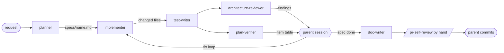

# Development Plan: four more subagents — `test-writer`, `architecture-reviewer`, `plan-verifier`, `doc-writer`

**Status:** decisions resolved 2026-09-24 — ready for implementation (T1–T5)

Scope: `.claude/agents/test-writer.md`, `.claude/agents/architecture-reviewer.md`, `.claude/agents/plan-verifier.md`,
`.claude/agents/doc-writer.md` (all new), `.claude/agents/README.md` (map update). No runtime code, no tests, no
config changes. Not created by this plan: a `security-reviewer` agent (still listed as missing in
`.claude/agents/README.md:13`), hooks (see D2/D3), a linter, dependency-cruiser rules.

## Definition of Done
- [x] Every requirement R1–R9 maps to at least one task, and every task traces to a requirement.
- [x] Every task has concrete files, `Owned paths`, `Depends-on`, skills and a measurable acceptance. Note: the recommended authoring skill `writing-for-agents` lives in `~/.claude/skills/`, not `.claude/skills/` (see D6).
- [x] Dependencies form a DAG; T1–T4 run concurrently with disjoint owned paths; T5 alone owns `README.md`.
- [x] Contracts first: the shared "agent contract" (frontmatter rules, Clarification block, severity scale, forbidden paths) is fixed in this spec (§ Shared agent contract) before T1–T4. No `@devdigest/shared` change.
- [x] Testing strategy covers the touched area (`.claude/agents/`): static frontmatter checks, validator, one smoke run per agent in a scratch worktree, and an end-to-end `plan-verifier` pass over this spec.
- [x] Nothing contradicts the skills, package `AGENTS.md`, `INSIGHTS.md`, do-not-touch list or lesson scope (no linter, no lockfile, no migration, no L02–L08 feature).
- [x] No UI/DB task, so i18n/states/migrations don't apply. Security-relevant surface = tool permissions; each agent's tool list is justified and checked by a grep acceptance.
- [x] Every decision resolved — **D1–D12 answered by the user 2026-09-24** (see § Decisions).
- [x] Every fact is evidenced or listed under Unverified.
- [x] Reviewer handoff filled in.
- [x] Spec saved at a new name (no clash), with an empty `## Delivery log`.

## Overview

`planner` and `implementer` hand work to "reviewers" that don't exist (`.claude/agents/README.md:13`), and phases 4–5 of
the AGENTS.md workflow (`AGENTS.md:66-71`: validation, review against standards and the spec, completion) are done by the
parent session alone. This plan adds four single-purpose subagents: one that **writes tests** (and nothing else), one that
**reviews layering read-only**, one that **checks code against every item of a spec with executed evidence**, and one that
**turns a spec into docs** under `docs/`/`specs/`. Non-goals: a security reviewer, automated enforcement (hooks, linter,
dependency-cruiser), e2e flow authoring, changes to the existing three agents.

## Requirements
- R1: `test-writer` writes tests for `client/` (Vitest + RTL, next to the component), `server/` (`server/test/`, `*.test.ts` hermetic, `*.it.test.ts` real Postgres) and `reviewer-core/` (`reviewer-core/test/`); writes only test files; runs the touched package's tests and typecheck; never changes production code — untestable code is reported.
- R2: `architecture-reviewer` has no Write/Edit; checks onion layering (server route → service → repository, ports & adapters; reviewer-core without DB/GitHub/FS), client placement/import boundaries, and `@devdigest/shared` mirrored in both copies. A finding = `path:line` + violated rule (skill + section) + severity + recommendation; no evidence → no finding.
- R3: `plan-verifier` checks the code against EVERY item of a spec/plan and returns a table item → done/partial/missing → evidence (`path:line`, test, command). Unconfirmed = not done. Permissions: read + run tests/typecheck.
- R4: `doc-writer` turns a spec/plan into documentation with Mermaid, using `mermaid-diagram` and `writing-for-agents`; writes only in `docs/` and `specs/` folders, following a placement map derived from the real `docs/`/`specs/` structure.
- R5: Every agent file keeps the existing format: frontmatter (`name`, `description`, `model`, `tools`, optional `permissionMode`/`maxTurns`/`skills`), a "when to call / when not" description, an explicit tool allowlist, a fixed report structure, a `## Clarification needed` block for unclear requests, hard constraints, a Definition of Done.
- R6: Each agent has a precise `description` for auto-delegation, minimal tools with a reason per tool, named skills that exist, owned and forbidden paths (Do-not-touch from `AGENTS.md:78-83`), and measurable acceptance criteria.
- R7: The new agents don't duplicate `researcher`, `planner`, `implementer`, the `pr-self-review` skill or the `code-review` skill; each states the boundary.
- R8: `.claude/agents/README.md` (the map) lists all seven agents, their tools/writes, sources and known limits.
- R9: The plan ends with an end-to-end verification step (the new `plan-verifier` run over this spec), and open questions (models, Bash for each agent, committing `.claude/agents/`, dependency-cruiser) are surfaced for the user.

## Context found

Initiation — what exists:
- Three agents, all **untracked** (`git status` → `?? .claude/agents/`; `git ls-files .claude/agents` → 0 files): `researcher.md` (sonnet; Read, Grep, Glob, Bash, WebFetch, WebSearch; no skills) — `.claude/agents/researcher.md:1-6`; `planner.md` (opus; + Write, Skill; `maxTurns: 40`; 13 preloaded skills) — `.claude/agents/planner.md:1-20`; `implementer.md` (sonnet; Edit/Write/Bash/Skill; `permissionMode: acceptEdits`; `maxTurns: 60`) — `.claude/agents/implementer.md:1-22`.
- The map `README.md` with sources S1–S8, a rule→source table and Known limits — `.claude/agents/README.md:51-85`. It says reviewer agents are missing — `.claude/agents/README.md:13` — and that write scope is prompt-enforced only, no hook — `.claude/agents/README.md:38,82`.
- Shared agent format: frontmatter first line `---`; description with trigger words (`Use BEFORE/AFTER …`, `Not for …`) — `.claude/agents/planner.md:3`, `implementer.md:3`; `## Clarification needed` block with "What I understood / Questions (default if unanswered) / What I'll do once answered" — `.claude/agents/researcher.md:31-38`; mandatory "Not found / unverified" section — `researcher.md:135`; statuses `done | partial | blocked` + DoD checklist + report template — `implementer.md:112-154`; "Don't spawn other agents" + subagents have no `AskUserQuestion` — `implementer.md:36`.
- Project skills (verified by `ls .claude/skills`): drizzle-orm-patterns, engineering-insights, fastify-best-practices, frontend-architecture, mermaid-diagram, next-best-practices, onion-architecture, postgresql-table-design, pr-self-review, react-best-practices, react-testing-library, security, typescript-expert, zod. **`tdd` and `writing-for-agents` are NOT project skills**: they exist only as user-level symlinks `~/.claude/skills/tdd -> ../../.agents/skills/tdd` and `~/.claude/skills/writing-for-agents` (verified `ls -la`).
- A single severity scale already exists: CRITICAL/HIGH/MEDIUM/LOW with per-skill mapping, "existing D1–D9 → not a finding", and "no `file:line` → drop the finding" — `.claude/skills/pr-self-review/references/severity.md:7-60`.
- Architecture baselines an arch review must not re-report: onion D1–D9 — `.claude/skills/onion-architecture/SKILL.md:193`; review checklist + grep gates — `onion-architecture/SKILL.md:208`; frontend review checklist — `.claude/skills/frontend-architecture/SKILL.md:215`; frontend accepted exceptions — `frontend-architecture/SKILL.md:228`.
- dependency-cruiser is already a server runtime dependency (`server/package.json:26`), and the onion skill says a ruleset "isn't set up" and grep lines are the gate because `AGENTS.md` forbids adding a linter — `onion-architecture/SKILL.md:226`, `AGENTS.md:41`.
- Test layout: server tests in `server/test/` (32 files, helpers `server/test/helpers/pg.ts`, `runs.ts`); reviewer-core tests in `reviewer-core/test/` (4 files); client tests next to components (44 files) — `AGENTS.md:49`; vitest includes: client `src/**/*.test.{ts,tsx}` (`client/vitest.config.ts`), server and reviewer-core `test/**/*.test.ts` + `src/**/*.test.ts`.
- `*.it.test.ts` naming is load-bearing for the CI split; a test importing `test/helpers/pg.ts` must use it — `TESTING.md:79`, `server/AGENTS.md` Conventions.
- Client test tooling: `@testing-library/react` + `jest-dom` + vitest only; **no `@testing-library/user-event`, no `msw`** (`client/package.json:27-37`); 24 test files use `fireEvent`, 17 use `vi.mock(` (grep of `client/src`).
- Docs/specs structure (for the doc-writer map): each of `client|server|reviewer-core/{docs,specs}/README.md` states purpose, "Not here → …", and "Index each document here" — e.g. `server/docs/README.md:1-5`, `client/specs/README.md:1-5`; root `docs/README.md` (cross-package deep-dives + `agent-prompts/`), root `specs/README.md:1-5` (cross-package behaviour, index every spec); `docs/research/*-plan.md` holds source research behind a spec (`specs/onion-architecture-skill.md:6`); `e2e/specs/` holds **executable** `*.flow.json` (`e2e/specs/README.md`). Mermaid blocks exist in `server/docs/review-run-lifecycle.md:11` and the root/package `README.md`s.
- Existing spec format (this file follows it): title, Status/Scope line, Problem/Overview, Behaviour, Decisions table, Files, `## Delivery log` table Phase|Record — `specs/pr-self-review-skill.md:1-72`, `specs/onion-architecture-skill.md:1-61`.
- Claude Code here is `2.1.281` (`claude --version`); `claude plugin validate [--strict] [--json] <path>` exists and validates "skills, agents, and commands in a directory" (`claude plugin validate --help`). `mmdc` is not installed (`which mmdc` → not found).

What is missing: the four agent files; README rows for them; any mechanism that enforces per-agent write scope or Bash limits.

Traps (folded into tasks below):
- Bash is not read-only (external source A). A read-only reviewer must get read-only tools, not a "please don't write" line.
- `react-best-practices` prescribes a stack the client doesn't use — `INSIGHTS.md:78`; likewise `react-testing-library` prescribes `userEvent`/MSW, which aren't installed. Adding them means a lockfile change (do-not-touch).
- Eval/smoke prompts that extend clean code don't discriminate — `INSIGHTS.md:12`. Smoke fixtures must contain a bad precedent.
- Grep checks silently return nothing in zsh when flags are in a variable — `INSIGHTS.md:86`. Acceptance greps below pass flags inline.
- `@devdigest/shared` copies have drifted on purpose; "not identical" is not a finding, only a field changed in one copy **by the diff** is — `INSIGHTS.md:51-60`.
- A `PreToolUse` Bash matcher must match the invocation, not the words — `INSIGHTS.md:100-121` (applies if D2/D3 choose a hook).

## Affected packages & contracts

| Package | Layer / folder | Change |
|---|---|---|
| repo tooling | `.claude/agents/` | 4 new agent files + README map update |
| client, server, reviewer-core, e2e | — | none (the agents act on them later) |

- Contracts: none in `@devdigest/shared`. The "contract" between agents is § Shared agent contract below.

## Design

### Where the new agents sit in the workflow



- `test-writer` is optional after `implementer` (the implementer already writes tests alongside code — `implementer.md:100`); it is for gaps, bug-reproduction tests and legacy modules.
- `architecture-reviewer` and `plan-verifier` are independent, fresh-context evaluators (separate generator from evaluator — `.claude/agents/README.md:73`); they may run in parallel because neither writes.
- Only the parent talks to the user and commits (`.claude/agents/README.md:24`).

### Boundaries against existing agents and skills (R7)

| Need | Owner | Not |
|---|---|---|
| Facts about repo/web | `researcher` | — |
| Plan | `planner` | — |
| Production code + its tests | `implementer` | `test-writer` never edits production code |
| Extra/missing tests, only test files | `test-writer` | `implementer` |
| Layering judgement, read-only, no verdict | `architecture-reviewer` | `pr-self-review` (deterministic gates + PASS/BLOCK over all skills), `security` review |
| "Is every spec item done?" with executed evidence | `plan-verifier` | `code-review` skill (diff-level standards + spec narrative); implementer's own DoD (self-check) |
| Docs from a spec | `doc-writer` | `engineering-insights` (INSIGHTS.md), Delivery log (parent) |

### Shared agent contract (applies to T1–T4)

1. Frontmatter: `---` on line 1; `name` = file stem, lowercase, hyphens, no leading `-`, no `:`; `description` single line; `tools` explicit allowlist, never omitted (omitting inherits everything); no `Agent` tool.
2. Body is self-contained (the subagent sees no conversation history) and mirrors the existing section order: role line → Hard constraints → Clarify first (the verbatim `## Clarification needed` block from `researcher.md:31-38`) → Workflow → Definition of Done → Output format.
3. Every agent reads `AGENTS.md` + the touched package's `AGENTS.md`, `INSIGHTS.md`, `docs/`, `specs/` first (`AGENTS.md:9`).
4. Every agent: "Don't spawn other agents"; reply in the request's language; no `git commit/push/checkout/reset/stash`; a mandatory "Not verified" section.
5. Forbidden paths for all four (from `AGENTS.md:78-83` + package AGENTS): `server/src/db/migrations/**`, all four lockfiles, `server/src/vendor/shared/**`, `client/src/vendor/**`, `server/clones/**`, `e2e/test-results/**`, `.claude/settings.json`, `.claude/agents/**`, `.claude/skills/**`, `AGENTS.md`/`CLAUDE.md` files. Plus per-agent lists below.
6. Severity scale for any finding: `.claude/skills/pr-self-review/references/severity.md` (Read it, don't copy it) — CRITICAL/HIGH/MEDIUM/LOW, baselines are not findings, no `path:line` → no finding.
7. Anti-sycophancy line in both evaluators, verbatim from source C: report only gaps that affect correctness or stated requirements, not style.

### The four agents (what T1–T4 must produce)

#### `test-writer` (T1)
- **Call when:** code exists and needs tests (a gap after an implementer task, a bug to pin with a failing-then-passing test, an untested helper/component/route). **Not when:** code must change to be testable (→ report, then `implementer`), e2e flows (`e2e/`, no agent owns them — see Risks), planning, review.
- **description (exact):** `Test-writing agent for DevDigest. Use AFTER code exists (an implementer task, a bug fix, or an untested module) to add or update tests in client/ (Vitest + React Testing Library, next to the component), server/ (server/test/: hermetic *.test.ts with src/adapters/mocks.ts, *.it.test.ts against real Postgres) or reviewer-core/ (reviewer-core/test/, fake LLMProvider). Writes test files only, then runs the touched package's tests and typecheck. Never changes production code: code that cannot be tested as-is is reported, not refactored. Not for e2e flows, planning or review.`
- **Frontmatter:** `model: sonnet` (D1) · `tools: Read, Grep, Glob, Edit, Write, Bash, Skill` · no `permissionMode` — default mode, each write needs approval (D8) · `maxTurns: 60`.
- **Why each tool:** Read/Grep/Glob — find code and neighbouring tests; Edit/Write — test files only; Bash — run `pnpm test`/`npm test`/typecheck (required by R1; not restrictable per command — D2); Skill — fallback if a preloaded skill failed to load (`.claude/agents/README.md:68`).
- **Skills (preload):** `react-testing-library`, `onion-architecture` (§6 "Testing by ring": mock only unmanaged deps, `.it` for repositories, `inject` for routes), `fastify-best-practices` (`rules/testing.md`, `app.inject()`), `drizzle-orm-patterns` (`.it` data setup), `zod` (contract/parse tests), `typescript-expert`, `engineering-insights`. `tdd` — see D6 (default: not preloaded).
- **Owned (may write):** `client/src/**/*.test.ts`, `client/src/**/*.test.tsx`, `server/test/**/*.test.ts` (incl. `*.it.test.ts`), `server/test/helpers/**` (test-only helpers), `reviewer-core/test/**/*.test.ts`, `<package>/INSIGHTS.md` (via `engineering-insights`). **Forbidden:** everything else, in particular any non-test file under `src/`, `vitest.config.*`, `package.json`, `client/src/test/setup.ts`, `server/src/adapters/mocks.ts` (production-side test doubles belong to the implementer), `e2e/**`, plus the shared list.
- **Must encode (gotchas):** follow repo precedent, not the RTL skill's defaults — `fireEvent` + `vi.mock` of `@/lib/hooks/<domain>`/`@/lib/api` because `user-event` and `msw` are not installed (`client/package.json:27-37`); never add a dependency. Server tests go in `server/test/`, not next to code (`AGENTS.md:49`). DB-touching test ⇒ `*.it.test.ts` (`TESTING.md:79`); run `.it` only if Docker is up, else report "not run". Hermetic mocks from `server/src/adapters/mocks.ts` (`TESTING.md` Conventions). reviewer-core: never bypass `groundFindings()`; fake `LLMProvider`, no network. Expected values from an independent source (spec, worked example) — no tautological assertions. Baseline run before writing, so pre-existing failures are separated. A test that fails because the code is wrong: keep it, mark it in the report as "finding: production bug" — don't "fix" either side.
- **Report:** `## Test report — <target>` · Status `done | partial | blocked` · DoD · Read before writing · Seams tested (public interface → test name) · Changed files (tests only) · Verification (commands + pass/fail, verbatim failure) · Untestable / needs production change (`path:line` + why + suggested seam) · Production bugs found · Insights recorded · Not verified.

#### `architecture-reviewer` (T2)
- **Call when:** after implementation, before `/pr-self-review` or a PR, on a branch / commit range / file list. **Not when:** security (→ `security` skill / future agent), style, spec compliance (→ `plan-verifier`), push gating (→ `pr-self-review`).
- **description (exact):** `Read-only architecture reviewer for DevDigest. Use AFTER a change is implemented (a branch, a commit range or a list of changed files) and BEFORE /pr-self-review or a PR, to check layering: server onion rings (route -> service -> repository, ports and adapters, composition root), reviewer-core purity (no DB, GitHub or filesystem), client placement and import boundaries (frontend-architecture), and @devdigest/shared changes mirrored in both copies. Every finding is path:line + violated rule + severity + recommendation; without evidence there is no finding. Cannot edit files. Not for security, style or spec-compliance review.`
- **Frontmatter:** `model: opus` (D1) · `tools: Read, Grep, Glob, Skill` (D3; no Write, Edit, NotebookEdit, Bash) · `maxTurns: 40`. No `permissionMode`.
- **Why:** Read/Grep/Glob are the read-only set the sub-agents docs recommend for reviewers (source A/B); the onion §9 grep gates run through the Grep tool; Skill — preload fallback. No Bash ⇒ it cannot run `git diff`: the parent passes the change set (base ref, `git diff --name-only`, and the diff saved to a scratchpad file the agent can Read). Without that input it returns `Clarification needed`.
- **Skills (preload):** `onion-architecture`, `frontend-architecture`, `next-best-practices` (only for RSC/client-boundary placement), `zod` (contract placement). Reads `pr-self-review/references/severity.md` for the scale.
- **Owned:** nothing. **Forbidden:** writing anywhere (enforced by tools).
- **Rules to encode:** review **added/changed lines only**; D1–D9 and frontend "Accepted exceptions" are baseline, not findings; a finding requires `path:line` on a changed line + rule as `<skill> §<n>` or `AGENTS.md:<line>` + severity per the shared scale + a concrete recommendation; shared-contract check = a field changed in one vendor copy but not the other **within the change set**, never pre-existing drift; optional evidence input: output of `.claude/skills/pr-self-review/scripts/gates.sh` or a dependency-cruiser run if the parent supplies it (D5). Report nothing rather than weak findings; low-confidence observations go to a separate "Questions" list, not findings.
- **Report:** `## Architecture review — <scope>` · Scope reviewed (base, files) · Summary counts per severity · Findings table `# | Severity | path:line | Rule (skill §) | What | Recommendation` · Baseline hits skipped (D-numbers) · Questions (low confidence) · Not verified (files not read, missing input).

#### `plan-verifier` (T3)
- **Call when:** implementation of a spec/plan is claimed complete (or partially) — before the Delivery log is written. **Not when:** no spec exists (→ `Clarification needed`), architecture/style review, fixing gaps.
- **description (exact):** `Spec compliance verifier for DevDigest. Use AFTER a spec or Development Plan (specs/*.md or <package>/specs/*.md) has been implemented, to check the code against EVERY requirement, task acceptance and Definition-of-Done item one by one. Returns a table item -> done | partial | missing | unverifiable with evidence (path:line, test name, command and its output). Runs tests and typecheck to obtain evidence; anything it could not confirm is not done. Changes no files. Not for architecture or style review and not for fixing gaps.`
- **Frontmatter:** `model: sonnet` (D1) · `tools: Read, Grep, Glob, Bash, Skill` · `maxTurns: 50`. No Write/Edit.
- **Why Bash:** R3 requires running tests/typecheck; evidence = executed output, not a claim (source C, Claude Code best-practices). Bash is limited by instruction to: the verify commands of `AGENTS.md` "Commands — verify", `git log/show/diff/status`, `ls`, `wc`, `date`, `grep`; no redirects, no installs, no `db:migrate`, no `db:generate` (D3).
- **Skills (preload):** `onion-architecture`, `frontend-architecture` (placement maps tell it where an item's code should be found). Nothing else — it judges presence and behaviour, not quality.
- **Owned:** nothing. **Forbidden:** writing anywhere (instruction + no Write/Edit); must not edit the spec's Delivery log.
- **Rules to encode:** enumerate items first (R#, T# acceptance, DoD bullets, Behaviour/Decisions rows for older-format specs) and print the count; one row per item, never merged; vocabulary `done` (evidence confirms all of it), `partial` (some confirmed, name the missing part), `missing` (searched, not found — say where), `unverifiable` (needs Docker/e2e/manual/LLM — counts as not done) — D9; evidence must be `path:line`, a test name that was **run and passed**, or a command + trimmed output; `.it`/e2e only if the item's acceptance names them and Docker is available (D11); verify in a fresh context from the spec + diff, not from the implementer's report.
- **Report:** `## Verification — <spec path>` · Verdict `complete | incomplete` + counts · Commands run (with results) · Table `# | Item (quoted) | Status | Evidence | Notes` · Gaps affecting correctness/requirements · Not verified.

#### `doc-writer` (T4)
- **Call when:** a spec/plan is implemented (or on request) and needs human/agent-readable docs with diagrams; when a folder index must list a new doc. **Not when:** code, tests, `INSIGHTS.md` (→ `engineering-insights`), reviewer prompts (`docs/agent-prompts/` pair with the DB — `AGENTS.md` Conventions), package `README.md`s, the Delivery log (parent).
- **description (exact):** `Documentation agent for DevDigest. Use AFTER a spec or Development Plan is implemented, or when asked to document one, to turn it into docs-as-code: package deep-dives in <package>/docs/, behaviour specs in <package>/specs/ or root specs/, cross-package docs in docs/, with Mermaid diagrams chosen by the question they answer, and the folder README index updated. Writes only Markdown under docs/ and specs/ folders. Not for code, tests, INSIGHTS.md, reviewer prompts, package READMEs or the Delivery log.`
- **Frontmatter:** `model: sonnet` (D1) · `tools: Read, Grep, Glob, Edit, Write, Skill` (no Bash — D3) · no `permissionMode` — default mode (D8) · `maxTurns: 40`.
- **Skills (preload):** `mermaid-diagram`, `writing-for-agents` (user-level — D6).
- **Owned:** `docs/**/*.md`, `specs/**/*.md`, `client|server|reviewer-core|e2e/docs/**/*.md`, `client|server|reviewer-core/specs/**/*.md`. **Forbidden:** `docs/agent-prompts/**`, `docs/skill-fixtures/**`, `e2e/specs/*.flow.json` (executable), `e2e/specs/README.md` (flow coverage table — owned by whoever adds a flow), every `README.md` outside `docs/`/`specs/`, every `INSIGHTS.md`, `AGENTS.md`/`CLAUDE.md`, plus the shared list. Never overwrites an existing doc without being asked; extends it.
- **Placement map to encode (derived from the real folders; Diátaxis labels are our inference, source D):**

| Content in the spec | Diátaxis type | Goes to | Evidence |
|---|---|---|---|
| Why/how a mechanism works inside one package (lifecycle, algorithm, trade-offs) | explanation | `<package>/docs/<kebab>.md` + index row in `<package>/docs/README.md` | `server/docs/README.md:1-5`, `server/docs/review-run-lifecycle.md` |
| Step-by-step procedure for contributors (write a flow, add a kind) | how-to | `<package>/docs/<kebab>.md` | `e2e/docs/writing-flows.md` |
| Intended behaviour of one package: case tables, contracts, error cases | reference | `<package>/specs/<kebab>.md` + index row | `reviewer-core/specs/grounding.md` (G1–G11), `client/specs/README.md:1-5` |
| Behaviour or contract spanning packages | reference | root `specs/<kebab>.md` + index row in `specs/README.md` | `specs/README.md:1-5` |
| Deep-dive spanning packages | explanation | root `docs/<kebab>.md` + row in `docs/README.md` | `docs/README.md` |
| Source research behind a spec/skill | reference (sources) | `docs/research/<name>-plan.md` | `specs/onion-architecture-skill.md:6` |
| Decisions and their reasons | ADR-lite | the spec's `## Decisions` table (no `adr/` folder exists; don't create one — D10) | `specs/pr-self-review-skill.md:33-46` |
| Tutorials | tutorial | none exist; don't create unasked | `ls docs */docs` |
| Route/API maps, env tables | — | package `README.md` — **not doc-writer**; report as a suggestion | `client/docs/README.md` "Not here" line |

- **Mermaid rules to encode:** diagram type by question (flow/decision → `flowchart`; calls over time → `sequenceDiagram`; tables → `erDiagram`; lifecycle → `stateDiagram-v2`; types → `classDiagram`); only these five keywords (GitHub renders its own pinned Mermaid version, newer types may not render — source D); ≤ ~20 nodes; quote labels with parentheses/braces; never a bare `end` as a node id/label; `mmdc` isn't installed, so the report states "syntax not rendered" unless the parent renders it.
- **Report:** `## Docs report — <source spec>` · Files written (path → Diátaxis type → why here) · Index rows added · Diagrams (file, type, question it answers) · Suggestions outside my scope (READMEs, INSIGHTS, AGENTS.md) · Not verified (rendering).

## Phased tasks

### Phase 1 — agent files (concurrent)

- **T1** (covers R1, R5, R6, R7)
  - **Action:** Create `.claude/agents/test-writer.md` per § The four agents → `test-writer` and § Shared agent contract.
  - **Package / Type:** repo tooling — agent definition
  - **Skills to use:** `writing-for-agents` (user-level, D6), `react-testing-library`, `onion-architecture` (to cite §6 correctly)
  - **Owned paths:** `.claude/agents/test-writer.md`
  - **Depends-on:** none (decisions D1, D2, D6, D8 applied if answered; defaults otherwise)
  - **Risk:** medium (Bash + Write; scope is instruction-only)
  - **Known gotchas:** no `user-event`/`msw` in client (`client/package.json:27-37`); server tests in `server/test/` (`AGENTS.md:49`); `.it` suffix (`TESTING.md:79`); zsh word-splitting in greps (`INSIGHTS.md:86`).
  - **Acceptance:** `head -1 .claude/agents/test-writer.md` prints `---`; `grep -m1 '^name:' .claude/agents/test-writer.md` prints `name: test-writer`; `grep -E '^tools:' .claude/agents/test-writer.md` prints exactly `tools: Read, Grep, Glob, Edit, Write, Bash, Skill`; `grep -c 'Clarification needed' .claude/agents/test-writer.md` ≥ 1; `grep -cE 'fireEvent|user-event' .claude/agents/test-writer.md` ≥ 1; the file names every owned and forbidden path listed above.

- **T2** (covers R2, R5, R6, R7)
  - **Action:** Create `.claude/agents/architecture-reviewer.md` per § `architecture-reviewer`.
  - **Package / Type:** repo tooling — agent definition
  - **Skills to use:** `writing-for-agents`, `onion-architecture`, `frontend-architecture`
  - **Owned paths:** `.claude/agents/architecture-reviewer.md`
  - **Depends-on:** none
  - **Risk:** low
  - **Known gotchas:** baselines D1–D9 and frontend accepted exceptions are not findings (`onion-architecture/SKILL.md:193`, `frontend-architecture/SKILL.md:228`); shared-copy drift is intentional (`INSIGHTS.md:51`).
  - **Acceptance:** `grep -E '^tools:' .claude/agents/architecture-reviewer.md` prints `tools: Read, Grep, Glob, Skill` (or the D3-chosen list); `grep -E '^tools:' .claude/agents/architecture-reviewer.md | grep -cE 'Write|Edit|NotebookEdit'` prints `0`; no `permissionMode` line; body contains the findings table header `Severity | path:line | Rule` and the anti-sycophancy sentence.

- **T3** (covers R3, R5, R6, R7, R9)
  - **Action:** Create `.claude/agents/plan-verifier.md` per § `plan-verifier`.
  - **Package / Type:** repo tooling — agent definition
  - **Skills to use:** `writing-for-agents`, `typescript-expert` (verify-command semantics only)
  - **Owned paths:** `.claude/agents/plan-verifier.md`
  - **Depends-on:** none
  - **Risk:** medium (Bash)
  - **Known gotchas:** older specs have no R#/T# (e.g. `specs/pr-self-review-skill.md` uses Behaviour/Decisions) — the agent must enumerate those rows instead; `.it` tests self-skip without Docker (`TESTING.md` server-integration) — a skipped suite is `unverifiable`, not `done`.
  - **Acceptance:** `grep -E '^tools:'` prints `tools: Read, Grep, Glob, Bash, Skill`; `... | grep -cE 'Write|Edit'` prints `0`; body defines exactly the statuses `done`, `partial`, `missing`, `unverifiable` and the table header `Item | Status | Evidence`.

- **T4** (covers R4, R5, R6, R7)
  - **Action:** Create `.claude/agents/doc-writer.md` per § `doc-writer`, including the placement map table and Mermaid rules.
  - **Package / Type:** repo tooling — agent definition
  - **Skills to use:** `writing-for-agents`, `mermaid-diagram`
  - **Owned paths:** `.claude/agents/doc-writer.md`
  - **Depends-on:** none
  - **Risk:** low
  - **Known gotchas:** `docs/agent-prompts/*` must change together with `agents.system_prompt` in the DB (`AGENTS.md` Conventions) — forbidden for this agent; every docs/specs folder requires an index row (`*/docs/README.md:5`, `*/specs/README.md:5`).
  - **Acceptance:** `grep -E '^tools:'` prints `tools: Read, Grep, Glob, Edit, Write, Skill`; `... | grep -c Bash` prints `0`; body contains the placement table with every row above and the five-keyword Mermaid allowlist.

### Phase 2 — map

- **T5** (covers R8)
  - **Action:** Update `.claude/agents/README.md`: 4 rows in "Set at a glance"; replace the "Not covered yet" line (`README.md:13`) with "Not covered yet: security review agent"; extend "How they fit together" with the Design flow; one section per new agent (Responsibility, Permissions, Skills, Input, Output) in the existing style; add sources A–D from this spec to "Sources behind the rules" with their trust level; extend "Known limits" (Bash not read-only for `test-writer`/`plan-verifier`; write scope instruction-only; user-level skills from D6; smoke-only verification).
  - **Package / Type:** repo tooling — docs of agents
  - **Skills to use:** `writing-for-agents`, `mermaid-diagram` (if the ASCII flow is converted — keep ASCII by default, matching the file)
  - **Owned paths:** `.claude/agents/README.md`
  - **Depends-on:** T1, T2, T3, T4
  - **Risk:** low
  - **Known gotchas:** the README says the rules live in each agent file — don't duplicate them (`README.md:3`).
  - **Acceptance:** `grep -cE '^\| \[`(test-writer|architecture-reviewer|plan-verifier|doc-writer)`\]' .claude/agents/README.md` prints `4`; tools/model columns match each file's frontmatter exactly (checked by eye against `grep -E '^(model|tools):' .claude/agents/*.md`).

- **T6** (**N/A — D2/D3 chose (a)**; covers R6; **conditional — only if D2 or D3 chooses option (b)**)
  - **Action:** Add an agent-scoped `PreToolUse` guard (frontmatter `hooks:` in the agent file, if 2.1.281 supports it — Unverified) that (1) for `test-writer` rejects `Edit|Write` whose `file_path` isn't a test glob from T1, and (2) for `test-writer`/`plan-verifier` rejects Bash commands that are not an allowed invocation (verify commands, read-only git, `ls|wc|date|grep`) or that contain `>`/`>>`/`tee`/`sed -i` outside quoted data. Matcher strips heredocs and quoted spans before matching.
  - **Package / Type:** repo tooling — hook
  - **Skills to use:** `security`, `writing-for-agents`
  - **Owned paths:** `.claude/agents/test-writer.md`, `.claude/agents/plan-verifier.md` (frontmatter only), `.claude/agents/hooks/<script>` (new)
  - **Depends-on:** T1, T3, T5
  - **Risk:** high (a false block breaks the agent; `INSIGHTS.md:100-121`)
  - **Known gotchas:** match an invocation, not words (`INSIGHTS.md:100`); a guard that cannot run must fail closed and say so (`INSIGHTS.md:169`); a project-level `.claude/settings.json` hook would also hit `implementer` and the parent — don't put it there.
  - **Acceptance:** a matcher self-test table (like `pr-self-review/scripts/match-publish-command.py`) with ≥ 10 allow and ≥ 10 deny cases passes; a live `@agent-test-writer` asked to edit `client/src/lib/format-cost.ts` is refused by the hook.

### Phase 3 — validation (parent session; no owned paths, scratch worktree for smoke runs)

- **T7** (covers R5, R6) — static checks
  - **Action:** restart Claude Code; `/agents` lists all 7; `claude plugin validate --strict .claude` (path form Unverified — try `.claude/agents` if that fails) exits 0; `claude --debug` shows no "skipped agent" warning; `/doctor` reports no duplicate names.
  - **Depends-on:** T5 · **Risk:** low
  - **Acceptance:** the four outputs above pasted into the Delivery log.

- **T8** (covers R1–R4) — one smoke run per agent via `@agent-<name>`, in a scratch git worktree so nothing lands on the branch; `git status --porcelain` before/after.
  - `test-writer` S1: "add tests for `client/src/lib/format-cost.ts`" → only `client/src/lib/format-cost.test.ts` appears; report shows `pnpm test` and `pnpm typecheck` run and passing. S2: "add tests for `server/src/modules/settings/helpers.ts`" → only `server/test/settings-helpers.test.ts`; unit lane + `pnpm typecheck` run. S3 (negative): ask for a test that needs a non-exported function → no production diff, item listed under "Untestable".
  - `architecture-reviewer` S1 (bad precedent, per `INSIGHTS.md:12`): parent seeds a diff with (a) a new `container.db` query inside `server/src/modules/pulls/routes.ts`, (b) `fetch(` inside a client component, (c) a new field in `server/src/vendor/shared/` only → exactly these 3 findings, each with `path:line`, rule, severity; the pre-existing D1 handlers in the same file are **not** reported. S2 (control): a clean pure-helper + test diff → 0 findings. `git status` unchanged by the agent.
  - `plan-verifier` S1: `client/specs/run-severity-filter.md` on the current tree → every item has a row, evidence present, `pnpm test` actually executed. S2: same spec with the filter logic removed in the scratch worktree → the affected row is `missing` or `partial`.
  - `doc-writer` S1: "document `server/specs/run-history.md` as a server deep-dive" → new file under `server/docs/`, row added to `server/docs/README.md`, every ```` ```mermaid ```` block's first line starts with one of the five allowed keywords; `git status` shows only files under `docs/`/`specs/`.
  - **Depends-on:** T7 · **Risk:** medium
  - **Acceptance:** each scenario's expected outcome met; results in the Delivery log.

- **T9** (covers R9) — end-to-end: run `@agent-plan-verifier` on this spec after T1–T8.
  - **Depends-on:** T8 · **Risk:** low
  - **Acceptance:** verdict `complete`, or every non-`done` row explained (T6 may be `n/a` if D2/D3 chose (a)).

## Testing strategy

- No package code changes, so no package test suite is required by this plan. The artefacts are Markdown agent definitions; they are verified by: T1–T5 grep acceptances (flags inline, run under `bash` if in doubt — `INSIGHTS.md:86`), T7 validator/`/agents`/`--debug`, T8 smoke runs, T9 plan-verifier.
- The smoke runs exercise the real verify commands (`AGENTS.md` "Commands — verify"): `cd client && pnpm test && pnpm typecheck`; `cd server && pnpm exec vitest run --exclude '**/*.it.test.ts' && pnpm typecheck`; `cd reviewer-core && npm test && npm run build`. `.it` tests and `./scripts/e2e.sh` are validation-phase only and not required here.
- Smoke-run artefacts (new test files, new docs) stay in the scratch worktree unless the parent decides to keep them.

## Risks & traps

- Bash is not read-only: `test-writer` and `plan-verifier` can write via redirects despite instructions → D2/D3; parent checks `git status` after every run (as for planner, `.claude/agents/README.md:38`).
- Write scope of `test-writer`/`doc-writer` is instruction-only (same known limit as planner/implementer, `.claude/agents/README.md:82`) → T6 optional; post-run `git status`.
- `react-testing-library` pushes `userEvent`/MSW; installing them changes a lockfile (do-not-touch) → T1 encodes repo precedent.
- Evaluator sycophancy / "always finds something" (source C) → anti-sycophancy line; S2 control smoke must return 0 findings.
- Overlap with `pr-self-review` (onion greps, severity) and the `code-review` skill (spec axis) → boundary table; architecture-reviewer reuses the same severity file so the scales can't drift.
- Preloading many skills inflates context (`.claude/agents/README.md:83`) → each new agent preloads ≤ 7 skills.
- User-level skills (`tdd`, `writing-for-agents`) are absent on another machine; a missing preloaded skill only logs a debug warning (`.claude/agents/README.md:68`) → D6.
- No agent owns e2e flow authoring (`e2e/specs/*.flow.json`); `implementer` covers it per task. Out of scope; noted.
- `e2e/specs/README.md` coverage table has no row for `09-conventions.flow.json` — out of scope, noted for whoever touches e2e.
- `plan-verifier` running tests while an implementer edits the same tree gives false failures → run it only after implementation finishes.

## Decisions (resolved by the user, 2026-09-24)

**Outcome:** D1–D7, D9–D12 = the recommended default; **D8 changed** to default `permissionMode` (no `acceptEdits`) for `test-writer` and `doc-writer`; D2/D3 = option (a), so **T6 is n/a**; D4 = yes, one commit on `lesson-03-laba`, the parent asks once more right before committing. The text below keeps the original options for the record.

- **D1 — model per agent.** Recommended default: `test-writer` sonnet · `architecture-reviewer` opus (judgement-heavy, precision matters more than cost) · `plan-verifier` sonnet (mechanical enumeration + commands) · `doc-writer` sonnet.
- **D2 — `test-writer` Bash.** It cannot meet R1 without running tests. Options: (a) Bash with an instruction-only allowlist (verify commands, read-only git, `ls/wc/date`) + parent checks `git status` — same as `implementer`; (b) (a) + an agent-scoped `PreToolUse` hook (T6) that allows only those invocations and blocks `Edit/Write` outside test globs — **per-command `Bash(...)` rules in an agent's `tools` field are NOT confirmed by the docs, and frontmatter `hooks:` support in 2.1.281 is Unverified**; (c) no Bash, parent runs the tests — breaks R1. Recommended default: **(a) now, (b) as a follow-up** once hook support is verified (hooks are deferred course material, `.claude/agents/README.md:82`).
- **D3 — Bash for `architecture-reviewer` and `plan-verifier`.** `architecture-reviewer`: recommended default **no Bash** (strict read-only by tool list; the parent passes base ref + file list + diff file); alternative: Bash for `git diff` only, instruction-enforced. `plan-verifier`: **Bash required** by R3; default instruction-only restriction (no redirects, no installs, no migrations), optional hook as in D2(b). `doc-writer`: default **no Bash** (needs none; date comes from the environment/parent).
- **D4 — commit `.claude/agents/`?** Currently untracked, including the user's three existing agents. Recommended default: yes, one slice on `lesson-03-laba` containing all of `.claude/agents/` plus this spec — **after the user confirms**, since the existing files are the user's work.
- **D5 — dependency-cruiser.** Recommended default: **no.** It's already a dependency (`server/package.json:26`), but a ruleset is a linter by another name (`AGENTS.md:41`, `onion-architecture/SKILL.md:226`). The reviewer may *read* its output if the parent supplies it.
- **D6 — user-level skills.** `tdd`: recommended **not preloaded** — its loop rules ("red before green", "confirm seams with the user") contradict a test-after, no-user subagent; the agent body keeps its two transferable rules (test public seams, no tautological assertions) and may load it via `Skill`. `writing-for-agents`: recommended **preloaded in `doc-writer`** (docs here are read by agents: `AGENTS.md:9`) and used by the implementer for T1–T5, with a Known-limits note that it's user-level; alternative: vendor it into `.claude/skills/` (separate, unasked task).
- **D7 — severity scale.** Recommended: reuse `.claude/skills/pr-self-review/references/severity.md` by reference (one scale repo-wide).
- **D8 — `permissionMode`.** **DECIDED: none (default mode) for all four** — differs from `implementer` (`acceptEdits`) on purpose. Original recommendation: `acceptEdits` for `test-writer` (like implementer) and `doc-writer`; none for the two read-only agents.
- **D9 — status vocabulary.** Recommended: `done | partial | missing | unverifiable` (the 4th is our addition; it counts as not done).
- **D10 — ADR folder for doc-writer.** Recommended: none; decisions stay in the spec's `## Decisions` table.
- **D11 — `.it`/e2e in `plan-verifier`.** Recommended: only when an item's acceptance names them and Docker is available; otherwise `unverifiable`.
- **D12 — pointer in root `AGENTS.md` "Use when" to `.claude/agents/README.md`.** Recommended: not in this change (scope); propose separately.

## Handoff to reviewers

- Architecture reviewer: agent boundaries don't overlap (§ Boundaries table); forbidden-path lists match `AGENTS.md:78-83`; doc-writer placement map matches the real folders; nothing adds a linter/hook/dependency unasked.
- Security reviewer: least-privilege tool lists (architecture-reviewer has no Write/Edit/Bash; doc-writer no Bash); Bash-bearing agents (`test-writer`, `plan-verifier`) have explicit command allowlists and forbid redirects, installs, migrations, git writes; if T6 is built, the matcher fails closed and strips quoted data before matching; no agent can edit `.claude/settings.json`, `.claude/agents/**` or `.claude/skills/**`.

## Unverified

- Whether 2.1.281 supports `hooks:` in subagent frontmatter, and whether hook input identifies the calling subagent (needed for T6 and for a settings-level hook scoped to one agent). Not in the researcher's source A.
- Whether `Bash(<pattern>)` per-command rules work inside an agent's `tools` field (source A: not confirmed).
- Exact path argument for `claude plugin validate` on project agents (`.claude` vs `.claude/agents`); only `--help` was run.
- Whether `disallowedTools` is honoured in 2.1.281 (documented per source A; not tested here) — not relied on.
- Whether user-level skills (`~/.claude/skills/*`) resolve in a project agent's `skills:` list (likely, not tested).
- Whether new agent files in an existing `.claude/agents/` need a restart (source A says the first agent in a new folder does; T7 restarts anyway).
- GitHub's currently pinned Mermaid version (source D says it's pinned; version not checked).
- `TESTING.md:83` says `server/package.json` is `skip-worktree`, but `git ls-files -v server/package.json` prints `H` (not `S`) in this checkout — irrelevant to this plan, noted.

## Sources

External practice researched by four `researcher` runs (fetched 2026-09-24). Trust: primary = official docs; secondary = vendor/blog; "ours" = a design choice no source prescribes.

| Id | Topic | Sources | Trust | Used for |
|---|---|---|---|---|
| A | Writing subagents | [sub-agents](https://code.claude.com/docs/en/sub-agents), [best-practices](https://code.claude.com/docs/en/best-practices) | primary | only `name`/`description` required; description drives delegation; `tools` allowlist (omit = inherit all); `disallowedTools` applied first; reviewers → `Read, Grep, Glob`; **Bash is not read-only**; `skills:` injects full bodies, not inherited from parent; body is the whole system prompt (self-contained); `model` values; `@agent-<name>`; `claude plugin validate`; `--debug` silent skips; `/doctor` duplicates. Unknown: official prompt template, "one job per agent" rule (inferred), subagent evals |
| B | Read-only review | sub-agents docs (primary); [dependency-cruiser rules](https://github.com/sverweij/dependency-cruiser/blob/main/doc/rules-reference.md), [ArchUnit](https://www.archunit.org/userguide/html/000_Index.html) (primary, tool docs) | primary / low for hallucination claims | read-only via tool list, not prompt text; deterministic checks as optional evidence (D5). Finding schema path:line + rule + severity + recommendation = ours. No data on LLM architecture-review precision |
| C | Spec verification | Claude Code best-practices (primary); Jama RTM (secondary); [GitHub Spec Kit](https://github.com/github/spec-kit/blob/main/spec-driven.md) | primary / secondary | one row per item with method + result; evidence = executed output; fresh-context verifier; "report only gaps that affect correctness or stated requirements, not style"; spec ends with an end-to-end verification step (T9). `done/partial/missing/unverifiable` = ours |
| D | Docs-as-code | [Diátaxis](https://diataxis.fr/), [ADR](https://adr.github.io/), [Mermaid syntax](https://mermaid.js.org/intro/syntax-reference.html), [GitHub diagrams](https://docs.github.com/en/get-started/writing-on-github/working-with-advanced-formatting/creating-diagrams), [Write the Docs: docs as code](https://www.writethedocs.org/guide/docs-as-code/), [C4](https://c4model.com/diagrams), [agents.md](https://agents.md/), [Claude memory](https://code.claude.com/docs/en/memory) | primary; type-by-question mapping secondary (medium) | placement map; Mermaid pitfalls (`end`, braces, quoting); GitHub's pinned Mermaid version → keyword allowlist; concrete, checkable instructions. Spec → Diátaxis mapping = ours; docs-sync automation only in vendor blogs |

## Delivery log

| Phase | Record |
|---|---|
| Initiation / Planning | Spec written, D1–D12 resolved 2026-09-24 (T6 n/a). |
| Implementation | T1–T5 done: `.claude/agents/{test-writer,architecture-reviewer,plan-verifier,doc-writer}.md` + README map (4 rows). Not committed yet (D4: parent asks once more first). |
| Validation — static (T7) | Acceptance greps of T1–T5 pass (tools lists exact; no Write/Edit in `architecture-reviewer` and `plan-verifier`; no Bash in `doc-writer`; 4 README rows; `tdd` and `writing-for-agents` exist at user level). `claude plugin validate --strict .claude` and `… .claude/agents` → `✔ Validation passed` (run from repo root). `/agents` list, `--debug` and `/doctor` not checked (interactive). |
| Amendment 2026-09-24 | `specs/agent-improvements.md` "Do first" items were applied on top of T1–T5, so the agent files no longer match parts of this spec: `plan-verifier` statuses are now `PASS \| PARTIAL \| MISSING \| UNVERIFIED` (D9, T3 acceptance and the T8 wording use the old `done/partial/missing/unverifiable`), its Bash scope grew (baseline commands, `diff`, `printf \| sort \| uniq -c`), `architecture-reviewer` requires a diff file, `planner` writes task cards. Read the agent files as the current truth. |
| Validation — smoke (T8), reduced | Two runs, both on the **pre-amendment** agent definitions (the session loaded them at start; later edits need a restart). `plan-verifier` on `client/specs/run-severity-filter.md`: 18 items, 17 done + 1 unverifiable (e2e `04`, needs Docker), `client` typecheck and 209/209 tests executed, no files changed. `architecture-reviewer` on commit `f2ccf0e` (server, 26 files, diff file as input): 0 CRITICAL/HIGH, 4 MEDIUM with `path:line` (three spot-checked true: `run-executor.ts:268` config read, `intent/repository.ts:26` inline row type, `upsertIntent` without `workspaceId`); baselines D2/D3/D4/D7 skipped, new ports had mocks. **Not run:** `test-writer` and `doc-writer` smokes, the seeded bad-precedent and clean-control scenarios, and every new rule from the amendment (command-derived counts, `PASS/…` vocabulary, required diff file). |
| End-to-end (T9) | Not run: needs a restart so `plan-verifier` uses the amended definition. |
