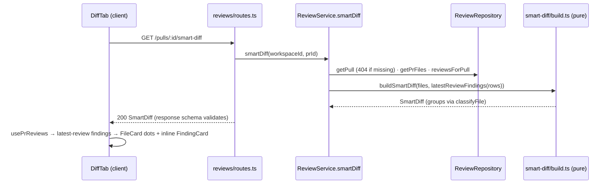

# Development Plan: Smart Diff (Files changed grouped by role, findings inline)
**Status:** needs decisions

## Definition of Done
- [x] Every requirement maps to a task and every task traces to a requirement.
- [x] Every task has files, owned paths, an executor, depends-on, existing skills, and a measurable acceptance.
- [x] Dependencies form a DAG. The pipeline runs sequentially, so no two tasks run concurrently. `client/messages/en/prReview.json` is owned by T1 and then T4, and T4 depends on T1.
- [x] Contracts come first (T1). Both `vendor/shared` copies are named, and editing the existing `SmartDiffRole` is called out.
- [x] The testing strategy covers server and client. The `.it` test and the manual check happen in the validation phase.
- [x] Nothing contradicts the skills, AGENTS.md, INSIGHTS or the do-not-touch list.
- [x] UI tasks cover i18n and the loading/empty/error states. There is no DB schema change. Security checks are named.
- [ ] Every decision is resolved: 4 open decisions remain, each with a recommended default (see "Open decisions").
- [x] Every fact is evidenced or listed under "Unverified".
- [x] Reviewer handoff is filled in.
- [x] The spec is saved with an empty Delivery log, and the task cards are saved next to it.

## Overview
The "Files changed" tab currently shows files in raw GitHub order. Smart Diff sorts the PR's files into five role groups (core, tests, wiring, docs, boilerplate) so the reviewer reads the logic first and noise last. It also shows the latest review's findings inline, under the line they cite. Roles come from a pure, deterministic path classifier that has no HTTP or DB dependency, so a later lesson can reuse it as a prompt filter. A new `GET /pulls/:id/smart-diff` returns the grouping and makes no LLM call.
**Non-goals:** LLM `pseudocode_summary`; real `proposed_splits` or `too_big` logic; a new e2e flow; any DB schema change; promoting `FindingCard` to `src/components/`.

## Requirements
- R1: Pure `classifyFile(path): SmartDiffRole` in `server/src/modules/reviews/smart-diff/`. Patterns and rule order live in `constants.ts` and the first matching rule wins. The order is boilerplate > tests > wiring > docs > core, with the exact patterns from the assignment. The function has no HTTP or DB import. A "path → role" test table is written first and includes the 3 disputed cases.
- R2: `SmartDiffRole` grows from 3 to 5 roles (`core, tests, wiring, docs, boilerplate`), identically in both `vendor/shared/contracts/brief.ts` copies.
- R3: i18n: add `testsLabel`, `docsLabel`, `smartOrder` and `originalOrder` (plus later UI labels) under `prReview.smartDiff`.
- R4: `GET /pulls/:id/smart-diff` returns the PR files grouped in the fixed role order, with `finding_lines` taken from the latest review's findings (`start_line`). It returns a minimal `split_suggestion` and its response is validated by the `SmartDiff` schema. It makes no LLM call, works before any review, and follows the route → service → repository layering.
- R5: The client's Files changed tab renders groups in the order core → tests → wiring → docs → boilerplate. Each group header shows the role label and "N files". Docs and boilerplate groups start collapsed; in the other groups, files follow `AUTO_EXPAND_MAX_LINES`. A Smart order / Original order toggle switches views.
- R6 (P1): `DiffTab` calls `usePrReviews(prId)`. A group header shows a dot plus the count of files that have findings. `FileCard` shows a dot (no number) next to the path, separate from the GitHub comment count. Under line `RIGHT:${start_line}`, a finding card reuses `FindingCard` (severity, title, rationale, Accept/Dismiss via `useFindingAction`).
- R7 (P2): Each finding line gets a coloured stripe plus a blocker/warning/suggestion label. A finding whose line is not in the patch appears in an end-of-file block. The existing comments toggle also hides findings.
- R8 (P3): Sticky group header, collapsible finding card, an empty state before the first review, live refresh after Run review, and all new labels from `prReview.smartDiff`.
- R9: Test PR fixtures (PR-A main demo, PR-B edge cases), described as a non-code task.
- R10: Tests next to the code, typecheck for server and client, and compliance with AGENTS.md.

## Context found
- The current contract is `SmartDiffRole = z.enum(['core','wiring','boilerplate'])`, and `SmartDiff`/`SmartDiffGroup`/`SmartDiffFile` already have `finding_lines` and `split_suggestion` — `server/src/vendor/shared/contracts/brief.ts:118-151`. The client copy is byte-identical (checked with `diff`).
- The only consumer of `SmartDiff` roles is a parse test with `role:'core'` — `server/test/contracts.test.ts:112-123`. The client only re-exports the type — `client/src/lib/types.ts:35`.
- Existing i18n keys are `smartDiff.coreLabel/wiringLabel/boilerplateLabel/filesCount/findingLines/groupedByRole/largeTitle/largeBody` — `client/messages/en/prReview.json:62-71`.
- The reviews module has `routes.ts`, `service.ts` (class `ReviewService(container)`, pattern D3) and `repository.ts`, which wraps `repository/pull.repo.ts` and `review.repo.ts` — `server/src/modules/reviews/`.
- These repository methods already exist: `getPull(workspaceId, prId)`, `getPrFiles(prId)` (**no ORDER BY**) and `reviewsForPull(prId)` (newest first, with findings) — `server/src/modules/reviews/repository.ts:32-66`, `repository/pull.repo.ts:28-33`, `repository/review.repo.ts:73-96`.
- The service already has a workspace-scoped read that throws `NotFoundError` — `server/src/modules/reviews/service.ts:162-175`.
- The route pattern with a response schema is `{ schema: { params: IdParams, response: { 200: X } } }` — `server/src/modules/intent/routes.ts:17-24`. The reviews routes register in `reviews/routes.ts` via `getContext` + service.
- `pr_files` has `path`, `additions`, `deletions`, `patch` — `server/src/db/schema/pulls.ts:36-45`. `findings` has `file`, `startLine`, `severity`, `dismissedAt` — `server/src/db/schema/reviews.ts:29-50`. `reviews.kind` is `'summary' | 'review'` — `reviews.ts:20`.
- `Severity = 'CRITICAL' | 'WARNING' | 'SUGGESTION'` — `server/src/vendor/shared/contracts/findings.ts:11`. `ReviewRecord` has `kind`, `created_at` and `findings: FindingRecord[]` — `contracts/review-api.ts:25-44`.
- `DiffTab` takes `{prId, filesCount, files, canComment}`, owns `showComments` and renders `<DiffViewer files commenting>` — `client/src/app/repos/[repoId]/pulls/[number]/_components/DiffTab/DiffTab.tsx`.
- `FileCard` sets its open state from `AUTO_EXPAND_MAX_LINES` (200), shows the comment count in the header, and calls `keysForLine` + `partitionThreads` — `client/src/components/diff-viewer/FileCard/FileCard.tsx:33-75`, `constants.ts:4`, `comments.ts:63-107`.
- `FindingCard` is route-local, with props `{f, focused, defaultExpanded, onAction, pending, repoFullName, headSha}` — `.../_components/FindingCard/FindingCard.tsx:26-43`. **`src/components/` may not import from `app/`** (frontend-architecture §8).
- `usePrReviews`, `useFindingAction` (invalidates reviews) and `reviewKeys` live in `client/src/lib/hooks/reviews.ts:80,190`. `PrDetailView` `onRunDone` calls `refetchReviews()` — `.../PrDetailView/PrDetailView.tsx:152-156` — so a `usePrReviews` in `DiffTab` refreshes live through the shared query key.
- INSIGHTS traps: the client has no `user-event`, so tests use `fireEvent` (`client/INSIGHTS.md:77`). A state-dependent `borderColor` next to `borderLeftColor` triggers a React warning (`client/INSIGHTS.md:84`). The shared copies are hand-synced and the client has drifted (`INSIGHTS.md:51`), so edit only `brief.ts`.

## Affected packages & contracts
| Package | Layer / folder | Change |
|---|---|---|
| server | domain `modules/reviews/smart-diff/` (`classify.ts`, `build.ts`, `constants.ts`) | new pure classifier + builder |
| server | application `reviews/service.ts`; driving `reviews/routes.ts` | `smartDiff()` method + `GET /pulls/:id/smart-diff` |
| server/client | `vendor/shared/contracts/brief.ts` (both) | `SmartDiffRole` 3 → 5 values (**edits an existing shared contract**; additive enum widening) |
| client | `lib/api.ts`? (hooks call `api.get` directly), `lib/hooks/reviews.ts` | `useSmartDiff` + `reviewKeys.smartDiff` |
| client | route `DiffTab/` (+ `helpers.ts`, `constants.ts`, `_components/SmartDiffGroup/`) | grouping, toggle, group header |
| client | shared `components/diff-viewer/` (`findings.ts`, `FileCard`, `CodeLine`, `DiffViewer`, `index.ts`, new `OutsideFindings/`) | inline findings via an injected API |
| client | `messages/en/prReview.json` | new `smartDiff.*` keys |
- Contracts: `brief.ts` in `server/src/vendor/shared/contracts/` **and** `client/src/vendor/shared/contracts/`. Only the `SmartDiffRole` line changes. No DB schema or migration change.

## Design

- **Server placement (onion-architecture):** `classify.ts`, `build.ts` and `constants.ts` are domain and import only `@devdigest/shared` and each other. The `smart-diff/` subfolder is the assignment's required location, and it holds only pure files, so it adds no ring. There is no new repository method: the service reuses `getPull`/`getPrFiles`/`reviewsForPull`, so repository tests stay unchanged. The service method goes on the existing `ReviewService` (D3 stays as is; nothing new is copied from it).
- **`buildSmartDiff(files, findings)`** takes plain `{path, additions, deletions}[]` and `{file, start_line}[]`. It builds one group per role in `ROLE_ORDER`, **omitting empty groups** (open decision 1). Within a group, files are sorted by path. `finding_lines` holds the unique ascending `start_line` values of findings with `file === path`. `pseudocode_summary` is omitted. `split_suggestion = {too_big:false, total_lines: Σ(additions+deletions), proposed_splits: []}`.
- **"Latest review"** means the newest `reviews` row with `kind === 'review'` (by `created_at`; `reviewsForPull` is already newest-first). With no such row, every file gets `finding_lines: []`. Dismissed findings are kept (open decision 2). The client helper `latestReviewFindings(reviews)` applies the same rule to `ReviewRecord[]`.
- **Client placement (frontend-architecture):** `components/diff-viewer/` may not import the route-local `FindingCard`. So `DiffViewer`/`FileCard` receive an optional `findings?: DiffFindingApi` prop, next to `commenting`: `{ byFile: Record<string, FindingRecord[]>; show: boolean; FindingView: React.ComponentType<{ finding: FindingRecord }> }`. `DiffTab` supplies `FindingView`, a small route-local wrapper around `FindingCard` + `useFindingAction` (`DiffTab/_components/InlineFinding/`). Pure anchoring (`findingKey`, `partitionFindings`, `severityLabelKey`) goes in `diff-viewer/findings.ts`, modelled on `comments.ts` and reusing `lineKey`/`keysForLine`.
- Grouping of the UI (the smart vs original order, the role order constant and the collapsed roles) lives route-local in `DiffTab/constants.ts` and `DiffTab/helpers.ts`, because `DiffTab` is its only consumer. Each group renders `<DiffViewer files={groupFiles} …>`, so `FileCard` open defaults stay unchanged. A group is collapsed at the **group level** when `COLLAPSED_ROLES = ['docs','boilerplate']` (open decision 3).
- The group-header dot and count, the FileCard dot and the inline cards are all computed from `usePrReviews` (the live source). The server's `finding_lines` is the contract and prompt-filter source and is not re-used for rendering, which avoids a second invalidation path. The toggle state is local `useState` defaulting to `'smart'`. The comments toggle (`showComments`) also drives `findings.show`, and the button shows whenever comments or findings exist.

## Phased tasks
### Phase 1 — Contract, i18n, classifier (A+B)
- **T1** (covers R1, R2, R3, R10)
  - **Action:** (1) In both `brief.ts` copies, change `SmartDiffRole` to `z.enum(['core','tests','wiring','docs','boilerplate'])`. Nothing else in the file changes. (2) Add `smartDiff.testsLabel` "Tests", `docsLabel` "Docs", `smartOrder` "Smart order", `originalOrder` "Original order" to `prReview.json`. (3) **Write the test table first**: `server/test/smart-diff-classify.test.ts`, an `it.each` of path → role covering every pattern plus the 3 disputed cases, each with a comment that explains why (`__tests__/__snapshots__/x.snap`→boilerplate, `.claude/skills/security/SKILL.md`→wiring, `e2e/README.md`→tests, which is kept because the tests rule precedes docs). (4) Implement `constants.ts`: `SMART_DIFF_ROLE_ORDER` (the display order core, tests, wiring, docs, boilerplate) and `CLASSIFY_RULES`, an ordered `{ role, patterns: RegExp[] }[]` in classification order (boilerplate, tests, wiring, docs), with a doc comment per rule. (5) Implement `classify.ts`: `classifyFile(path)` normalizes the path (`\`→`/`, strip a leading `./`), returns the role of the first matching rule, and defaults to `core`. Glob semantics: `*.x` and bare names like `README*`, `index.ts`, `.env*` and `tsconfig*.json` match the **basename at any depth**. `dist/**`, `build/**`, `docs/**`, `.github/**`, `.claude/**` and `e2e/**` are **root-anchored**. `**/test/**`, `**/tests/**`, `**/__tests__/**` and `**/__snapshots__/**` match a directory segment at any depth, including root. Don't add a glob dependency.
  - **Package / Type:** server + client — core (pure) + contract + i18n
  - **Executor:** implementer
  - **Skills to use:** onion-architecture, zod, typescript-expert
  - **Owned paths:** `server/src/vendor/shared/contracts/brief.ts`, `client/src/vendor/shared/contracts/brief.ts`, `client/messages/en/prReview.json`, `server/src/modules/reviews/smart-diff/classify.ts`, `server/src/modules/reviews/smart-diff/constants.ts`, `server/test/smart-diff-classify.test.ts`, `server/test/contracts.test.ts` (optional: add one 5-role parse case)
  - **Depends-on:** none
  - **Risk:** low
  - **Known gotchas:** Edit only the `SmartDiffRole` line. Never sync whole vendor files, because the client copy lags on purpose (`INSIGHTS.md:51`). Server relative imports need the `.js` extension. `classify.ts` must not import fastify, drizzle, `db/*` or `container`.
  - **Acceptance:** `diff server/src/vendor/shared/contracts/brief.ts client/src/vendor/shared/contracts/brief.ts` prints nothing. The table in `smart-diff-classify.test.ts` has ≥ 1 row per pattern, and the 3 disputed rows pass. `cd server && pnpm exec vitest run --exclude '**/*.it.test.ts'` and `pnpm typecheck` are green. `cd client && pnpm typecheck` is green. `grep -nE "fastify|drizzle|db/|container" server/src/modules/reviews/smart-diff/*.ts` prints nothing.

### Phase 2 — Route (C)
- **T2** (covers R4, R10)
  - **Action:** (1) Add a pure `smart-diff/build.ts` that exports `buildSmartDiff(files, findings): SmartDiff` and `latestReviewFindings(rows)` (per Design). (2) Add `ReviewService.smartDiff(workspaceId, prId)`: `getPull` (else `NotFoundError('Pull request not found')`), then `getPrFiles`, then `reviewsForPull`, then `buildSmartDiff`. Map rows to plain inputs in the service and never pass rows or Drizzle types into `build.ts`. (3) In `reviews/routes.ts`, add `app.get('/pulls/:id/smart-diff', { schema: { params: IdParams, response: { 200: SmartDiff } } }, …)`: a thin handler (context, then one service call) with a header-comment entry. Make no LLM or adapter call. (4) Tests: `server/test/smart-diff-build.test.ts` (unit), covering fixed group order, empty groups omitted, `finding_lines` deduped and sorted, `total_lines` sum, no-review → all empty, only the latest `kind:'review'` counted, and summary-kind reviews ignored. Also `server/test/smart-diff.it.test.ts` (Testcontainers): 404 for an unknown or other-workspace PR, a 200 before any review, and a 200 after inserting a review with findings.
  - **Package / Type:** server — backend
  - **Executor:** implementer
  - **Skills to use:** onion-architecture, fastify-best-practices, zod, typescript-expert, security
  - **Owned paths:** `server/src/modules/reviews/smart-diff/build.ts`, `server/src/modules/reviews/service.ts`, `server/src/modules/reviews/routes.ts`, `server/test/smart-diff-build.test.ts`, `server/test/smart-diff.it.test.ts`
  - **Depends-on:** T1
  - **Risk:** medium
  - **Known gotchas:** `getPrFiles` has no ORDER BY (`repository/pull.repo.ts:28-33`), so sort in `build.ts`. `reviewsForPull(prId)` is not workspace-scoped by itself, so always call `getPull(workspaceId, …)` first. In `.it` tests, inject fail-fast LLM stubs (`server/INSIGHTS.md:203`), even though this route calls no LLM. Throw errors instead of calling `reply.status`.
  - **Acceptance:** The unit tests are green (`pnpm exec vitest run --exclude '**/*.it.test.ts'`) and `pnpm typecheck` is green. `grep -n "llm\|completeStructured" server/src/modules/reviews/smart-diff/*.ts` prints nothing. The `.it` test passes in the validation phase (`pnpm exec vitest run smart-diff.it`).

### Phase 3 — Client grouping (D)
- **T3** (covers R5, R8-partial)
  - **Action:** (1) Add `useSmartDiff(prId)` to `lib/hooks/reviews.ts` with `reviewKeys.smartDiff(prId)` and `api.get<SmartDiff>('/pulls/${prId}/smart-diff')`. (2) Add `DiffTab/constants.ts`: `SMART_ROLE_ORDER`, `COLLAPSED_ROLES`, `ROLE_LABEL_KEY` (role → `smartDiff.<role>Label`). (3) Add `DiffTab/helpers.ts` (pure): `groupFiles(smartDiff, files)`, which maps groups to `PrFile[]` by path, ignores unknown paths, and appends files missing from the response to `core`. Plus `latestReviewFindings(reviews)` and `filesWithFindings(files, byFile)`. (4) Add `DiffTab/_components/SmartDiffGroup/`: a collapsible header (chevron, label, "N files", a dot plus count when > 0), sticky (`position: sticky; top: 0`), and a body `<DiffViewer files …/>`. (5) In `DiffTab`, add the Smart order / Original order toggle (default smart). Loading shows the original order, and an error falls back to the original order. Replace the hard-coded "Files changed · N files" label with an i18n key.
  - **Package / Type:** client — ui
  - **Executor:** implementer
  - **Skills to use:** frontend-architecture, react-best-practices, next-best-practices, react-testing-library, typescript-expert
  - **Owned paths:** `client/src/lib/hooks/reviews.ts`, `client/src/app/repos/[repoId]/pulls/[number]/_components/DiffTab/**` (except `_components/InlineFinding/`)
  - **Depends-on:** T2
  - **Risk:** medium
  - **Known gotchas:** Use `fireEvent`, not `userEvent` (`client/INSIGHTS.md:77`). Don't copy query data into `useState`. Use a stable React `key` = role or path. Every new string goes through `t()`. The labels T3 needs that T1 didn't add (`filesChanged`, `filesWithFindings`) are added by T4. **T3 may use only keys that T1 added, plus the existing `filesCount`.** For the section title, reuse `smartDiff.groupedByRole` / `filesCount`.
  - **Acceptance:** `DiffTab/helpers.test.ts` covers group order, the missing-file fallback and latest-review selection. `DiffTab/DiffTab.test.tsx`, with mocked hooks, shows the headers in the order Core, Tests, Wiring, Docs, Boilerplate with "N files", and docs/boilerplate bodies hidden until their header is clicked. Clicking "Original order" renders the files in `pr.files` order with no group headers. `cd client && pnpm test && pnpm typecheck` is green.

### Phase 4 — Inline findings (E+F)
- **T4** (covers R6, R7, R8)
  - **Action:** (1) Add `diff-viewer/findings.ts` (pure): `DiffFindingApi` type, `findingKey(f)` = `lineKey('RIGHT', f.start_line)`, `partitionFindings(findings, renderedKeys) → {matched: Map, outside: FindingRecord[]}`, and `SEVERITY_LABEL_KEY` (CRITICAL→`blocker`, WARNING→`warning`, SUGGESTION→`suggestion`). Test it in `findings.test.ts`. (2) `FileCard` accepts `findings?`: a header dot (`aria-label` from `smartDiff.hasFindings`, no number) when `byFile[path]` is non-empty and `show` is true, rendered separately from the comment count. Under each matched line, render `<FindingView>`; after the lines, render `OutsideFindings/` (a titled block) for unmatched findings. (3) `CodeLine` gets an optional `findingSeverity` for the coloured left stripe and a severity label (P2). (4) `DiffViewer` passes `findings` through, and `index.ts` exports `type DiffFindingApi`. (5) Add a route-local `DiffTab/_components/InlineFinding/`, which wraps `FindingCard` with `useFindingAction` (`{findingId, action, prId}`), `repoFullName`/`headSha` if available, and `defaultExpanded` true, collapsible via FindingCard's own toggle (P3). (6) Wire `DiffTab`: `byFile` from `latestReviewFindings(usePrReviews(prId))`, `show = showComments`, the toggle button visible when comments + findings > 0, the group header dot/count, and an empty-state hint (`smartDiff.noReviewYet`) when there is no review. (7) Add the remaining `smartDiff.*` keys: `filesChanged`, `filesWithFindings`, `hasFindings`, `noReviewYet`, `outsideDiffTitle`, `severity.blocker|warning|suggestion`, `toggleFindings`.
  - **Package / Type:** client — ui
  - **Executor:** implementer
  - **Skills to use:** frontend-architecture, react-best-practices, react-testing-library, typescript-expert, security
  - **Owned paths:** `client/src/components/diff-viewer/**`, `client/src/app/repos/[repoId]/pulls/[number]/_components/DiffTab/**`, `client/messages/en/prReview.json`
  - **Depends-on:** T3
  - **Risk:** high (touches the shared diff viewer that every Files-changed render uses)
  - **Known gotchas:** Style the stripe with longhands only (`borderLeftColor`, never a state-dependent `borderColor`; `client/INSIGHTS.md:84`). `components/diff-viewer` must not import `@/app/...`, so inject `FindingView`. Existing `DiffViewer.test.tsx` must stay green (the `findings` prop is optional). Rationale Markdown is rendered by the existing `FindingCard`/`Markdown`; never add `dangerouslySetInnerHTML`. Use `fireEvent`.
  - **Acceptance:** `findings.test.ts` covers matched vs outside and the RIGHT-side key. A `FileCard` or `DiffViewer` test shows a FindingView under line N and an outside block for a line not in the patch, with the dot present without a number and still visible when `show=false` (the toggle hides comments and finding cards, not the dot). A `DiffTab` test shows that Accept calls `useFindingAction.mutate` with `prId`, that the group header shows "1 with findings" for 2 findings in one file, and that the empty-state text appears with no reviews. `cd client && pnpm test && pnpm typecheck` is green. `grep -rn "@/app" client/src/components/diff-viewer` prints nothing.

### Phase 5 — Fixtures and validation
- **T5** (covers R9) — non-code
  - **Action:** Create 2 PRs on the demo GitHub repo and import them. **PR-A (main demo):** a lock file change (`pnpm-lock.yaml` or `package-lock.json`, → boilerplate); a core logic file with **one planted bug** (e.g. an off-by-one or missing null check that a review should flag, so a finding lands inline); a matching `*.test.ts` (→ tests); a barrel `index.ts` plus a `*.config.*` or `tsconfig.json` (→ wiring); a `README.md` or `docs/*.md` (→ docs). Keep every non-boilerplate file under 200 changed lines so auto-expand is visible, and make the lock file larger. **PR-B (edge cases):** `__tests__/__snapshots__/x.snap`, `.claude/skills/security/SKILL.md`, `e2e/README.md`, a `dist/` file, a `*.min.js`, a `.env.example`, a `.github/workflows/*.yml`, a nested `src/test/helper.ts`, and a file with a finding line outside the patch (checked after a review).
  - **Package / Type:** e2e-adjacent (manual data)
  - **Executor:** parent
  - **Skills to use:** none
  - **Owned paths:** none in this repo (remote demo repo only)
  - **Depends-on:** none (needed before T6)
  - **Risk:** low
  - **Known gotchas:** Open the PR detail page before running a review, or the review sees an empty diff (`server/INSIGHTS.md:57`). A fine-grained PAT only sees the repositories it was scoped to (`server/INSIGHTS.md:230`).
  - **Acceptance:** Both PRs are imported. PR-A shows 5 groups. PR-B classifies each edge file as in the T1 table.
- **T6** (covers R10) — validation
  - **Action:** Run the full server suite including `.it`, then the client tests, and typecheck both. Check PR-A manually before and after Run review (live refresh, dots, inline card, Accept/Dismiss, toggle, comments toggle hiding findings, sticky header). Run the architecture-reviewer and then the plan-verifier. Append to the Delivery log.
  - **Executor:** parent
  - **Skills to use:** pr-self-review (before push), engineering-insights
  - **Owned paths:** `specs/smart-diff.md` (Delivery log only)
  - **Depends-on:** T4, T5
  - **Risk:** low
  - **Acceptance:** Every command in the Testing strategy is green, and the manual checklist is ticked in the Delivery log.

## Testing strategy
- **server** (from `server/`): `pnpm exec vitest run --exclude '**/*.it.test.ts'` (the T1 table, T2 build unit, and the existing `contracts.test.ts`) and `pnpm typecheck`. Validation phase: `pnpm exec vitest run .it.test` (includes `smart-diff.it.test.ts`; needs Docker).
- **client** (from `client/`): `pnpm test` (`DiffTab/helpers.test.ts`, `DiffTab.test.tsx`, `diff-viewer/findings.test.ts`, FileCard/DiffViewer tests, the existing `DiffViewer.test.tsx` and `FindingCard.test.tsx`) and `pnpm typecheck`.
- **e2e:** no new flow (open decision 4). Run `./scripts/e2e.sh` in validation to confirm the existing flows that open the PR page (the Files changed default) still pass.

## Risks & traps
- A shared-contract enum widening could break an exhaustive `Record<SmartDiffRole, …>`. There is none today (only `contracts.test.ts:112` uses a role) → typecheck both packages in T1.
- The diff viewer is shared by every Files-changed render → the `findings` prop is optional and the existing `DiffViewer.test.tsx` must stay green (T4).
- Server `finding_lines` and client dots could disagree if the "latest review" rule diverges → the same rule is documented in both helpers, with a test on each side.
- Treating every basename `index.ts` as wiring hides logic placed in a barrel (misclassified as wiring). This is accepted because the assignment specifies it; note it in the rule's doc comment.
- Out of scope: `pulls/routes.ts` reads `pr_files` directly (onion D1) and has no ORDER BY, so "Original order" is DB insertion order. Don't fix it here.

## Open decisions
1. Should groups with zero files appear in the response or UI? — recommended default: **omit them** on the server, so the client renders only returned groups.
2. Should dismissed findings count toward `finding_lines`, dots and inline cards? — recommended default: **include them** (the FindingCard shows its dismissed state, which matches the Findings tab).
3. Does "collapsed by default" for docs/boilerplate mean the whole group body or each FileCard? — recommended default: **the group body** (the header stays visible and one click expands it).
4. Add an e2e flow for Smart Diff? — recommended default: **no** (not requested; the manual check in T6 covers it).
5. Should the T3/T4 split replace the suggested single D+E+F run? — recommended default: **yes**, as two sequential implementer runs keep each run small.

## Handoff to reviewers
- **Architecture reviewer:** `smart-diff/*.ts` is pure (no fastify/drizzle/db/container imports). The route handler does context, one service call and nothing else, and the response schema is `SmartDiff`. The service maps rows to plain inputs, and no new cross-module import appears. There is no new repository method. On the client, `components/diff-viewer` has no `@/app` import and `FindingView` is injected. Logic lives in `helpers.ts`/`findings.ts`, not in component bodies. No `export *` appears, and `index.ts` exports only `DiffViewer` and the types. Both `brief.ts` copies are identical.
- **Security reviewer:** `/pulls/:id/smart-diff` is workspace-scoped via `getPull(workspaceId, prId)` before `reviewsForPull` (IDOR). `IdParams` validates the id. There is no LLM call and no user input reaches a regex (the patterns are constants). Finding text renders only through the existing `FindingCard`/`Markdown`, with no `dangerouslySetInnerHTML`.

## Unverified
- `api.get` is called directly from hooks, as in `usePrReviews`. It is not confirmed whether new endpoints must also get a named method in `lib/api.ts`; follow the pattern in `reviews.ts:80-86`.
- Whether `PrDetailView` can pass `repoFullName`/`headSha` into `DiffTab` without a PrDetailView edit (currently not in `DiffTab` props). If it can't, `InlineFinding` omits the GitHub link. Adding the props would touch `PrDetailView.tsx`, which is outside the owned paths, so ask first.
- The exact severity dot colour tokens were not checked; reuse `FindingCard/constants.ts` `SEV_COLOR` only via the injected view, or `@devdigest/ui` tokens.
- Existing e2e flows asserting the Files changed tab content were not inspected.

## Delivery log
- **Initiation / Planning:** planner produced this spec and `smart-diff.tasks.md`; the 5 open decisions were confirmed with their defaults, and "Original order" stays as the DB returns it.
- **Implementation:** implementer ran sequentially, T1 (classifier, 5-role enum, i18n), T2 (route), T3 (groups and order toggle), T4 (inline findings). Commits: 3f5a28a (server), 0c29d10 (client).
- **Validation:**
  - architecture-reviewer: 0 critical, 0 high, 2 medium, 1 low. All three were fixed (public `chevronFor` export, `fs` styles moved to `styles.ts`, `hasReview` helper).
  - plan-verifier: 22 PASS, 1 PARTIAL, 0 MISSING, 2 UNVERIFIED. The PARTIAL was the dot staying visible when comments are hidden; the spec now says so. The UNVERIFIED items are sticky header and live refresh in a browser, and the real GitHub/LLM run.
  - Tests: server 282 unit + 2 integration, client 219, both typechecks green; both `brief.ts` copies identical.
  - Also fixed after the verifier: singular "1 file" / "1 file with findings".
- **Completion:** T5 (test PRs, demo video) is pending and needs GITHUB_TOKEN and an LLM key.
